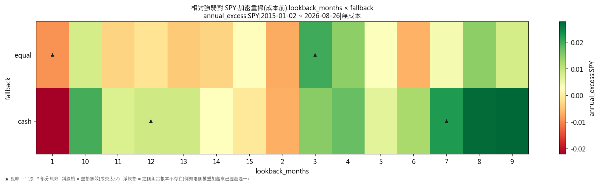
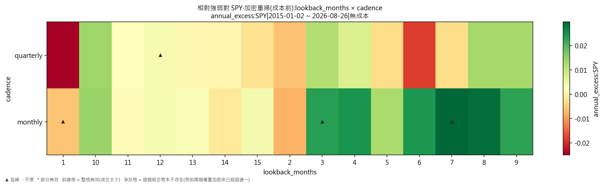
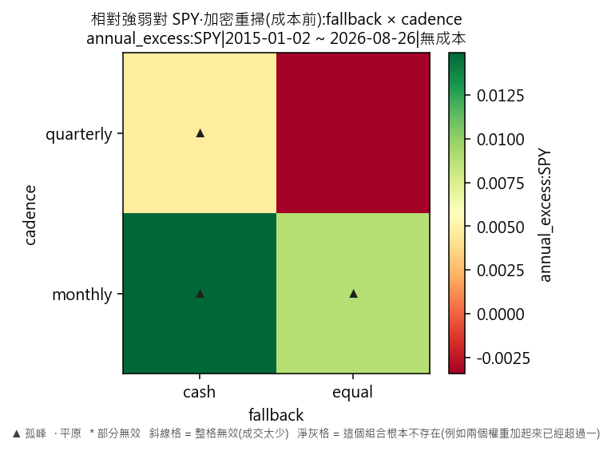

# 因子輪動·相對強弱對 SPY·加密重掃(成本前)

產出於 2026-08-28 09:11。

## 這次掃的是哪一套設定

- 來歷:策略「因子輪動(ETF 版)」第 1 版 × 期間 2015-01-02 至 2026-08-26 × 數據快照 2026-08-27-91a5d51339d9 × 引擎 vectorbt 0.1.0
- 掃描格:笛卡兒積格 lookback_months(15) × fallback(2) × cadence(2),共 60 格;相鄰 = 每個軸最多移一步且不可全部不動(3 維);無序軸(fallback)同軸任意兩個取值皆相鄰
- 跑法:共 60 格,其中 12 格今次真的動過引擎、48 格是讀回已有的運行(同一格不重跑);耗時 5.0 秒
- 無風險利率 4.00%(Sortino 用);基準 QQQ、SPY
- 逐格的運行編號在 `掃描表.csv` 的 `run_id` 欄,一格一個。

## 判讀門檻

- 目標指標 annual_excess:SPY(越大越好);無效格門檻 = 成交少於 30 筆;孤峰門檻 = 高出鄰域平均 0.005 以上;平原高地 = 目標值排前 10%(分位 0.90,即 0.0244284 以上)
- 鄰域平均**包含自己那一格**(二維即整個 3×3 九格);不含自己的那個數在判讀表的 `neighbour_mean` 欄。

## 結果

- 共 60 格:孤峰 4 格、普通 56 格
- **單點最優**:lookback_months=7、fallback=cash、cadence=monthly;annual_excess:SPY = 0.0449,鄰域平均 0.0123(落差 0.0326,孤峰),成交 259 筆,運行編號 run-11f822ff5102d5ac
- **鄰域平均最高**:lookback_months=9、fallback=cash、cadence=monthly;鄰域平均 0.0176,本格 0.0313(普通),運行編號 run-c976fccde0e65c92
- 單點最優與鄰域平均最高**不是同一格**——這正是規格 6.5 要人看住的那件事:單點最高不等於穩健。

### 頭 5 格(按 annual_excess:SPY,只計有效格)

| # | 參數 | annual_excess:SPY | 鄰域平均 | 落差 | 裁決 | 成交筆數 | 運行編號 |
|---|---|---|---|---|---|---|---|
| 1 | lookback_months=7、fallback=cash、cadence=monthly | 0.0449 | 0.0123 | 0.0326 | 孤峰 | 259 | run-11f822ff5102d5ac |
| 2 | lookback_months=6、fallback=cash、cadence=monthly | 0.0404 | 0.0070 | 0.0334 | 普通 | 275 | run-6d9d318722bb82d1 |
| 3 | lookback_months=8、fallback=cash、cadence=monthly | 0.0333 | 0.0174 | 0.0159 | 普通 | 257 | run-06ef2cf2a8004d09 |
| 4 | lookback_months=9、fallback=cash、cadence=monthly | 0.0313 | 0.0176 | 0.0137 | 普通 | 257 | run-c976fccde0e65c92 |
| 5 | lookback_months=3、fallback=equal、cadence=monthly | 0.0288 | 0.0089 | 0.0199 | 孤峰 | 353 | run-31608427bec2ef83 |

### 孤峰(判為擬合噪音,D-016 第 3 條)

- lookback_months=7、fallback=cash、cadence=monthly:0.0449,鄰域平均 0.0123,高出 0.0326
- lookback_months=3、fallback=equal、cadence=monthly:0.0288,鄰域平均 0.0089,高出 0.0199
- lookback_months=12、fallback=cash、cadence=quarterly:0.0117,鄰域平均 0.0027,高出 0.0090
- lookback_months=1、fallback=equal、cadence=monthly:0.0025,鄰域平均 -0.0113,高出 0.0138

## 圖

## 備註

- 數據快照:`2026-08-27-91a5d51339d9`
- 期間:2015-01-02 至 2026-08-26
- 交易成本:零(手續費與滑點皆為 0)
- 運行編號(60 個):`run-3d1679149c250ddd`、`run-035183127255f727`、`run-73a484799b1d7d85`、`run-2cf7b251f0fed52c`、`run-8496145b792176c8`、`run-6ab1a8757d656ca9`、`run-262f48d1f904a9b6`、`run-bb93a439d2ce0a17`,另有 52 個
- 掃描格:回望期逐月 1 至 15 個月 × monthly/quarterly 兩個節奏,共 60 格(KARST-036 原本只有 20 格)

回望期由「1/3/6/9/12」改成**逐月**之後,「一步之遙」由三個月變成一個月——鄰域的定義本身變了,所以本份判讀的平原/孤峰**不可以與 KARST-036 那次直接比較**。

熱身期 252 根 K 線,期間四格各佔 25%;訊號一律只用決策日收工前的數據,成交在下一根 K 線的開價(D-021 第 3 條)。

## 檔

- `掃描表.csv`:逐格八項指標、成交筆數、運行編號
- `判讀表.csv`:逐格裁決、鄰域平均、落差

本報告只交表與判讀,**不裁定哪一組參數該用**——那是用戶的領域(D-008)。
