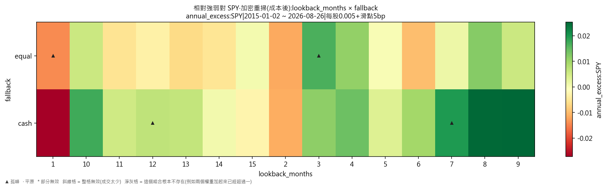
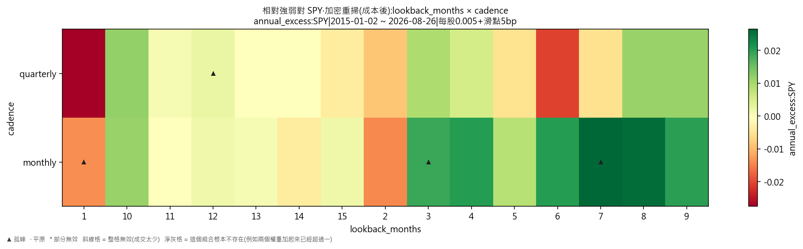
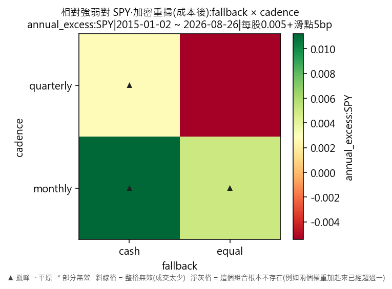

# 因子輪動·相對強弱對 SPY·加密重掃(成本後)

產出於 2026-08-28 09:11。

## 這次掃的是哪一套設定

- 來歷:策略「因子輪動(ETF 版)」第 1 版 × 期間 2015-01-02 至 2026-08-26 × 數據快照 2026-08-27-91a5d51339d9 × 引擎 vectorbt 0.1.0
- 掃描格:笛卡兒積格 lookback_months(15) × fallback(2) × cadence(2),共 60 格;相鄰 = 每個軸最多移一步且不可全部不動(3 維);無序軸(fallback)同軸任意兩個取值皆相鄰
- 跑法:共 60 格,其中 12 格今次真的動過引擎、48 格是讀回已有的運行(同一格不重跑);耗時 4.4 秒
- 無風險利率 4.00%(Sortino 用);基準 QQQ、SPY
- 逐格的運行編號在 `掃描表.csv` 的 `run_id` 欄,一格一個。

## 判讀門檻

- 目標指標 annual_excess:SPY(越大越好);無效格門檻 = 成交少於 30 筆;孤峰門檻 = 高出鄰域平均 0.005 以上;平原高地 = 目標值排前 10%(分位 0.90,即 0.0211348 以上)
- 鄰域平均**包含自己那一格**(二維即整個 3×3 九格);不含自己的那個數在判讀表的 `neighbour_mean` 欄。

## 結果

- 共 60 格:孤峰 4 格、普通 56 格
- **單點最優**:lookback_months=7、fallback=cash、cadence=monthly;annual_excess:SPY = 0.0417,鄰域平均 0.0096(落差 0.0321,孤峰),成交 259 筆,運行編號 run-f09de92f37689030
- **鄰域平均最高**:lookback_months=9、fallback=cash、cadence=monthly;鄰域平均 0.0152,本格 0.0283(普通),運行編號 run-550d4d4ca24ab88a
- 單點最優與鄰域平均最高**不是同一格**——這正是規格 6.5 要人看住的那件事:單點最高不等於穩健。

### 頭 5 格(按 annual_excess:SPY,只計有效格)

| # | 參數 | annual_excess:SPY | 鄰域平均 | 落差 | 裁決 | 成交筆數 | 運行編號 |
|---|---|---|---|---|---|---|---|
| 1 | lookback_months=7、fallback=cash、cadence=monthly | 0.0417 | 0.0096 | 0.0321 | 孤峰 | 259 | run-f09de92f37689030 |
| 2 | lookback_months=6、fallback=cash、cadence=monthly | 0.0365 | 0.0040 | 0.0325 | 普通 | 275 | run-dc82154b95c00e97 |
| 3 | lookback_months=8、fallback=cash、cadence=monthly | 0.0304 | 0.0148 | 0.0155 | 普通 | 257 | run-43b605dbd6e7101f |
| 4 | lookback_months=9、fallback=cash、cadence=monthly | 0.0283 | 0.0152 | 0.0131 | 普通 | 257 | run-550d4d4ca24ab88a |
| 5 | lookback_months=3、fallback=equal、cadence=monthly | 0.0241 | 0.0050 | 0.0191 | 孤峰 | 353 | run-1e7764279adc4ed3 |

### 孤峰(判為擬合噪音,D-016 第 3 條)

- lookback_months=7、fallback=cash、cadence=monthly:0.0417,鄰域平均 0.0096,高出 0.0321
- lookback_months=3、fallback=equal、cadence=monthly:0.0241,鄰域平均 0.0050,高出 0.0191
- lookback_months=12、fallback=cash、cadence=quarterly:0.0102,鄰域平均 0.0006,高出 0.0096
- lookback_months=1、fallback=equal、cadence=monthly:-0.0053,鄰域平均 -0.0161,高出 0.0108

## 圖

## 備註

- 數據快照:`2026-08-27-91a5d51339d9`
- 期間:2015-01-02 至 2026-08-26
- 交易成本:手續費 每股 US$0.005(型別 `per_share`)、滑點 5 個基點(佔成交價比例)
- 運行編號(60 個):`run-ad7e05ff89839a45`、`run-55d3bdaaee3037f2`、`run-e088cbeb484c1f32`、`run-7e05c95ec492ddff`、`run-98cc6421d78f0286`、`run-e2cc5f9ae9959268`、`run-c90c961274dcc52e`、`run-bbacefd31788a46a`,另有 52 個
- 掃描格:回望期逐月 1 至 15 個月 × monthly/quarterly 兩個節奏,共 60 格(KARST-036 原本只有 20 格)

回望期由「1/3/6/9/12」改成**逐月**之後,「一步之遙」由三個月變成一個月——鄰域的定義本身變了,所以本份判讀的平原/孤峰**不可以與 KARST-036 那次直接比較**。

熱身期 252 根 K 線,期間四格各佔 25%;訊號一律只用決策日收工前的數據,成交在下一根 K 線的開價(D-021 第 3 條)。

## 檔

- `掃描表.csv`:逐格八項指標、成交筆數、運行編號
- `判讀表.csv`:逐格裁決、鄰域平均、落差

本報告只交表與判讀,**不裁定哪一組參數該用**——那是用戶的領域(D-008)。
