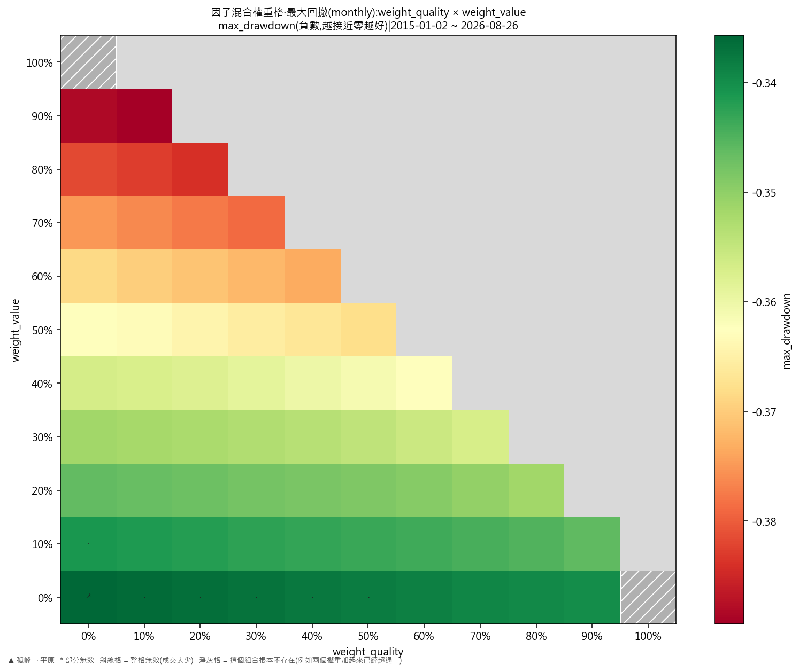
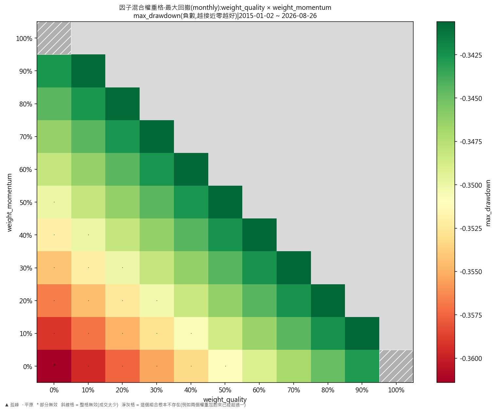
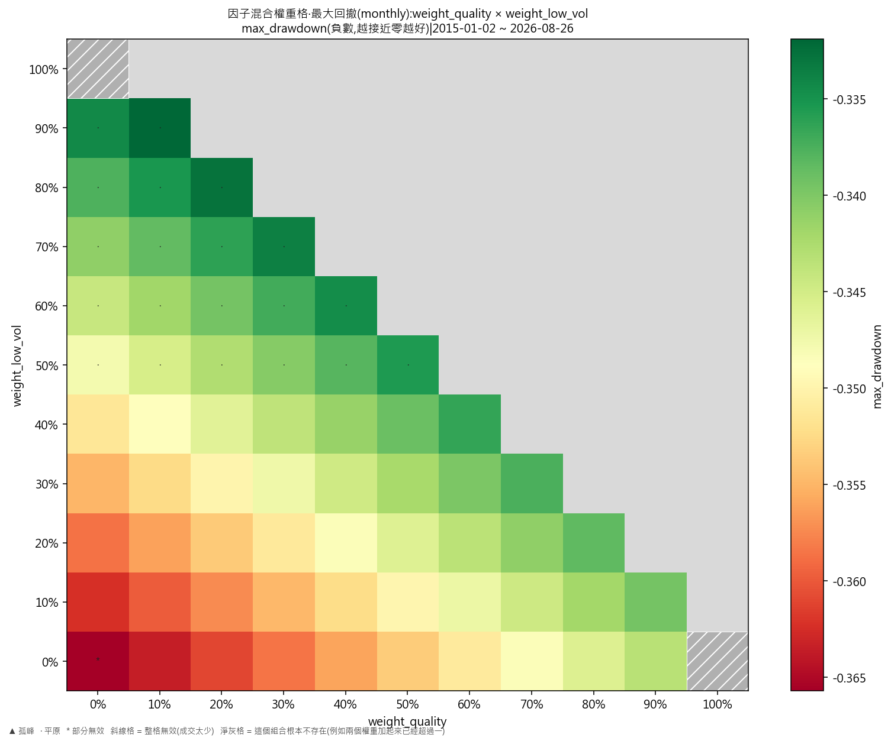
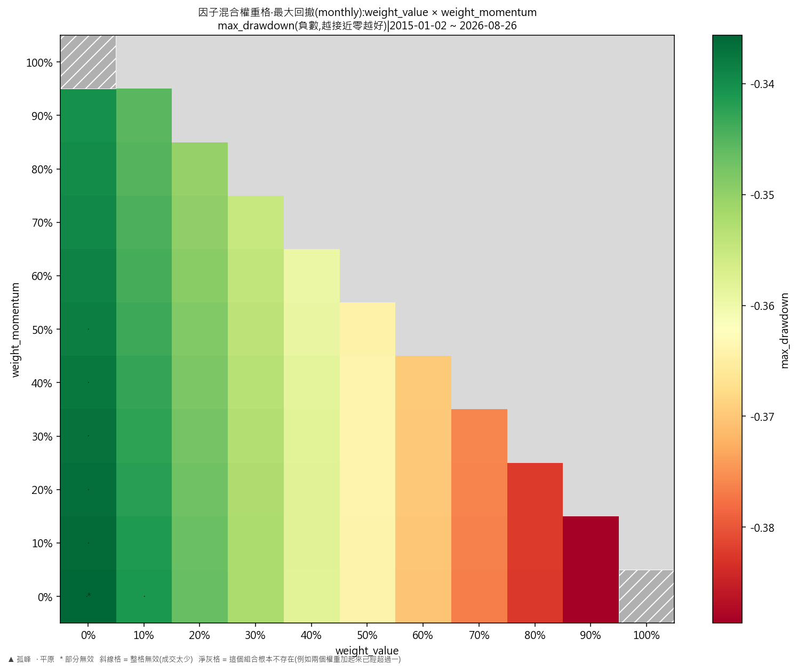
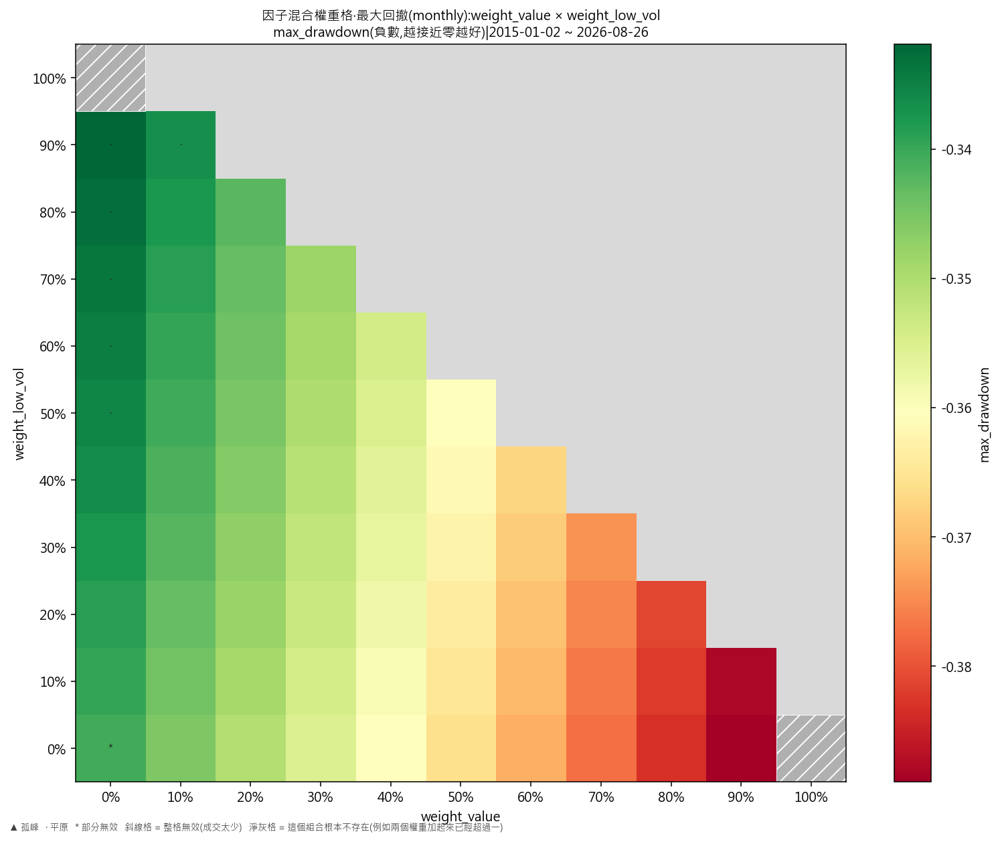
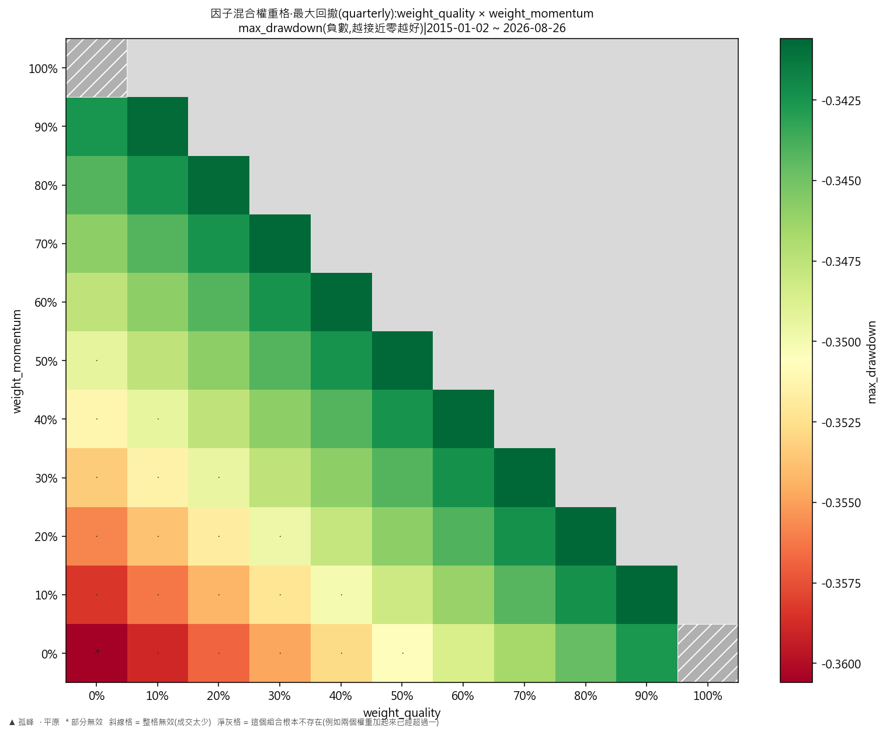
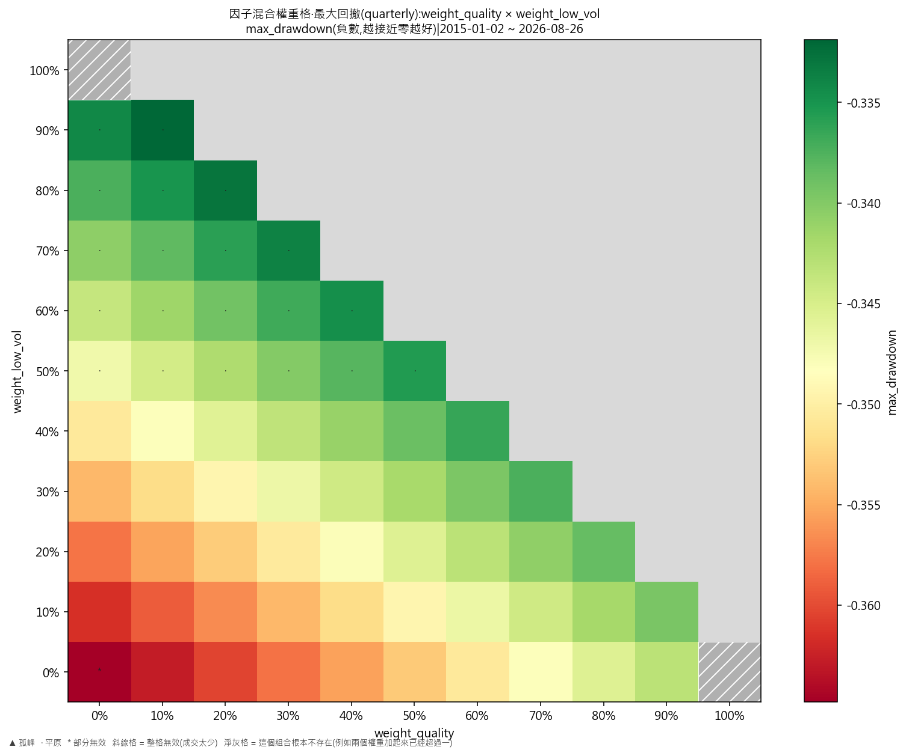
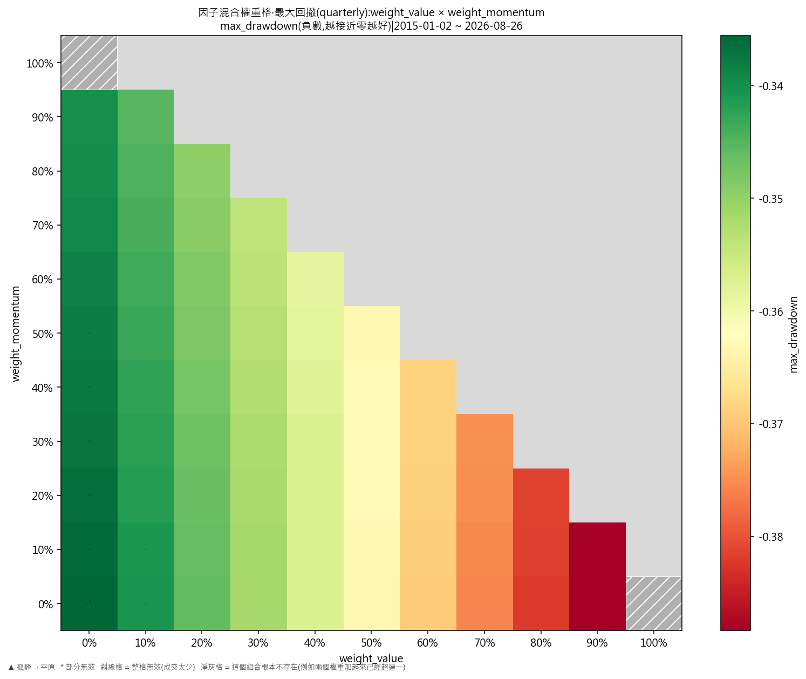
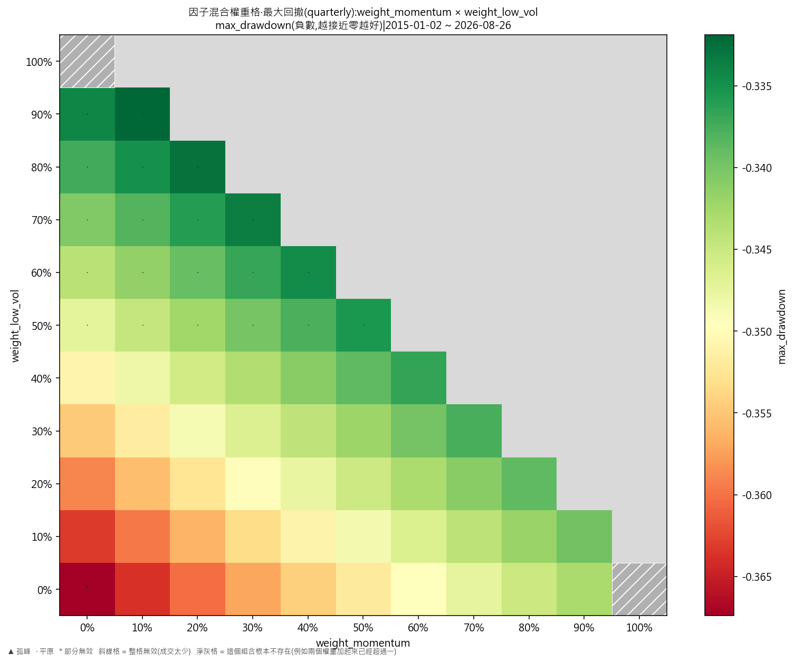

# 因子混合權重掃描·最大回撤(步長 10%)

產出於 2026-08-28 01:25。

## 這次掃的是哪一套設定

- 來歷:策略「因子混合(ETF 版)」第 1 版 × 期間 2015-01-02 至 2026-08-26 × 數據快照 2026-08-27-91a5d51339d9 × 引擎 vectorbt 0.1.0
- 掃描格:拼合格(2 個成分格,共 572 格)——相鄰 = 每個成分格各自移一步或者不動,但不可全部不動。成分格:權重單純形格:4 個權重(weight_quality、weight_value、weight_momentum、weight_low_vol),步長 10%,加總 100%,共 286 格;相鄰 = 把一步的權重由其中一格移去另一格(一個 +一步、一個 −一步,其餘不動);笛卡兒積格 cadence(2),共 2 格;相鄰 = 每個軸最多移一步且不可全部不動(1 維)
- 跑法:共 572 格,其中 0 格今次真的動過引擎、572 格是讀回已有的運行(同一格不重跑);耗時 29.4 秒
- 無風險利率 4.00%(Sortino 用);基準 QQQ、SPY
- 逐格的運行編號在 `掃描表.csv` 的 `run_id` 欄,一格一個。

## 判讀門檻

- 目標指標 max_drawdown(越大越好);無效格門檻 = 成交少於 30 筆;孤峰門檻 = 高出鄰域平均 0.005 以上;平原高地 = 目標值排前 10%(分位 0.90,即 -0.337331 以上)
- 鄰域平均**包含自己那一格**(二維即整個 3×3 九格);不含自己的那個數在判讀表的 `neighbour_mean` 欄。

## 結果

- 共 572 格:平原 43 格、普通 521 格、無效 8 格
- **單點最優**:weight_quality=0、weight_value=0、weight_momentum=0.1、weight_low_vol=0.9、cadence=monthly;max_drawdown = -0.3319,鄰域平均 -0.3339(落差 0.0020,平原),成交 280 筆,運行編號 run-6a1989ab52838307
- **鄰域平均最高**:weight_quality=0、weight_value=0、weight_momentum=0.1、weight_low_vol=0.9、cadence=monthly;鄰域平均 -0.3339,本格 -0.3319(平原),運行編號 run-6a1989ab52838307

### 頭 5 格(按 max_drawdown,只計有效格)

| # | 參數 | max_drawdown | 鄰域平均 | 落差 | 裁決 | 成交筆數 | 運行編號 |
|---|---|---|---|---|---|---|---|
| 1 | weight_quality=0、weight_value=0、weight_momentum=0.1、weight_low_vol=0.9、cadence=monthly | -0.3319 | -0.3339 | 0.0020 | 平原 | 280 | run-6a1989ab52838307 |
| 2 | weight_quality=0.1、weight_value=0、weight_momentum=0、weight_low_vol=0.9、cadence=quarterly | -0.3319 | -0.3339 | 0.0020 | 平原 | 94 | run-199d88283d1f5da5 |
| 3 | weight_quality=0、weight_value=0、weight_momentum=0.1、weight_low_vol=0.9、cadence=quarterly | -0.3319 | -0.3339 | 0.0020 | 平原 | 94 | run-2b9f23d4ce017cce |
| 4 | weight_quality=0.1、weight_value=0、weight_momentum=0、weight_low_vol=0.9、cadence=monthly | -0.3319 | -0.3339 | 0.0020 | 平原 | 280 | run-e13f5cc07a7e80d0 |
| 5 | weight_quality=0、weight_value=0、weight_momentum=0.2、weight_low_vol=0.8、cadence=monthly | -0.3328 | -0.3344 | 0.0016 | 平原 | 280 | run-4f46ae494b55e78d |

### 對照格

| 參數 | max_drawdown | 全格排名 | 運行編號 |
|---|---|---|---|
| weight_quality=0.25、weight_value=0.25、weight_momentum=0.25、weight_low_vol=0.25、cadence=monthly | -0.3499 | 不在這個格上 | run-bc650a4f67fceb9f |
| weight_quality=0.25、weight_value=0.25、weight_momentum=0.25、weight_low_vol=0.25、cadence=quarterly | -0.3493 | 不在這個格上 | run-5110658680fb21c8 |

### 無效格(成交太少,數字講的是運氣不是參數)

- 共 8 格成交少於 30 筆;它們不入最優,亦不入任何一格的鄰域平均。
  - weight_quality=0、weight_value=0、weight_momentum=0、weight_low_vol=1、cadence=monthly:成交 1 筆
  - weight_quality=0、weight_value=0、weight_momentum=0、weight_low_vol=1、cadence=quarterly:成交 1 筆
  - weight_quality=0、weight_value=0、weight_momentum=1、weight_low_vol=0、cadence=monthly:成交 1 筆
  - weight_quality=0、weight_value=0、weight_momentum=1、weight_low_vol=0、cadence=quarterly:成交 1 筆
  - weight_quality=0、weight_value=1、weight_momentum=0、weight_low_vol=0、cadence=monthly:成交 1 筆
  - weight_quality=0、weight_value=1、weight_momentum=0、weight_low_vol=0、cadence=quarterly:成交 1 筆
  - weight_quality=1、weight_value=0、weight_momentum=0、weight_low_vol=0、cadence=monthly:成交 1 筆
  - weight_quality=1、weight_value=0、weight_momentum=0、weight_low_vol=0、cadence=quarterly:成交 1 筆

## 圖

## 備註

最大回撤以**負數**表示(−0.34 即由高位跌 34%),所以判讀那句「越大越好」在這裡剛好就是「跌得越少越好」,方向不用另設參數。

這一份與年化超額那一份**用的是同一批運行**——同一個格、同一批運行編號,只是換一個目標指標重判一次,一格都沒有重跑。

## 檔

- `掃描表.csv`:逐格八項指標、成交筆數、運行編號
- `判讀表.csv`:逐格裁決、鄰域平均、落差

本報告只交表與判讀,**不裁定哪一組參數該用**——那是用戶的領域(D-008)。
