# 因子混合權重掃描(步長 5%)

產出於 2026-08-28 23:29。

## 這次掃的是哪一套設定

- 來歷:策略「因子混合(ETF 版)」第 2 版 × 期間 2015-01-02 至 2026-08-26 × 數據快照 2026-08-28-000b4820a23a × 引擎 vectorbt 0.1.0
- 掃描格:拼合格(2 個成分格,共 3542 格)——相鄰 = 每個成分格各自移一步或者不動,但不可全部不動;軸型:weight_quality(連續)、weight_value(連續)、weight_momentum(連續)、weight_low_vol(連續)、cadence(選擇);鄰域只沿連續軸取,選擇軸(cadence)逐層分開判。成分格:權重單純形格:4 個權重(weight_quality、weight_value、weight_momentum、weight_low_vol),步長 5%,加總 100%,共 1771 格;相鄰 = 把一步的權重由其中一格移去另一格(一個 +一步、一個 −一步,其餘不動);笛卡兒積格 cadence(2),共 2 格;相鄰 = 每條連續軸最多移一步且不可全部不動,選擇軸釘死不動(0 條連續軸;選擇軸 cadence 切出 2 層,每層各出一份判讀);軸型:cadence(選擇);鄰域只沿連續軸取,選擇軸(cadence)逐層分開判
- 跑法:共 3542 格,其中 2968 格今次真的動過引擎、574 格是讀回已有的運行(同一格不重跑);耗時 1006.6 秒
- 無風險利率 4.00%(Sortino 用);基準 QQQ、SPY
- 逐格的運行編號在 `掃描表.csv` 的 `run_id` 欄,一格一個。

## 判讀門檻

- 目標指標 annual_excess:SPY(越大越好);無效格門檻 = 成交少於 30 筆;孤峰門檻 = 高出鄰域平均 0.005 以上;平原高地 = 目標值排前 10%(分位 0.90,即 0.00322518 以上)
- 軸型:weight_quality(連續)、weight_value(連續)、weight_momentum(連續)、weight_low_vol(連續)、cadence(選擇);鄰域只沿連續軸取,選擇軸(cadence)逐層分開判(切出 2 層);**山脊** = 沿連續軸自己與鄰域平均都在高地,但同一組連續軸取值換去另一層即跌穿高地門檻
- 鄰域平均**包含自己那一格**,而且**只沿連續軸取**——選擇軸不入鄰域(KARST-047)。不含自己的那個數在判讀表的 `neighbour_mean` 欄;換一層的代價在 `weakest_sibling_mean` 與 `layer_drop` 兩欄。

## 結果

- 共 3542 格:平原 329 格、山脊 14 格、普通 3191 格、無效 8 格
- **單點最優**:weight_quality=0、weight_value=0.05、weight_momentum=0.95、weight_low_vol=0、cadence=quarterly;annual_excess:SPY = 0.0121,鄰域平均 0.0113(落差 0.0008,平原),成交 94 筆,運行編號 run-4fbaef32301da5a9
- **鄰域平均最高**:weight_quality=0、weight_value=0.05、weight_momentum=0.95、weight_low_vol=0、cadence=quarterly;鄰域平均 0.0113,本格 0.0121(平原),運行編號 run-4fbaef32301da5a9

### 頭 5 格(按 annual_excess:SPY,只計有效格)

| # | 參數 | annual_excess:SPY | 鄰域平均 | 落差 | 裁決 | 成交筆數 | 運行編號 |
|---|---|---|---|---|---|---|---|
| 1 | weight_quality=0、weight_value=0.05、weight_momentum=0.95、weight_low_vol=0、cadence=quarterly | 0.0121 | 0.0113 | 0.0008 | 平原 | 94 | run-4fbaef32301da5a9 |
| 2 | weight_quality=0.05、weight_value=0、weight_momentum=0.95、weight_low_vol=0、cadence=quarterly | 0.0121 | 0.0113 | 0.0008 | 平原 | 94 | run-dd56707bb1b956fe |
| 3 | weight_quality=0、weight_value=0.05、weight_momentum=0.95、weight_low_vol=0、cadence=monthly | 0.0121 | 0.0112 | 0.0008 | 平原 | 280 | run-dfd04fc1e4071a4e |
| 4 | weight_quality=0.05、weight_value=0、weight_momentum=0.95、weight_low_vol=0、cadence=monthly | 0.0120 | 0.0112 | 0.0008 | 平原 | 280 | run-b2006b2f5b0d919d |
| 5 | weight_quality=0.05、weight_value=0.05、weight_momentum=0.9、weight_low_vol=0、cadence=quarterly | 0.0114 | 0.0109 | 0.0005 | 平原 | 141 | run-e5040474676bc252 |

### 對照格

| 參數 | annual_excess:SPY | 全格排名 | 運行編號 |
|---|---|---|---|
| weight_quality=0.25、weight_value=0.25、weight_momentum=0.25、weight_low_vol=0.25、cadence=monthly | -0.0072 | 1826 | run-e1ecd16be7d794ab |
| weight_quality=0.25、weight_value=0.25、weight_momentum=0.25、weight_low_vol=0.25、cadence=quarterly | -0.0066 | 1736 | run-9177d17490f49dc4 |

### 分層判讀(選擇軸 cadence 切出 2 層)

選擇軸換一個取值即換一套做法,不是微調——所以它不入鄰域,而是逐層各出一份判讀。同一條連續軸在哪一層站得住、在哪一層沒有,就在這張表上。

| 層 | 格數 | 有效格 | 高地格數 | 平原 | 山脊 | 孤峰 | 最優 | 層平均 |
|---|---|---|---|---|---|---|---|---|
| cadence=monthly | 1771 | 1767 | 167 | 164 | 0 | 0 | 0.0121 | -0.0077 |
| cadence=quarterly | 1771 | 1767 | 187 | 165 | 14 | 0 | 0.0121 | -0.0073 |

逐層的完整數字在 `分層判讀表.csv`。

### 山脊(沿連續軸平順,換一層即掉;KARST-047)

這幾格自己與連續軸鄰域平均都在高地,但同一組連續軸取值換去另一層之後,那一層的鄰域平均跌穿高地門檻。**不是平原**(換一套做法就沒有了),**亦不是孤峰**(連續軸上揀錯一兩格不要緊)。

- weight_quality=0.2、weight_value=0.35、weight_momentum=0.45、weight_low_vol=0、cadence=quarterly:0.0039,連續軸鄰域平均 0.0034;換去最差那一層只有 0.0032(跌 0.0002)
- weight_quality=0.15、weight_value=0.4、weight_momentum=0.45、weight_low_vol=0、cadence=quarterly:0.0037,連續軸鄰域平均 0.0033;換去最差那一層只有 0.0031(跌 0.0002)
- weight_quality=0.1、weight_value=0.1、weight_momentum=0.65、weight_low_vol=0.15、cadence=quarterly:0.0036,連續軸鄰域平均 0.0036;換去最差那一層只有 0.0031(跌 0.0004)
- weight_quality=0.15、weight_value=0.05、weight_momentum=0.65、weight_low_vol=0.15、cadence=quarterly:0.0036,連續軸鄰域平均 0.0036;換去最差那一層只有 0.0031(跌 0.0004)
- weight_quality=0.05、weight_value=0.15、weight_momentum=0.65、weight_low_vol=0.15、cadence=quarterly:0.0036,連續軸鄰域平均 0.0035;換去最差那一層只有 0.0031(跌 0.0004)
- weight_quality=0.2、weight_value=0、weight_momentum=0.65、weight_low_vol=0.15、cadence=quarterly:0.0035,連續軸鄰域平均 0.0036;換去最差那一層只有 0.0032(跌 0.0004)
- weight_quality=0、weight_value=0.2、weight_momentum=0.65、weight_low_vol=0.15、cadence=quarterly:0.0035,連續軸鄰域平均 0.0035;換去最差那一層只有 0.0031(跌 0.0004)
- weight_quality=0.1、weight_value=0.35、weight_momentum=0.5、weight_low_vol=0.05、cadence=quarterly:0.0034,連續軸鄰域平均 0.0034;換去最差那一層只有 0.0032(跌 0.0003)
- weight_quality=0.25、weight_value=0.1、weight_momentum=0.55、weight_low_vol=0.1、cadence=quarterly:0.0033,連續軸鄰域平均 0.0033;換去最差那一層只有 0.0029(跌 0.0004)
- weight_quality=0.3、weight_value=0.05、weight_momentum=0.55、weight_low_vol=0.1、cadence=quarterly:0.0033,連續軸鄰域平均 0.0033;換去最差那一層只有 0.0029(跌 0.0003)
- weight_quality=0.2、weight_value=0.15、weight_momentum=0.55、weight_low_vol=0.1、cadence=quarterly:0.0033,連續軸鄰域平均 0.0033;換去最差那一層只有 0.0029(跌 0.0004)
- weight_quality=0.35、weight_value=0、weight_momentum=0.55、weight_low_vol=0.1、cadence=quarterly:0.0033,連續軸鄰域平均 0.0033;換去最差那一層只有 0.0030(跌 0.0003)
- weight_quality=0.05、weight_value=0.4、weight_momentum=0.5、weight_low_vol=0.05、cadence=quarterly:0.0033,連續軸鄰域平均 0.0032;換去最差那一層只有 0.0030(跌 0.0002)
- weight_quality=0.15、weight_value=0.2、weight_momentum=0.55、weight_low_vol=0.1、cadence=quarterly:0.0032,連續軸鄰域平均 0.0032;換去最差那一層只有 0.0029(跌 0.0004)

### 無效格(成交太少,數字講的是運氣不是參數)

- 共 8 格成交少於 30 筆;它們不入最優,亦不入任何一格的鄰域平均。
  - weight_quality=0、weight_value=0、weight_momentum=0、weight_low_vol=1、cadence=monthly:成交 1 筆
  - weight_quality=0、weight_value=0、weight_momentum=0、weight_low_vol=1、cadence=quarterly:成交 1 筆
  - weight_quality=0、weight_value=0、weight_momentum=1、weight_low_vol=0、cadence=monthly:成交 1 筆
  - weight_quality=0、weight_value=0、weight_momentum=1、weight_low_vol=0、cadence=quarterly:成交 1 筆
  - weight_quality=0、weight_value=1、weight_momentum=0、weight_low_vol=0、cadence=monthly:成交 1 筆
  - weight_quality=0、weight_value=1、weight_momentum=0、weight_low_vol=0、cadence=quarterly:成交 1 筆
  - weight_quality=1、weight_value=0、weight_momentum=0、weight_low_vol=0、cadence=monthly:成交 1 筆
  - weight_quality=1、weight_value=0、weight_momentum=0、weight_low_vol=0、cadence=quarterly:成交 1 筆

## 圖

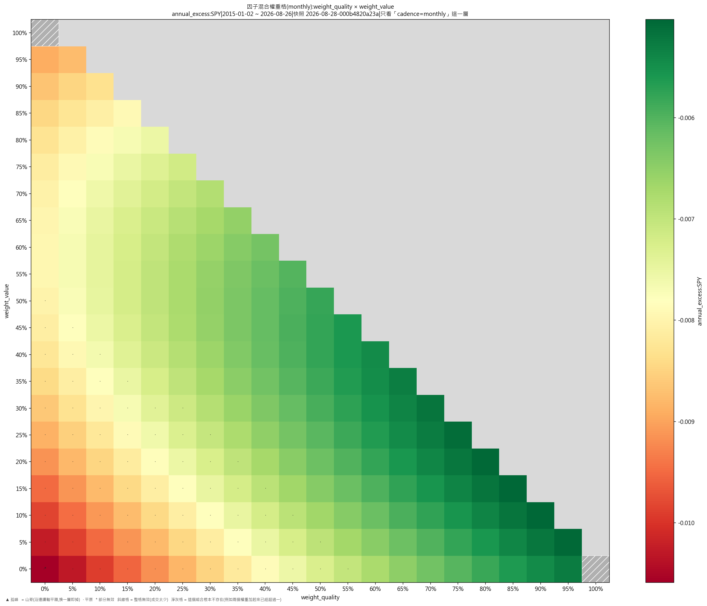

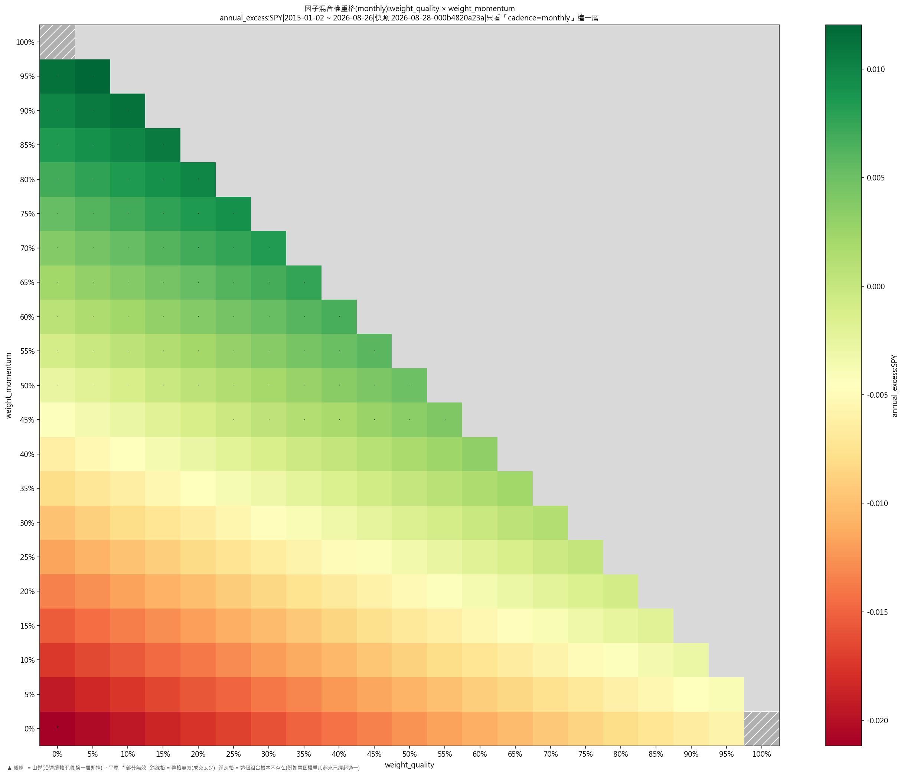

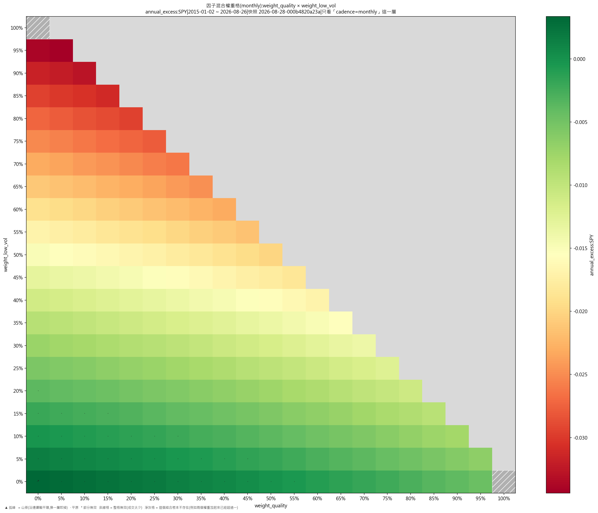

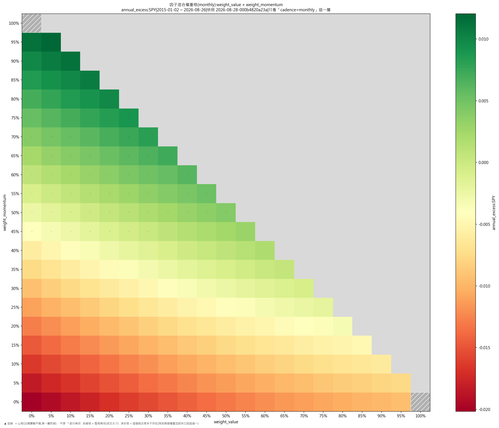

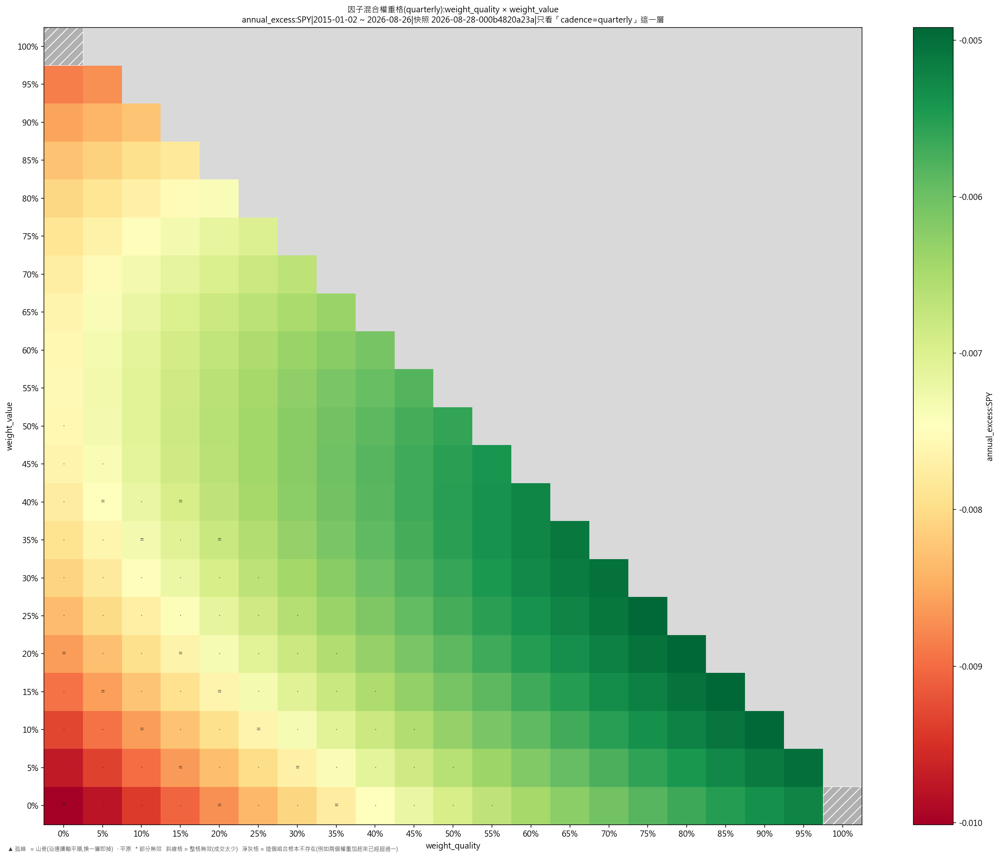

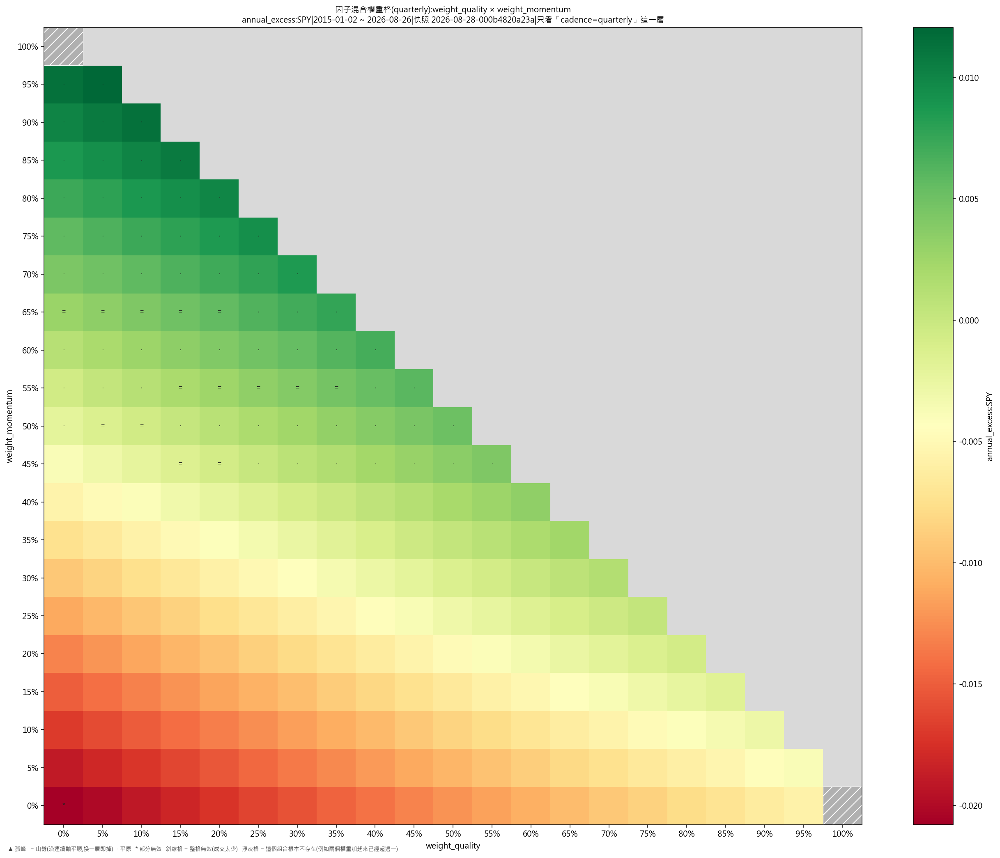

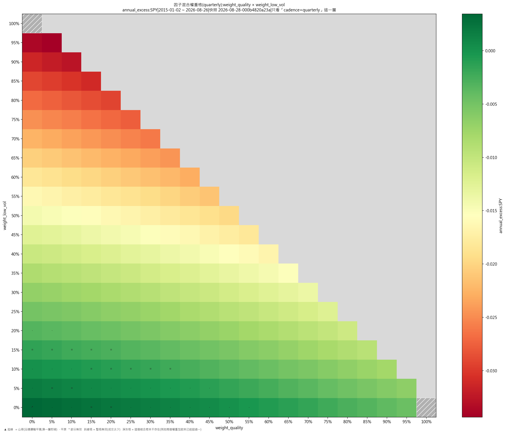

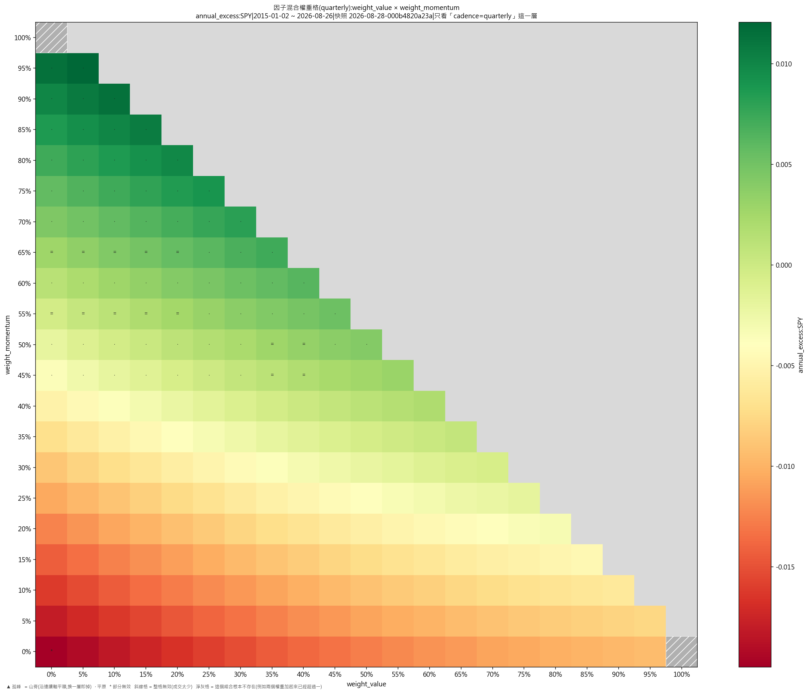

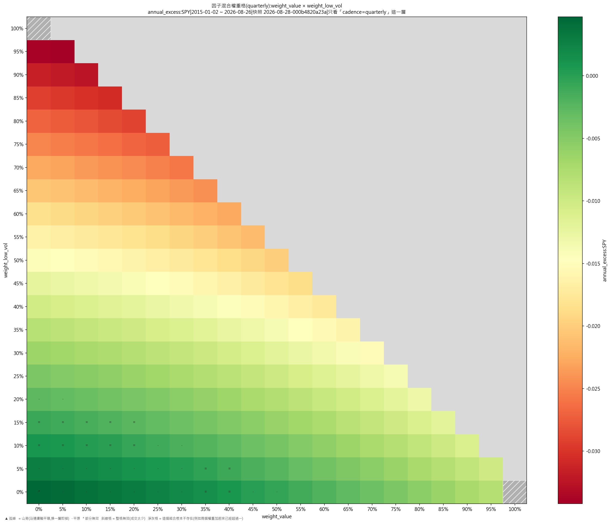

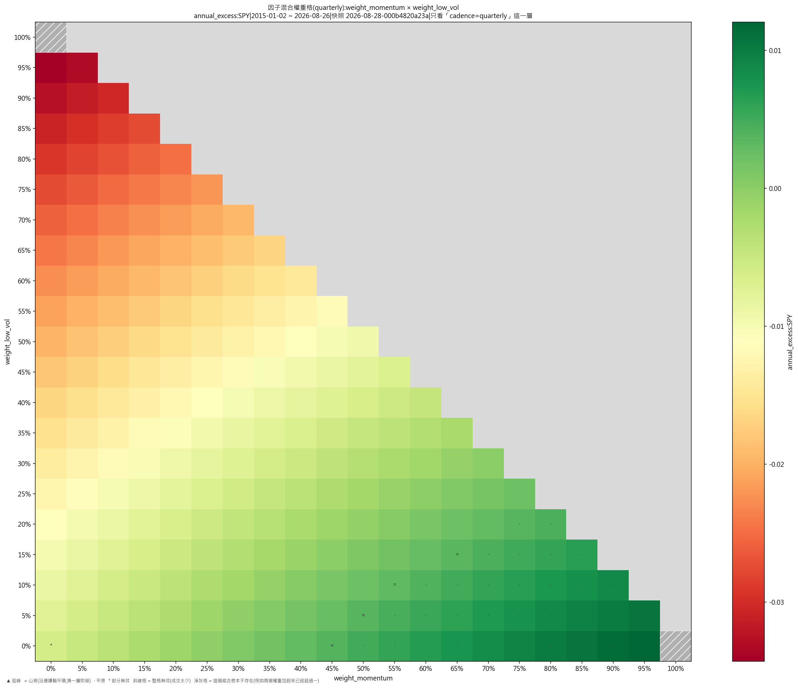

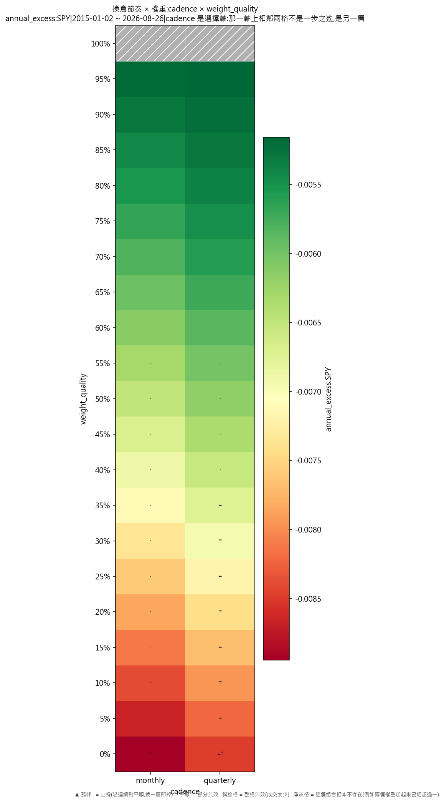

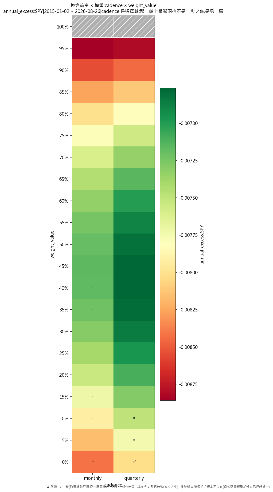

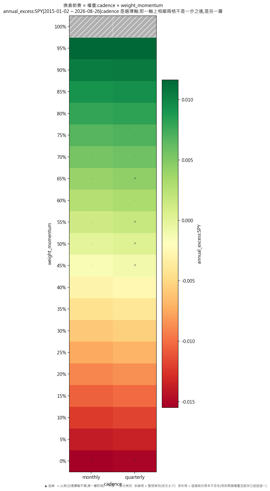

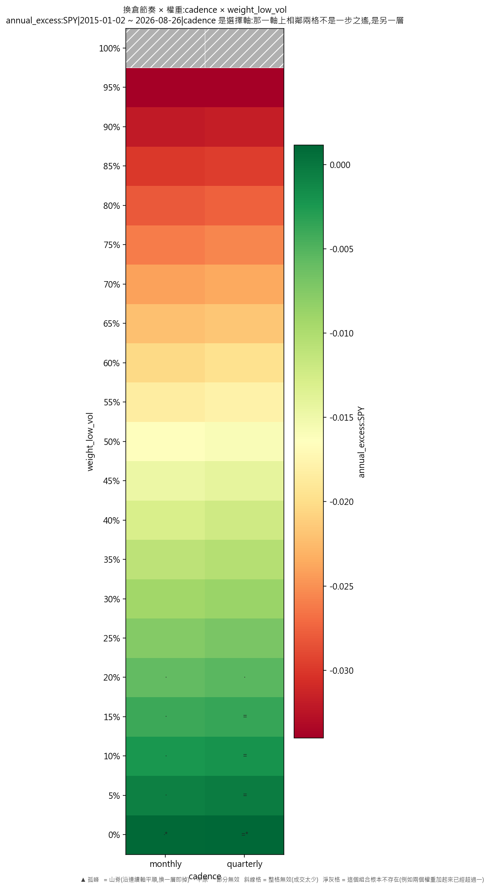

## 備註

四隻因子 ETF:QUAL(質素)、VLUE(價值)、MTUM(動能)、USMV(低波);SPY 與 QQQ 在同一個快照裡,但只做基準,一股不持。

步長 10% 排不出「各 25%」(十步分不均四格),所以固定四等分是**對照格**另外跑的,不在 10% 那個格上;5% 步長的格本身就含住它。

無風險利率 4% 是示例取值,不是裁決;換一個數,Sortino 會跟住變,年化超額與最大回撤不受影響。

## 檔

- `掃描表.csv`:逐格八項指標、成交筆數、運行編號
- `判讀表.csv`:逐格裁決、鄰域平均、落差、所在層、換層代價
- `分層判讀表.csv`:逐層的裁決分佈、最優格、層平均

本報告只交表與判讀,**不裁定哪一組參數該用**——那是用戶的領域(D-008)。
