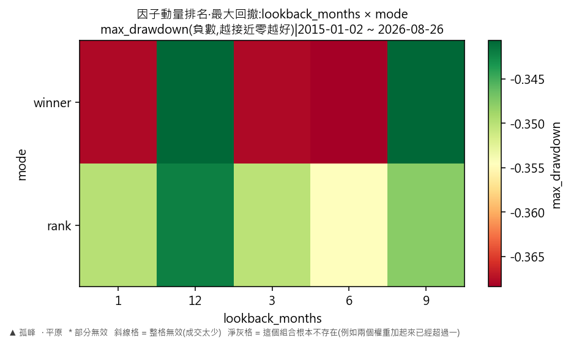
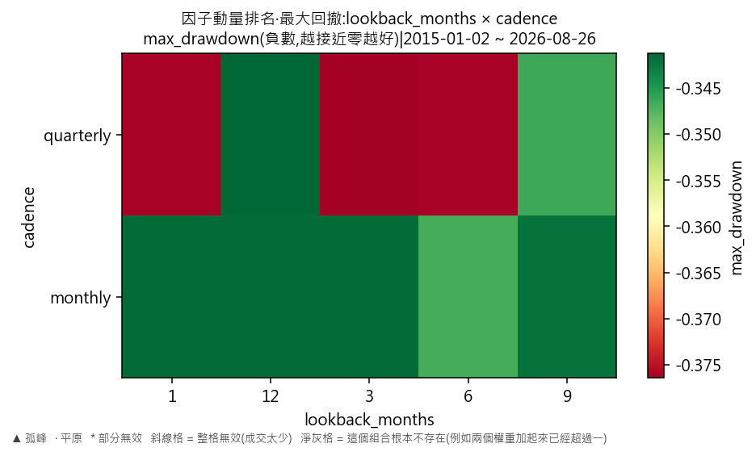
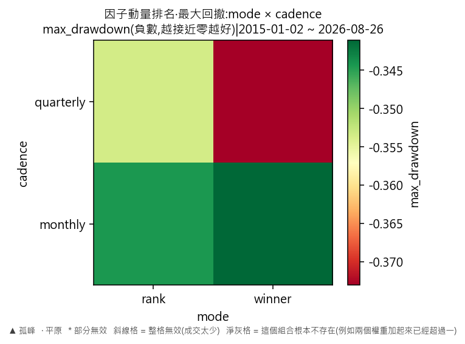

# 因子輪動·因子動量排名(最大回撤)

產出於 2026-08-28 08:20。

## 這次掃的是哪一套設定

- 來歷:策略「因子輪動(ETF 版)」第 1 版 × 期間 2015-01-02 至 2026-08-26 × 數據快照 2026-08-27-91a5d51339d9 × 引擎 vectorbt 0.1.0
- 掃描格:笛卡兒積格 lookback_months(5) × mode(2) × cadence(2),共 20 格;相鄰 = 每個軸最多移一步且不可全部不動(3 維);無序軸(mode)同軸任意兩個取值皆相鄰
- 跑法:共 20 格,其中 20 格今次真的動過引擎、0 格是讀回已有的運行(同一格不重跑);耗時 9.6 秒
- 無風險利率 4.00%(Sortino 用);基準 QQQ、SPY
- 逐格的運行編號在 `掃描表.csv` 的 `run_id` 欄,一格一個。

## 判讀門檻

- 目標指標 max_drawdown(越大越好);無效格門檻 = 成交少於 30 筆;孤峰門檻 = 高出鄰域平均 0.005 以上;平原高地 = 目標值排前 10%(分位 0.90,即 -0.340797 以上)
- 鄰域平均**包含自己那一格**(二維即整個 3×3 九格);不含自己的那個數在判讀表的 `neighbour_mean` 欄。

## 結果

- 共 20 格:普通 20 格
- **單點最優**:lookback_months=12、mode=winner、cadence=quarterly;max_drawdown = -0.3406,鄰域平均 -0.3428(落差 0.0023,普通),成交 48 筆,運行編號 run-b1f19a0946fff24a
- **鄰域平均最高**:lookback_months=12、mode=rank、cadence=monthly;鄰域平均 -0.3428,本格 -0.3423(普通),運行編號 run-47a6a6eda9012c0e
- 單點最優與鄰域平均最高**不是同一格**——這正是規格 6.5 要人看住的那件事:單點最高不等於穩健。

### 頭 5 格(按 max_drawdown,只計有效格)

| # | 參數 | max_drawdown | 鄰域平均 | 落差 | 裁決 | 成交筆數 | 運行編號 |
|---|---|---|---|---|---|---|---|
| 1 | lookback_months=9、mode=winner、cadence=quarterly | -0.3406 | -0.3491 | 0.0085 | 普通 | 50 | run-05620c775a1e43d6 |
| 2 | lookback_months=12、mode=winner、cadence=quarterly | -0.3406 | -0.3428 | 0.0023 | 普通 | 48 | run-b1f19a0946fff24a |
| 3 | lookback_months=12、mode=winner、cadence=monthly | -0.3408 | -0.3428 | 0.0020 | 普通 | 90 | run-687088bf67095d2f |
| 4 | lookback_months=1、mode=winner、cadence=monthly | -0.3408 | -0.3589 | 0.0181 | 普通 | 236 | run-e4c6120a03601e16 |
| 5 | lookback_months=3、mode=winner、cadence=monthly | -0.3408 | -0.3598 | 0.0189 | 普通 | 144 | run-e2056ff3857a10bf |

## 圖

## 備註

最大回撤以**負數**表示,所以判讀那句「越大越好」在這裡就是「跌得越少越好」。與年化超額那一份**用的是同一批運行**,只換一個目標指標重判一次,一格都沒有重跑。

## 檔

- `掃描表.csv`:逐格八項指標、成交筆數、運行編號
- `判讀表.csv`:逐格裁決、鄰域平均、落差

本報告只交表與判讀,**不裁定哪一組參數該用**——那是用戶的領域(D-008)。
