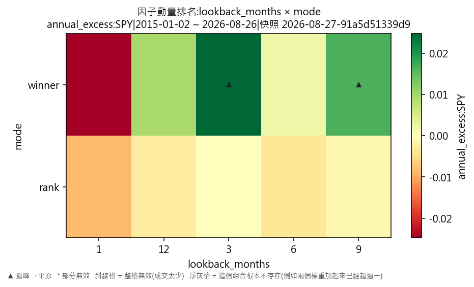
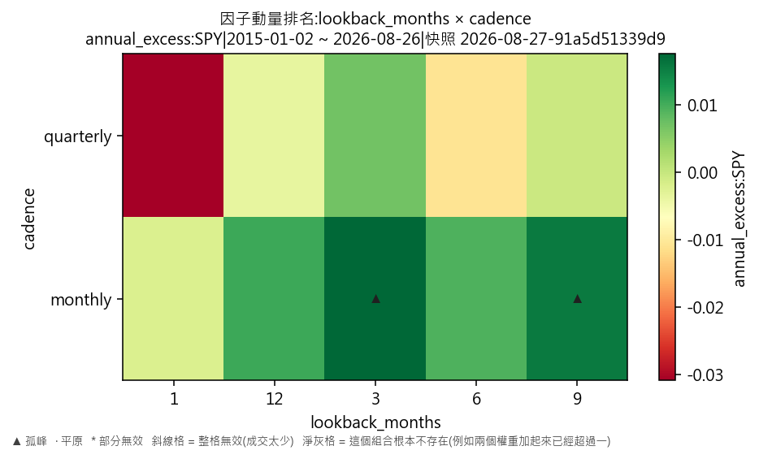
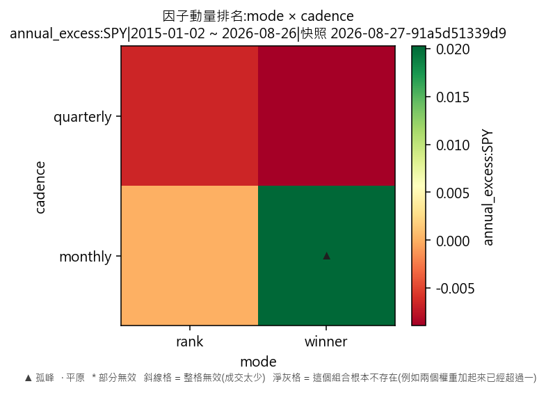

# 因子輪動·因子動量排名(對 SPY 年化超額)

產出於 2026-08-28 08:20。

## 這次掃的是哪一套設定

- 來歷:策略「因子輪動(ETF 版)」第 1 版 × 期間 2015-01-02 至 2026-08-26 × 數據快照 2026-08-27-91a5d51339d9 × 引擎 vectorbt 0.1.0
- 掃描格:笛卡兒積格 lookback_months(5) × mode(2) × cadence(2),共 20 格;相鄰 = 每個軸最多移一步且不可全部不動(3 維);無序軸(mode)同軸任意兩個取值皆相鄰
- 跑法:共 20 格,其中 20 格今次真的動過引擎、0 格是讀回已有的運行(同一格不重跑);耗時 9.6 秒
- 無風險利率 4.00%(Sortino 用);基準 QQQ、SPY
- 逐格的運行編號在 `掃描表.csv` 的 `run_id` 欄,一格一個。

## 判讀門檻

- 目標指標 annual_excess:SPY(越大越好);無效格門檻 = 成交少於 30 筆;孤峰門檻 = 高出鄰域平均 0.005 以上;平原高地 = 目標值排前 10%(分位 0.90,即 0.0218772 以上)
- 鄰域平均**包含自己那一格**(二維即整個 3×3 九格);不含自己的那個數在判讀表的 `neighbour_mean` 欄。

## 結果

- 共 20 格:孤峰 2 格、普通 18 格
- **單點最優**:lookback_months=3、mode=winner、cadence=monthly;annual_excess:SPY = 0.0324,鄰域平均 -0.0017(落差 0.0341,孤峰),成交 144 筆,運行編號 run-e2056ff3857a10bf
- **鄰域平均最高**:lookback_months=6、mode=rank、cadence=monthly;鄰域平均 0.0064,本格 -0.0008(普通),運行編號 run-3e44e2f10f1cc5f5
- 單點最優與鄰域平均最高**不是同一格**——這正是規格 6.5 要人看住的那件事:單點最高不等於穩健。

### 頭 5 格(按 annual_excess:SPY,只計有效格)

| # | 參數 | annual_excess:SPY | 鄰域平均 | 落差 | 裁決 | 成交筆數 | 運行編號 |
|---|---|---|---|---|---|---|---|
| 1 | lookback_months=3、mode=winner、cadence=monthly | 0.0324 | -0.0017 | 0.0341 | 孤峰 | 144 | run-e2056ff3857a10bf |
| 2 | lookback_months=9、mode=winner、cadence=monthly | 0.0301 | 0.0034 | 0.0267 | 孤峰 | 96 | run-41a9d3742f31a235 |
| 3 | lookback_months=12、mode=winner、cadence=monthly | 0.0210 | 0.0055 | 0.0155 | 普通 | 90 | run-687088bf67095d2f |
| 4 | lookback_months=6、mode=winner、cadence=monthly | 0.0195 | 0.0064 | 0.0131 | 普通 | 124 | run-1857bcad9b6af6a0 |
| 5 | lookback_months=3、mode=winner、cadence=quarterly | 0.0170 | -0.0017 | 0.0187 | 普通 | 74 | run-fa98c4f178ad3b4c |

### 孤峰(判為擬合噪音,D-016 第 3 條)

- lookback_months=3、mode=winner、cadence=monthly:0.0324,鄰域平均 -0.0017,高出 0.0341
- lookback_months=9、mode=winner、cadence=monthly:0.0301,鄰域平均 0.0034,高出 0.0267

## 圖

## 備註

驅動器:因子動量排名:比過去 1 個月的報酬,整注押排第一那格(這一句是其中一格的寫法,參數逐格不同,見掃描表)。

熱身期 252 根 K 線,期間四格各佔 25%——即與「各佔 25%」那個對照一模一樣;驅動器由第 252 根之後的第一個決策日才開始話事。

訊號一律只用**決策日收工前**的數據,成交在下一根 K 線的開價(D-021 第 3 條);大市那條線(SPY)只做訊號,一股不持。

外部數據:一個都沒有用——全部訊號由這六隻 ETF 自身的收價算出來。

## 檔

- `掃描表.csv`:逐格八項指標、成交筆數、運行編號
- `判讀表.csv`:逐格裁決、鄰域平均、落差

本報告只交表與判讀,**不裁定哪一組參數該用**——那是用戶的領域(D-008)。
