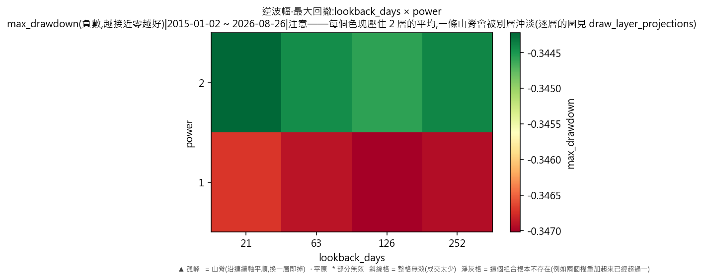
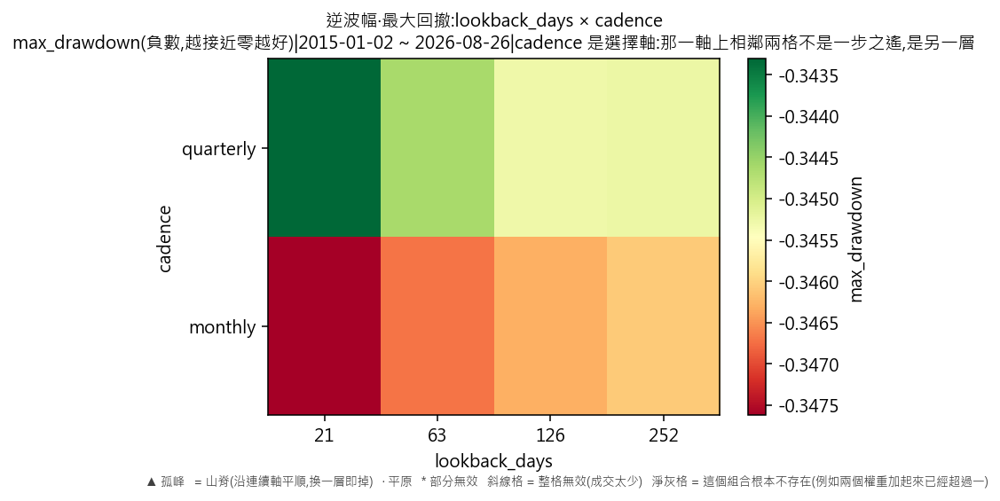
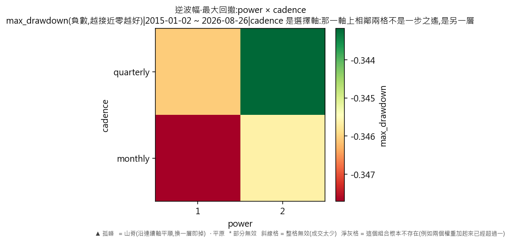

# 因子輪動·逆波幅(最大回撤)

產出於 2026-08-28 23:29。

## 這次掃的是哪一套設定

- 來歷:策略「因子輪動(ETF 版)」第 2 版 × 期間 2015-01-02 至 2026-08-26 × 數據快照 2026-08-28-000b4820a23a × 引擎 vectorbt 0.1.0
- 掃描格:笛卡兒積格 lookback_days(4) × power(2) × cadence(2),共 16 格;相鄰 = 每條連續軸最多移一步且不可全部不動,選擇軸釘死不動(2 條連續軸;選擇軸 cadence 切出 2 層,每層各出一份判讀);軸型:lookback_days(連續)、power(連續)、cadence(選擇);鄰域只沿連續軸取,選擇軸(cadence)逐層分開判
- 跑法:共 16 格,其中 16 格今次真的動過引擎、0 格是讀回已有的運行(同一格不重跑);耗時 5.1 秒
- 無風險利率 4.00%(Sortino 用);基準 QQQ、SPY
- 逐格的運行編號在 `掃描表.csv` 的 `run_id` 欄,一格一個。

## 判讀門檻

- 目標指標 max_drawdown(越大越好);無效格門檻 = 成交少於 30 筆;孤峰門檻 = 高出鄰域平均 0.005 以上;平原高地 = 目標值排前 10%(分位 0.90,即 -0.343566 以上)
- 軸型:lookback_days(連續)、power(連續)、cadence(選擇);鄰域只沿連續軸取,選擇軸(cadence)逐層分開判(切出 2 層);**山脊** = 沿連續軸自己與鄰域平均都在高地,但同一組連續軸取值換去另一層即跌穿高地門檻
- 鄰域平均**包含自己那一格**,而且**只沿連續軸取**——選擇軸不入鄰域(KARST-047)。不含自己的那個數在判讀表的 `neighbour_mean` 欄;換一層的代價在 `weakest_sibling_mean` 與 `layer_drop` 兩欄。

## 結果

- 共 16 格:普通 16 格
- **單點最優**:lookback_days=21、power=2、cadence=quarterly;max_drawdown = -0.3416,鄰域平均 -0.3440(落差 0.0024,普通),成交 188 筆,運行編號 run-15e9b3a684b25295
- **鄰域平均最高**:lookback_days=21、power=1、cadence=quarterly;鄰域平均 -0.3440,本格 -0.3450(普通),運行編號 run-d94a194c0b05d08c
- 單點最優與鄰域平均最高**不是同一格**——這正是規格 6.5 要人看住的那件事:單點最高不等於穩健。

### 頭 5 格(按 max_drawdown,只計有效格)

| # | 參數 | max_drawdown | 鄰域平均 | 落差 | 裁決 | 成交筆數 | 運行編號 |
|---|---|---|---|---|---|---|---|
| 1 | lookback_days=21、power=2、cadence=quarterly | -0.3416 | -0.3440 | 0.0024 | 普通 | 188 | run-15e9b3a684b25295 |
| 2 | lookback_days=63、power=2、cadence=quarterly | -0.3432 | -0.3444 | 0.0012 | 普通 | 188 | run-2808f97c2d665d6e |
| 3 | lookback_days=252、power=2、cadence=quarterly | -0.3440 | -0.3453 | 0.0013 | 普通 | 188 | run-a8dafe60be90d383 |
| 4 | lookback_days=126、power=2、cadence=quarterly | -0.3440 | -0.3451 | 0.0011 | 普通 | 188 | run-f918375f1d5bdfbb |
| 5 | lookback_days=252、power=2、cadence=monthly | -0.3448 | -0.3462 | 0.0013 | 普通 | 560 | run-2ee1e51ca230b959 |

### 分層判讀(選擇軸 cadence 切出 2 層)

選擇軸換一個取值即換一套做法,不是微調——所以它不入鄰域,而是逐層各出一份判讀。同一條連續軸在哪一層站得住、在哪一層沒有,就在這張表上。

| 層 | 格數 | 有效格 | 高地格數 | 平原 | 山脊 | 孤峰 | 最優 | 層平均 |
|---|---|---|---|---|---|---|---|---|
| cadence=monthly | 8 | 8 | 0 | 0 | 0 | 0 | -0.3448 | -0.3467 |
| cadence=quarterly | 8 | 8 | 2 | 0 | 0 | 0 | -0.3416 | -0.3446 |

逐層的完整數字在 `分層判讀表.csv`。

## 圖

## 備註

最大回撤以**負數**表示,所以判讀那句「越大越好」在這裡就是「跌得越少越好」。與年化超額那一份**用的是同一批運行**,只換一個目標指標重判一次,一格都沒有重跑。

## 檔

- `掃描表.csv`:逐格八項指標、成交筆數、運行編號
- `判讀表.csv`:逐格裁決、鄰域平均、落差、所在層、換層代價
- `分層判讀表.csv`:逐層的裁決分佈、最優格、層平均

本報告只交表與判讀,**不裁定哪一組參數該用**——那是用戶的領域(D-008)。
