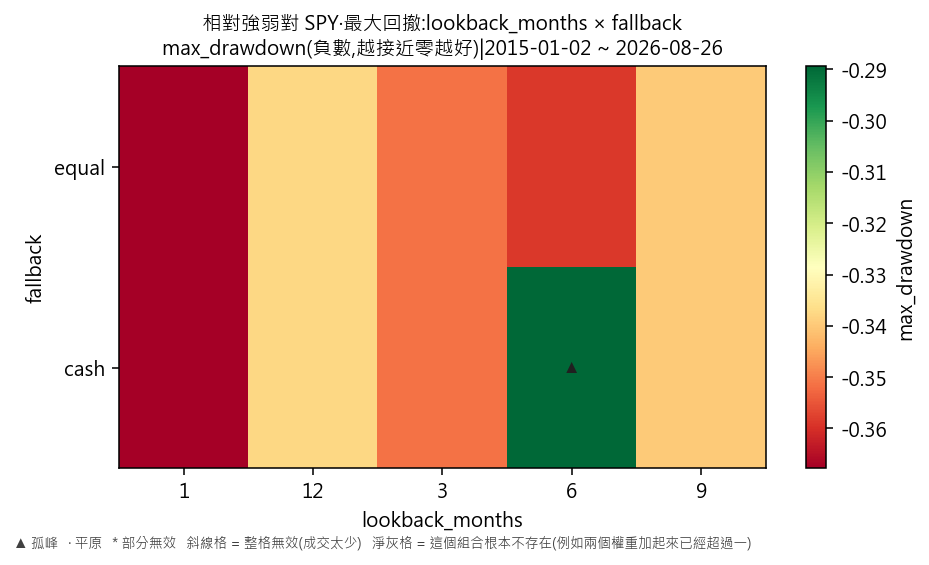
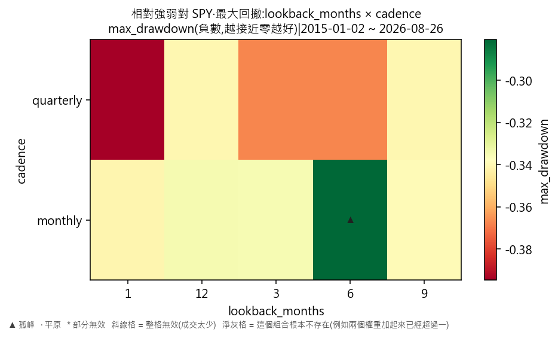
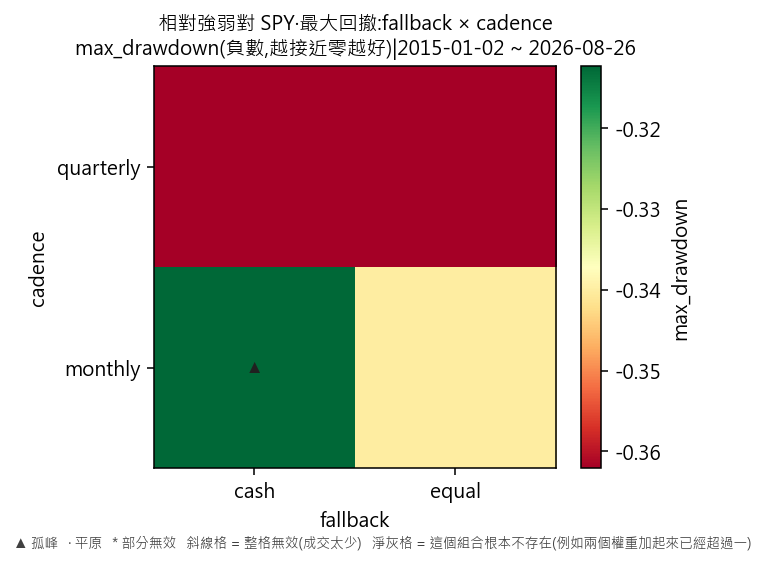

# 因子輪動·相對強弱對 SPY(最大回撤)

產出於 2026-08-28 08:20。

## 這次掃的是哪一套設定

- 來歷:策略「因子輪動(ETF 版)」第 1 版 × 期間 2015-01-02 至 2026-08-26 × 數據快照 2026-08-27-91a5d51339d9 × 引擎 vectorbt 0.1.0
- 掃描格:笛卡兒積格 lookback_months(5) × fallback(2) × cadence(2),共 20 格;相鄰 = 每個軸最多移一步且不可全部不動(3 維);無序軸(fallback)同軸任意兩個取值皆相鄰
- 跑法:共 20 格,其中 20 格今次真的動過引擎、0 格是讀回已有的運行(同一格不重跑);耗時 8.1 秒
- 無風險利率 4.00%(Sortino 用);基準 QQQ、SPY
- 逐格的運行編號在 `掃描表.csv` 的 `run_id` 欄,一格一個。

## 判讀門檻

- 目標指標 max_drawdown(越大越好);無效格門檻 = 成交少於 30 筆;孤峰門檻 = 高出鄰域平均 0.005 以上;平原高地 = 目標值排前 10%(分位 0.90,即 -0.334801 以上)
- 鄰域平均**包含自己那一格**(二維即整個 3×3 九格);不含自己的那個數在判讀表的 `neighbour_mean` 欄。

## 結果

- 共 20 格:孤峰 1 格、普通 19 格
- **單點最優**:lookback_months=6、fallback=cash、cadence=monthly;max_drawdown = -0.2114,鄰域平均 -0.3384(落差 0.1270,孤峰),成交 275 筆,運行編號 run-6d9d318722bb82d1
- **鄰域平均最高**:lookback_months=9、fallback=cash、cadence=monthly;鄰域平均 -0.3338,本格 -0.3391(普通),運行編號 run-c976fccde0e65c92
- 單點最優與鄰域平均最高**不是同一格**——這正是規格 6.5 要人看住的那件事:單點最高不等於穩健。

### 頭 5 格(按 max_drawdown,只計有效格)

| # | 參數 | max_drawdown | 鄰域平均 | 落差 | 裁決 | 成交筆數 | 運行編號 |
|---|---|---|---|---|---|---|---|
| 1 | lookback_months=6、fallback=cash、cadence=monthly | -0.2114 | -0.3384 | 0.1270 | 孤峰 | 275 | run-6d9d318722bb82d1 |
| 2 | lookback_months=12、fallback=cash、cadence=monthly | -0.3348 | -0.3388 | 0.0040 | 普通 | 263 | run-8885e7f0c0c358aa |
| 3 | lookback_months=12、fallback=equal、cadence=monthly | -0.3348 | -0.3388 | 0.0040 | 普通 | 283 | run-03193d546c755391 |
| 4 | lookback_months=3、fallback=equal、cadence=monthly | -0.3353 | -0.3477 | 0.0124 | 普通 | 353 | run-31608427bec2ef83 |
| 5 | lookback_months=3、fallback=cash、cadence=monthly | -0.3353 | -0.3477 | 0.0124 | 普通 | 316 | run-4c52e2911ca0cc16 |

### 孤峰(判為擬合噪音,D-016 第 3 條)

- lookback_months=6、fallback=cash、cadence=monthly:-0.2114,鄰域平均 -0.3384,高出 0.1270

## 圖

## 備註

最大回撤以**負數**表示,所以判讀那句「越大越好」在這裡就是「跌得越少越好」。與年化超額那一份**用的是同一批運行**,只換一個目標指標重判一次,一格都沒有重跑。

## 檔

- `掃描表.csv`:逐格八項指標、成交筆數、運行編號
- `判讀表.csv`:逐格裁決、鄰域平均、落差

本報告只交表與判讀,**不裁定哪一組參數該用**——那是用戶的領域(D-008)。
