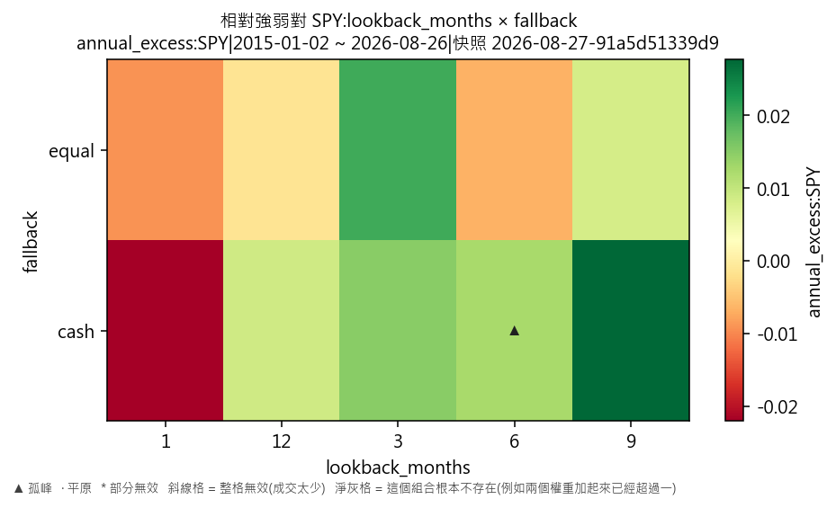
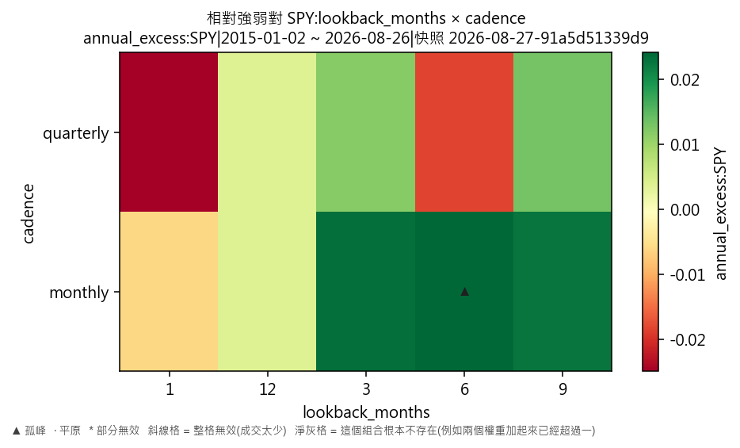
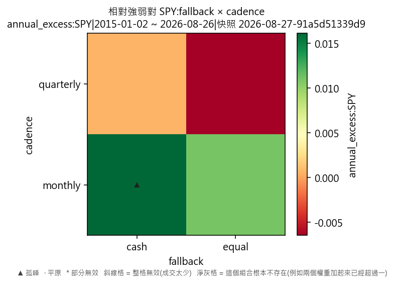

# 因子輪動·相對強弱對 SPY(對 SPY 年化超額)

產出於 2026-08-28 08:20。

## 這次掃的是哪一套設定

- 來歷:策略「因子輪動(ETF 版)」第 1 版 × 期間 2015-01-02 至 2026-08-26 × 數據快照 2026-08-27-91a5d51339d9 × 引擎 vectorbt 0.1.0
- 掃描格:笛卡兒積格 lookback_months(5) × fallback(2) × cadence(2),共 20 格;相鄰 = 每個軸最多移一步且不可全部不動(3 維);無序軸(fallback)同軸任意兩個取值皆相鄰
- 跑法:共 20 格,其中 20 格今次真的動過引擎、0 格是讀回已有的運行(同一格不重跑);耗時 8.1 秒
- 無風險利率 4.00%(Sortino 用);基準 QQQ、SPY
- 逐格的運行編號在 `掃描表.csv` 的 `run_id` 欄,一格一個。

## 判讀門檻

- 目標指標 annual_excess:SPY(越大越好);無效格門檻 = 成交少於 30 筆;孤峰門檻 = 高出鄰域平均 0.005 以上;平原高地 = 目標值排前 10%(分位 0.90,即 0.0290347 以上)
- 鄰域平均**包含自己那一格**(二維即整個 3×3 九格);不含自己的那個數在判讀表的 `neighbour_mean` 欄。

## 結果

- 共 20 格:孤峰 1 格、普通 19 格
- **單點最優**:lookback_months=6、fallback=cash、cadence=monthly;annual_excess:SPY = 0.0404,鄰域平均 0.0128(落差 0.0276,孤峰),成交 275 筆,運行編號 run-6d9d318722bb82d1
- **鄰域平均最高**:lookback_months=6、fallback=cash、cadence=monthly;鄰域平均 0.0128,本格 0.0404(孤峰),運行編號 run-6d9d318722bb82d1

### 頭 5 格(按 annual_excess:SPY,只計有效格)

| # | 參數 | annual_excess:SPY | 鄰域平均 | 落差 | 裁決 | 成交筆數 | 運行編號 |
|---|---|---|---|---|---|---|---|
| 1 | lookback_months=6、fallback=cash、cadence=monthly | 0.0404 | 0.0128 | 0.0276 | 孤峰 | 275 | run-6d9d318722bb82d1 |
| 2 | lookback_months=9、fallback=cash、cadence=monthly | 0.0313 | 0.0082 | 0.0231 | 普通 | 257 | run-c976fccde0e65c92 |
| 3 | lookback_months=3、fallback=equal、cadence=monthly | 0.0288 | 0.0017 | 0.0271 | 普通 | 353 | run-31608427bec2ef83 |
| 4 | lookback_months=9、fallback=cash、cadence=quarterly | 0.0241 | 0.0082 | 0.0159 | 普通 | 104 | run-e0685486e09a4781 |
| 5 | lookback_months=3、fallback=cash、cadence=monthly | 0.0178 | 0.0017 | 0.0162 | 普通 | 316 | run-4c52e2911ca0cc16 |

### 孤峰(判為擬合噪音,D-016 第 3 條)

- lookback_months=6、fallback=cash、cadence=monthly:0.0404,鄰域平均 0.0128,高出 0.0276

## 圖

## 備註

驅動器:相對強弱對大市:比過去 1 個月的報酬,跑贏大市的因子均分;全部跑輸就四格全部持現金(這一句是其中一格的寫法,參數逐格不同,見掃描表)。

熱身期 252 根 K 線,期間四格各佔 25%——即與「各佔 25%」那個對照一模一樣;驅動器由第 252 根之後的第一個決策日才開始話事。

訊號一律只用**決策日收工前**的數據,成交在下一根 K 線的開價(D-021 第 3 條);大市那條線(SPY)只做訊號,一股不持。

外部數據:一個都沒有用——全部訊號由這六隻 ETF 自身的收價算出來。

## 檔

- `掃描表.csv`:逐格八項指標、成交筆數、運行編號
- `判讀表.csv`:逐格裁決、鄰域平均、落差

本報告只交表與判讀,**不裁定哪一組參數該用**——那是用戶的領域(D-008)。
