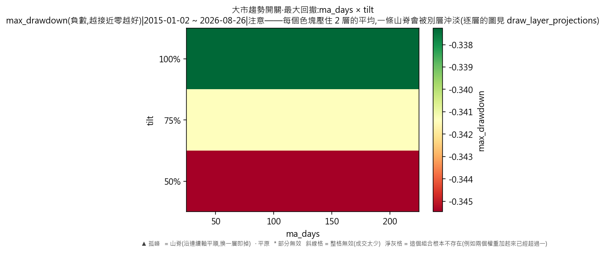
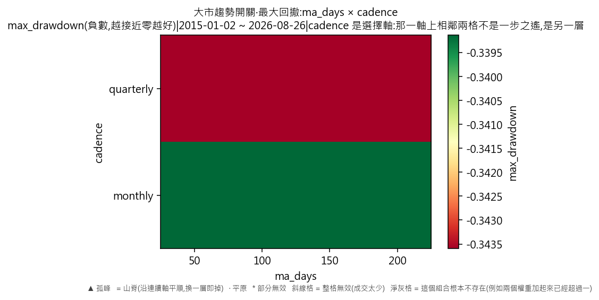
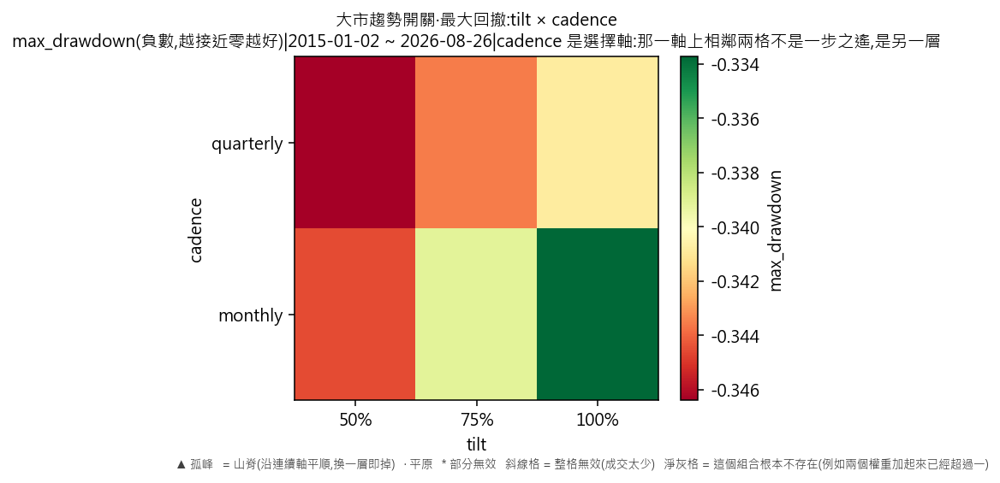

# 因子輪動·大市趨勢開關(最大回撤)

產出於 2026-08-28 23:30。

## 這次掃的是哪一套設定

- 來歷:策略「因子輪動(ETF 版)」第 2 版 × 期間 2015-01-02 至 2026-08-26 × 數據快照 2026-08-28-000b4820a23a × 引擎 vectorbt 0.1.0
- 掃描格:笛卡兒積格 ma_days(4) × tilt(3) × cadence(2),共 24 格;相鄰 = 每條連續軸最多移一步且不可全部不動,選擇軸釘死不動(2 條連續軸;選擇軸 cadence 切出 2 層,每層各出一份判讀);軸型:ma_days(連續)、tilt(連續)、cadence(選擇);鄰域只沿連續軸取,選擇軸(cadence)逐層分開判
- 跑法:共 24 格,其中 24 格今次真的動過引擎、0 格是讀回已有的運行(同一格不重跑);耗時 5.9 秒
- 無風險利率 4.00%(Sortino 用);基準 QQQ、SPY
- 逐格的運行編號在 `掃描表.csv` 的 `run_id` 欄,一格一個。

## 判讀門檻

- 目標指標 max_drawdown(越大越好);無效格門檻 = 成交少於 30 筆;孤峰門檻 = 高出鄰域平均 0.005 以上;平原高地 = 目標值排前 10%(分位 0.90,即 -0.333725 以上)
- 軸型:ma_days(連續)、tilt(連續)、cadence(選擇);鄰域只沿連續軸取,選擇軸(cadence)逐層分開判(切出 2 層);**山脊** = 沿連續軸自己與鄰域平均都在高地,但同一組連續軸取值換去另一層即跌穿高地門檻
- 鄰域平均**包含自己那一格**,而且**只沿連續軸取**——選擇軸不入鄰域(KARST-047)。不含自己的那個數在判讀表的 `neighbour_mean` 欄;換一層的代價在 `weakest_sibling_mean` 與 `layer_drop` 兩欄。

## 結果

- 共 24 格:普通 24 格
- **單點最優**:ma_days=100、tilt=1、cadence=monthly;max_drawdown = -0.3337,鄰域平均 -0.3364(落差 0.0027,普通),成交 114 筆,運行編號 run-b7f9e417643d6b26
- **鄰域平均最高**:ma_days=200、tilt=1、cadence=monthly;鄰域平均 -0.3364,本格 -0.3337(普通),運行編號 run-5d9e1292ea955f7e
- 單點最優與鄰域平均最高**不是同一格**——這正是規格 6.5 要人看住的那件事:單點最高不等於穩健。

### 頭 5 格(按 max_drawdown,只計有效格)

| # | 參數 | max_drawdown | 鄰域平均 | 落差 | 裁決 | 成交筆數 | 運行編號 |
|---|---|---|---|---|---|---|---|
| 1 | ma_days=100、tilt=1、cadence=monthly | -0.3337 | -0.3364 | 0.0027 | 普通 | 114 | run-b7f9e417643d6b26 |
| 2 | ma_days=150、tilt=1、cadence=monthly | -0.3337 | -0.3364 | 0.0027 | 普通 | 90 | run-a8e43ae9b9e53d19 |
| 3 | ma_days=200、tilt=1、cadence=monthly | -0.3337 | -0.3364 | 0.0027 | 普通 | 98 | run-5d9e1292ea955f7e |
| 4 | ma_days=50、tilt=1、cadence=monthly | -0.3337 | -0.3364 | 0.0027 | 普通 | 134 | run-73ffcb705b00c610 |
| 5 | ma_days=200、tilt=0.75、cadence=monthly | -0.3391 | -0.3391 | -0.0000 | 普通 | 560 | run-6a38e4539aa74781 |

### 分層判讀(選擇軸 cadence 切出 2 層)

選擇軸換一個取值即換一套做法,不是微調——所以它不入鄰域,而是逐層各出一份判讀。同一條連續軸在哪一層站得住、在哪一層沒有,就在這張表上。

| 層 | 格數 | 有效格 | 高地格數 | 平原 | 山脊 | 孤峰 | 最優 | 層平均 |
|---|---|---|---|---|---|---|---|---|
| cadence=monthly | 12 | 12 | 3 | 0 | 0 | 0 | -0.3337 | -0.3391 |
| cadence=quarterly | 12 | 12 | 0 | 0 | 0 | 0 | -0.3408 | -0.3436 |

逐層的完整數字在 `分層判讀表.csv`。

## 圖

## 備註

最大回撤以**負數**表示,所以判讀那句「越大越好」在這裡就是「跌得越少越好」。與年化超額那一份**用的是同一批運行**,只換一個目標指標重判一次,一格都沒有重跑。

## 檔

- `掃描表.csv`:逐格八項指標、成交筆數、運行編號
- `判讀表.csv`:逐格裁決、鄰域平均、落差、所在層、換層代價
- `分層判讀表.csv`:逐層的裁決分佈、最優格、層平均

本報告只交表與判讀,**不裁定哪一組參數該用**——那是用戶的領域(D-008)。
