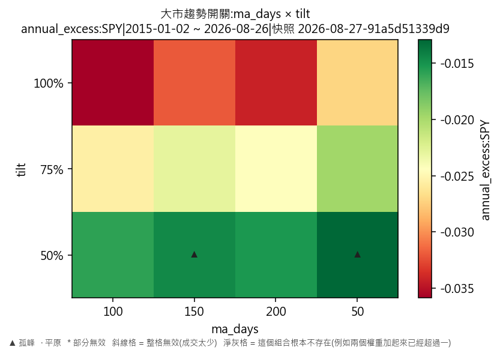
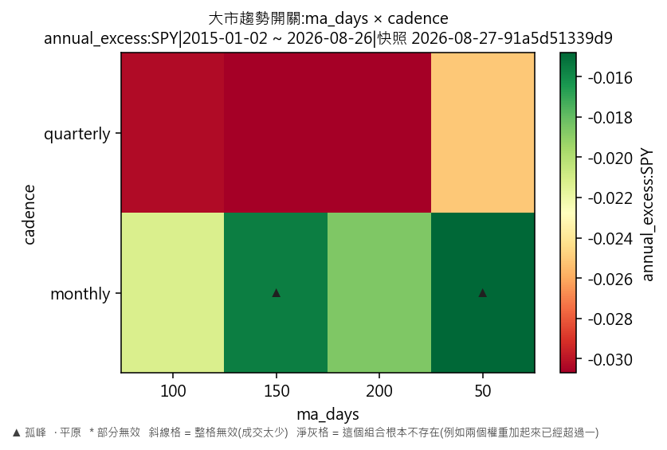
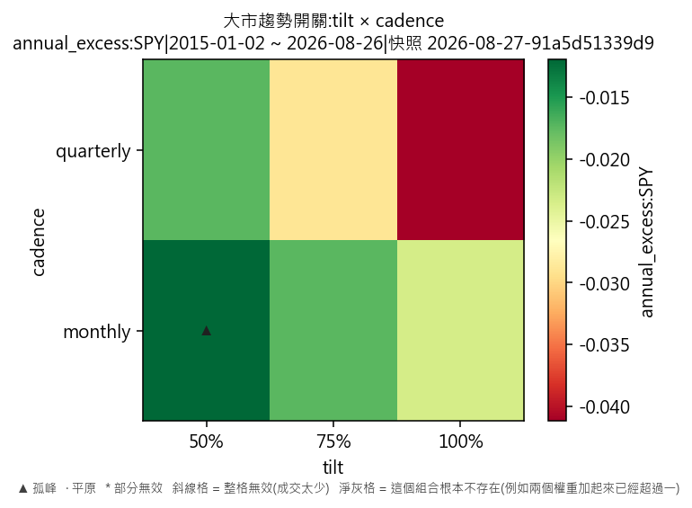

# 因子輪動·大市趨勢開關(對 SPY 年化超額)

產出於 2026-08-28 08:21。

## 這次掃的是哪一套設定

- 來歷:策略「因子輪動(ETF 版)」第 1 版 × 期間 2015-01-02 至 2026-08-26 × 數據快照 2026-08-27-91a5d51339d9 × 引擎 vectorbt 0.1.0
- 掃描格:笛卡兒積格 ma_days(4) × tilt(3) × cadence(2),共 24 格;相鄰 = 每個軸最多移一步且不可全部不動(3 維)
- 跑法:共 24 格,其中 12 格今次真的動過引擎、12 格是讀回已有的運行(同一格不重跑);耗時 5.6 秒
- 無風險利率 4.00%(Sortino 用);基準 QQQ、SPY
- 逐格的運行編號在 `掃描表.csv` 的 `run_id` 欄,一格一個。

## 判讀門檻

- 目標指標 annual_excess:SPY(越大越好);無效格門檻 = 成交少於 30 筆;孤峰門檻 = 高出鄰域平均 0.005 以上;平原高地 = 目標值排前 10%(分位 0.90,即 -0.0128721 以上)
- 鄰域平均**包含自己那一格**(二維即整個 3×3 九格);不含自己的那個數在判讀表的 `neighbour_mean` 欄。

## 結果

- 共 24 格:孤峰 2 格、普通 22 格
- **單點最優**:ma_days=50、tilt=0.5、cadence=monthly;annual_excess:SPY = -0.0106,鄰域平均 -0.0185(落差 0.0080,孤峰),成交 560 筆,運行編號 run-155fadcfc362a78b
- **鄰域平均最高**:ma_days=50、tilt=0.5、cadence=monthly;鄰域平均 -0.0185,本格 -0.0106(孤峰),運行編號 run-155fadcfc362a78b

### 頭 5 格(按 annual_excess:SPY,只計有效格)

| # | 參數 | annual_excess:SPY | 鄰域平均 | 落差 | 裁決 | 成交筆數 | 運行編號 |
|---|---|---|---|---|---|---|---|
| 1 | ma_days=50、tilt=0.5、cadence=monthly | -0.0106 | -0.0185 | 0.0080 | 孤峰 | 560 | run-155fadcfc362a78b |
| 2 | ma_days=150、tilt=0.5、cadence=monthly | -0.0109 | -0.0198 | 0.0088 | 孤峰 | 560 | run-6b1b9496cbbdbefa |
| 3 | ma_days=200、tilt=0.5、cadence=monthly | -0.0125 | -0.0193 | 0.0068 | 普通 | 560 | run-a0832754eb7b7cc8 |
| 4 | ma_days=100、tilt=0.5、cadence=monthly | -0.0138 | -0.0186 | 0.0048 | 普通 | 560 | run-034a0964668da785 |
| 5 | ma_days=50、tilt=0.75、cadence=monthly | -0.0146 | -0.0229 | 0.0083 | 普通 | 560 | run-8c4844b01d642b00 |

### 孤峰(判為擬合噪音,D-016 第 3 條)

- ma_days=50、tilt=0.5、cadence=monthly:-0.0106,鄰域平均 -0.0185,高出 0.0080
- ma_days=150、tilt=0.5、cadence=monthly:-0.0109,鄰域平均 -0.0198,高出 0.0088

## 圖

## 備註

驅動器:大市趨勢開關:大市收價高於 50 日均線就押 weight_momentum、低於就押 weight_low_vol,押注比重 50%,其餘平均分給另外三格(這一句是其中一格的寫法,參數逐格不同,見掃描表)。

熱身期 252 根 K 線,期間四格各佔 25%——即與「各佔 25%」那個對照一模一樣;驅動器由第 252 根之後的第一個決策日才開始話事。

訊號一律只用**決策日收工前**的數據,成交在下一根 K 線的開價(D-021 第 3 條);大市那條線(SPY)只做訊號,一股不持。

外部數據:一個都沒有用——全部訊號由這六隻 ETF 自身的收價算出來。

## 檔

- `掃描表.csv`:逐格八項指標、成交筆數、運行編號
- `判讀表.csv`:逐格裁決、鄰域平均、落差

本報告只交表與判讀,**不裁定哪一組參數該用**——那是用戶的領域(D-008)。
