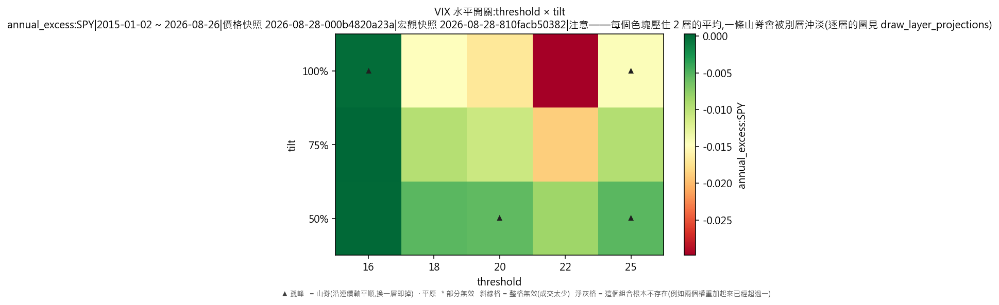
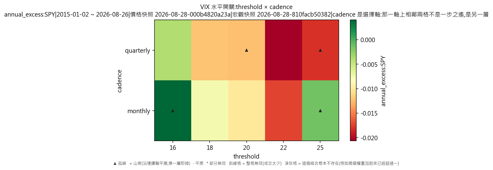
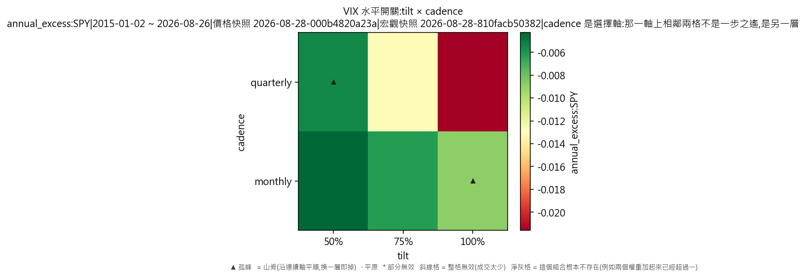

# 宏觀驅動器·VIX 水平開關(對 SPY 年化超額,連成本)

產出於 2026-08-28 23:34。

## 這次掃的是哪一套設定

- 來歷:策略「因子輪動(ETF 版)」第 2 版 × 期間 2015-01-02 至 2026-08-26 × 數據快照 2026-08-28-000b4820a23a × 引擎 vectorbt 0.1.0
- 掃描格:笛卡兒積格 threshold(5) × tilt(3) × cadence(2),共 30 格;相鄰 = 每條連續軸最多移一步且不可全部不動,選擇軸釘死不動(2 條連續軸;選擇軸 cadence 切出 2 層,每層各出一份判讀);軸型:threshold(連續)、tilt(連續)、cadence(選擇);鄰域只沿連續軸取,選擇軸(cadence)逐層分開判
- 跑法:共 30 格,其中 30 格今次真的動過引擎、0 格是讀回已有的運行(同一格不重跑);耗時 19.7 秒
- 無風險利率 4.00%(Sortino 用);基準 QQQ、SPY
- 逐格的運行編號在 `掃描表.csv` 的 `run_id` 欄,一格一個。

## 判讀門檻

- 目標指標 annual_excess:SPY(越大越好);無效格門檻 = 成交少於 30 筆;孤峰門檻 = 高出鄰域平均 0.005 以上;平原高地 = 目標值排前 10%(分位 0.90,即 -0.000381107 以上)
- 軸型:threshold(連續)、tilt(連續)、cadence(選擇);鄰域只沿連續軸取,選擇軸(cadence)逐層分開判(切出 2 層);**山脊** = 沿連續軸自己與鄰域平均都在高地,但同一組連續軸取值換去另一層即跌穿高地門檻
- 鄰域平均**包含自己那一格**,而且**只沿連續軸取**——選擇軸不入鄰域(KARST-047)。不含自己的那個數在判讀表的 `neighbour_mean` 欄;換一層的代價在 `weakest_sibling_mean` 與 `layer_drop` 兩欄。

## 結果

- 共 30 格:孤峰 4 格、普通 26 格
- **單點最優**:threshold=16、tilt=1、cadence=monthly;annual_excess:SPY = 0.0068,鄰域平均 -0.0017(落差 0.0085,孤峰),成交 269 筆,運行編號 run-2a9ad797eecc5b3a
- **鄰域平均最高**:threshold=16、tilt=1、cadence=monthly;鄰域平均 -0.0017,本格 0.0068(孤峰),運行編號 run-2a9ad797eecc5b3a

### 頭 5 格(按 annual_excess:SPY,只計有效格)

| # | 參數 | annual_excess:SPY | 鄰域平均 | 落差 | 裁決 | 成交筆數 | 運行編號 |
|---|---|---|---|---|---|---|---|
| 1 | threshold=16、tilt=1、cadence=monthly | 0.0068 | -0.0017 | 0.0085 | 孤峰 | 269 | run-2a9ad797eecc5b3a |
| 2 | threshold=16、tilt=0.75、cadence=monthly | 0.0042 | -0.0018 | 0.0060 | 普通 | 560 | run-adfe8a0ac0b88496 |
| 3 | threshold=16、tilt=0.5、cadence=monthly | 0.0011 | -0.0018 | 0.0029 | 普通 | 560 | run-60a5065901eed55d |
| 4 | threshold=25、tilt=1、cadence=monthly | -0.0005 | -0.0113 | 0.0107 | 孤峰 | 132 | run-fbc37beb3339735c |
| 5 | threshold=16、tilt=0.5、cadence=quarterly | -0.0009 | -0.0055 | 0.0046 | 普通 | 188 | run-238b8665aec0642d |

### 分層判讀(選擇軸 cadence 切出 2 層)

選擇軸換一個取值即換一套做法,不是微調——所以它不入鄰域,而是逐層各出一份判讀。同一條連續軸在哪一層站得住、在哪一層沒有,就在這張表上。

| 層 | 格數 | 有效格 | 高地格數 | 平原 | 山脊 | 孤峰 | 最優 | 層平均 |
|---|---|---|---|---|---|---|---|---|
| cadence=monthly | 15 | 15 | 3 | 0 | 0 | 2 | 0.0068 | -0.0065 |
| cadence=quarterly | 15 | 15 | 0 | 0 | 0 | 2 | -0.0009 | -0.0134 |

逐層的完整數字在 `分層判讀表.csv`。

### 孤峰(判為擬合噪音,D-016 第 3 條)

- threshold=16、tilt=1、cadence=monthly:0.0068,鄰域平均 -0.0017,高出 0.0085
- threshold=25、tilt=1、cadence=monthly:-0.0005,鄰域平均 -0.0113,高出 0.0107
- threshold=20、tilt=0.5、cadence=quarterly:-0.0050,鄰域平均 -0.0105,高出 0.0055
- threshold=25、tilt=0.5、cadence=quarterly:-0.0081,鄰域平均 -0.0136,高出 0.0056

## 圖

## 備註

- 數據快照:`2026-08-28-000b4820a23a`
- 期間:2015-01-02 至 2026-08-26
- 交易成本:手續費 每股 US$0.005(型別 `per_share`)、滑點 5 個基點(佔成交價比例)
- 運行編號(30 個):`run-60a5065901eed55d`、`run-238b8665aec0642d`、`run-adfe8a0ac0b88496`、`run-e9169cae222389c3`、`run-2a9ad797eecc5b3a`、`run-b52107c90e67709d`、`run-836f86393f3100db`、`run-7e8107dccbcc2a90`,另有 22 個
- 宏觀快照:`2026-08-28-810facb50382`(序列 VIX;知情時間=收市後可得;宏觀序列不是可投資對象,只影響四格怎樣分)

## 檔

- `掃描表.csv`:逐格八項指標、成交筆數、運行編號
- `判讀表.csv`:逐格裁決、鄰域平均、落差、所在層、換層代價
- `分層判讀表.csv`:逐層的裁決分佈、最優格、層平均

本報告只交表與判讀,**不裁定哪一組參數該用**——那是用戶的領域(D-008)。
