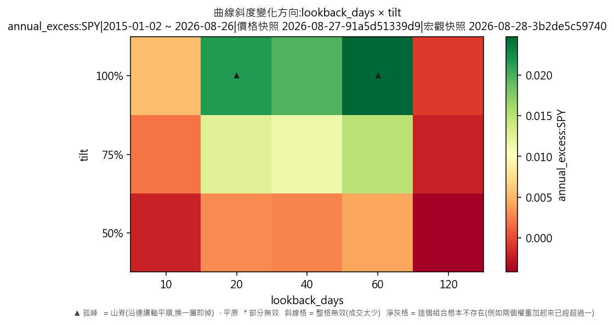
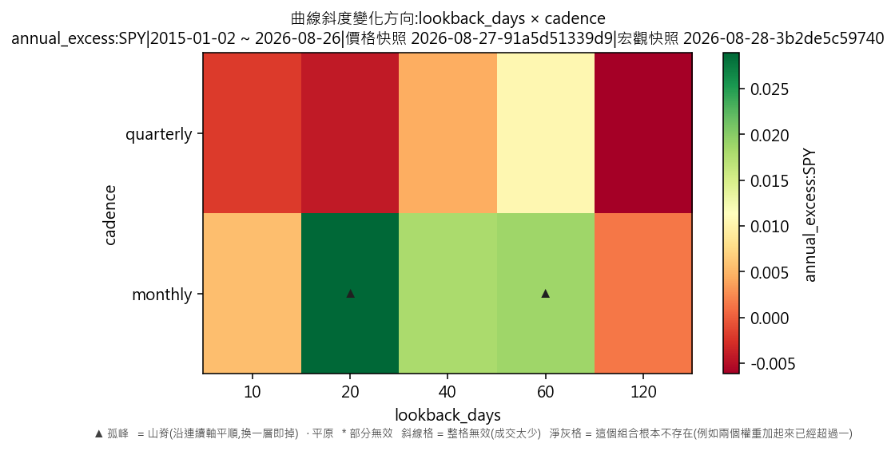
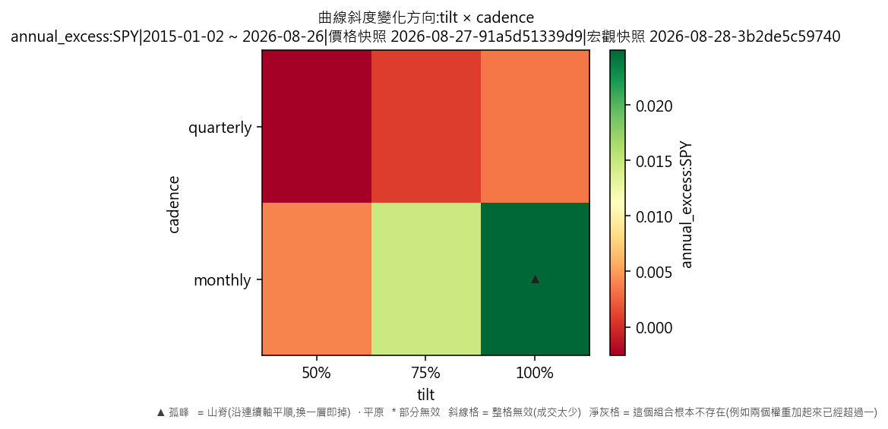

# 宏觀驅動器·曲線斜度變化方向(對 SPY 年化超額,連成本)

產出於 2026-08-28 09:45。

## 這次掃的是哪一套設定

- 來歷:策略「因子輪動(ETF 版)」第 1 版 × 期間 2015-01-02 至 2026-08-26 × 數據快照 2026-08-27-91a5d51339d9 × 引擎 vectorbt 0.1.0
- 掃描格:笛卡兒積格 lookback_days(5) × tilt(3) × cadence(2),共 30 格;相鄰 = 每個軸最多移一步且不可全部不動(3 維);軸型:lookback_days(連續)、tilt(連續)、cadence(連續);全部是連續軸,只有一層
- 跑法:共 30 格,其中 30 格今次真的動過引擎、0 格是讀回已有的運行(同一格不重跑);耗時 9.5 秒
- 無風險利率 4.00%(Sortino 用);基準 QQQ、SPY
- 逐格的運行編號在 `掃描表.csv` 的 `run_id` 欄,一格一個。

## 判讀門檻

- 目標指標 annual_excess:SPY(越大越好);無效格門檻 = 成交少於 30 筆;孤峰門檻 = 高出鄰域平均 0.005 以上;平原高地 = 目標值排前 10%(分位 0.90,即 0.0291261 以上)
- 軸型:全部連續軸,只有一層;鄰域沿全部軸取,判讀與規格 6.5 的 3×3 一樣,不會出現山脊
- 鄰域平均**包含自己那一格**(二維即整個 3×3 九格);不含自己的那個數在判讀表的 `neighbour_mean` 欄。

## 結果

- 共 30 格:孤峰 2 格、普通 28 格
- **單點最優**:lookback_days=20、tilt=1、cadence=monthly;annual_excess:SPY = 0.0466,鄰域平均 0.0121(落差 0.0345,孤峰),成交 174 筆,運行編號 run-a3d8dd0ad9cd2b78
- **鄰域平均最高**:lookback_days=40、tilt=1、cadence=monthly;鄰域平均 0.0175,本格 0.0303(普通),運行編號 run-a04d56e8839516ac
- 單點最優與鄰域平均最高**不是同一格**——這正是規格 6.5 要人看住的那件事:單點最高不等於穩健。

### 頭 5 格(按 annual_excess:SPY,只計有效格)

| # | 參數 | annual_excess:SPY | 鄰域平均 | 落差 | 裁決 | 成交筆數 | 運行編號 |
|---|---|---|---|---|---|---|---|
| 1 | lookback_days=20、tilt=1、cadence=monthly | 0.0466 | 0.0121 | 0.0345 | 孤峰 | 174 | run-a3d8dd0ad9cd2b78 |
| 2 | lookback_days=60、tilt=1、cadence=monthly | 0.0313 | 0.0113 | 0.0200 | 孤峰 | 118 | run-7894c146abecb76f |
| 3 | lookback_days=40、tilt=1、cadence=monthly | 0.0303 | 0.0175 | 0.0128 | 普通 | 142 | run-a04d56e8839516ac |
| 4 | lookback_days=20、tilt=0.75、cadence=monthly | 0.0290 | 0.0085 | 0.0205 | 普通 | 560 | run-689ed263e88f834e |
| 5 | lookback_days=60、tilt=0.75、cadence=monthly | 0.0189 | 0.0078 | 0.0111 | 普通 | 560 | run-410e41b82a6675ff |

### 孤峰(判為擬合噪音,D-016 第 3 條)

- lookback_days=20、tilt=1、cadence=monthly:0.0466,鄰域平均 0.0121,高出 0.0345
- lookback_days=60、tilt=1、cadence=monthly:0.0313,鄰域平均 0.0113,高出 0.0200

## 圖

## 備註

- 數據快照:`2026-08-27-91a5d51339d9`
- 期間:2015-01-02 至 2026-08-26
- 交易成本:手續費 每股 US$0.005(型別 `per_share`)、滑點 5 個基點(佔成交價比例)
- 運行編號(30 個):`run-4e2017cb6b42de47`、`run-d74d6b236fa05963`、`run-bed5e50fc11d9ea1`、`run-b21306b5d18dd7eb`、`run-8774e8cb7da1e11b`、`run-218d445879c9bbca`、`run-27c8b9b3993d0a61`、`run-940752d5cb593102`,另有 22 個
- 宏觀快照:`2026-08-28-3b2de5c59740`(序列 UST_10Y、UST_3M;知情時間=收市後可得;宏觀序列不是可投資對象,只影響四格怎樣分)

## 檔

- `掃描表.csv`:逐格八項指標、成交筆數、運行編號
- `判讀表.csv`:逐格裁決、鄰域平均、落差、所在層、換層代價

本報告只交表與判讀,**不裁定哪一組參數該用**——那是用戶的領域(D-008)。
