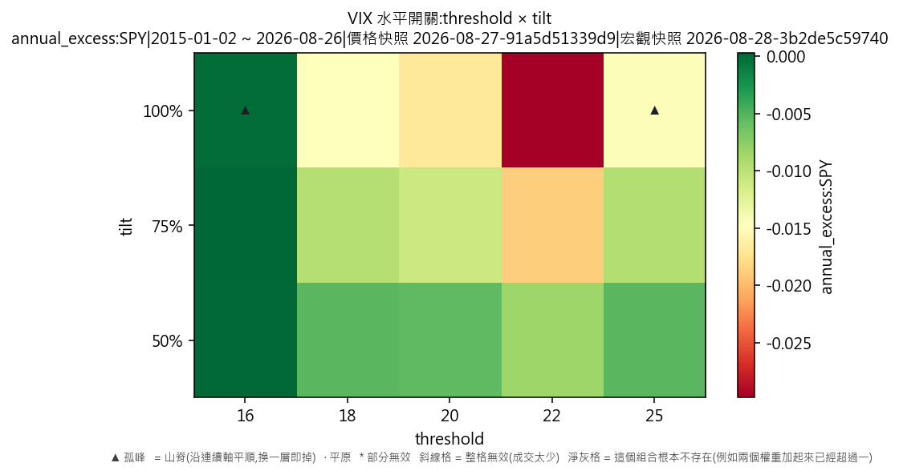
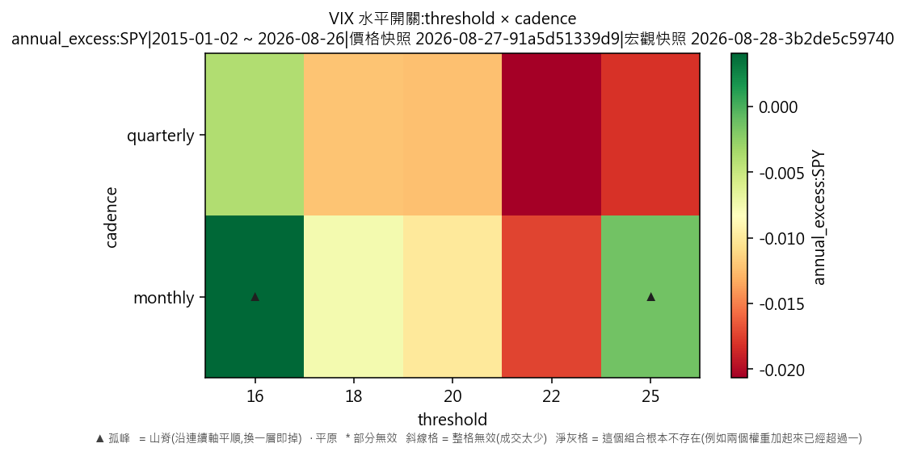
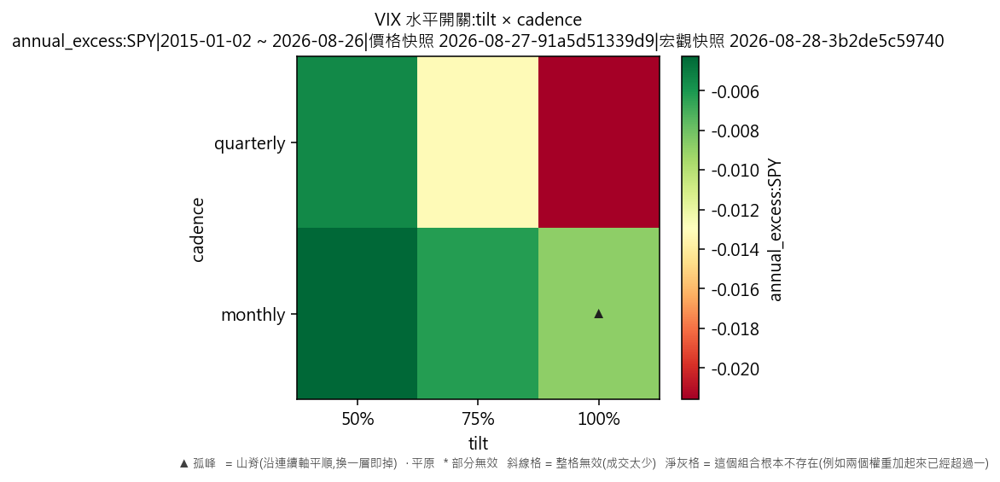

# 宏觀驅動器·VIX 水平開關(對 SPY 年化超額,連成本)

產出於 2026-08-28 09:44。

## 這次掃的是哪一套設定

- 來歷:策略「因子輪動(ETF 版)」第 1 版 × 期間 2015-01-02 至 2026-08-26 × 數據快照 2026-08-27-91a5d51339d9 × 引擎 vectorbt 0.1.0
- 掃描格:笛卡兒積格 threshold(5) × tilt(3) × cadence(2),共 30 格;相鄰 = 每個軸最多移一步且不可全部不動(3 維);軸型:threshold(連續)、tilt(連續)、cadence(連續);全部是連續軸,只有一層
- 跑法:共 30 格,其中 0 格今次真的動過引擎、30 格是讀回已有的運行(同一格不重跑);耗時 0.6 秒
- 無風險利率 4.00%(Sortino 用);基準 QQQ、SPY
- 逐格的運行編號在 `掃描表.csv` 的 `run_id` 欄,一格一個。

## 判讀門檻

- 目標指標 annual_excess:SPY(越大越好);無效格門檻 = 成交少於 30 筆;孤峰門檻 = 高出鄰域平均 0.005 以上;平原高地 = 目標值排前 10%(分位 0.90,即 -0.000381097 以上)
- 軸型:全部連續軸,只有一層;鄰域沿全部軸取,判讀與規格 6.5 的 3×3 一樣,不會出現山脊
- 鄰域平均**包含自己那一格**(二維即整個 3×3 九格);不含自己的那個數在判讀表的 `neighbour_mean` 欄。

## 結果

- 共 30 格:孤峰 2 格、普通 28 格
- **單點最優**:threshold=16、tilt=1、cadence=monthly;annual_excess:SPY = 0.0068,鄰域平均 -0.0060(落差 0.0129,孤峰),成交 269 筆,運行編號 run-84c9142129cb4e81
- **鄰域平均最高**:threshold=16、tilt=0.5、cadence=monthly;鄰域平均 -0.0036,本格 0.0011(普通),運行編號 run-0987e23325ad92e7
- 單點最優與鄰域平均最高**不是同一格**——這正是規格 6.5 要人看住的那件事:單點最高不等於穩健。

### 頭 5 格(按 annual_excess:SPY,只計有效格)

| # | 參數 | annual_excess:SPY | 鄰域平均 | 落差 | 裁決 | 成交筆數 | 運行編號 |
|---|---|---|---|---|---|---|---|
| 1 | threshold=16、tilt=1、cadence=monthly | 0.0068 | -0.0060 | 0.0129 | 孤峰 | 269 | run-84c9142129cb4e81 |
| 2 | threshold=16、tilt=0.75、cadence=monthly | 0.0042 | -0.0049 | 0.0091 | 普通 | 560 | run-42615264875e8453 |
| 3 | threshold=16、tilt=0.5、cadence=monthly | 0.0011 | -0.0036 | 0.0047 | 普通 | 560 | run-0987e23325ad92e7 |
| 4 | threshold=25、tilt=1、cadence=monthly | -0.0005 | -0.0182 | 0.0176 | 孤峰 | 132 | run-9b98d0d48645157f |
| 5 | threshold=16、tilt=0.5、cadence=quarterly | -0.0009 | -0.0036 | 0.0027 | 普通 | 188 | run-f8ff5a1e19d1853d |

### 孤峰(判為擬合噪音,D-016 第 3 條)

- threshold=16、tilt=1、cadence=monthly:0.0068,鄰域平均 -0.0060,高出 0.0129
- threshold=25、tilt=1、cadence=monthly:-0.0005,鄰域平均 -0.0182,高出 0.0176

## 圖

## 備註

- 數據快照:`2026-08-27-91a5d51339d9`
- 期間:2015-01-02 至 2026-08-26
- 交易成本:手續費 每股 US$0.005(型別 `per_share`)、滑點 5 個基點(佔成交價比例)
- 運行編號(30 個):`run-0987e23325ad92e7`、`run-f8ff5a1e19d1853d`、`run-42615264875e8453`、`run-341d3e636018ba08`、`run-84c9142129cb4e81`、`run-44fb014d64deaa75`、`run-fa714afe9cc06954`、`run-cd784e0dd0fd79a2`,另有 22 個
- 宏觀快照:`2026-08-28-3b2de5c59740`(序列 VIX;知情時間=收市後可得;宏觀序列不是可投資對象,只影響四格怎樣分)

## 檔

- `掃描表.csv`:逐格八項指標、成交筆數、運行編號
- `判讀表.csv`:逐格裁決、鄰域平均、落差、所在層、換層代價

本報告只交表與判讀,**不裁定哪一組參數該用**——那是用戶的領域(D-008)。
