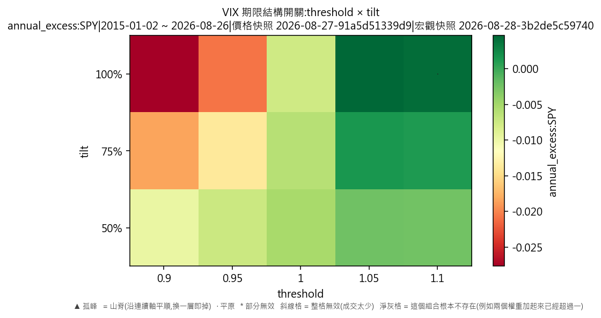
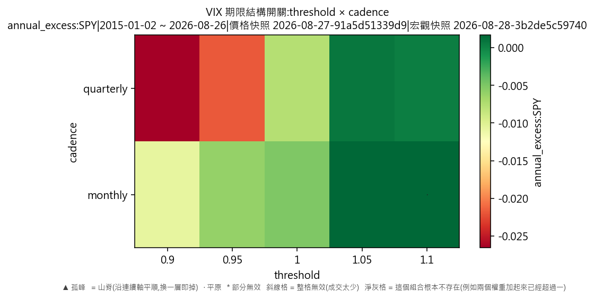
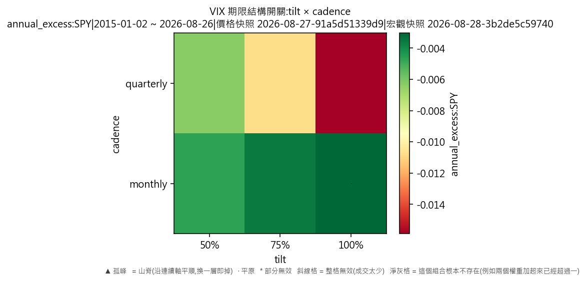

# 宏觀驅動器·VIX 期限結構開關(對 SPY 年化超額,連成本)

產出於 2026-08-28 09:45。

## 這次掃的是哪一套設定

- 來歷:策略「因子輪動(ETF 版)」第 1 版 × 期間 2015-01-02 至 2026-08-26 × 數據快照 2026-08-27-91a5d51339d9 × 引擎 vectorbt 0.1.0
- 掃描格:笛卡兒積格 threshold(5) × tilt(3) × cadence(2),共 30 格;相鄰 = 每個軸最多移一步且不可全部不動(3 維);軸型:threshold(連續)、tilt(連續)、cadence(連續);全部是連續軸,只有一層
- 跑法:共 30 格,其中 30 格今次真的動過引擎、0 格是讀回已有的運行(同一格不重跑);耗時 11.8 秒
- 無風險利率 4.00%(Sortino 用);基準 QQQ、SPY
- 逐格的運行編號在 `掃描表.csv` 的 `run_id` 欄,一格一個。

## 判讀門檻

- 目標指標 annual_excess:SPY(越大越好);無效格門檻 = 成交少於 30 筆;孤峰門檻 = 高出鄰域平均 0.005 以上;平原高地 = 目標值排前 10%(分位 0.90,即 0.00270178 以上)
- 軸型:全部連續軸,只有一層;鄰域沿全部軸取,判讀與規格 6.5 的 3×3 一樣,不會出現山脊
- 鄰域平均**包含自己那一格**(二維即整個 3×3 九格);不含自己的那個數在判讀表的 `neighbour_mean` 欄。

## 結果

- 共 30 格:平原 1 格、普通 29 格
- **單點最優**:threshold=1.1、tilt=1、cadence=monthly;annual_excess:SPY = 0.0058,鄰域平均 0.0029(落差 0.0030,平原),成交 68 筆,運行編號 run-c7b65b53780666f0
- **鄰域平均最高**:threshold=1.1、tilt=1、cadence=monthly;鄰域平均 0.0029,本格 0.0058(平原),運行編號 run-c7b65b53780666f0

### 頭 5 格(按 annual_excess:SPY,只計有效格)

| # | 參數 | annual_excess:SPY | 鄰域平均 | 落差 | 裁決 | 成交筆數 | 運行編號 |
|---|---|---|---|---|---|---|---|
| 1 | threshold=1.1、tilt=1、cadence=monthly | 0.0058 | 0.0029 | 0.0030 | 平原 | 68 | run-c7b65b53780666f0 |
| 2 | threshold=1.05、tilt=1、cadence=monthly | 0.0057 | -0.0004 | 0.0061 | 普通 | 74 | run-00febc6b40f3a532 |
| 3 | threshold=1.05、tilt=1、cadence=quarterly | 0.0035 | -0.0004 | 0.0039 | 普通 | 36 | run-796c2b25120df721 |
| 4 | threshold=1.1、tilt=1、cadence=quarterly | 0.0026 | 0.0029 | -0.0003 | 普通 | 30 | run-55cc3eb4aff285af |
| 5 | threshold=1.05、tilt=0.75、cadence=monthly | 0.0019 | -0.0014 | 0.0033 | 普通 | 560 | run-e5ee89bc6985d579 |

## 圖

## 備註

- 數據快照:`2026-08-27-91a5d51339d9`
- 期間:2015-01-02 至 2026-08-26
- 交易成本:手續費 每股 US$0.005(型別 `per_share`)、滑點 5 個基點(佔成交價比例)
- 運行編號(30 個):`run-70eb6dab179068e9`、`run-f076586b373dee7c`、`run-273535fe605197fb`、`run-79caae752eeaeb8e`、`run-30e745bb7dac44be`、`run-fcf26e2dad349b5d`、`run-e6e613efebd85865`、`run-f478b95a13c0847f`,另有 22 個
- 宏觀快照:`2026-08-28-3b2de5c59740`(序列 VIX、VIX_3M;知情時間=收市後可得;宏觀序列不是可投資對象,只影響四格怎樣分)

## 檔

- `掃描表.csv`:逐格八項指標、成交筆數、運行編號
- `判讀表.csv`:逐格裁決、鄰域平均、落差、所在層、換層代價

本報告只交表與判讀,**不裁定哪一組參數該用**——那是用戶的領域(D-008)。
