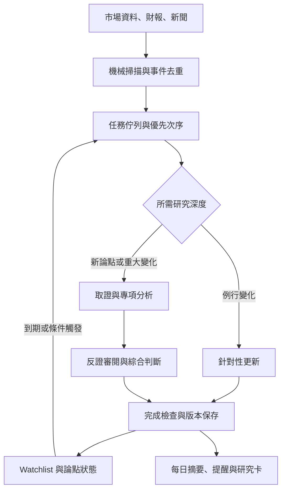
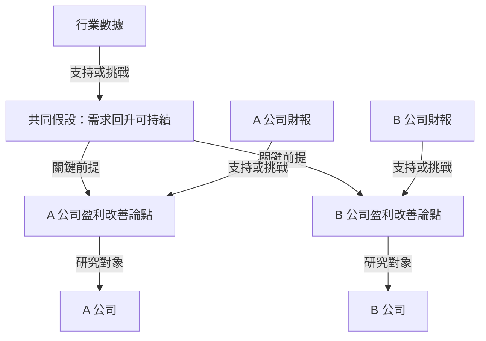
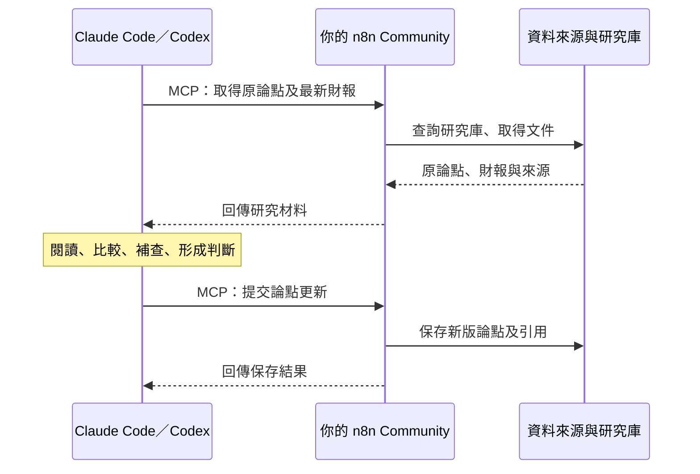

# ②第五輪外部評論與新架構討論(GPT 對話原文,2026-09-13 至 14)

> 來源:用戶分享的 ChatGPT 對話(標題「評估引入 Lean‑rly」),由主 agent 抽出全文,工具呼叫與檢索訊息已略去。USER = 用戶原話;ASSISTANT = GPT。最後一則 ASSISTANT 是對 `2026-09-13-②第一次考試結果報告(供外部評論).md` 八問的逐一回應。主 agent 的立場與採納紀錄在 `2026-09-08-②趨勢注材料全盤梳理.md` §十二 第 17 條與 `.kira/decisions.md` D-177。

### USER

Recently I have read this. Do you think Lean is a approach should bring into our model?
[(1) 當 AI 的推論愈來愈長，我們如何知道它是對的？ - 90s.pm.investing](https://90spminvesting.substack.com/p/ai)  
[Introduction](https://lean-lang.org/theorem_proving_in_lean4/Introduction/)  

---

### ASSISTANT

我會先讀你貼的文章和 Lean 的官方介紹，再結合我們投資研究模型的脈絡，判斷哪些部分值得引入形式驗證。

---

### ASSISTANT

我也會用 Personal Context 技能核對我們之前定下的研究流程，尤其是 84 宗案例和「改善能否延續」的評估目標。

---

### ASSISTANT

讀完後，我傾向引入文章的驗證思路，但暫時不把 Lean 變成整個模型的必經步驟。文章也有清楚區分：舊分數、日期和引用等問題靠資料追查與程式測試處理；Lean 驗證的是指定的邏輯和數值性質。對我們而言，關鍵是保留「改善能否延續」這個實證問題，避免把待驗的投資假設寫成必然成立的規則。

---

### ASSISTANT

**我認為值得引入它的形式化與驗證思路；Lean 本身則適合先做小範圍試點。** 以我們目前正在跑的 ②「改善能否延續」及已凍結的 84 宗案例來看，我會先建立可機器檢查的研究規格，再挑少數穩定規則交給 Lean。

它能改善系統的可靠性，但我們仍要靠案例評估，確認 LLM 的研究判斷有沒有增量價值。

文章有一點我很認同：作者清楚交代，舊分數未更新、日期混淆、引用對不上等問題，是靠資料追查、命題審核和程式測試發現；Lean 另外驗證指定的邏輯及數值性質。而且作者承認，Python 與 Lean 之間做過對照測試，尚未完成整個應用程式的形式等價證明。**所以文章支持的是一套分工清楚的驗證流程，不能把所有改善都歸功於 Lean。** [原文第五星至第七節](https://90spminvesting.substack.com/p/ai)

對我們而言，最重要的是分清三種「對」：

| 要確認甚麼 | 我們模型中的例子 | 適合的方法 |
|---|---|---|
| 資料與理解正確 | 財報數字是否抄對？管理層說的是目標還是已實現結果？ | 原始來源查核、口徑與日期檢查、語義審閱 |
| 計算與推導遵守規則 | 是否讀取舊結果？必要條件是否被當成充分條件？ | 一般程式檢查；部分規則可用 Lean 證明 |
| 判斷具有預測力 | 能否辨認未來 2–4 季會持續改善的公司？ | 凍結預測、機械基準比較、到期結果與前瞻測試 |

Lean 的正式保證主要落在第二行：對精確表達的定義、前提及命題，檢查證明是否成立。它不會自動驗證前提是否描述真實世界。[Lean 官方介紹](https://lean-lang.org/theorem_proving_in_lean4/Introduction/)

例如，我們可能讀到：

> 毛利率改善、訂單回升，因此未來幾季的改善較可能延續。

這是一項需要實證支持的預測判斷。如果為了讓 Lean 接受，先加入「毛利率改善且訂單回升，必然導致改善延續」這個假設，後面的證明即使通過，也沒有回答我們真正想知道的問題。

**最容易出錯的接點，是把研究文字翻譯成形式命題的那一步。** 「支持某個假說」可能被翻成「假說成立」；「尚未找到證據」可能被翻成「假說不成立」。Lean 可以嚴格檢查翻譯後的命題，但仍需要我們審核它有沒有忠實保留原意。官方文件也明確區分命題、假設與證明。[命題與證明](https://lean-lang.org/theorem_proving_in_lean4/Propositions-and-Proofs/)

因此，我會在我們的共同研究流程中，按以下次序引入。

1. **先讓每項重要判斷可以追查。**  
   為核心結論記錄：明確命題、觀察期限、來源及當時可取得日期、事實／管理層說法／模型推斷的身份、依賴的假設、反證條件和版本。研究正文仍然可以用 Markdown，不需要整份改寫成 Lean。

2. **把固定規則做成獨立於 LLM 的檢查。**  
   例如：引用是否存在；輸入更改後，下游結果是否重算或標記過期；尚未到期的案例是否被錯當失敗；資料缺漏是否被默認為零或否定；評估時是否偷偷換了結果定義。這些是我認為目前應優先投入的部分。

3. **再挑一小塊用 Lean，證明它對所有符合前提的輸入都成立。**  
   可選的是已穩定、反覆使用、錯了會影響很多結果的規則。例如依賴狀態的傳遞，或未來若有情景權重轉移，其非負性與總量守恆。一般測試檢查具體案例；形式證明可以在明列前提下覆蓋整類輸入，這才是額外價值。[Lean 官方介紹](https://lean-lang.org/theorem_proving_in_lean4/Introduction/)

其中，我尤其想保留 **「未知」這個狀態**。投資研究經常遇到資料不足、證據互相衝突或結果尚未成熟。這些不能被壓成單純的真／假。證明沒有完成，也不等於命題已被推翻。

如果做 Lean 試點，我會要求它回答一個具體問題：**相對於普通程式檢查，它額外防止了哪一類錯誤，是否值得維護第二套規格？** 同時需要確認實際執行的程式符合被證明的規格；只證明旁邊一份抽象模型，保障範圍仍然有限。驗收也不能只看「編譯成功」——Lean 允許用 `sorry` 暫留證明缺口，會發出警告，所以完成標準必須排除這類未完成證明及未審核的假設。[Lean 官方文件](https://lean-lang.org/theorem_proving_in_lean4/Interacting-with-Lean/)

**對這輪 84 宗，我會繼續原定評估，不會等全面導入 Lean 才跑。** 可以加入上述資料、版本和流程檢查，但檢查失敗的案例仍須留下紀錄，修正或明列無法評估的原因，不能藉此悄悄收緊候選池。

我會把近期工作順序定為：先確認研究流程可重播、結果可追查，再用完整案例比較 LLM 與機械基準；當中反覆出現、且能精確定義的規則錯誤，就是最值得交給 Lean 的第一批工作。

---

### USER

while the 84 宗  is still developing, what about the case for Category 1?

---

### ASSISTANT

我會先核對 Category 1 上次評估後保留的用途和限制，再判斷 Lean 在那部分是否更值得引入。

---

### ASSISTANT

我會用 Library 技能讀回 ① 的回測與定位報告，重點核對「暴露較低」到「價格真的低估」之間，之前尚未驗證成功的部分。

---

### ASSISTANT

① 有更具體的試點位置：它曾把「壞情境成立時會受重創」接成「不值得買」，估值部分也曾用現價反推參數再評判現價。形式化可以讓這些前提和依賴更清楚；但後一種循環計算，Lean 可能照樣證明算術正確，仍要審核它是否真的提供了獨立估值依據。

---

### ASSISTANT

**① 比②更適合作為第一個小型 Lean 試點。** 因為①已有一些具體的推導接駁問題，可以明確寫出「這一步需要甚麼前提」，再檢查系統有沒有跳步。我會把試點定為：**驗證①的經濟傳導與估值推導，維持它目前作研究輔助的定位。**

你原本對①的要求，是判斷「行業恐懼是否真的傷到這家好公司的業務價值，以及價格是否反映過度」。重讀報告後，我認為形式化對這條研究路徑有用，尤其是以下幾處。

| ① 的接點 | 需要守住的區分 | 適合怎樣驗證 |
|---|---|---|
| 行業恐懼 → 公司損害 | 「若恐懼成真，損害重大」與「預期會有重大損害」 | 把情境條件保留在推導中；Lean 可驗證已形式化的條件推論 |
| 公司暴露 → 業務後果 | 收入受影響，還要經過價格、數量、成本、時間才成為現金流損失 | 明列機制及計算；穩定的數量關係可交 Lean |
| 公司受損較少 → 股票便宜 | 相對韌性與現價吸引力是兩個待回答的問題 | 規格要求獨立的定價論據；不能只憑暴露判級完成結論 |
| 一個行業假設 → 多家公司結論 | 共用前提改變後，所有依賴它的分析都需要覆核 | 先做依賴與版本檢查，再考慮證明狀態傳遞規則 |

這些直接對應①過去的問題。早期版本曾有「重大損害＝不買」的接法；後來改成情境表，正是為了分開**條件成立時的損害、條件有多可信，以及現價是否充分反映損害**。filecitefile_00000000cd3882099a54c6e2bc64127f filecitefile_00000000dad8820e9ca4bc3dad19e12f

但這裏有一個很值得用①理解的限制：**有些問題，Lean 會證明它算得完全正確，卻仍然沒有投資上的解釋力。**

例如報告提到，曾用衝擊日價格反推估值倍數，再用這個倍數判斷現價。簡化成每股收入 \(S>0\)、現價 \(P\)：

\[
M=\frac{P}{S},\qquad V=M\times S=P
\]

Lean 可以證明這個恆等式。可是它沒有提供獨立的公平價值依據；報告中的價格判詞也仍然呈現接近零或反向的分辨力。filecitefile_00000000da7081f689a1706eae3eb85f

所以，①真正需要一起做好的是：

- **經濟規格審核：**我們究竟在計算甚麼？這個結果能回答哪個問題？
- **形式驗證：**給定這份規格，推導和計算是否確實成立？

這符合 Lean 的保證範圍：驗證精確表達的命題是否由指定前提推出；前提與規格是否適合描述現實，仍要另外判斷。[Lean 官方介紹](https://lean-lang.org/theorem_proving_in_lean4/Introduction/)

而且，「現價要求」本來就可以合法地使用現價。假如我們問的是「在指定利潤率、折現率和期限下，現價要求收入跌多少」，反推是有意義的。需要避免的是把**從現價解出的隱含條件，再當成獨立證據證明現價合理**。這個分界，比全面禁止使用現價更重要。

對①的敘事分析，我還會特別保留一條規則：**沒有找到某個必要條件的證據，只能記作未知；不能直接判定條件不成立。** 否則系統可能因為研究不完整，就把市場恐懼判成錯誤。即使形式化後的推導成立，輸入的「否定」仍可能根本不成立。

我會趁②的 84 宗仍在開發時，給①一個很小、可完成的工作包：

1. **沿用一宗已研究的行業事件，選兩至三家不同傳導機制的公司。**  
   把原有分析整理成「共同恐懼—必要條件—公司暴露—價量成本—現金流後果—現價要求」，每個接點標明是定義、資料、假設，還是推導。

2. **先用既有錯誤做重播。**  
   測試系統能否指出：條件式損害被當成確定預期、低暴露被當成低估、未知被當成否定，以及共用假設改了卻沿用舊結論。一般程式檢查能處理的部分先完成。

3. **只挑一段真正穩定的規則寫 Lean。**  
   例如一組公司損害上下界的計算，或共同前提失效後哪些正式結論不再具備所需條件。驗收要看它額外攔住了甚麼錯誤，以及實際研究程式是否確實使用那套規格。

**這值得做，但不能憑「Lean 通過」就恢復①的獨立排序、排除或交易權限。** 它可以提高研究推導的可信程度；①能否判出錯價、能否帶來選擇優勢，仍是另一道考試。

我會優先把①做成一個能清楚指出「結論在哪一步失去支持」的研究模組，再用這個小試點決定 Lean 是否值得擴展到整個共同流程。

---

### USER

Actually what is Lean, is it a archtecture? Or it is a programming language? As you know, we are trying to build a LLM based with mainly contextual agent judgement with unstructured data + minor TA data. Whether Lean is somewhere value added and critical, is it a governance model to LLM induction of proof or analysis?

---

### ASSISTANT

我會把 Lean 的工具身份、它能驗證的內容，以及它在你這種「以非結構化資料和 agent 判斷為主」的系統中應放的位置分開說清楚。我上一則對①的建議也需要更明確地限定範圍。

---

### ASSISTANT

**Lean 是一種程式語言，同時是一套定理證明工具（proof assistant）。它本身不是 agent 架構，也不是 LLM 治理模型。** 你可以把它接進自己的架構，讓它負責某些形式證明的檢查。[Lean 官方介紹](https://lean-lang.org/theorem_proving_in_lean4/Introduction/)

**對你描述的系統——主要靠非結構化資料、contextual agent judgment，另加少量 TA——我目前不認為 Lean 是關鍵依賴。** 它可能在局部增加價值，但研究品質的主要瓶頸仍是證據理解、經濟機制判斷，以及這些判斷能否經得起結果驗證。

我也需要修正前兩則的表達：我把「形式化研究規格」與「採用 Lean」講得太接近了。你很需要前者；後者則需要另外證明值得投入。

Lean 實際做的事情，可以這樣理解：

1. 人或 LLM 把問題寫成精確的定義、假設與命題。
2. 人或 LLM 提供形式證明，也可使用 Lean 的自動化工具協助。
3. Lean 的核心檢查器核對這份證明，是否真的支持那個命題。

**負責最後檢查的是程式規則，不是另一個 LLM 對答案是否合理的評價。** 但它檢查的是提交給它的形式命題，並不會自動閱讀整份研究報告、理解商業背景，再判斷分析是否可信。[Lean 的形式證明與類型系統](https://lean-lang.org/doc/reference/latest/The-Type-System/)

例如，你的 agent 可能提出：

> 客戶轉換成本高、續約仍然穩定，因此這次 AI 替代恐懼可能被市場高估。

這裏有幾個不同的研究責任：

- 「轉換成本高」是否有可靠證據，還是管理層自己的說法？
- 續約數字是否滯後，尚未反映新的替代壓力？
- AI 是否會改變原本的轉換成本？
- 即使恐懼被高估，現价是否已經反映這一點？

**Lean 不會自行解答這些問題。** 如果 agent 直接把「高轉換成本會阻止 AI 替代」寫成假設，Lean 可以檢查後面的推導，但最值得懷疑的那一步已經被放進前提了。

這就是你系統與數學證明的重要差別：你主要做的是**根據不完整證據，提出解釋、比較情境、更新對未來的判斷**，也就是歸納與溯因推理。Lean 的主要強項，是對已明確形式化的演繹推導提供保證。它也能處理機率模型的數學性質，但不會因此證明那些機率符合現實。

所以，如果你問「它是不是一種治理 LLM 分析的方式」，我的回答是：**它可以成為治理流程中的一個驗證工具；整套治理仍然要由我們設計。**

| 你需要治理的事情 | 主要方法 | Lean 的位置 |
|---|---|---|
| 引用是否真實、是否支持結論 | 原文核對、來源與日期追蹤、語義審閱 | 無法自行保證 |
| agent 是否忽略背景、反證或替代解釋 | 結構化研究要求、針對性反方審閱、案例評估 | 作用有限 |
| 假設是否被悄悄寫成事實 | 明列陳述身份、依賴關係及不確定性 | 可約束正式表示，但翻譯仍要審核 |
| 指標、估值計算與固定規則是否正確 | 一般程式、資料檢查、測試 | 少數複雜且穩定的規則值得形式證明 |
| 判斷是否有預測力與增量價值 | 凍結預測、基準比較、到期評分與校準 | 無法代替實證 |

對你而言，我會優先建立一個很薄的**可追查判斷格式**，讓 agent 在保持自由分析的同時，為每個重要結論交代：

- **結論：**究竟在主張甚麼，期限是多久。
- **證據：**哪些原始材料支持它，哪些與它矛盾。
- **推斷：**從證據走到結論，依賴哪些尚未證實的假設。
- **失效條件：**看到甚麼就必須重新評估。
- **依賴與版本：**上游資料或假設改變時，哪些下游結論需要覆核。

這些可以用 Markdown 加少量結構化欄位與程式檢查完成。它們讓研究可審核，但不把「填齊欄位」冒充為「分析已證明正確」。

至於少量 TA，像均線、報酬、交易日期對齊，通常先用一般程式計算與驗證便足夠。真正困難的仍是「這個訊號在當前商業情境下代表甚麼」，那部分需要 agent 判斷和實證考核。

**因此，我會把①的下一步改得更明確：先整理經濟推導、證據身份與結論依賴，暫時不把導入 Lean 列為必要工作。** 等我們找到一條反覆使用、定義穩定、出錯影響大，而且普通檢查仍不足以保障的規則，再讓 Lean 證明那一小塊。這樣才能知道它帶來的是實際可靠性提升，而不是多了一份看起來嚴謹的形式文件。

---

### USER

Yes, as I think at the first disipine, Macroeconomic or financial market is a result of billions of people interactions, it is bounded to be uncertainty. But we are missioned to under the pattern or conditional or grounding, while accepting certain risk, and expecting a certain return. And trying to proof by economics model or financial model, we try to smartly bet into the market with proper R&R and control. To try winning the 90% of player in the market, as we do think more in advance of them. But this is not meaning that we are innovating something new ourselves, but we rather to observe and choose to bet into the favoritable or follow the majority setup. (as the majority should have more information then the minority if we are talking about the cashflow. i.e. Institution, or even the bigger institution should have more power or information than the smaller)

---

### ASSISTANT

我理解你想建立的是一套在不確定性下、有依據地下注並控制風險的方法。我會特別釐清「資金與機構行為可作證據」和「它們較可能是對的」之間的分別，因為這會影響 agent 如何使用市場訊號。

---

### ASSISTANT

我認同這個任務定位：**在不確定性下，利用經濟機制、公開證據與市場行為，選擇值得承擔的風險，並持續修正判斷。** 這也更準確地界定了我們需要的 LLM 系統。

你說不必發明新理論，我也同意。優勢可以來自更完整地整理既有資訊、更準確地辨認適用條件、更有選擇地參與，以及更一致地執行。不過，這些目前應視為**我們要驗證的優勢來源**；「分析得更多」本身還不是優勢的證據。

我會保留你大部分的方向，但對「多數／大機構有更多資訊，所以跟隨它們較有利」作一個重要修正。

**機構的資訊能力、影響價格的能力，以及我們跟隨後的回報，是三件不同的事。**

大型機構可能投入更多研究資源，但我們看到的一筆買入，仍可能有多種解釋：基本面看好、追蹤指數、處理申購、再平衡，或配合另一邊的對沖。它們的期限、成本和持倉目的，也未必與我們相同。更大的資金規模，不能直接換算成更高的判斷正確率。

而我們看到的機構資訊也可能不完整。例如美國 13F 通常在季末後 45 天內申報，並不披露股票空倉，因此不能把它當作即時、完整的機構看法。[SEC：13F 常見問題](https://www.sec.gov/rules-regulations/staff-guidance/division-investment-management-frequently-asked-questions/frequently-asked-questions-about-form-13f)

所以我會把你的想法落成：

**市場價格與資金行為，是需要認真解讀的證據；其含義要結合機制、期限與現價判斷。**

這完全容許順勢。我們不需要在機構之前發現所有事情，才有機會取得回報。歷史上的跨資產趨勢跟隨研究，就提供了「觀察已發生的價格趨勢再參與」可以具有價值的證據；但它並未證明「大機構知道更多」就是原因，也不能直接證明我們的選股流程有效。[Hurst、Ooi、Pedersen：趨勢跟隨的長期證據](https://www.aqr.com/Insights/Research/Journal-Article/A-Century-of-Evidence-on-Trend-Following-Investing)

**順著正在形成的共識參與，與「跑贏很多參與者」並不矛盾。** 但必須回答：當我们看見這個 setup 時，還剩下甚麼值得取得的回報？可能是基本面改善仍未充分反映、改善時間比市場預期長，或我們有更合適的持有期限。若好消息已充分反映，即使方向判對，這個價格的 R&R 仍可能不吸引。

而「多數」也最好不要理解成人數。對價格更有用的問題是：**哪些資金正在改變配置、這種需求可能持續多久，以及價格已經為這個預期走了多遠。** 單憑成交量或上漲，不能確認背後是哪類機構、知道甚麼。

這會令我們的共同研究流程更清楚：

| 要回答的問題 | Agent 的工作 |
|---|---|
| **發生了甚麼，為何可能延續？** | 從非結構化資料找出機制、適用條件、反證及時間限制 |
| **市場目前反映了甚麼？** | 結合現價、估值、預期變化、價格與可觀察的資金行為；分開觀察與推測 |
| **現在參與是否值得？** | 比較情境、可能回報、損失、期限與成本，說明判斷對哪些假設敏感 |
| **我們錯了會怎樣？** | 定義失效證據、覆核或退出條件，以及多筆持倉是否共用同一風險 |
| **這套判斷真的增加了價值嗎？** | 與簡單基準比較，追蹤漏選、誤選、成本、回撤及事前判斷的校準 |

經濟模型和金融模型在這裏很有用：它們能迫使 agent 解釋**「如果我們相信這個故事，價格、數量、成本與現金流應該怎樣變」**，也能找出不一致之處。但模型給出的仍是帶條件的結果；機率可以用區間和敏感度表達，不必為了完整而填入虛假的精確數字。

同樣，R&R 不能只由目標價與止蝕價決定。兩者提供的是計劃中的盈虧比例；是否值得下注，還取決於各結果的可能性、實現時間，以及實際損失可能偏離計劃多少。風控能限制承擔的風險，卻不會自動創造正的預期回報。

至於「贏過 90% 的玩家」，我會保留為抱負，但評估時用可測量的標準：**扣除成本後，相對合理基準是否有增量回報，而承擔的回撤、集中度與尾部風險是否值得。** 我們不需要先證明比九成人聰明；需要證明這套額外研究，比更簡單的做法帶來更好的結果。

這也決定了①和②的關係：①研究市場的恐懼是否錯配到公司；②研究已出現、甚至已被市場認同的改善，是否仍可延續。兩者都可以使用市場確認，但不能讓上漲代替經濟分析，也不能讓一個漂亮故事自動推翻市場訊號。

**因此，我會以這套「條件判斷—定價—風險—更新」流程作為架構核心。** LLM 負責理解脈絡與提出可覆核的判斷，程式負責精確計算與固定規則，案例結果負責檢驗我們是否真的有優勢。Lean 暫時只保留為局部驗證工具，無須主導整個研究方法。

---

### USER

On while, if I start over from the setup on this repo. Actually what should be the best setup on this assumpting it is much a LLM work?

---

### USER

On while, if I start over from the setup on this repo. Actually what should be the best setup on this assumpting it is much a LLM work?  

I am actually thinking it is more like a Agent Team workflow, that is trying to enforce the agent to ensure that it will be doing the multi-step analysis, with the datasources of tools properly defined. And with synthesis agent to consolidate the agents?

And then it should be having watchlist concept to periodically review the watchlisted stock, and it should be actually to have mechanical scan of abnormal price-action stocks, earnings everything, and keep news of the day.

---

### ASSISTANT

我會先核對現有投資 repo 的脈絡，再把你提出的掃描、新聞、agent 分工、綜合判斷和 watchlist 串成一套可持續運行的架構，重點放在如何確保每一步真的完成，以及新資料何時觸發重評。

---

### ASSISTANT

bash -lc /bin/bash -lc "pwd && rg --files -g 'AGENTS.md' -g 'README*' -g 'pyproject.toml' -g 'package.json' -g 'CONTEXT.md' -g 'CLAUDE.md' -g '"'!node_modules'"' -g '"'!downloads'"' ."

---

### ASSISTANT

我找到 `kkhcheng88/Investment` 了。可讀到的 `master` 主要是四月的 CIO 設計，已經有 watchlist、每日三層報告和多個投資者角色；我會以你剛才說明的方向為準，檢查哪些基礎值得保留，以及哪些要變成能排程、保存狀態和追查完成情況的實際流程。

---

### ASSISTANT

repo 裡其實已有 Chairman／synthesis 的草稿；我會調整的是它的運作方式：按取證、分析、反證和綜合分工，由程式檢查前置步驟及產物是否齊備。Watchlist 則記錄每個論點「在等甚麼、何時重評」，讓新聞和異動能觸發有針對性的更新。

---

### ASSISTANT

**是，你描述的方向適合做成「由事件驅動、有持續狀態的 Agent 研究工作流」。** Agent Team 負責理解和判斷；外層程式負責排程、資料取得、步驟依賴、重試和保存結果。這會是我對你目前需求的首選架構。

我看了 `kkhcheng88/Investment` 可讀到的 `master`：主要仍是四月的設計，已有三層分析、watchlist，以及 Chairman 綜合委員意見的草稿。因此有不少材料可以保留；九月的研究進展則以我們最近討論為準。[現有工作流](https://github.com/kkhcheng88/Investment/blob/bdd754be20dc105ede119b3f24b2baddacb5e557/WORKFLOW_MVP1.md)、[委員會草稿](https://github.com/kkhcheng88/Investment/blob/bdd754be20dc105ede119b3f24b2baddacb5e557/agents/committee/COMMITTEE_ARCHITECTURE.md)

**如果重建，我會把核心單位定為「一個持續被追蹤的投資論點」**。股票、新聞、財報、TA、agent 分析，都圍繞這個論點更新。報告則從這些記錄生成。

這裏有兩個重要的設計選擇：**多步驟分析由程式安排；每一步之內保留 agent 的研究自由。** 我們規定必須回答哪些問題、留下哪些證據，但不把商業判斷寫成死板公式。

你要的 Agent Team，我會先設以下五種職能，按研究深度啟用：

| 職能 | 主要責任 | 必須交出的結果 |
|---|---|---|
| **取證 agent** | 找原始披露、核對日期和口徑、整理相互矛盾的材料 | 可追溯的證據包與缺口 |
| **公司／行業分析 agent** | 分析商業模式、傳導機制、改善或惡化的持續條件 | 條件式論點、情境與關鍵假設 |
| **市場／定價 agent** | 解讀現价、預期、相對強弱及可觀察的市場行為 | 市場反映了甚麼、哪些只是推測 |
| **反證 agent** | 找替代解釋、漏掉的資料、錯誤類比與失效路徑 | 具體反對意見及其證據 |
| **Synthesis agent** | 綜合經濟分析、定價與反證，必要時要求補查 | 最終研究判斷、未解分歧、下一次觀察條件 |

日常小更新不用每次啟動完整團隊。新公司、財報重大變化或原有論點受挑戰，才進入完整流程。財務計算、價格指標和情境算式交給工具，agent 負責選擇假設及解讀結果。

現有投資家框架可以保留作**方法庫**：研究涉及資本配置時載入相關方法，涉及會計質量時載入另一套。執行角色則按工作責任劃分，這樣比較容易查出哪一步失敗。

另外，我會移除舊委員會草稿裡「共識比例乘係數＝最終信心度」這類合成公式。多個 agent 可能依賴同一來源、犯同一錯誤，票數不能直接變成勝率。Synthesis 應交代**採納了甚麼、駁回了甚麼、依據在哪裏**，而不是把意見平均。[現有信心度設計](https://github.com/kkhcheng88/Investment/blob/bdd754be20dc105ede119b3f24b2baddacb5e557/agents/committee/COMMITTEE_ARCHITECTURE.md)

你說的「enforce multi-step analysis」，需要落在執行層。每個階段應記錄輸入版本、實際執行狀態、來源及產物；前置工作未完成，後一步不能被標為正式完成。資料不足可以留下研究草稿與缺口，不能由 synthesis 補寫成確定結論。

反證也應是分開執行的工作，有自己的上下文及原始資料存取。尤其重要的案例，可以讓反證 agent 先獨立列出問題，再看主分析稿。**流程檢查能確認工作有做；分析品質仍要靠審閱和評估確認。**

資料來源方面，我會建立一份版本化的來源登記表，所有 agent 經統一工具介面取得資料：

- **價格及量能：**固定主要資料供應商、交易日曆、時區、拆股與股息調整口徑。
- **財報及公司事件：**公司 IR、監管披露作原始依據；財報日曆與共識預期另行記錄來源及取得時間。
- **新聞：**新聞供應商或訂閱來源負責覆蓋，搜尋用來補查；相同事件的轉載要合併。
- **宏觀及行業：**官方發布加指定行業來源，保存發布時間、修訂版本及適用期限。

每項資料至少分開「事件發生時間、公開時間、我們取得時間」。沒有當時的共識預期，就不能聲稱某次財報「超預期」。來源失效或掃描未完成，也要顯示為未完成，不能回報成「沒有新聞／沒有異動」。

工具權限與回傳格式由程式設定。Prompt 說「請使用某資料源」，不足以確保資料來源一致。

**Watchlist 應該記錄我們在等甚麼。** 每個項目除了 ticker，還應有：

- 當前論點及其版本、所屬①②③④模組。
- 為何關注，以及現在未行動的原因。
- 在等價格、財報、訂單、政策，還是其他證據。
- 下一個催化事件、覆核日期與觸發條件。
- 哪些新資料會加強、削弱或推翻論點。
- 最近一次完成覆核的時間及未解問題。

同一公司可以有不同論點；同一行業假設也可能影響多家公司。因此，新聞不能只靠 ticker 配對。例如行業需求假設改變，應能找到所有依賴它的 watchlist 項目。

我會採用「事件觸發＋定期補查」的節奏，以下是起步設定：

| 工作 | 建議節奏 | 產出 |
|---|---|---|
| 價格／量能異常掃描 | 每個交易日收市後 | 可重播的異動清單及觸發原因 |
| 財報、公告、新聞取得 | 定期更新，重大事件觸發任務 | 去重事件及受影響論點 |
| Watchlist 輕量覆核 | 每日檢查新證據與觸發條件 | 改變了甚麼、是否需要深讀 |
| Watchlist 完整覆核 | 按論點期限設定，財報後及重大反證出現時 | 新版論點及判斷變更 |
| 每日摘要 | 每日一次 | 重要新事件、watchlist 變更、待處理工作 |

機械掃描可以涵蓋跳空、相對成交量、相對行業的異常回報，以及已定義的趨勢變化；也要先處理公司行動造成的假異常。**異動是研究入口，不直接代表投資機會。** 財報與新聞也能獨立觸發研究，避免只看已經大幅移動的股票。

資料量增加時，優先用事件去重、分級處理和任務預算管理深讀工作；候選及延後處理的原因都留下記錄。這也符合我們之前對②的安排。

技術上，我會先選一套相對薄的組合：

| 部分 | 我的起步選擇 |
|---|---|
| Agent 執行 | **Claude Agent SDK**，保留其他模型的獨立接入介面 |
| 流程控制 | **Python 控制器**：固定階段、依賴、重試、成本上限與恢復 |
| 排程與任務 | 常駐服務的排程器＋持久化任務佇列 |
| 動態狀態 | 單機起步用 **SQLite**；由控制器統一寫入 |
| 規格及研究文件 | **Git＋Markdown**，少量結構化欄位 |
| 原始證據 | 保存可重播的來源快照、版本及索引 |

Claude Agent SDK 提供 Claude Code 的 agent loop、工具、subagents、MCP、hooks 和結構化輸出能力，適合放在這個執行位置。[官方 SDK 文件](https://code.claude.com/docs/en/agent-sdk/overview)

這裏的「Agent Team」是我們的工作分工設計。若特指 Claude Code 的 **Agent Teams** 功能，官方目前仍列為實驗性，而且非互動模式及 SDK session 使用的是普通 subagents。因此，自動排程研究我會以 SDK 和外部控制器實作；互動式 team 可用於需要你參與的複雜研究。[官方 Agent Teams 文件](https://code.claude.com/docs/en/agent-teams)

研究正文仍可主要使用 Markdown。資料庫保存任務、事件、watchlist 狀態及正式版本指標；現有 `CIO_WATCHLIST.md` 可以變成生成的閱讀介面，避免多個 agent 同時改寫一張大表。Memory plugin 則幫忙找回背景與理由，不決定哪個版本才是現行判斷。

**第一版我會先完成一條真正閉合的流程：事件進來 → 取得證據 → 分析與反證 → 綜合 → 加入 watchlist → 新證據觸發重評。** 再接上全市場掃描、財報日曆和每日新聞，最後測試哪些額外 agent 確實改善品質，值得其成本。

①與②共用這套基礎設施，各自載入不同研究問題；②的 84 宗維持凍結定義，架構改動另記版本。這樣重建得到的是一套能持續研究、更新和接受檢驗的系統，而不是只在單次對話中完成一份分析。

---

### USER

[KylinMountain/TradingAgents-AShare: A 股多智能体智能投研系统 — 基于 TradingAgents 架构，15 名 AI Agent 模拟机构协作与实时辩论对抗，全流程可视化，支持 OpenClaw / Claude Code 集成，Docker 一键部署。](https://github.com/KylinMountain/TradingAgents-AShare)   

Or actually we should be developing on top of this?

---

### ASSISTANT

我會先看它的實際程式、資料接入和工作流程，再判斷哪些能直接承接我們的需求，哪些仍要另外建；尤其會檢查「15 個 agent」背後是否有可追查的分工、狀態保存和持續監測。

---

### ASSISTANT

bash -lc /bin/bash -lc "sed -n '1,260p' tradingagents/graph/data_collector.py"

---

### ASSISTANT

bash -lc /bin/bash -lc "sed -n '1,280p' tradingagents/graph/setup.py"

---

### ASSISTANT

bash -lc /bin/bash -lc 'cat LICENSE pyproject.toml .github/workflows/ci-checks.yml'

---

### ASSISTANT

bash -lc /bin/bash -lc "rg -n 'class |def |short|medium|long|checkpoint|compile\\(|memory|reflect|horizon|resume|interrupt|provider|date' tradingagents/graph/trading_graph.py tradingagents/agents/utils/agent_states.py tradingagents/default_config.py tradingagents/dataflows/interface.py tradingagents/dataflows/trade_calendar.py"

---

### ASSISTANT

bash -lc /bin/bash -lc "rg -n 'class |def |cron|interval|schedule|claim|retry|fail|pending|running|stale|news|earnings|scan|watchlist|thesis|version|checkpoint' scheduler/main.py api/services/scheduled_service.py api/services/watchlist_service.py api/services/backtest_service.py api/database.py api/job_store.py"

---

### ASSISTANT

它確實已有不少可重用的工程：LangGraph 分工、資料集中取得、watchlist、定時分析和歷史報告都有實作。目前要釐清的是，它的分析核心偏向「按指定股票重跑交易判斷」，能否低成本改成我們需要的「追蹤論點、因新證據而更新」，以及美股資料和持有期限是否相容。

---

### ASSISTANT

bash -lc /bin/bash -lc "sed -n '200,470p' tradingagents/graph/data_collector.py"

---

### ASSISTANT

bash -lc /bin/bash -lc "sed -n '243,320p' api/database.py && sed -n '387,419p' api/database.py && cat tradingagents/dataflows/trade_calendar.py"

---

### ASSISTANT

bash -lc /bin/bash -lc "rg -n -C 3 'Sqlite|MemorySaver|checkpointer|horizon|fetch_all|resume|thread_id|reflect|def propagate|def stream' tradingagents/graph/trading_graph.py && cat tradingagents/default_config.py"

---

### ASSISTANT

bash -lc /bin/bash -lc "rg -n \"curr_date|financials|balance_sheet|cashflow|\\.info|def get_\" tradingagents/dataflows/y_finance.py tradingagents/dataflows/providers/yfinance_provider.py"

---

### ASSISTANT

bash -lc /bin/bash -lc 'rg -n "checkpoint|MemorySaver|Sqlite|resume|earnings|scanner|horizon|trade_calendar" api/main.py tradingagents/graph/intent_parser.py scheduler/main.py skills/tradingagents-analysis/scripts/analyze.sh'

---

### ASSISTANT

bash -lc /bin/bash -lc "sed -n '1,110p' tradingagents/graph/intent_parser.py"

---

### ASSISTANT

bash -lc /bin/bash -lc "sed -n '1,230p' api/services/backtest_service.py"

---

### ASSISTANT

bash -lc /bin/bash -lc "sed -n '280,330p' scheduler/main.py"

---

### ASSISTANT

bash -lc /bin/bash -lc 'rg -n "confidence|置信|信心|概率|必须|必須|仓位|倉位|止损|止損|5.*10|1.*3|horizon_context_block" tradingagents/prompts/zh.py tradingagents/agents/managers/risk_manager.py tradingagents/agents/managers/research_manager.py'

---

### ASSISTANT

找到兩個會影響我們採用的細節：預設交易提示會限制 HOLD，催促 agent 選買或賣；另外，yfinance 財務接口明確沒有使用傳入的歷史日期。前者與我們保留「證據不足、繼續觀察」的研究流程有衝突，後者則需要先處理，才能用於 84 宗歷史驗證。我會把可重用的工程和需要改造的研究邏輯分開評估。

---

### ASSISTANT

bash -lc /bin/bash -lc "sed -n '1,95p' LICENSE"

---

### ASSISTANT

bash -lc /bin/bash -lc "sed -n '1,95p' tradingagents/graph/trading_graph.py"

---

### ASSISTANT

bash -lc /bin/bash -lc "sed -n '60,145p' skills/tradingagents-analysis/scripts/analyze.sh"

---

### ASSISTANT

**值得借用，但我不建議直接把整套 TradingAgents-AShare 當成我們的長期底座。** 對我們以美股、非結構化資料和跨季度論點為主的研究，我會優先評估 **原版 TradingAgents 的工作流核心，再加上自己的研究狀態與 watchlist 系統**；AShare 則提供很有價值的應用介面和排程參考。

這會調整我前面的建議：我們不用把所有工程從零搭起，也不必為了「Agent Team」而堅持重寫成 Claude Agent SDK。

我看過它的實際程式。它確實用 LangGraph 強制執行流程：各分析師完成後，才進入多空研究、研究經理、交易員和風控。這部分很符合你要的多步分析。不過，**流程能確保某個步驟被執行；證據是否充分、結論是否成立，仍需要另外設計檢查。** [工作流實作](https://github.com/KylinMountain/TradingAgents-AShare/blob/fef942f94081885a7e6956c71645dbaf3b93b811/tradingagents/graph/setup.py)

| 我們需要的能力 | 它目前提供的東西 | 我們還要補甚麼 |
|---|---|---|
| 多步分析、綜合判斷 | 分析師、辯論、研究經理、風控的完整流程 | 改成符合我們 Category 的研究任務與輸出 |
| 定義資料工具 | 資料供應商接口、集中收集、程式計算 TA | 來源快照、發布時間、缺失資料的處理規則 |
| Watchlist | 股票清單、定時分析、歷史報告 | 持續保存論點、失效條件、下一個驗證事件 |
| 異常價量掃描、財報、每日新聞 | 有相關資料工具和個股分析入口 | 完整的市場掃描、事件去重、觸發研究機制 |
| Category 1 行業事件研究 | 核心以指定股票分析為主 | 同一事件下，跨公司比較曝險與受益程度 |

這個差距可以從資料結構看到：watchlist 主要保存股票代碼與排序；排程保存時間、狀態和報告關聯。它已有實用的追蹤基礎，但還沒有我們需要的「論點如何隨證據改變」的完整狀態。上表是根據程式檢查作出的適配判斷。[資料模型](https://github.com/KylinMountain/TradingAgents-AShare/blob/fef942f94081885a7e6956c71645dbaf3b93b811/api/database.py)、[資料收集器](https://github.com/KylinMountain/TradingAgents-AShare/blob/fef942f94081885a7e6956c71645dbaf3b93b811/tradingagents/graph/data_collector.py)

有三個細節，令我不會直接照搬它的研究核心。

**第一，它的提示詞內建了偏向作出交易決定的取向。** 例如，交易員只有在技術、資金、基本面與新聞都缺乏方向時，才可以選 HOLD；風控也被要求原則上尊重上游方向。這會影響整個委員會的結論分布。我們應容許「公司論點成立，但價格不吸引」「有異動，但機制未明」「證據不足，等待財報」成為完整、有效的研究結果。[提示詞](https://github.com/KylinMountain/TradingAgents-AShare/blob/fef942f94081885a7e6956c71645dbaf3b93b811/tradingagents/prompts/zh.py)

**第二，歷史日期不等於當時可知的資料。** 它的 yfinance 財務接口明確沒有使用傳入的 `curr_date`，而是讀取當前可取得的公司資訊和報表。因此，指定過去日期，仍可能把後來才知道的資訊交給 agent。這條資料路徑必須先處理，才能用於我們的 84 宗歷史驗證。[財務接口](https://github.com/KylinMountain/TradingAgents-AShare/blob/fef942f94081885a7e6956c71645dbaf3b93b811/tradingagents/dataflows/y_finance.py)

**第三，它的預設市場和時間尺度與我們不同。** 週期標籤是短線 1–2 週、中線 1–3 月；排程使用中國交易日和上海時區。要承接美股，以及 Category 2 的 2–4 季改善論點，需要調整資料、排程和研究狀態，單改 system prompt 並不足夠。[週期設定](https://github.com/KylinMountain/TradingAgents-AShare/blob/fef942f94081885a7e6956c71645dbaf3b93b811/tradingagents/graph/intent_parser.py)、[排程實作](https://github.com/KylinMountain/TradingAgents-AShare/blob/fef942f94081885a7e6956c71645dbaf3b93b811/scheduler/main.py)

因此，我會把我們的系統建成以下四部分：

1. **程式負責持續觀測。** 掃描異常價量、財報時間、公告和新聞，去重後產生事件。TA 在這裏很有用：發現值得研究的變化。
2. **資料層保存可追查的證據。** 每筆資料包含來源、發布時間、取得時間和內容快照；研究引用明確的證據。
3. **Agent workflow 負責有條件的判斷。** 按事件啟動相關分析師，由反方檢查最脆弱假設，再由 synthesis agent 整理機制、市場預期、風險回報與未解問題。毋須每次啟動全部 15 個角色。
4. **Watchlist 保存研究進展。** 記錄目前論點、成立條件、失效條件、下一個驗證事件，以及「今次相對上次改變了甚麼」。新事件只重查受影響的部分。

例如，一份財報進來後，系統應能指出：

> 收入改善符合原先預期，但毛利率改善尚未出現；論點保留，下一季需要驗證產品組合。股價已提前反映部分改善，因此風險回報吸引力下降。

這類**跨時間更新同一個論點的能力**，才是我們最值得自行開發的部分。

至於底層選擇，原版 TradingAgents 已有可選的 SQLite 節點恢復機制，採 Apache 2.0 授權，值得先做適配驗證；這並不代表它的資料和提示詞可以免審。AShare 的新增介面和重大修改則採非商業授權，若未來產品化，重用範圍也需要考慮。[原版恢復機制](https://github.com/TauricResearch/TradingAgents/blob/be952b8eccb49720509af544c6675233bc1f10d0/tradingagents/graph/trading_graph.py)、[原版授權](https://github.com/TauricResearch/TradingAgents/blob/be952b8eccb49720509af544c6675233bc1f10d0/LICENSE)、[AShare 授權](https://github.com/KylinMountain/TradingAgents-AShare/blob/fef942f94081885a7e6956c71645dbaf3b93b811/LICENSE)

我會先用**一個 Category 1 事件及數隻相關股票**驗證這個組合：完成首次研究、加入 watchlist，再用下一次真實事件測試論點更新。同時比較精簡分析流程與完整辯論流程的證據品質、成本和耗時，據此決定保留多少 agent。

這次是程式靜態審查，尚未實跑模型與資料服務；可以確認它有可重用的工程，但目前沒有證據證明其 15-agent 組合會提升我們的投資判斷。

---

### USER

So I think we can agree on the UIUX should reference TradingAgent. And we should update the datasource to fit for our user cases. And then LangGraph is a good choice for us? Or Claude Agent SDK is better? Meanwhile, the agent is the thing we need to pay attention to fit for our use cases?

Or you think it is too bulky to start with TradingAgents?

---

### ASSISTANT

我會把三件事分開判斷：TradingAgents 值得重用多少、LangGraph 與 Claude Agent SDK 各自負責甚麼，以及我們真正需要設計的研究 agent。我會先核對兩個框架目前的能力，再給你一個明確的起步選擇。

---

### ASSISTANT

**我同意這個方向。若現在定案，我會選：參考 TradingAgents-AShare 的 UI/UX，用 LangGraph 建一個精簡的研究流程，資料層和研究 agent 按我們的用途設計。第一版先不引入 Claude Agent SDK，也不整套 fork TradingAgents。**

上一則提到原版 TradingAgents 可以作候選底座；更具體地說，我會重用合適的實作，讓我們自己的研究流程決定系統結構。

**LangGraph 比較符合我們目前最需要解決的問題。**

兩者都能做多 agent，差別主要在於各自替我們處理甚麼：

| 考慮 | LangGraph | Claude Agent SDK |
|---|---|---|
| 主要提供甚麼 | 流程、分支、共享狀態、執行恢復 | Claude Code 的 agent loop、工具、上下文管理 |
| 強制研究步驟 | 適合明確定義必經步驟及補查路徑 | 可以做到，但要自行安排外層流程和檢查 |
| 開放式研究 | 節點內可以自主選工具、反覆調查 | 開箱即有較完整的自主工作環境 |
| 中斷後繼續 | 配置持久化 checkpoint，保存流程狀態 | 提供 session 延續與恢復；業務任務狀態仍要自己設計 |
| 比較、混用不同模型 | 容易把模型選擇放在各節點 | 主要圍繞 Claude 的執行環境 |
| 對我們的適合程度 | 適合反覆運行的研究與 watchlist 系統 | 適合先建立一位能讀檔、用工具、完成複雜任務的 Claude 研究助理 |

這是根據兩者目前能力，對我們用途作出的取捨。LangGraph 可以混合程式規則與自主 agent；Claude Agent SDK 也有 subagents、hooks 和自訂工具，所以並非一邊只能固定流程、另一邊只能自由發揮。[LangGraph 概覽](https://docs.langchain.com/oss/python/langgraph/overview)、[Claude Agent SDK 概覽](https://code.claude.com/docs/en/agent-sdk/overview)

我們現在要處理的，除了「這次能否分析好一隻股票」，還包括：

- 財報或新聞到來後，應更新哪個研究？
- 上次未解決的問題，今次有沒有答案？
- 某個資料來源失敗，哪些結論必須暫停？
- 分析中斷後，如何繼續並保留版本？
- 如何用一致的輸入和流程比較不同模型？

**這些要求令我傾向 LangGraph。** 不過，watchlist 論點和證據版本仍要明確保存；框架的 checkpoint 主要保存執行狀態，不會自動替我們設計研究記憶。[持久化機制](https://docs.langchain.com/oss/python/langgraph/persistence)

你之前偏好 Claude Code，也完全可以繼續用它開發系統、維護研究方法和手動調查。**用 Claude Code 開發，與產品運行時選用哪個框架，是兩個獨立決定。** 日後若某個研究任務確實需要 SDK 的完整讀檔、搜尋和上下文管理能力，再把它接成一個 LangGraph 節點即可；第一版毋須同時維護兩套執行機制。

**Agent 確實是重點，但「資料來源＋agent prompt」還不足以構成我們的研究系統。**

我會把設計重心放在三件事：

| 重心 | 我們需要明確定義的內容 |
|---|---|
| 證據 | 來源、發布時間、當時是否可知、缺失和矛盾如何處理 |
| 研究任務 | 要回答甚麼、可用甚麼工具、必須檢查甚麼、何時應停止或補查 |
| 論點狀態 | 目前假設、支持與反對證據、失效條件、下一個驗證事件、歷次改變 |

例如，Category 1 的任務應圍繞「同一行業事件，對不同公司的實際影響有何差異，市場是否過度一概而論」；Category 2 則圍繞「改善能否延續 2–4 季」。兩者可以共用資料工具與流程框架，但需要不同的問題清單、證據要求和評估方法。

我會先設計四種研究角色：

- **主研究員：** 解釋機制，建立可以被後續證據驗證的論點。
- **市場與預期研究員：** 分析價格反應、預期和估值；TA 作輔助。
- **反方審查員：** 找替代解釋、矛盾證據和最脆弱假設，必要時要求補查。
- **綜合研究員：** 整理成立條件、未解問題、風險回報與下一步，保留重要分歧。

每個角色都應有清楚的輸入、工具範圍、輸出格式和完成條件。綜合研究員的信心不能直接由「幾個 agent 同意」推算。同一套角色也可以按公司或事件啟動多個實例，毋須預先建成龐大的固定委員會。

**至於 TradingAgents 是否太 bulky：整套承接，對我們第一版而言是；選擇性重用，則很有價值。**

它的交易流程、角色、資料格式、報告和 UI 已互相配合。若我們同時更換市場、週期、論點結構和決策方式，改造既有假設可能比寫一個小流程更費力。這是適配成本的判斷，並不是認為它的工程沒有價值。

UI/UX 可以參考它的 watchlist、分析進度、報告分頁與歷史紀錄，但我們的主要畫面應優先回答：

> **這隻股票為何在 watchlist？今天改變了甚麼？下一個要驗證甚麼？**

Agent 的工作過程可以展開查看。這樣介面服務的是持續研究，而非只展示一次分析有多少角色參與。

第一版我會落在：**Python 後端＋LangGraph＋持久化資料庫＋四種研究角色＋參考 TradingAgents 的介面**。排程和機械掃描由程式執行，LLM 處理需要判斷的事件；研究方法以版本化文件維護。

先完成一個 Category 1 事件的「初次研究 → watchlist → 新證據觸發 → 論點更新」，便能驗證這個架構是否適合我們。84 宗則繼續按原有評估設計推進，無須等待整個應用重建。

---

### USER

And here, 論點  is a key dimension? And actually how it should be stored? As a Stock level graph?

---

### ASSISTANT

我會把「論點」看成連接研究、證據和 watchlist 的核心單位，先釐清它與股票、事件及跨公司關係如何連接，再說明應怎樣儲存，以及是否需要圖資料庫。

---

### ASSISTANT

**是，「論點」應該是核心研究物件。股票頁面可以呈現它的 graph，但底層應保存一個能跨股票、行業和事件連接的研究網絡。**

一隻股票可以同時有幾個論點；一個共同假設也可能影響多隻股票。因此，我會把 **Stock-level graph 定義為這個網絡中，與某隻股票有關的部分**。

例如，同一隻股票可以同時存在：

- 未來 2–4 季盈利改善的論點。
- 最近升幅已反映大部分改善的判斷。
- 改善其實來自提前拉貨的替代解釋。

這些觀點需要並存，並清楚標示各自的時間尺度與證據。

**論點本身，應是一個可以持續驗證的條件式判斷。**

以一個假設例子來說：

> 如果訂單改善主要來自終端需求，而提前拉貨的影響有限，加上產品組合持續改善，A 公司未來 2–4 季的毛利率應有改善空間。

這個論點至少要保存：

| 內容 | 要回答的問題 |
|---|---|
| 判斷與機制 | 我們預期發生甚麼？為甚麼？ |
| 關鍵前提 | 哪些條件成立，這個推論才合理？ |
| 時間尺度 | 預期何時可以觀察結果？ |
| 支持與反對證據 | 各自來自哪份資料？ |
| 失效條件 | 看見甚麼，便需要撤回或大幅修改？ |
| 下一次驗證 | 哪份財報、數據或事件可以回答未解問題？ |
| 目前評估 | 暫時支持、受到挑戰、證據不足，及其理由 |

估值、當前價格和風險回報另作關聯評估。**論點仍成立，與現在是否值得買入，可以有不同答案。**

跨股票的關係可以像這樣；以下箭頭表示研究上的依賴或證據關係，並不代表因果已被證明：

這對 Category 1 尤其有用：我們可以共用行業事件與政策證據，再分別研究每家公司的曝險程度。共同假設受到挑戰時，系統便知道哪些股票論點需要重查；各公司的結論仍要分別判斷。

**儲存方面，我會先用 SQLite 的資料表和關聯來表達這張圖。第一版毋須專門的圖資料庫。**

建議的最小資料模型是：

| 物件 | 保存甚麼 |
|---|---|
| `entities` | 公司、證券、行業等穩定身份；ticker 作識別資料之一 |
| `theses` | 論點的固定 ID、研究對象、Category |
| `thesis_versions` | 每次論點內容、前提、評估、失效條件及修改理由 |
| `evidence` | 原始資料快照、來源、發布時間、取得時間、引用位置 |
| `relations` | 哪份證據支持／挑戰哪個論點版本；哪個論點依賴哪個假設 |
| `reviews` | 哪個事件觸發複查、使用哪些版本、產生甚麼改變 |
| `watchlist_items` | 追蹤的股票與相關論點、優先次序、下次檢查條件 |

以資料表保存物件，再用關聯表連接，是我對第一版的設計建議；SQLite 有外鍵機制可用於維持關聯完整性。[SQLite 官方文件](https://www.sqlite.org/foreignkeys.html)

研究正文可以保留為長文字，原始 PDF、新聞和逐字稿則保存為文件快照，資料庫記錄其位置和引用。**只把會影響判斷、需要獨立驗證的關鍵前提拆成節點**，這樣仍能保留 LLM 處理非結構化資料的彈性。

**版本和時間，比畫出多少關係更重要。**

假設原先認為「訂單改善可持續」，新財報顯示部分改善來自提前拉貨，系統應：

1. 保存新財報及其發布時間。
2. 把相關證據連到原先的關鍵前提。
3. 建立新論點版本，記錄哪些判斷被削弱、哪些仍成立。
4. 保留舊版本，更新 watchlist 的下一次驗證條件。

如果新解釋已換了一套核心機制，就另建論點，連回原論點，避免把原本錯誤的預測逐步改寫成「一直都知道」。

對 84 宗驗證，也要能還原指定日期可知的證據。例如，涵蓋六月的財報若八月才發布，就不能放進六月的分析。資料發布時間、系統取得時間和研究版本建立時間應分別保存。

還要區分兩種 graph：**LangGraph 保存的是工作流程；這裏的研究 graph 保存的是論點、證據及依賴。** LangGraph 的 checkpoint 可以協助恢復一次分析，但我們仍要自行定義跨次研究的長期資料。[LangGraph 持久化文件](https://docs.langchain.com/oss/python/langgraph/persistence)

在 UI 上，我會讓股票頁先呈現「目前論點、上次以來的變化、下一個驗證事件」，再讓使用者展開關係圖。新異動股票也可以先進 watchlist，標示「待建立論點」；保留探索入口，讓研究逐步形成可驗證的判斷。

---

### USER

my question is. If we need to support this to a 500+ stock level, whether SQLite is proper, or GraphDB is better? Or any other choice?

---

### ASSISTANT

我會按實際負載來判斷：500 多隻股票本身未必需要 GraphDB，較關鍵的是同時有多少研究任務寫入，以及查詢需要跨幾層論點關係。我會核對 SQLite、PostgreSQL 和圖資料庫的限制，再給你明確建議。

---

### ASSISTANT

**500 多隻股票，SQLite 可以承擔。但按我們要建的持續運行、多 agent 研究系統，我現在會建議直接用 PostgreSQL 作主資料庫，暫時不需要 GraphDB。**

我上一則推薦 SQLite，是以本地、單機原型為起點。現在你明確提出整個股票池的持續監測，我會更重視並行寫入、背景任務及長期維護。

**決定因素是工作負載，不是股票數量。**

例如，假設每隻股票有 5 個論點，500 隻就是 2,500 個論點；再加入版本和證據關係，這個數量本身不足以構成採用 GraphDB 的理由。更影響選型的是：

- 新聞、財報和研究 agent 是否同時寫入？
- 資料收集、分析和網頁服務是否分開運行？
- 查詢主要是找股票的論點與證據，還是經常探索複雜的跨公司路徑？
- 保存的是日線及研究資料，還是大量逐筆行情？

| 選擇 | 對我們的適用性 | 主要取捨 |
|---|---|---|
| **SQLite** | 單機原型、少量並行寫入仍然合適 | 維護簡單；每個資料庫同一時間只有一個 writer |
| **PostgreSQL** | **我建議的正式主資料庫** | 適合多服務共同讀寫；需要運行和維護一個資料庫服務 |
| **GraphDB，例如 Neo4j** | 當跨公司、供應鏈及論點依賴的路徑查詢成為核心工作 | 圖關係表達自然；仍須設計版本、時間、證據和一致性 |

SQLite 的 WAL 模式可以讓讀取和寫入並行，但仍只有一個 writer。短交易、排隊寫入可以讓它承擔不少工作，所以「多 agent」不會自動令 SQLite 不適用；只是 PostgreSQL 更符合我們預計的服務架構。[SQLite 適用情境](https://www.sqlite.org/whentouse.html)、[WAL 機制](https://www.sqlite.org/wal.html)、[PostgreSQL 並行控制](https://www.postgresql.org/docs/current/mvcc-intro.html)

**我們的研究資料有 graph 結構，也可以先完整存在 PostgreSQL。**

把公司、論點、論點版本、證據分別存成資料表，再用關聯表保存：

- 證據支持／挑戰哪個論點版本。
- 哪個論點依賴哪個共同假設。
- 哪些論點涉及同一家公司或行業。

以下查詢都適合先用 SQL 實作：

> A 公司目前有哪些論點？  
> 哪些證據支持或反對它們？  
> 這個行業假設受到挑戰，哪些股票需要重新研究？  
> 截至某個日期，我們當時知道甚麼、持有甚麼判斷？

PostgreSQL 可以用 joins 和 recursive queries 追蹤關係；變動較大的研究輸出可以放在 JSONB，固定身份、時間、版本和關係則用明確欄位保存。[遞迴查詢](https://www.postgresql.org/docs/current/queries-with.html)、[JSONB](https://www.postgresql.org/docs/current/datatype-json.html)

GraphDB 會在這類問題變得頻繁時更值得評估：

> 某個供應商出問題，經過不同層供應鏈，哪些公司會間接受影響？  
> 多隻表面上不同的股票，是否透過不同路徑依賴同一個需求假設？

Neo4j 原生使用節點、關係和屬性表達這類網絡。但是否比 PostgreSQL 更快、更易維護，需要拿我們的實際查詢比較；沒有「超過 500 隻便應轉 GraphDB」的界線。[Neo4j 資料模型](https://neo4j.com/docs/getting-started/appendix/graphdb-concepts/)

我會把第一版儲存架構定為：

| 資料 | 儲存方式 |
|---|---|
| 股票、論點、版本、關係、watchlist、研究任務 | **PostgreSQL** |
| LangGraph 執行 checkpoint | PostgreSQL 內的獨立資料表 |
| 財報 PDF、新聞及逐字稿原始快照 | 文件／物件儲存；PostgreSQL 保存位置、時間和內容雜湊 |
| UI 上的 Stock-level graph | 從 PostgreSQL 查出相關節點及關係後呈現 |

還有一項比選哪種 DB 更重要：**兩個 agent 同時更新同一個論點，不能互相覆蓋。** 我們應讓 agent 基於指定版本提出更新，寫入時檢查版本是否已改變，並保留修改理由。PostgreSQL 處理資料交易；論點更新的規則仍由我們設計。

因此，若現在開始建正式系統，我會直接採用 **PostgreSQL＋原始文件儲存**，保留清楚的節點 ID 和關係模型。日後有實際的複雜圖查詢需求，再評估加入 GraphDB。

---

### USER

GraphDB 會在這類問題變得頻繁時更值得評估：

> 某個供應商出問題，經過不同層供應鏈，哪些公司會間接受影響？
>  多隻表面上不同的股票，是否透過不同路徑依賴同一個需求假設？ 

But I think value-chain, and bottleneck will be on this requirement? this need to decide if GraphDB or Postregre is better choice?

And I also want to think able storage. As if the agent will need to read a lot of annual report, transcipts, news, Morningstar, and some other numeric based data. And each of them actually have its source. And I think after the research work, in production, I don't see the value of too much historical value as in the key is always in the current and the future assessment. So the question is that whether we should have a big database to store everything we came across? Or it is only needed to load on the fly and drop?

What is the pros and cons?

And also, what is the fastest way of implementation?

And actuall I have N8N with me, actually whether N8N is a easier pinoeer of the whole thing or it will impose restruction on key feature as such it is infact a bottleneck to let us prove our self?

And actually with TradingAgent, it seems that I can only use API to do the agent assessment. So my GPT subscription and Claude Subscription is not able to run it?

Actually with the Agent Specific (breakdowned task), how much intelligence is expected for these agent. In GPT context, do you think the LLM should be Astra, Sol, Terra, or Luna grade is needed to make the correct assessment in our purpose?

---

### ASSISTANT

你加入 value-chain 和 bottleneck 後，跨公司關係查詢的重要性確實提高了。我會一併核對資料保留、n8n、訂閱與 API 的使用限制，以及模型分工，整理出一個能最快驗證研究價值的起步方案。

---

### ASSISTANT

bash -lc /bin/bash -lc "rg --files -g '*AGENTS.md' -g '*README*' -g '*openai*' -g '*llm*' -g '*config*' /workspace/scratch/0102b5faad6b"

---

### ASSISTANT

訂閱與模型選擇部分，我會使用 OpenAI Docs 技能核對官方資料，特別分清楚 ChatGPT／Codex 訂閱與可供程式呼叫的 API，避免把兩者混在一起。

---

### ASSISTANT

目前有兩個會影響起步方案的結論：value-chain 應從第一版就有可追查的關係模型；但找出「真正瓶頸」仍需要產能、替代性、交期和合約證據，GraphDB 本身不會替我們完成判斷。另外，既然你已有 n8n，它很適合先負責收集資料和觸發研究，研究邏輯則可以保留成獨立、可測試的模組。

---

### ASSISTANT

找到一條很適合你現有工具的驗證路徑：官方 n8n 已提供 Claude Code／Codex 的 MCP 接法，可以讓原生研究助理調用資料工作流。這能用於個人研究原型，但不等於把訂閱額度交給 TradingAgents 的 API 後端。另外，資料保留我會採分層策略：保留判斷依據與版本，讓未採用的暫存資料到期清理，避免每次研究都重新讀過同一批文件。

---

### ASSISTANT

**你的補充會改變設計的重心：value-chain 和 bottleneck 應從第一版就成為核心研究能力。** 同時，既然你已有 n8n 和模型訂閱，我會先用它們完成一個可驗證的研究流程，再決定哪些部分值得做成完整的自動化產品。

我目前的起步選擇是：**n8n＋PostgreSQL＋原始文件儲存＋少量 Python 研究程式；核心判斷先用 Sol／Astra。** 供應鏈從一開始就按 graph 建模，GraphDB 則用具體查詢決定是否加入。

**關於 GraphDB：你的用途確實比一般股票 watchlist 更需要它，但仍要分清楚「關係探索」和「瓶頸判斷」。**

GraphDB 很適合回答：某種材料供應受阻，透過哪些產品和製程，影響哪些公司？哪些公司有替代來源？Neo4j 原生的節點、關係與路徑查詢，正是為這類網絡設計。[Neo4j 資料模型](https://neo4j.com/docs/getting-started/appendix/graphdb-concepts/)

但「某公司連接很多供應鏈」並不直接代表它是瓶頸。研究還需要：

- 產能、利用率和擴產所需時間。
- 替代供應商、轉換成本與認證時間。
- 庫存、交期、合約和定價權。
- 這些資訊的有效日期、來源，以及哪些只是推測。

因此，我們的節點需要包括**產品、材料、製程、產能與公司**。只畫上市公司之間的連線，會遺漏真正的限制條件。

| 起步方式 | 優點 | 代價 |
|---|---|---|
| **PostgreSQL 保存節點與關係** | 一套資料庫處理研究、版本、任務和關係，最快完成整體流程 | 複雜路徑查詢需要較多 SQL |
| **PostgreSQL＋Neo4j** | 業務資料和網絡探索各有合適工具 | 多一套服務，需要處理同步與版本一致性 |
| **Neo4j 作主要資料庫** | 若主要產品就是供應鏈探索，開發體驗可能更直接 | 文件、數值、任務及研究版本仍需仔細建模，整體未必更快 |

**以最快驗證整個投研流程為優先，我仍選 PostgreSQL 起步。** 它支援遞迴查詢，可以先完成供應鏈追蹤；第一條實際 value-chain 建好後，就拿「衝擊傳導、替代路徑、共同依賴」三類查詢比較 Neo4j，毋須等到 500 隻全部完成。[PostgreSQL 遞迴查詢](https://www.postgresql.org/docs/current/queries-with.html)

如果這些路徑探索確實佔研究工作的大部分，我會提早加入 Neo4j。PostgreSQL 保留正式證據與研究版本，Neo4j 保存可重建的關係索引，避免兩邊各自修改出不同事實。

**關於儲存：我建議保留有選擇的研究記憶，並把「保存」和「每次交給 LLM 閱讀」分開。**

當前與未來判斷，仍然需要歷史作比較。例如「管理層提高指引」「交期開始縮短」「毛利率改善持續」，都需要知道之前的狀態。丟掉原始依據，也會令我們難以分辨論點失效、資料錯誤，還是 agent 漏讀。

但我們也不需要把遇過的所有新聞永久存下來。

| 策略 | 優點 | 缺點 |
|---|---|---|
| 每次即取即棄 | 初期簡單、少儲存管理 | 重複下載和解析；來源改動後難重現；無法可靠比較前後判斷 |
| 全部永久保存 | 重讀、回查和重新抽取最完整 | 去重、搜尋、權限和保留管理較重，資料噪音增加 |
| **按用途分層保留** | 保留研究依據，同時控制規模 | 要定義哪些資料值得保留、何時清理 |

我會採第三種，具體是：

- **目前研究使用的資料：** 最新公司概況、有效論點、相關供應鏈關係、近期財務序列，以及重要支持與反對證據。
- **需要保留的研究紀錄：** 實際影響判斷的原文快照、引用位置、論點版本、重要預測與失效原因。舊資料可歸檔，平時不送進 context。
- **可清理的暫存：** 重複新聞、未採用的搜尋結果、可重建的處理中間檔，按期限清理。
- **所有候選的精簡紀錄：** 保留曾發現甚麼、如何處理及原因，避免只剩成功或被選中的案例。

資料最好在首次取得時先暫存，研究後再決定保留級別。**摘要旁邊仍要能找到原文**，否則早期摘要漏掉的細節，以後再強的模型也看不到。

Morningstar 等付費來源，則按實際方案容許的自動取用和保存範圍處理；不能預設有訂閱就能永久保存所有全文。數值資料也要保存期間、單位、發布日期和修訂版本。

**n8n 對你而言是合適的起步工具，不會天然限制研究品質。**

官方目前已有分支、循環、等待、子工作流和錯誤處理；新版也有 agent、工具、subagents 與記憶，但新的 Agents 功能仍標示為 Preview，是否可用要看你的版本與部署。[流程能力](https://docs.n8n.io/build/flow-logic)、[Agents 功能](https://docs.n8n.io/build/build-and-manage-agents)

我會這樣分工：

| 工作 | 起步放在哪裏 |
|---|---|
| 定時掃描、新聞／財報接入、去重、觸發研究 | n8n |
| 提取證據、分析、反方檢查、綜合 | 先用簡單子工作流或獨立 Python 函式 |
| 論點、證據、版本和 watchlist | PostgreSQL |
| 複雜補查循環、精確恢復、批量模型評估 | 需要時由 Python／LangGraph 接管 |

n8n 真正可能增加負擔的地方，是把所有研究規則、長提示詞和狀態更新散落在大量視覺節點中，令版本比較與測試困難。我的做法會是把研究方法和輸出格式維護成可版本控制的文件／程式，讓 n8n 負責調用。

所以，**LangGraph 仍是合適的正式研究執行框架，但可以不成為第一個驗證的前置條件。**

**訂閱與 TradingAgents 要分開看：它現有的模型接口不能直接消耗你的 ChatGPT／Claude 訂閱額度。**

| 使用方式 | 能否使用現有訂閱 |
|---|---|
| 在 ChatGPT／Codex 原生產品內做研究 | 按你的方案、模型權限和使用額度 |
| 在 Claude／Claude Code 原生產品內做研究 | 按你的方案和使用限制 |
| TradingAgents 或 n8n 用模型 API 呼叫 | 一般使用獨立 API／供應商計費 |
| 原生研究助理透過 MCP 調用 n8n 的資料工作流 | 可作個人研究原型；底層資料服務仍可能另外收費 |

OpenAI 官方區分 ChatGPT 訂閱登入和 API 計費；Claude Code 也容許使用自己的 Claude 訂閱登入，但不能把訂閱憑證當作任意第三方模型 API 的替代品。[OpenAI 驗證與計費](https://learn.chatgpt.com/docs/auth)、[Claude Code 使用條件](https://code.claude.com/docs/en/legal-and-compliance)

**這給你一條很快的驗證路徑：在 Claude Code／Codex 裏執行研究，透過 n8n MCP 取得資料與保存結果。** n8n 已有這兩種客戶端的官方接法。這是研究助理調用 n8n 工具；n8n 裏若另有 LLM 節點，那些呼叫仍需自己的計費來源。[n8n MCP 接法](https://docs.n8n.io/connect/connect-to-n8n-mcp-server/mcp-client-examples)

這條路適合先驗證研究價值。每日無人看管地處理整個股票池，則應另外規劃 API 預算與執行容量。

**模型方面，拆細任務可以降低部分工作難度，但不代表每個 agent 都能用低階模型。**

「抽取管理層提到的產能數字」可以很明確；「判斷它是否代表真正瓶頸、會否被替代產能消除」即使只是一個 agent 的任務，仍需要很強的判斷。

我會先用以下分配，作為待驗證的起點：

| 任務 | 建議起點 |
|---|---|
| 日期、單位、比率計算、精確去重 | 程式處理 |
| 明確欄位抽取、文件分類、格式整理 | **Luna**，配合原文位置與檢查 |
| 跨期對照、一般資料整理、明確問題的初步分析 | **Terra** |
| 公司論點、財報語意、證據矛盾、改善持續性 | **Sol** |
| Value-chain 機制、瓶頸與替代路徑、重要反方審查 | **Astra** |
| 最終綜合 | **Sol 起步；重大分歧或高影響判斷交 Astra** |

這與官方的模型定位一致：Luna 偏明確重複任務、Terra 偏日常工作、Sol 偏複雜開放任務、Astra 偏最困難的多步研究。但**目前沒有證據證明某一級模型能在我們的投資用途達到指定正確率**；以上是工程分工建議。[官方模型選擇指南](https://learn.chatgpt.com/docs/models)

我會先用較強模型建立可接受的研究基準，再逐個步驟測試能否降級。尤其要測「漏掉重要反證」：如果便宜模型在入口把資料丟掉，最後的 Astra 可能根本不知道有東西需要重查。因此，高階研究員要能直接回看原文，並抽查被初篩排除的資料。

**最快可落地的第一個版本，我會做到以下四步：**

1. 從 500 多隻的候選池中選一條 value-chain 深讀，保留整個候選池。
2. 用 n8n 收集該鏈的公司文件、新事件和少量數值資料，存入 PostgreSQL 與文件儲存。
3. 用現有原生訂閱工具完成主研究、反方與綜合，保存證據、關係和論點版本。
4. 等下一個真實事件，檢查能否找對受影響公司、補查關鍵資料、更新論點；同時記錄成本、耗時和錯誤。

這個版本的驗收結果應是一份能追查來源、能隨事件更新的跨公司研究，而不只是一次看似完整的多 agent 對話。它會直接告訴我們，下一筆工程投入應放在 GraphDB、LangGraph、自動化資料接入，還是模型品質。

---

### USER

but my n8n is community version which is self-hosted. Please note on the n8n MCP. Actually I know n8n has MCP,  but what does it mean to us? I am not very sure.

---

### ASSISTANT

我會按你「自行架設的 n8n Community」來說明，並核對它的 MCP 能提供甚麼。重點是：誰在做研究、誰在調用工具，以及它能否接上你現有的訂閱工作方式。

---

### ASSISTANT

明白，後續方案會以你現有的 **self-hosted n8n Community** 為前提。它可以承擔我們需要的 MCP 工具層，具體設定視你的 n8n 版本而定，毋須為這個構想先轉用 Cloud 或 Enterprise。[Community 功能](https://docs.n8n.io/deploy/host-n8n/community-edition-features)、[n8n MCP 說明](https://docs.n8n.io/connect/connect-to-n8n-mcp-server)

**對我們而言，MCP 的意思是：讓 Claude Code／Codex 能直接調用你在 n8n 建好的研究工具。**

例如，你現在可能要：

1. 下載財報、找逐字稿、查數據。
2. 把資料交給 AI。
3. 把分析結果複製到研究紀錄。

接上 MCP 後，AI 可以在研究途中自行要求「取得某公司的最新財報」「找出上次論點」「保存今次更新」。n8n 執行背後的資料流程，再把結果交回 AI。

**研究判斷仍由 Claude Code／Codex 裏的模型完成；n8n 負責執行你定義的工具。**

假設你問：「這家公司最近的財報，有沒有改變我們對供應鏈瓶頸的判斷？」運作可以是：

這些研究工具**需要我們建立**。開啟 n8n MCP 不會自動獲得財報、Morningstar 或供應鏈資料。

第一版可以只做四個工具：

| 我們建立的工具 | 背後由 n8n 做甚麼 |
|---|---|
| `get_research_state` | 取出股票目前的論點、關係和未解問題 |
| `get_company_evidence` | 取得指定期間的文件／數據，回傳來源與時間 |
| `get_value_chain` | 查詢已保存的供應鏈關係及支持證據 |
| `submit_thesis_update` | 檢查輸出及版本，保存論點修改與引用 |

工具名稱、輸入欄位和回傳格式都由我們定義。資料商的連接設定可以留在 n8n；研究助理透過工具取得所需結果。

**另外，「n8n 有 MCP」其實包含幾種不同用途。**

| n8n 功能 | 意思 | 對我們的用途 |
|---|---|---|
| **Instance-level MCP** | 外部 AI 尋找、執行獲開放的工作流；依版本與權限也可建立或修改工作流 | 協助我們開發 n8n，或快速調用已有工作流 |
| **MCP Server Trigger** | 把指定工具／工作流組成一個 MCP 工具接口 | **適合我們提供固定的投研工具** |
| **MCP Client Tool** | n8n 裏的 agent 調用外面的 MCP 工具 | 當研究 agent 本身運行在 n8n 裏才需要 |

官方明確區分 instance-level 存取與 MCP Server Trigger；後者可以透過 Workflow Tool 暴露指定工作流。[Server Trigger](https://docs.n8n.io/integrations/builtin/core-nodes/n8n-nodes-langchain.mcptrigger)、[Client Tool](https://docs.n8n.io/integrations/builtin/cluster-nodes/sub-nodes/n8n-nodes-langchain.toolmcp)

**我前面建議你的，主要是第二種：給原生研究助理一套我們自己的投研工具。**

它對我們有三個直接價值：

- **先使用現有研究環境。** 在 Claude Code／Codex 裏驗證研究方法，同時取得真實資料並保存結果。
- **統一資料和記錄。** 不同研究 agent 都調用同一套工具，使用一致的來源格式、時間規則和論點版本。
- **保留後續替換空間。** 日後改由 LangGraph 執行研究，仍可重用這些工具及資料流程。

但我也要把前面的訂閱說法講準確：**MCP 不會把你的訂閱變成供 n8n 任意呼叫的模型 API。** 在原生客戶端內研究，使用該客戶端適用的訂閱與額度；如果 n8n 工作流自己另外呼叫模型，那部分仍有自己的計費。MCP 也不會單憑連接，就讓 n8n 每晚自動啟動你的聊天研究助理。[OpenAI 登入與計費區分](https://learn.chatgpt.com/docs/auth)

所以，我會先讓 n8n 定期準備資料，再由你在 Claude Code／Codex 發起研究。這能先驗證「取證 → 判斷 → 保存 → 下次更新」是否有用；全自動執行另作下一步。

對你的自架環境，只需留意連線位置：本機 Claude Code／Codex 可以連到它能存取的 n8n；雲端聊天客戶端則需要能連到你的 MCP 端點。我目前還未查看你的版本和網絡設定，因此沒有假設它已經接通。

**第一個最值得做的工具，就是「取出某股票的原論點，加上自上次研究以來的新證據」。** 它一完成，你便能直接感受到 MCP 如何令 AI 從一次性對話，變成能延續研究工作的助理。

---

### USER

But then I still don't know why it is useful as in N8N it could be even more difficult to create and define the tools with different external tools like Defeatbeta database, Longbridge MCP, Futu MCP? What do you think. It seems local self-build should be earlier?

And actually for the Analysis Report, or the market news, you think storing by MD conversion in Postgre is easier? Or using some knowledge management solution like IMA or LLM Wiki is easier?

Also, the research on Category 2 for the 84 cases are done. Please review.

---

### ASSISTANT

你這個質疑有道理：若資料來源已有可直接使用的 SDK 或 MCP，再包一層 n8n 可能只會增加工作。我會先讀完 84 宗結果報告，再一併評估它對研究流程、模型選擇和資料儲存的啟示；也會核對你提到的資料工具與知識管理方案。

---

### ASSISTANT

bash -lc /bin/bash -lc "cat '/workspace/scratch/0102b5faad6b/upload/2026-09-13-②第一次考試結果報告(供外部評論).md'"

---

### ASSISTANT

bash -lc /bin/bash -lc "python - <<'PY'
from math import comb,sqrt
print('funnel_remaining',5364-206-722-809)
print('unexplained_gap',5364-206-722-809-1802)
print('years',len(range(2015,2026)))
n=81;k=51
p=2*sum(comb(n,i) for i in range(k,n+1))/2**n
print('paired_sign_test_two_sided',p)
for x,n in [(43,84),(61,84),(51,81)]:
 z=1.959963984540054
 ph=x/n;den=1+z*z/n
 mid=(ph+z*z/(2*n))/den
 half=z*sqrt(ph*(1-ph)/n+z*z/(4*n*n))/den
 print('wilson_95',x,n,ph,mid-half,mid+half)
PY"

---

### ASSISTANT

報告的主結果值得繼續追：兩個模型的點值誤差都低於 C2，Opus 的區間覆蓋率也明顯較高。不過，我找到幾個要先補清楚的地方：抽樣漏斗有 1,825 宗去向未交代；「2025 年 6 月之後」在現在已不等於前瞻；而指引下修標籤不可靠，會直接影響延續機率和分歧格的解讀。

---

### ASSISTANT

bash -lc /bin/bash -lc "sed -n '1,260p' 'upload/2026-09-13-②第一次考試結果報告(供外部評論).md'"

---

### ASSISTANT

儲存方面，我會選「原始文件＋PostgreSQL＋可更新的 Markdown 研究頁」。這次報告查出了年份錯位和事後重述值，正好說明原始證據與版本值得保留。LLM Wiki 適合整理目前論點，但仍要能追溯每個判斷當時讀到的資料。

---

### ASSISTANT

**是，我現在更傾向先做本地自建的研究流程，直接接資料工具。你對 n8n 的質疑成立，我前面把它放得太中心了。**

讀完 84 宗報告後，這個方向更明確：目前最值得投入的是**資料口徑、證據追溯和評估方法**。研究流程應圍繞這些要求設計。

我先回答架構與儲存，再評論考試結果。以下審閱基於你提供的報告，尚未核對 84 份原始判斷、取證包和評分程式。filecitefile_000000004a3c81faa6454a0378ba7aba

**關於 n8n：已有 MCP／SDK 的來源，直接連通常更合理。**

MCP 解決的是「agent 如何發現和呼叫工具」。如果資料商已提供合適的 MCP，agent 可以直接使用，毋須再經 n8n。

例如，DefeatBeta 本身已有 Python API 和 MCP server，官方文件列出的結構就是 MCP client → DefeatBeta MCP → Python API → 資料來源。[DefeatBeta MCP 文件](https://github.com/defeat-beta/defeatbeta-api/blob/main/mcp/README.md)

對你提到的來源，我會這樣分工：

| 工作 | 初期做法 |
|---|---|
| 500+ 股票價格、財務、異常掃描 | Python 直接呼叫 SDK／API，批量處理 |
| Agent 臨時查資料 | 直接使用合適的 MCP |
| 整理取證包、核對時間與數值 | 自己掌握的 Python 程式 |
| 多步分析、反駁、綜合判斷 | 小型 agent 流程 |
| 定時啟動、完成通知 | 現有 n8n 可負責，亦可先用系統排程 |

Longbridge、Futu 的具體 MCP 實作仍要按你選用的版本核對；**不需要為了統一外觀，把每個現成工具重新包成 n8n workflow。**

你真正需要自行定義的是：

> 每次取得的資料，屬於哪家公司、哪個期間、何時公開、來自哪裡，以及有沒有經過重述或加工？

這些要求無論用 n8n、LangGraph 或直接 MCP 都存在。MCP 統一呼叫方式，並不自動統一財務口徑。

所以最快的起點，是**現有 agent 環境＋少量 Python＋直接資料接入**。先把一宗研究可靠地跑完、保存和重現；需要複雜分支、重試、恢復執行時，再引入較完整的編排框架。

**關於 PostgreSQL、Markdown、IMA 和 LLM Wiki：它們處理不同層面的問題，可以配合使用。**

假設你說的 IMA 是騰訊 ima，LLM Wiki 是 Karpathy 提出的模式：前者提供知識庫與問答介面；後者主張保留原始來源，由 LLM 持續維護 Markdown 知識頁、交叉連結及研究綜合。[騰訊 ima](https://ima.qq.com/)、[LLM Wiki 原文](https://gist.github.com/karpathy/442a6bf555914893e9891c11519de94f)

**對你的系統，我會選「原始文件＋PostgreSQL＋Markdown 研究頁」。**

| 層面 | 儲存內容 | 建議位置 |
|---|---|---|
| 原始證據 | 年報、逐字稿、新聞原文、供應商回傳資料 | 初期本地檔案，之後可搬物件儲存 |
| 可閱讀版本 | 轉換後 Markdown、表格及原文位置對照 | 檔案或 PostgreSQL `TEXT`，選一處作正本 |
| 可查詢的狀態 | 股票、事件、來源、數值、watchlist、論點版本、研究執行紀錄 | PostgreSQL |
| 目前研究理解 | 公司分析、價值鏈、瓶頸、支持／反對論點 | LLM 維護的 Markdown／Wiki |

把 Markdown 存進 PostgreSQL 是容易的，但**把整篇報告塞進一個文字欄，不等於已建立可運作的研究資料庫**。

例如，「訂單改善能延續兩季」應該有獨立的論點紀錄，包含：

- 涉及公司及價值鏈環節；
- 支持、反對證據的來源；
- 適用期間、目前狀態；
- 失效條件與下次檢查事件。

Markdown 負責把這些內容寫成好讀的分析。PostgreSQL 負責回答「哪些論點過期了？哪些股票依賴同一假設？哪些需要重審？」

我喜歡 LLM Wiki 作為你的研究介面，但會增加一條要求：**新資料可以更新目前理解，過去的研究判斷和當時證據必須保留版本。** Wiki 的雙向連結也不直接等於可計算供應鏈曝險的圖資料。

至於 ima，我尚未核實它是否滿足批量程式存取、完整匯出、來源版本和歷史截止查詢等要求，因此暫時會把它定位為閱讀工具，而不是研究系統的主要資料儲存。

你之前問歷史資料值不值得留，這場考試給了很具體的答案：**年份錯位和事後重述值，只有能追溯原始資料，才容易查清。** 可以清除重複下載和可重建的暫存；對實際支持過判斷的證據、分析版本及結果，我會保留。平日檢索預設看最新版本，舊版本留作回溯。

**對 84 宗結果，我的評價是：有值得繼續投入的能力訊號，但「完整通過」和「能力已成立」都需要收窄。**

報告有幾個做得好的地方：區分能力假說與投資假說、加入 C3、保留失敗與修正紀錄，也主動公開資料缺陷。這些讓結果具有討論價值。

主表顯示：

| 兩季收入增速預測 | 誤差中位數 |
|---|---:|
| C2：之前四季平均增速 | 11.4 個百分點 |
| C3：訊號季增速不變 | 8.0 個百分點 |
| DeepSeek | 5.3 個百分點 |
| Opus | 4.5 個百分點 |

這是正面的觀察。以下逐一回應報告的八個問題。

**1. 是否足以說能力假說成立？**

我會改成：

> 本開發樣本為模型改善收入增速預測提供初步支持；相對 C2 的優勢較一致，相對 C3 的增量較依賴事件類型。公司指引比較、資料完整性及獨立前瞻驗證仍未完成。

原因之一是，原定成功條件包括勝過 C1，但 C1 已作廢。因此目前是**部分成功條件得到支持，另有條件未能檢驗**；「否定條件沒有觸發」不等於整體假說已通過。

最傷能力解讀的缺口，是**尚未有一個資料正確、資訊較匹配的強基準，來區分文件理解與簡單口徑修正的貢獻**。你的入口大量包含收入加速事件，C2 使用之前四季平均，本身容易滯後。勝過 C3 更有說服力，但優勢已明顯收窄。

在此之前，還有一個必須釐清的資料問題：報告寫修了九包，但只重判三宗。其餘六包的修改是否影響模型實際讀到的內容，需要逐宗交代。

**2. 中檔約一個百分點，算不算增量？**

算是**觀察到的增量**，但還不知道是否穩定、是否足以改變決策。

可以直接報：

- 中檔 44 宗：DeepSeek／Opus 為 4.0／3.8，C3 為 5.2 個百分點。
- 排除門檻決定型後 49 宗：4.2／3.9，C3 為 4.8。

下一步應用逐事件配對誤差，查看不確定範圍及公司、時間叢集的影響。單靠兩個中位數不足以判斷穩定性。

另外，「一半優勢來自極端基數」目前說得太精確。**中位數不能透過刪除子組直接分解貢獻比例**。可以說「移除這些事件後，對 C3 的優勢明顯縮小」。

**3. 如果優勢主要是處理基數和併購算術，仍算判斷能力嗎？**

算有用的能力，但要分清楚能力種類：

- 從文件識別口徑改變、一次性因素、併購影響；
- 把它們正確換算；
- 進一步判斷需求、訂單、產能和競爭，推測未來延續性。

這次結果較直接支持前兩項。第三項仍需要額外證據。

便宜而有價值的下一步，是增加一個**經基數和口徑修正的簡單基準**，以及比較模型「只看數值」與「看完整文件」的表現。對這 84 宗新增的分析要標為探索性，不能再當作新的盲考。

即使最後發現主要價值來自清理口徑，它仍然值得部署；只是產品應先定位成可靠的研究與正規化助手。

**4. 排除自報污染的 26 宗，有多少分量？**

它是有用的敏感度分析，但對排除記憶污染的證明力有限。

模型未必知道自己記住了什麼；沒有自報，也不代表沒有受到影響。可以低成本補做遮蔽名稱／ticker、文件消融等診斷，但這些仍不能證明乾淨。

還有一項需要直接修正：**今天是 2026 年 9 月 13 日，「2025 年 6 月之後」已不等於前瞻。**

真正的前瞻應是先凍結方法，再於新事件發生時保存資料和預測，等待未來兩季結果。2025 年下半年至今的資料，可以作時間留出測試，但應按歷史測試標示。

**5. 收入增速與實際改善錯配，第二場怎麼辦？**

我會**保留收入增速作可比較的主指標，同時在事件發生時預先指定對應的改善指標**：

| 當時的改善論點 | 對應的額外評分 |
|---|---|
| 收入／需求加速 | 收入或有機收入增速 |
| 毛利改善 | 毛利率變動 |
| 成本控制、經營槓桿 | 營業利益率或營業利潤 |
| 併購推動成長 | 併表與有機成長分開 |

負利潤、接近零基數的情況，也要預先定義適用的衡量方式。

關鍵是**看結果前決定考什麼**，並分組呈現。否則一個正確的毛利改善判斷，可能被收入指標判錯；反過来也可能發生。

**6. DeepSeek 做點值，Opus 做區間與資料核查，合理嗎？**

可以作為待驗證的成本配置，但目前還不足以定案。

Opus 在 51 宗點值較準，DeepSeek 在 30 宗較準，不能只用「中位差小」忽略這個分布。另一方面，仍缺少成本、耗時，以及兩套執行環境的實際資料可見性比較。

區間方面，73% 比 51% 更接近目標 80%，是好訊號；但**區間覆蓋率必須和寬度一起看**。如果 Opus 只是大幅擴闊區間，其決策價值未必相應增加。應補上區間寬度，以及同時懲罰過寬與漏中的區間評分。

我會先讓較便宜模型做常規抽取及初稿，讓較強模型處理口徑衝突、來源矛盾和高不確定事件，另抽樣複核看似正常的案例，以免漏掉沒有自行報警的錯誤。

此外，「已讀檔案」應由實際工具紀錄產生，不能依賴模型自行填寫。

**7. 哪些缺陷必須先修，哪些可以標記？**

| 前瞻前必須處理 | 可以保留樣本並標記 |
|---|---|
| 季度／年份錯位、截止後數值、首報與重述混用 | 缺逐字稿 |
| 單位、正負號、分拆／終止經營口徑錯配 | 缺歷史共識 |
| 影響入口資格的指引解析 | 商品、併購、負基數等事件特徵 |
| 用作評分真值的指引下修標籤 | 收入與盈利改善類型不同 |
| 實際輸入版本、執行紀錄和修正後重跑規則 | 不影響資格及核心判斷的資料缺漏 |

同業錯配要看用途：**如果它影響「相對同業為正」的入池条件，就必須修；若只是補充背景，也至少要撤掉不相關摘錄。**

逐字稿亦不能只核對電話會日期；需要辨認文字版本當時是否已可取得。

報告本身另有幾個要補清的地方：

- `5,364 − 206 − 722 − 809 = 3,627`，與入口池 1,802 相差 **1,825 宗**。可能漏寫一道篩選，需補完整漏斗。
- 2015–2025 是 **11 個年份**，「逐年剔走 12 年」需核對。
- 「尺度違規 2 宗」與後文「只 E003 一宗」不一致。
- 指引下修標籤不可靠，會影響分歧格、AUC 和延續率；報告應列出替代標籤版本的實際結果。

五個機率帶的命中率和 AUC 也不足以證明機率已校準；還需要每帶樣本數、平均預測機率及相應評分。

**8. 重整時，哪些產物值得保留？**

我不同意只保留四類定義、能力卡、結果摘要與資料盤點。那會丟掉這次工作最難重建的部分。

應保留：

- 抽樣母體、84＋44 名單、種子和換位理由；
- 原始文件、取證包版本及內容雜湊；
- 原始輸出，包括失敗、作廢和重跑版本；
- 提示詞、模型／執行設定、實際工具紀錄；
- 真值、基準、評分程式及修正紀錄。

可以重寫的是臨時協調程式、重複文件整理和已知失效的解析器；舊版仍可歸檔。

**這 84 宗最值得保留成一套固定的回歸測試資料。** 日後改資料來源、抽取程式或 agent 流程，都可以檢查有沒有再次引入季度錯位、洩漏或引用問題。它的價值不只是一個分數。

我會把接下來的實作順序定為：

1. 補清本場漏斗、九包修正與三宗重跑的對應，以及評分標籤。
2. 做直接連接資料來源的小型管線，保存可追溯的取證包。
3. 用 PostgreSQL 管理事件、來源、論點版本及 watchlist，以 Markdown 呈現研究。
4. 跑一條完整流程：事件觸發 → 初步分析 → 資料核查／反駁 → 綜合判斷 → 保存預測 → 到期評分。
5. 凍結規則後，開始真正的前瞻紀錄。

這樣既能開始使用系統，也能持續回答最重要的問題：**每增加一個 agent 或一道分析步驟，究竟改善了哪些判斷，付出了多少成本。**

---

If you want, I can:

- Continue detailed explanation on using self-hosted n8n MCP
- Explain pros and cons of storing all data vs on-the-fly loading
- Advise fastest implementation approach for research system
