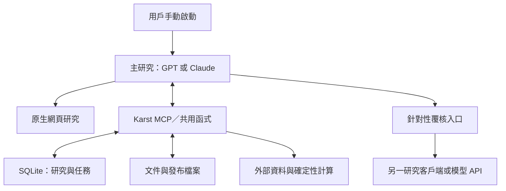

# Claude 執行計劃：主研究 agent＋資料服務 v1（角色可互換修訂）

2026-09-16。基準：master `0d2b72c98f4890ce4fa55bac5d35e02ec13c25b1`；承接 [提案評論 PR #4](https://github.com/kkhcheng88/Karst/pull/4) 及用戶本輪確認：資料／計算服務以機械操作為主，初期由 agent 讀取研究狀態、補取資料並更新判斷。用戶要求 GPT 提供本計劃供 Claude 執行；本文件完成不代表任何服務已部署。

**第一個產品交付：用戶能叫主研究 agent 分析一隻股票，agent 自行取證、補查、計算及保存，交出可閱讀的投資頁。第二個交付：叫它更新同一股票，只處理相關變化。**

**本輪用戶補充：GPT 與 Claude 均可主研究或覆核，兩邊共用 MCP、研究方法及產物。角色不綁模型；Claude Code 亦可作正式研究客戶端。此項取代早先固定「GPT 主研究／Claude 覆核」或「Claude Code 只作開發」的生產形態描述；Claude 負責本地實作是開發分工，不是研究角色限制。**

本計劃中的 SQLite、模組路徑、工作包與 INTU 驗收配置是實作預設；不是另立投資策略。Claude 可依實際程式調整檔案拆分，但不得改變產品結果或重新建立股票專用腳本。

## 一、起步形態

- **主研究：**一個強模型持有完整論點，六層問題都回答；同一研究可以多輪取證和修訂，不等於限制一次模型呼叫。
- **機械核心：**抓取、正規化、索引、差異、算術、保存及出頁。核心不呼叫 LLM 才能完成一般讀寫／計算。
- **覆核：**reviewer 是可配置角色，可由 GPT、Claude 或其他已接模型執行。互動覆核由另一客戶端讀寫共用任務；自動覆核的模型呼叫放在獨立 adapter，只處理足以改變決策的爭議。
- **資料庫連接：**首版由 MCP 的查詢／保存工具操作 SQLite。Agent 有能力查研究資料，無須知道表結構或先另接一個 SQL 產品；不開發任意 SQL 工具作第一版前提。
- **啟動：**先手動。Agent 不常駐空轉；定時監察待「更新一次」跑順後接同一流程。
- **入口：**同一遠端 MCP endpoint 支援 ChatGPT 與 Claude Code，各自完成連接及授權，共用資料和方法。兩者均可主研究、覆核或接手更新；互動客戶端與未來 API 自動執行共用核心，接通一端不代表另一端已驗通。
- **來源：**EDGAR、DefeatBeta、Longbridge；單股行情按用戶意見以 Longbridge 為主。富途本地閘道、500 股掃描及知識平台各按後續需求安排。
- **研究資料：**公開市場及用戶研究文件；私人持倉／成本與交易工具不進正式研究。初期不需要私人資金數字才能交每股及百分比計劃。

## 一之二、研究方法由 MCP 提供，執行狀態由共用服務管理

研究方法只有一份版本化正本：投資委託、六層問題、情境模組、估值／TA 規則、補查與覆核步驟。以現有策略規格及提示詞為內容來源；客戶端指引只說怎樣載入，不各自複製一套投資方法。

| 內容 | MCP 的提供方式 | 誰執行 |
|---|---|---|
| 取數、查研究、計算、保存 | Tools | 機械服務 |
| 委託、規則、論點與原文 | Resources；另提供讀取工具作相容入口 | 主研究或覆核 agent |
| 完整研究／更新／覆核的模板 | Prompts；亦可由 `get_research_protocol` 取得同版內容 | 呼叫它的客戶端 agent |
| 固定順序、分支、任務與交接 | 工作流程定義和 job／stage 狀態，透過 Tools 讀取／提交 | 互動時由 agent 推進；自動時由服務端 runner 推進 |

**MCP 是提供工具與內容的介面，不會因為掛上一份 prompt 就自動執行 DAG。** 各客戶端對 Prompts／Resources 的呈現不同，因此必要研究規則同時可由普通工具取得；不依賴客戶端自動安裝或自動載入本地 Skill。MCP Prompts 可提供參數化模板，但不是保證每一步實際執行的排程器。[MCP 官方概念](https://modelcontextprotocol.io/docs/learn/server-concepts)

首版新增 `get_research_protocol(mode, version)`，mode 為 research／update／review，回必要規則、輸出格式、步驟及版本。開始研究時取用並固定該版；重試／接手仍可取回同版。客戶端支援原生 MCP Prompt 時可用快捷入口，與工具版來自同一內容。

流程先用「讀既有研究 → 取證與補查 → 判斷及計算 → 按需覆核 → 修訂發布」；補查可回到取證，覆核可回到分析。沿用 `jobs` 保存狀態及研究版本，不為此新增完整 DAG 引擎。把必要次序落在服務操作的狀態及輸入檢查；模型仍自行決定查什麼、證據意味什麼。沒有獨立執行器時，客戶端關閉後任務會等待接手，不宣稱服務已自動繼續。

角色配置分清：

- `role`：researcher／reviewer，描述責任。
- `execution`：interactive／api，描述誰啟動及維持執行。
- `provider/model`：本次實際模型，可替換，未知的精確版本不捏造。

GPT 主研究＋Claude 覆核、Claude 主研究＋GPT 覆核都合法，不為反方向複製流程。覆核針對明確 research_version 及證據／假設版本，交付 review 結果後由本次主研究者處置；覆核者不直接覆蓋主研究。新上下文形成新的覆核任務，不把同一模型重讀自己的結論冒稱另一模型已覆核。

**手動互評可先用：**A 保存研究與覆核任務，用戶在 B 啟動 review，B 透過同一 MCP 讀取指定產物並保存意見，A 接手修訂。**自動互評可後接：**`request_review` 按配置呼叫 Anthropic 或 OpenAI adapter，結果同樣寫回。MCP 連接本身不會打開另一個聊天視窗或借用其登入／訂閱來呼叫 API；自動模式需相應執行器及憑證。兩個方向使用同一結果格式。

## 二、重用現有程式，先補四個已確認缺口

| 現有資產／限制 | 執行方式 |
|---|---|
| `karst/fetch/`、registry、packet 已存在 | 重用函式與 raw/meta 規則；補 EDGAR EX-10 合約附件、所需新聞／財務取數，不再寫第二套登記器。 |
| `fetch/broker.py` 只保存 agent 已拿到的回傳，不呼叫 MCP | 新增真正的 Longbridge 公開資料 client，按所用 SDK／MCP 端點能力接線；保留既有落地入口供手動補件。 |
| `agents/assemble.py` 強制六份片段及反方初判 | 新增主研究入口，直接提交完整研究 payload；重用檢查及 renderer，不偽造六次角色執行。舊 assembler 仍供既有包讀取。 |
| `publish.py` 保存全部證據檔及含 D/W/M 陣列的 research | 新發布把文件／採用數字與臨時序列分開；不能一邊宣稱「序列不存」，一邊由發布器或完整 tool log 偷存回去。 |
| calculations 已有 FCFF DCF、SMA200、pivots、R&R | 沿用；第二股補必要的 DCF 敏感度及有明確求解變數的反向估值。新方法要有經濟理由，不因程式方便一律套 FCFF。 |

計算器負責算術；收入屬總公司還是產品、期末季度速度還是全年收入，由研究者先辨明。不能把算式通過當成經濟假設已驗證。

**契約處理：**0.2 保留讀取與舊發布驗證。本輪新版保存格式涉及臨時 bars 與已採用計算結果拆分，按現行版本規則建立必要的新版本，預設 0.3.0；先列實際變更欄位及對照，不重寫四份契約中的無關部分。新研究模式明記互動／API 真實研究，不冒充手填示例。模型只交分析 payload，ID、時鐘、版本及計算回執由程式補。若 Claude 找到不改既有契約便能完整表達的方法，須用同一驗收證明，不以刪掉 bars 後令 SMA 變空值作遷移。

## 三、儲存與資料模型：夠用即止

單一服務實例，SQLite＋持久檔案目錄。SQLite 保存可操作的研究狀態；原文保存一次，索引指向它。Markdown 可作匯出與閱讀格式，不再要求模型維護一套 Markdown 正本及另一套 DB 正本。

| 內容 | 正本及保存方式 |
|---|---|
| 引用文件 | 沿用證據物件及 manifest；保留原文或實際可見摘錄、來源、期間、時間精度和定位。DB 的來源列是查詢索引。 |
| 發布研究 | SQLite 的 `research_versions` 保存版本化研究 JSON、採納的假設、計算回執與上版關係；發布檔案是其可閱讀輸出。已發布版本追加，不原地改寫。 |
| 使用的數字 | 留數值、期間、單位／幣別、口徑、來源與取得時間，以及估值模型的參數和結果。共識預測、公司指引及本系統假設分開。 |
| 完整供應商序列 | 放當次 run 的臨時快取，供計算及圖表；保留期限配置化，完成／失敗後可清理，不做每日永久累積。 |
| 任務與觀察名單 | DB 保存實際狀態，屬需要備份的資料，不能稱為可由文件全部重建的索引。 |

**最初四類表：**

- `entities`：公司／證券／產業／市場節點，證券含交易所、幣別及供應商代號映射。
- `sources`：證據索引、來源版本、文件位置與時間／覆蓋資訊；沿用 manifest 身份。
- `research_versions`：版本 ID、subject、previous ID、as_of、狀態、payload、計算回執、發布位置。
- `jobs`：執行種類、狀態、輸入／結果引用、實際起訖、失敗原因及可取得的模型用量。

到更新工作包才補 `watchlist` 與 `dependencies`；來源訂閱可先是 watchlist 配置。假設及關係先存在研究 payload，程式建立依賴索引。無需先建全產業圖或 GraphDB。

先把檔案完整寫入，再以 DB 交易標記發布可用；中途退出不把半成品設為 latest。對同股票保存帶 expected_previous_version，撞到新版本便返回衝突供重評，防止較舊判斷蓋掉較新判斷。服務重啟保留研究和任務；備份同時涵蓋 DB 及引用文件。

**圖表與封存取捨：**當次研究可用臨時 D/W/M 資料渲染圖表；歷史頁保存當時的判斷、均線、關鍵價位與資料截止，不承諾完整 K 線重播。最新頁若重新取價，需經更新流程或明列獨立的即時報價，不能靜靜把新價格混進舊計劃。不要為保留圖表偷偷永久保存整套價格陣列。

## 四、對 agent 的工具面

下列是能力與建議名稱，均屬待實作；Claude 可合併小工具，不另造一層框架。每個入口呼叫共用 Python 函式；CLI、MCP、排程共用同一套邏輯。

| 工具能力 | 核心輸入／回傳 |
|---|---|
| `get_research_protocol` | 研究／更新／覆核模式及方法版本；回共用指引、步驟與輸出格式。 |
| `get_research_context` | subject、截至時間、已有研究／假設／重要來源索引／待驗證事項；先回目錄及必要內容，原文可分頁讀。 |
| `refresh_sources` | subject、資料種類及所需期間；回新增／變更／無變／失敗／未覆蓋與 evidence IDs。種類包括申報、逐字稿、財務、價格、共識、新聞及日曆。 |
| `search_evidence`、`read_evidence` | 公司／產業／日期／關鍵字查詢，按 ID／locator 讀原文；未命中不等於外界沒有資料。 |
| `ingest_source` | URL、上載報告或可見摘錄；保留作者與覆蓋限制，支援 inbox。網頁抓不到全文仍可登記實際讀到的部分。 |
| `calculate` | 方法、明確參數及來源引用；回結果、單位、資料範圍及計算版本。包含 TA、DCF／敏感度／反向條件、R&R。 |
| `save_research`／`publish_research` | 研究 payload 與預期上版；由服務補工程欄位，保存後回可閱讀 URL。可合併一入口，但失敗不能留下半個發布。 |
| `request_review`、`get_job`、`submit_review` | 指定爭議、證據、研究版本及 reviewer 配置；互動模式供另一客戶端領取／提交，自動模式交 API adapter；同一 job／review 格式。 |

網頁搜尋沿用互動主模型的原生能力；自動 API 主研究落地時再配置其搜尋工具，抓 URL 不能當搜尋替代。新聞和研報可以支撐相應主張，作者預測不可轉寫為已發生事實。

回傳的 status／時間／coverage 由程式產生；公開時刻未知就保留未知。來源成功但只有不足 200 根完整日線時，SMA200 明確不可用；診斷不當「沒有新消息」。

## 五、Claude 按四個工作包交付

使用現有 Epic「根基重整」與 D09／D12；下面 W1–W4 是工作包代號，不是假造的新 KARST 票號。由本地按現有票務流程登記或調整 KARST-240／242，避免重複開一組同義票。

### W1：本地機械核心及單一研究入口

**目的：**模型可取數、計算、讀／寫研究；不用先完成遠端部署。

交付：
- 接通上述最小函式、SQLite 及文件保存；價格改為 Longbridge client 真實取用。
- 一名主研究者輸入／輸出格式及提示詞，承接委託與六層必答問題；收件器與現有 renderer 接通。共用方法由 `get_research_protocol` 提供；角色及輸出格式不含固定供應商。
- 新保存格式只處理本輪必要兼容變更，舊 0.2 bundle 仍可讀。
- 本地 MCP 可用；以已保存公開樣本先驗，再由 Claude 用真實來源驗一家公司。
- 提案 v1.1、來源 §四及相關 README 同步，特別更正來源限制、序列保存及「六片段才能發布」說明；HANDOFF 的已完成功能列表按實際修正。

**驗收：**本地 agent 取得真實資料、呼叫計算並保存一份研究後，程式回傳可打開的頁面。合成或手填接線示例須明示，不算第二股真實研究交付。換 ticker 不改程式。重啟後仍讀到研究。

### W2：兩個客戶端共用連接及雙向覆核交接

依賴 W1。部署單一服務實例及持久目錄到 Zeabur；用官方 MCP Python SDK 的 Streamable HTTP 接入，鎖定實際驗過的版本。部署目錄、啟動命令、環境變數名稱及兩端連接／驗證步驟寫入 README，不提交憑證。

先完成部署配置及本地驗證；沿用既有授權，只在確實缺雲端權限、來源憑證或用戶端操作時提出具體清單，其餘工作繼續。遠端入口使用兩個客戶端支援的驗證方式，不能把研究寫入或付費覆核 API 裸露在公網。

先接通共用 reviewer 任務與互動提交，讓 GPT／Claude Code 可互相覆核。自動模式使用可配置的 provider adapter；先接有現成憑證的一家，保留另一家的相同介面，兩端 API 不必同日齊備才交股票頁。啟用的自動 adapter 必須實測，不能把手動互評當 API 已接通。API job 記實際模型、起訖和可取得用量，回合／費用上限由配置設定；同一 job 去重，已送出但結果不明時待核對，不自動重複付費派出。

**驗收：**ChatGPT 與 Claude Code 均能從同一 endpoint 取得同版指引、讀研究、取數及計算；用一份小型公開樣本測 A 寫研究、B 寫覆核、A 讀回，再交換角色驗交接，不重跑兩份完整深度研究。只完成一端時如實列另一端未驗，已接通的一端可先交 W3。遠端重啟仍可讀研究及任務；啟用 API 時另驗該 adapter。研究工具只提供公開資料，券商 token 的 scope 與服務工具清單分開核實。

### W3：第二股完整研究與頁面

依賴 W2 的可用連接；預設 INTU，代號只是配置。本次主研究者可選 GPT 或 Claude，在新研究上下文載入共用方法及工具；覆核者依重要爭議和可用模型配置。沿用本系統已發布的公開研究可明示提供；不帶開發對話、私人持倉或成本。這條開發對話已含私人經歷，不直接當獨立研究 worker。

主研究流程：
1. 讀既有認知及資料目錄，列會改變判斷的問題。
2. 讀最新適用申報與逐字稿全文，查財務、產業與價值鏈、共識及行情；自由補查網頁／用戶報告。
3. 建立因果論點與情境，選估值方法，調計算工具。分析相位與日週月位置，形成條件計劃。
4. 把最重要爭議交本次配置的 reviewer；可由另一客戶端互動完成或 API 自動執行。反方可讀原文並補查，回具體挑戰及依據，不以另一評級作投票。
5. 主研究者採納、駁回或保留條件情境，修正受影響數字與建議，保存及發布。

**首屏驗收：**評級／執行狀態、主要理由、關鍵假設、最強反證、改變行動條件、與上次相比。下方包括當日內在價值情境及算式、現價隱含要求、有期限目標的橋接或缺口、支撐阻力／200 日 SMA／日週月解讀、入場／加倉／退出條件與 R&R。未知不能捏造；等待也要說明具體在等什麼，不把可當下補的資料一律推到下一季。

不填未確認的私人股數或 1% 正式注碼。完整性以重要問題與可用計劃判斷，不要求每層同長、不顯示「已量度／未量度」。

記總歷時、人工操作時間、API／工具實際成本及未知部分。先交這頁；三組比較不作前置。這一輪不重新跑 AXTI 全研究或為勝負比較擴大模型試驗。

### W4：手動「更新一次」及觀察名單

依賴 W3。先讓同一 agent 手動處理更新，再接排程。

加入 watchlist：公司、在等什麼、價格／事件條件、驗證期限、來源訂閱。加入依賴索引：來源／關係版本 → 假設版本 → 公司／層／研究版本。模型說明採用的依賴，程式查關係和差異，不從一條引用猜完整經濟傳導。

更新時由程式回「哪些來源變了」，agent 判斷「對論點有何影響」：
- 一般價格變：重算技術、折讓／隱含要求及計劃，經營假設可沿用；重大異動可觸發新聞補查。
- 新業績／逐字稿：重讀新材料及必要對照，更新基本面、估值與計劃。
- 產業／價值鏈變：查相關公司，按不同暴露逐家判斷。
- 無新增或只變取得時間：不重跑完整分析；資料失敗另列，不能算無變。
- 驗證期限到達：即使沒有新文件，也檢查事件缺席是否有意義。

**驗收：**一宗真實手動更新交出差異頁；再用參數化樣本驗證價格局部更新、來源失敗及共享產業假設影響兩家公司。沿用保留原判斷時間與目標期限，不改 ID／hash 冒充重評。

上述通過後才配置定時觸發同一更新流程；頻率留部署配置，首版不預設盤中常駐。排程檢查來源不等於每日永久儲存供應商完整資料。先用單一排程入口，是否沿用現有 n8n 視部署方便決定，研究核心不搬進另一套 workflow。

## 六、建議程式位置與實作驗證

新增位置控制在現有 `karst/` 下：

- `service.py`：共用操作函式；`mcp_server.py`：MCP 薄包裝。
- `store.py` 與必要 migration：SQLite／研究版本／任務；有同職責模組就擴充。
- `fetch/longbridge.py`：公開市場 client；其他來源擴充既有 adapter。
- `agents/research.py`、`agents/prompts/research.md`：共用方法、單主研究輸入／收件；`agents/review.py`：供應商無關的覆核任務／結果與 API adapters。MCP Prompts 與讀取工具由同一份方法生成，不複製兩份規則。
- 計算及頁面擴充既有檔；W4 才加更新協調模組。
- 測試集中 `karst/tests/`，參數化使用既有 48 份公開 fixtures。部署檔限必要配置，不逐股票新增入口。

路徑是建議拆分，不要求逐檔建空殼。**程式只住 `karst/` 套件，代號與日期由參數傳入，生產檔名與碼內不寫死股票身份；參數化測試 fixture 可含代號及可信預期值，探索與除錯碼放倉外，不 commit。**

驗證集中在實際風險：舊包兼容；單主研究可出頁；新文獻可補查且引用可讀；空回傳／日期精度不誤判；計算與頁面一致；不永久混存原始行情；重啟／重試不丟研究或重複發布／覆核；更新能保留未變判斷。改取證／抽取時依既有 D-178 跑 84 包相關越界、錯位與引用檢查；缺本地原料時明列未驗範圍，不把局部結構檢查說成完整回歸。

每個工作包以分支及 PR 交付，本地驗通後合併。GPT 可覆核程式與契約，Claude 負責真實來源、憑證／部署與實際模型整合；本計劃不把所有編碼固定留給 GPT 才能前進。.kira 的票務及決策格式由本地維護，本次不直接改寫。

## 七、Claude 開始時的行動

1. 讀本計劃及 PR #4；核對最新 master，重用已完成的能力。
2. 把 W1–W4 映射到現有票，記明本輪新形態承接舊六角色流程；不要在兩套 runtime 各自增功能。
3. 從 W1 的取數 client、單主研究收件及保存／出頁開始；先交一條可用流程再擴工具。
4. 每次回報只列可用入口、實際驗過的結果、具體阻塞及下一交付；設計完成與部署完成分開。

只因規格還有一般實作選擇，不需再要求用戶回答股票名單、框架、資料庫或同一句「開始」。外部權限／費用超出既有授權時，先完成可審閱的配置與本地結果，再提出所需的具體操作。

技術依據：採用官方 [MCP Python SDK](https://github.com/modelcontextprotocol/python-sdk) 的伺服器／客戶端與 HTTP 能力，實作時鎖定版本；[Longbridge MCP](https://open.longbridge.com/docs/mcp) 的實際工具取決於地區及授權，需以真實回傳確認。上述官方文件不是我們已完成連線的證明。

- 2026-09-16 角色可互換修訂：按用戶補充，移除固定 GPT／Claude 生產角色；MCP 指引共用、互動互評與自動 API 分開，W2 增兩端交接驗收。本次只改計劃，未部署或實際連接。遠端 MCP 支援依 [官方 OpenAI 文件](https://developers.openai.com/api/docs/guides/developer-mode) 及 [Claude Code 文件](https://code.claude.com/docs/en/mcp)；各端仍須實際授權和驗證。
