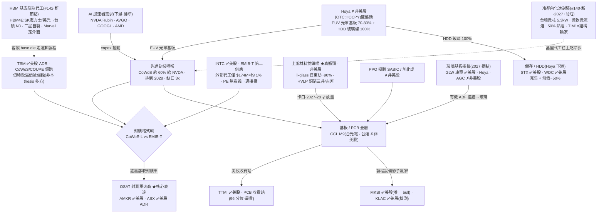

<!-- frontmatter = valid-YAML scalars only. Put wiki-links INLINE in the body; cite per claim.
     Never put double-bracket links in YAML frontmatter (breaks the parser). -->

# 先進封裝 / AI 基板材料(B 型)— 真咽喉,但真瓶頸非美股、可交易代理已 90-100 分位

> 綜合頁。蒸餾自 12 篇 Tier-2 報告([[advanced-packaging]] 叢,gooptions;含 ECTC 2026 三部曲 #140/#142/#144)+ 一手驗證(defeatbeta
> ttm_pe/capex,2026-07-01)。**這叢敘事僅 1/9 bull(11%,比記憶體 14% 還不擠),照 bull% 該接近
> 0.38;但一手估值把全部可交易美股代理釘在 90-100 分位、且真瓶頸擁有者(日東紡/三井/Hoya)是非
> 美股 → 壓到 0.32。示範:priced-in 閘 + 表達缺口壓 confidence。INITIAL/uncalibrated。**

## 一句話(核心張力 = thesis 本身)
先進封裝是 AI 算力放量的**物理咽喉**([[CoWoS]] 約 60% 給 [[NVDA]]、排到 2028、台積電自認缺口達
3 倍,#100),再往上 [[CCL]] M9 的三大材料(T-glass 玻璃布、HVLP 銅箔、PPO 樹脂)佔材料成本
八成、各被一兩家掐死(#106/#117)。**瓶頸是真的、硬的;但兩個裂縫殺 confidence:(1) 真瓶頸擁有
者——[[日東紡]](T-glass ~90%)、[[三井金屬]](HVLP 銅箔)、[[Hoya]](光罩基板 70-80% + HDD 玻璃
100%)——全是非美股,你買不到護城河本體;(2) 能買的美股代理(封測軍火商 [[AMKR]]/[[ASX]]、收費站
[[TTMI]]、設備 [[MKSI]]/[[KLAC]])一手 ttm_pe 全在 90-96 分位,市場早已定價。** 現在:**真主題、真
咽喉,但可交易表達是二手 + 貴。不追高;偏好「誰贏都收錢」的軍火商 > 最貴的收費站;[[INTC]] 用事件
/選擇權框架(PE 無意義)。**

## 價值鏈(實體 + 關係;消化到 ticker)



## ticker 層(Karst 端產品 = 這張表)

| ticker | 鏈上角色 | 可交易 | 一手驗證(Tier-1,2026-07-01) | conviction 含義 |
|---|---|---|---|---|
| [[AMKR]] | OSAT 封測**軍火商**、一手台積電一手 Intel、格式戰誰贏都收封裝單(#131) | ✅ US | ttm_pe **49(91%)**;capex 0.29→0.43B 後回 0.23B(~1.5x) | **核心表達(誰贏都收錢),但已 91 分位** |
| [[ASX]] | OSAT 封測軍火商 #2(日月光,溢出單合計約 8 萬片 CoWoS,#131) | ✅ US ADR | ttm_pe **67(90%)**;capex TWD 34.6→46.4B(~+34% 供給回應) | 軍火商 #2、貴且供給回應中 |
| [[TTMI]] | PCB 美股**收費站**、中國擴產反向受益(#112/#117) | ✅ US | ttm_pe **102(96%!最貴)**;capex 0.06→0.11B(小基數) | **收費站但估值全叢最極端** |
| [[INTC]] | EMIB-T 第一個帶真實訂單的可信第二供應(#100/#131) | ✅ US | ttm_pe **3519(無意義·近零盈利)**;外部代工 $174M vs 代工季虧 $2.4B(#119) | **選擇權/事件框架**(政治催化 +10.64%,#119),非 PE |
| [[MKSI]] | PCB 製程設備影子贏家(鑽針/雷射鑽孔,唯一 bull #121) | ✅ US | ttm_pe **93(94%)**;capex ~0.02-0.05B(輕資產) | 設備鏟子,but 已 94 分位 |
| [[KLAC]] | 零容錯**光學檢測**(層數 18→32→報廢率↑,#121) | ✅ US | ttm_pe **85(94%)** | 檢測鏟子、大型、亦已貴 |
| [[GLW]] | 玻璃基板接棒(2027 拐點,有機 ABF 撞牆,#117) | ✅ US | 大型多元(亦見 [[photonics-optical]]) | 玻璃地基、防守、慢變數 |
| [[STX]] / [[WDC]] | Hoya HDD 玻璃碟(100%)下游、硬碟完售 + 漲價~50%(#083/#085) | ✅ US | — | **儲存半支(Hoya 下游),WDC 亦見記憶體叢** |
| TSM | CoWoS/COUPE 封裝**領跑** + 新增 **HBM 基底晶粒代工線**(#142)+ 冷卻內化(微柱,#140);稀缺溢價被格式戰侵蝕(#131) | ✅ US ADR | — | **被競爭的現任但多吃兩條線(base die+冷卻);非本 thesis 多方→不列多方** |
| MRVL(跨鏈) | 客製 HBM **介面定義者**(−60% 加速器面積 / −70% 功耗,#142);主表達見 [[tpu-custom-silicon]] / [[photonics-optical]] | ✅ | — | 敘事受惠、非本叢核心表達 |
| 日東紡 / 三井金屬 / Hoya / AGC | T-glass~90% / HVLP 銅箔 / 雙壟斷 / 光罩基板 #2 | ✗ 非美股 | Hoya IT 分部 ROIC 21.1%(#083,Tier-2) | **真瓶頸擁有者,買不到→用 AMKR/TTMI/GLW 二手表達** |
| 台光電 EMC / 台燿 TUC / 巨石 | CCL M9(一度唯一過認證) / E-glass | ✗ 非美股 | — | thesis 輸入,不可交易 |
| NVDA / AVGO / GOOGL / AMD | 需求錨(Rubin CCL $275M→$2B,#106) | ✅ | — | **下游需求、非封裝表達,排除** |

## 4-KPI(每條 cited;Tier-2 報告 # + Tier-1 一手)

### 1. moat / bottleneck — 強(2/2)
- **封裝咽喉硬**:CoWoS 產能被預訂一空、約 60% 在 [[NVDA]]、要等 2028 才有新產能、台積電自認缺口
  達主要客戶規劃約 3 倍(Tier-2 #100)。封裝成了 AI 算力放量的咽喉。
- **材料雙鎖喉**:M9 級 [[CCL]] 要的 T-glass 玻璃布約 **90% 產自日本 [[日東紡]]**;HVLP 超低粗糙度
  銅箔由日韓 **3-5 家寡占、且自 2026-03 起配額制**(拿到訂單也未必拿得到料)(Tier-2 #106/#117)。
- **Hoya 雙壟斷**:EUV 光罩基板市佔 **70-80%**(唯一對手 [[AGC]])+ HDD 玻璃碟 **100%**;護城河在製程
  良率而非稀缺原料,比資源壟斷更難追平(Tier-2 #083)。
- **軍火商結構**:封裝格式戰(CoWoS-L vs EMIB-T)無論誰贏,封測這道工序都得有人做 → [[AMKR]]/[[ASX]]
  兩邊通吃、誰贏都收錢(Tier-2 #131)。這是本叢最乾淨的可交易護城河邏輯。
- **ECTC 2026 三部曲深化(#140/#142/#144)= 封裝成新戰場、且晶圓代工往上吃**:(a) **冷卻內化**——台積微柱
  8L/min 散 5.3kW、微軟真 GH200 微流道封裝熱阻 −50%、物理移除 TIM1(結構輸家),2027+ 標準化(#140);
  (b) **HBM 基底晶粒代工**——HBM4E 三家有兩家(SK海力士/美光)把 base die 交台積 N3、台積 ECTC 展示 N3P 客製
  C-HBM4E,Marvell 定介面(−60% 加速器面積 / −67% 灘頭 / −70% 功耗)(#142);(c) **中介層三重牆**——I/O 翻倍、
  功耗 +86%、層數 2×(Samsung 外推)同撞繞線/供電/散熱,EMIB-T 橋上電容把供電網路阻抗改善 **>82%**、TSV 壓降
  −68~80%,但 CoWoS 是量產在位者、EMIB-T 仍在追、封測廠兩邊通吃(#144)。**注:base die 那塊矽很小、對台積是
  「配額仲裁者」再加一條線,非新成長引擎(#142)。**

### 2. 資本配置 / ROIC — 中偏弱(1/2)
- **供給回應中但溫和**:[[AMKR]] capex 一年 ~1.5x(0.29→0.43B 後回 0.23B)、[[ASX]] capex TWD
  34.6→46.4B(~+34%)= OSAT 正在擴;[[TTMI]] ~1.9x 但小基數、[[MKSI]]/[[KLAC]] 平(Tier-1,2026-07-01)。
- **但材料層供給無彈性(對 thesis 是好事)**:T-glass / HVLP 新產能因資本密集 + 認證久,**最快 2027-28
  才放量**、2026 年內無解(Tier-2 #106)= 瓶頸墊高、但也代表你買的美股代理是「二手」(真瓶頸在非美股)。
- Hoya IT 分部 ROIC 21.1%、~100% 自由現金流還股東(Tier-2 #083)——**但非美股,買不到這個 ROIC**。

### 3. 估值 / priced-in — 弱(0.5/2)⚠️ 最大拖累
- **全部可交易美股代理 90-100 分位**(一手,2026-07-01):[[TTMI]] **96%**、[[MKSI]] 94%、[[KLAC]] 94%、
  [[AMKR]] 91%、[[ASX]] 90%;**全叢無一個便宜入口**(過去對比 [[photonics-optical]] 的「AXTI 26% 錨」**已下修**——
  #141:AXTI 當季轉虧、預估 PE 72.8×、P/S 61×→38.6×,尾隨 ttm_pe 16 是盈利觸頂假象、不再是乾淨便宜入口)。
- **[[INTC]] PE 無意義**:近零盈利、外部代工營收僅 $174M(約總營收 1%)、同部門季虧 $2.4B(Tier-2 #119)
  → 6/18 單日 +10.64% 買的是政治選擇權溢價,不是可用現金流估的成熟平台 → **用事件/選擇權框架、非 PE**。
- **市場慢一層 ≠ 便宜**:報告框架說「市場只定價了中游、沒追到上游材料」(#106),但那句話講的是**非美股**
  的日東紡/三井;能買的美股中游(TTMI/AMKR)反而**已被定價到極端**。這是本叢的表達缺口。

### 4. 成長耐久 / TAM — 強(2/2)
- **AI 算力板必需**:一台 AI 伺服器材料成本八成卡在樹脂 + 玻纖布 + 銅箔;高階板前十市占逾 90%;板層數
  2 年 18→32 層、鑽針消耗 4-5x(Tier-2 #117/#121)。
- **平台級升級**:CCL 沿 M4→M9 隨 [[NVDA]] 平台一代代爬;Rubin 平台 CCL 市場 $275M→$2B(高盛估,#106);
  玻璃基板量產拐點 2027、有機 ABF 撞物理牆後由玻璃接棒(#117)= 真、additive、若 AI capex 續則耐久。
- **玻璃基板 caveat(#138)**:2027 拐點 + [[GLW]] 領跑確認,但**韓廠 KCC / LX Glass / SKC 亦入局**(競爭、非
  獨家);且瘋傳嘅「巨型玻璃基板 TAM」其實係 **CPO TAM 誤植**——真實約 **$31B advanced-IC-substrate by 2030
  (Yole)**,遠細過病毒推文所稱 → 玻璃係真接棒,但唔好用誤植 TAM 撐估值。

## cycle_stage = LATE(可交易端已定價)+ 物理瓶頸仍中段
| 訊號 | 現況 |
|---|---|
| 擁擠(敘事) 🟢 **低** | gooptions 本叢 **僅 1/9 bull(11%)**、多為 neutral/逆向框架(「逆向工程病毒推文」「市場還沒追到上游」)= 敘事**比記憶體 14%、photonics 58% 都不擠** |
| 擁擠(估值) 🔴 **全叢最極端** | **可交易美股代理全 90-100 分位**(TTMI 96/MKSI 94/KLAC 94/AMKR 91/ASX 90)= 市場早已定價,即使 newsletter 沒 pump |
| 表達缺口 🔴 | **真瓶頸擁有者(日東紡/三井/Hoya)非美股**,能買的是二手代理 → 護城河買不到、代理又貴 |
| 供給回應 🟡 形成中 | AMKR ~1.5x·ASX +34%;材料層 2027-28 才放量(無彈性)= 物理瓶頸仍中段、金融表達已晚 |
| 瓶頸仍真 🟢 | CoWoS 排到 2028、T-glass 認證 + 產能 2027-28、配額制未解 → 主題有腿 |

→ **真物理咽喉、敘事還不擠(11% bull),但可交易表達已被定價到 90-100 分位、且真瓶頸非美股(表達缺口)。**
對比 memory(3/22 bull、MU 67 分位、LTA 墊地板)本叢**敘事更不擠、但估值更極端 + 買不到護城河本體**
→ confidence 落在 memory 0.38 與 photonics 0.30 **之間偏低**。**挑軍火商(AMKR/ASX,誰贏都收錢)> 避最貴
收費站(TTMI 96%);INTC 走選擇權;要進場等代理名估值分位消風。**

## confidence 推導(可追溯;2026-07-16 red-team 修訂)
```
KPI: moat 1/2(red-team 2026-07-16 中彈:OSAT 可交易 proxy(AMKR/ASX)唔捕捉真正租金——真瓶頸擁有者
   T-glass 日東紡90%/HVLP三井/Hoya雙壟斷全部非美股,美股代理係二手、非咽喉本體 → 由 2 降至 1)
   · capital 1/2(AMKR ~1.5x·ASX +34%,但材料層 2027-28 才放量=供給無彈性、代理二手)
   · valuation 0.5/2(可交易名全 90-100 分位:TTMI96/MKSI94/KLAC94/AMKR91/ASX90;INTC 無盈利)
   · growth 2/2(Rubin CCL 7x·CoWoS 缺口 3x·玻璃基板 2027 拐點)              = 4.5/8 = 0.5625 base
penalty(DESIGN §4a 表:crowding 48.1 → 40-60 帶 × late)                    × 0.65  → 0.366
single-source cap(sources len=1)                                            → min(0.366, 0.30)
→ confidence = 0.30  (現行 0.32 已違反 cap,屬修正。INITIAL, uncalibrated)
```
red-team 詳見 `backtest/results/2026-07-15_redteam_advanced_packaging.md`。
**讀法:真咽喉 + 敘事還不擠,但可交易表達已貴(90-100 分位)且是二手(真瓶頸非美股)→ 0.32。相對強弱
有、別追高;要吃軍火商 [[AMKR]]/[[ASX]] 小注(誰贏都收錢)、盯代理名估值分位;[[INTC]] 選擇權框架。**

## kill_condition(可證偽)
> **上游材料瓶頸鬆動** —— [[日東紡]] T-glass / [[三井金屬]] HVLP 銅箔 2027-28 新產能提前放量、或
> Q-glass/次世代量產把 T-glass 去獨家化(#106/#117)**或** **封裝格式戰塵埃落定**:單一贏家(Intel 或
> 台積電)吸走 [[AMKR]]/[[ASX]]「誰贏都收錢」的軍火商溢價(#131)**或** CoWoS/EMIB 產能 ramp 超前 AI
> 加速器需求(封裝從咽喉變過剩,#100)**或** 可交易代理名(AMKR/TTMI/MKSI)估值分位自 90-100 均值回歸
> (peak-multiple 破裂)。觸發 → confidence 歸零、代理名 mean-revert。

## Agent 追蹤(定日可證偽預測 → track_record)
- **2026-07-01**:先進封裝 = 真物理咽喉(封裝 + 材料雙鎖喉),但真瓶頸擁有者(日東紡/三井/Hoya)**非
  美股**,可交易美股代理(軍火商 [[AMKR]]/[[ASX]]、收費站 [[TTMI]]、設備 [[MKSI]]/[[KLAC]]、選擇權
  [[INTC]])**全部估值 90-100 分位**。方向:**不追高**;偏好軍火商 **AMKR/ASX(誰贏都收錢)> 最貴收費站
  TTMI(96%)**;INTC 用事件/選擇權框架(PE 無意義);TSM 是被侵蝕的現任、不列多方。追蹤變數 =
  T-glass/HVLP 新產能時程 + 代理名估值分位 + bull 佔比;kill = 材料瓶頸鬆動 / 格式戰收斂。
- **2026-07-05**(ingest ECTC 三部曲 #140/#142/#144):咽喉/格式戰/軍火商 thesis **獲深度佐證**(EMIB-T 橋上
  電容 −82% 阻抗、CoWoS 在位、封測兩邊通吃),並新增兩個結構節點(**冷卻內化 + HBM 基底晶粒代工往台積移**)。
  無估值紓解(代理名仍 90-100 分位)→ confidence 維持 **0.32**、cycle 維持 LATE;新增追蹤 = base die 台積佔比、
  EMIB-T 客戶落地、冷卻第三層 2027 標準化時程。
- forward-IC 評估器(待建)N 天後回填 → 這條預測的 forward IC 才是「thesis 有沒有 edge」的裁判。

## 2026-07-08 update:#150(全文)新證據 —— HBM 製程六收費站,全鏈瓶頸確認(confidence/cycle_stage 維持)

- **CoWoS 2026 售罄、全鏈瓶頸再確認**:台積電 CoWoS 約六成產能給 [[NVDA]],月產能自 2024 年底約 3.5 萬片
  估衝到 **2026 年底 12–15 萬片**,即便如此 2026 產線已預訂一空(#150)。
- **矽通孔/堆疊設備分純度**:**TCB(熱壓鍵合)**——ASMPT(港股,非美股)營收 **+146%**;美股可交易的
  [[KLIC]](K&S)同做熱壓鍵合、目標把這條線做到年營收 **$4 億**。**混合鍵合(下一代)**——[[BESI]](非
  美股)訂單 **+104.5%**、客戶擴至 20 家、已向**第二家記憶體客戶交付 HBM 應用評估機**(#150 明確提醒:
  **混合鍵合用在 HBM 仍是早期驗證階段,近期營收含量低**,非本季就能兌現的獲利)。**測試層**——愛德萬
  (日股,非美股)年營收 **¥1.13 兆創新高**;美股 [[TER]](Teradyne)記憶體測試(含 HBM/DRAM)明確受惠。
- **⚠ 題材已 re-rate**:出稿當日(#150 完稿當天)美光、台積電、日月光與多家設備股**盤中同步回檔約
  6–10%**——設備股 2026 上半已先反映一段,前瞻世代(混合鍵合、次世代 HBM)近期營收含量低與股價漲幅
  之間有時間差。
- **universe 擴充**:新增 [[KLIC]](TCB 直接受惠)、[[TER]](記憶體測試)、[[FORM]](FormFactor,探針卡/
  測試)、[[LRCX]](矽通孔蝕刻/電鍍,先進封裝 2026 估成長逾 50%)四檔美股可交易代理,補進 4-KPI 表的
  「設備/測試」環節(見 `thesis/themes.yaml` tickers)。ASMPT/Besi/愛德萬非美股,僅記錄於本頁,不入
  tickers/universe。
- [[ai-capex-macro-risk]]:CoWoS/HBM 全鏈供給回應若在 AI-capex 打嗝下超前需求(五盞燈轉偏空),本頁
  「真咽喉但已定價」判斷要重新檢視。

## 待補(降「未確認」扣分)
- [x] ✅ AMKR/TTMI/INTC/MKSI/KLAC/ASX ttm_pe + capex(一手)— 2026-07-01。
- [ ] 接「表達缺口」量測:真瓶頸非美股 vs 代理名估值分位 → 動態 cycle/confidence。
- [ ] 逐字稿抽 AMKR/ASX 管理層 EMIB/CoWoS 雙接單 + 產能語言(軍火商護城河證據補強)。
- [ ] universe.yaml 加先進封裝 grouping(AMKR/ASX/TTMI/MKSI/KLAC/GLW/STX),讓 scan 覆蓋。
- [ ] STX/WDC HDD 完售 + 漲價~50% 一手查證(Hoya 玻璃碟時序限速,#085 的 07-31 讀數關鍵日)。
- [ ] INTC 用選擇權/事件框架(非 PE)另評:外部代工營收 $174M→$1B+ 兌現曲線(#119/#131)。
- [ ] 追 HBM base die 台積 N3 佔比兌現(#142)+ 冷卻第三層(直接對矽微流體)2027 標準化落地(#140)。
- [ ] 冷卻「帶走熱」段的美股表達 VRT/ETN 見 [[ai-power-grid]](Eaton 收 Boyd Thermal $9.5B,#140)。

## 來源
Tier-2(advanced-packaging 叢 12 篇,`thesis/wiki/sources/`,全文 `corpus.db`);**新增(2026-07-08):#150
(全文,HBM 六收費站/CoWoS 售罄六成給 NVDA/TCB+混合鍵合+測試設備分純度/題材已 re-rate)**;**新增 ECTC 2026
三部曲:#140(冷卻推進矽、三層真相、TIM1 輸家、Eaton 收 Boyd $9.5B)、#142(客製 HBM 基底晶粒代工移向台積、Marvell
定介面 −60% 面積)、#144(HBM4E 封裝三重牆、EMIB-T 供電 −82%、CoWoS 在位)**;既有:#100(EMIB-T 為真、
結構贏家台積電、CoWoS 咽喉)、#131(格式戰、AMKR/ASX 軍火商、面板 75% vs 圓晶圓 51%、Intel 封裝 $1B+)、
#106(CCL 上游雙鎖喉、T-glass 日東紡 90%、HVLP 配額制、Rubin CCL $275M→$2B)、#117(材料成本 80%、
玻璃基板 2027 拐點)、#112(日東紡腰斬仍 90%、TTMI 反向受益)、#083/#085(Hoya 雙壟斷 EUV+HDD、STX/WDC
完售)、#119(Intel 選擇權溢價、外部 $174M vs 代工虧 $2.4B)、#121(bull:PCB 製程設備 MKSI/KLAC、鑽針
4-5x)。Tier-1:defeatbeta `ttm_pe`/`quarterly_cash_flow`(capex)(2026-07-01)。
