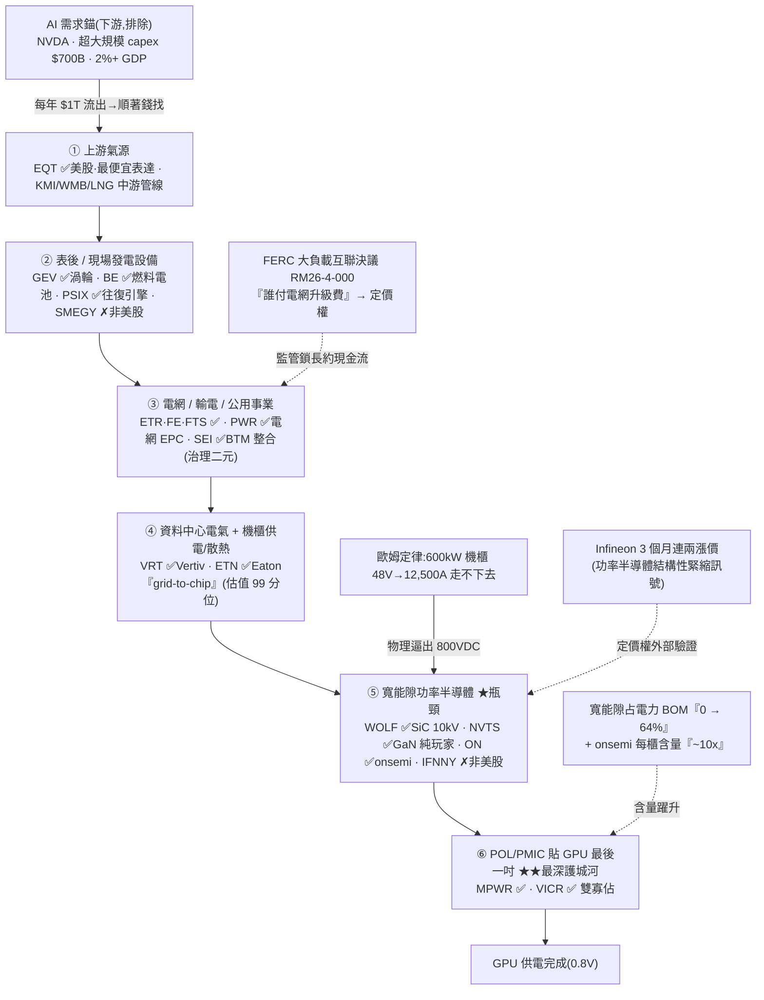

<!-- frontmatter = valid-YAML scalars only。wiki-links 放 body 內、逐條 cite。
     frontmatter 內絕不放 [[ ]](破 parser)。 -->

# AI 電力 / 供電鏈(B 型)— 需求是真瓶頸,但 quality 名已 priced ahead of the ramp

> 綜合頁。蒸餾自 21 篇 Tier-2 報告(ai-power-grid 叢,gooptions)+ 一手驗證(defeatbeta
> ttm_pe/capex,2026-07-01)。**這叢報告擁擠度低(6/21 = 29% bull < 光通訊 58%),照理該加分——
> 但 quality 名的估值分位比 memory 更極端(ETN 99%、ON/MPWR/BE 90%+)、且放量落在 2027 後 →
> confidence 壓到 0.33,介於 memory 0.38 與 photonics 0.30 之間。** INITIAL/uncalibrated。

## 一句話(核心張力 = thesis 本身)
「AI 卡的不是模型、是電」——這句話**需求面已被一手證據疊到幾乎無歧義**([[NVDA]] 供電受限、
超大規模 capex $700B、[[EQT]] CEO「收到 8 個 Homer City 規模詢價」,Tier-2 #052)。從**天然氣分子 →
發電 → 電網 → 資料中心配電 → 800V 機櫃供電 → 功率半導體 → 貼 GPU 的 POL/PMIC**,是一條真實、物理逼出來
的價值鏈。**但張力在於:需求週期還在中段(放量 2027 後、[[onsemi]] 反而在砍 capex),股價卻已跑到晚期
(quality 名估值 90%+ 分位、內部人賣、分析師目標低於現價)。** 誰對?→ **「800V/HVDC 放量時程 × AI capex
不打嗝」是可證偽裁決變數。** 現在:**主題真、別追已飛的 quality 名;最便宜的乾淨表達是上游氣源
[[EQT]](ttm_pe 35 分位),最硬瓶頸在 [[MPWR]]/[[VICR]] POL 雙寡佔(但 89% 分位滿水位)。**

## 價值鏈(molecule → electron → GPU;消化到 ticker)



## ticker 層(Karst 端產品 = 這張表;跨兩子鏈分層 conviction)

| ticker | 鏈上角色 / 層 | 可交易 | 一手驗證(Tier-1,2026-07-01) | conviction 分層 |
|---|---|---|---|---|
| [[EQT]] | ① 上游天然氣、AI 表後發電燃料;三線交匯(#044/#045) | ✅ US | **ttm_pe 10.1(35 分位,n=5531 唯一便宜且史長可靠)**;capex 平 ~0.5–0.6B(無供給回應) | **最乾淨便宜表達**、商品股但估值不貴 |
| [[GEV]] | ② 大型渦輪發電設備 | ✅ US | ttm_pe 34(**12% 但 n=501 史短、spin-off 後大重估、不可靠**);capex lumpy 0.17→0.67 | 質優但 CEO 自曝訂單節奏裂縫(#086)、渦輪訂單或 2026 見頂(#134) |
| [[BE]] | ② 燃料電池、Aschenbrenner 大贏家(+1,680%) | ✅ US | **ttm_pe 無意義(近零盈利,15,659)→ 事件/選擇權框架**;capex 微升 0.01→0.03 | **已飛、pre-earnings**、非 PE 可評 |
| [[VRT]] | ④ 機櫃供電/**散熱**、beta 最高;防守段「**take-heat-away**」(CDU/quick-disconnect/二次熱交換,代工唔內化)vs 會被 direct-to-silicon 微流道內化嘅裸晶冷板(2027+,#140) | ✅ US | ttm_pe 84(68%);capex 0.04→0.11(**2.5x**);Q1'26 營收 ~$2.65B **+30% YoY**、backlog >$15B、全年上調 $13.5–14B(#140) | 熱門高 beta、供給在回應;護城河偏「帶走熱」防守段 |
| [[ETN]] | ④ 『grid-to-chip』電氣平台、DC orders +240%;**收購 Boyd Thermal ~$9.5B 伸入液冷**(#140) | ✅ US | **ttm_pe 41.7(99 分位!n=7106 史長最可靠)**;capex 平;180 天 0 insider buy(#051) | **質優但估值極端 priced-in**、對稱不偏 |
| [[PWR]] | ③ 電網 EPC / 輸電工程 | ✅ US | —(未拉,鏟子股) | 鏟子、間接受惠 |
| [[MPWR]] | ⑥ POL 最後一吋寡佔(僅 MPWR+Vicor 兩家)、賭 Vera Rubin 70% 份額 | ✅ US | **ttm_pe 99.6(89 分位)**;capex 輕資產 ~0.04–0.07;5 位內部人高點集體賣(#082) | **最深護城河但滿水位 + 二元事件** |
| [[VICR]] | ⑥ POL/PMIC 另一半、IP 授權 | ✅ US | —(未拉) | 雙寡佔另一腳 |
| [[NVTS]] | ⑤ 美股唯一純 GaN、輝達設計拿單 | ✅ US | **ttm_pe 無意義(11.8 但 n=61、營收衰退、167x P/S)→ 選擇權框架**;capex ~0;**分析師目標 $13.59 < 現價 $28.51**(#081) | **對的故事、連賣方都喊貴**、2027 才拐點 |
| [[WOLF]] | ⑤ SiC 上游、10kV 獨家、剛出 Chapter 11 | ✅ US | **ttm_pe 無意義(GAAP 毛利 -27%)→ 事件/二元框架**;capex lumpy | **破產遺產非對稱賭注**、價值陷阱風險 |
| [[ON]] | ⑤ onsemi、每櫃含量 10x($9.5k→$115k,CEO 親口) | ✅ US | ttm_pe 67(90 分位);**capex 反而在砍 0.14→0.02(需求未放量 / 週期紀律)** | 含量故事真、但放量 2027 後、非買點 |
| IFNNY / SMEGY / 日系設備 | Infineon 漲價訊號源 / Siemens 發電 / TEL 半導體設備(#122) | ✗ 非美股 | — | thesis 輸入,用美股功率半導體 proxy 表達 |
| NVDA / CRWV / NBIS / hyperscalers | 需求錨 / neocloud(#137/#086) | — | — | **下游需求、非電力表達,排除** |
| MSTR(#039) | 比特幣、誤歸類 | — | — | **與本主題無關,排除** |

## 4-KPI(每條 cited;Tier-2 報告 # + Tier-1 一手)

### 1. moat / bottleneck — 中強但不均(1.5/2)
- **物理逼出的硬瓶頸**:600kW 機櫃用 48V 要灌 12,500A、銅排 148kg,歐姆定律走不下去 → **800VDC 是唯一
  結構解**(非題材,Tier-2 #091)。寬能隙功率半導體(SiC/GaN)占電力 BOM **從 0 跳到 ~64%**(#091)。
- **最深護城河在 POL/PMIC 最後一吋**:貼 GPU 把電降到 0.8V,**僅 [[MPWR]]+[[VICR]] 兩家**、認證第二家
  要好幾季(#091)。**定價權外部驗證**:Infineon 3 個月連兩輪漲價 = 功率半導體結構性緊縮(#080/#091/#125)。
- **但瓶頸不均**:上游氣源(商品)、發電渦輪(已知寡佔但訂單節奏鬆動 #086)、公用事業(受管制)這幾段
  **商品化/週期性**,不像 HBM/InP 單一乾淨咽喉 → 護城河極度集中在下游那兩三層,整叢平均被稀釋。
- **散熱/液冷成新一層(#140)**:AI 機櫃功率密度逼出液冷——[[VRT]]「帶走熱」防守段(CDU/quick-disconnect)代工
  唔內化、裸晶冷板(direct-to-silicon 微流道)2027+ 會被晶圓代工內化(見 [[advanced-packaging]]);併購潮確認:
  Eaton→Boyd Thermal $9.5B、Ecolab→CoolIT $4.75B、Trane→LiquidStack、Flex→JetCool;Dell'Oro 估 2026 DC 液冷
  製造商營收 ~$6B。

### 2. 資本配置 / ROIC — 中偏弱(1/2)
- **無廣泛供給回應過熱**(反而是 cycle 未過熱的正面):[[EQT]] capex 平(~0.5–0.6B)、**[[ON]] capex 反而
  在砍(0.14→0.02B)**、[[MPWR]]/[[NVTS]] 輕資產(Tier-1,2026-07-01)。onsemi 砍 capex = **放量還沒到**
  (#125 明講「放量落在 2027 後、是卡位窗口不是買點」)。
- **代價**:POL/半導體輕資產 → 缺重資產式護城河壁壘;[[VRT]] capex 2.5x 是唯一在明顯擴的(供給在回應)。

### 3. 估值 / priced-in — 弱(0.5/2)⚠️ 最大拖累
- **quality 名估值極端**(一手,自身史長分位):**[[ETN]] 99 分位(!)**、[[ON]] 90%、[[MPWR]] 89%、
  [[BE]] 91%(2026-07-01)。**唯一便宜 = [[EQT]] 35%**。
- **賣方/內部人反向訊號**:[[ETN]] 180 天 0 insider buy(#051)、[[MPWR]] 5 位內部人高點集體賣(#082)、
  **[[NVTS]] 分析師目標 $13.59 < 現價 $28.51、8 位全在現價一半以下**(#081)——連賣方都喊貴。
- **crowding 的另一種形態**:報告 bull% 低(29%),但**聰明錢已滿倉**(Aschenbrenner/SALP $1.22B 全押、
  佔 AUM 22%,#045/#052)、零售報告在追他的 13F = 這本身是 consensus tell。

### 4. 成長耐久 / TAM — 強(2/2)
- **資料中心 capex $1T(2026)→ $1.7T(2030)**(Dell'Oro,#110);超大規模 $700B、2%+ GDP、AI 占 GDP
  成長 75%(All-In,#052)。
- **含量躍升(additive)**:[[onsemi]] CEO 親口每櫃含量 **$9.5k → $115k(~10x)**(#125);SiC/GaN 0→64%
  BOM、系統級供電 ASP ~10x(#091)。**電力是 AI scale-up 的物理必需**,若 AI capex 續 → 真、耐久。

## cycle_stage = LATE(股價),但需求週期仍在中段(divergence 是本叢關鍵)
| 訊號 | 現況 |
|---|---|
| 估值 🔴 | **ETN 99% / ON 90% / MPWR 89% / BE 91%** 分位 + 內部人賣 + 分析師目標低於現價 = 股價晚期 priced-in |
| 放量時序 🟡 | **onsemi capex 在砍、放量落 2027 後**(#125)、GEV 訂單節奏裂縫(#086)、渦輪或 2026 見頂(#134) → **需求交付還沒到、週期中段** |
| 擁擠 🟢(相對) | 報告 **29% bull**(< 光通訊 58%)、多數中性/示警自己點出 priced-in → 報告擁擠低於光通訊 |
| 瓶頸仍真 🟢 | 800V 歐姆定律未解、Infineon 連兩漲價、POL 雙寡佔認證壁壘 → 主題有腿 |

→ **需求真、瓶頸真,但市場把「還沒交付的 2027 放量」提前定價到 quality 名的 90%+ 分位。** 對比 memory
(MU 67 分位、LTA 墊地板)這叢**估值更極端**;對比光通訊(58% bull)這叢**報告擁擠更低**——兩相抵 →
confidence 落在兩者之間。**別追已飛的 ETN/MPWR/BE/NVTS;要碰,乾淨便宜表達是 [[EQT]],或等 crowding/估值
消風再進 POL 雙寡佔。**

## confidence 推導(可追溯)
```
KPI: moat 1.5/2(POL/PMIC 雙寡佔 + SiC/GaN 0→64% BOM 真瓶頸,但氣/電網/公用事業段商品化、瓶頸不均)
     · capital 1/2(EQT capex 平、ON capex 反在砍 → 無過度供給回應;但輕資產壁壘薄、放量未到)
     · valuation 0.5/2(ETN 99%!/ON 90%/MPWR 89%/BE 91% 極端 + 內部人賣 + 分析師目標<現價;僅 EQT 35%)
     · growth 2/2(資料中心 capex $1T→$1.7T、onsemi 每櫃含量 10x、SiC/GaN 0→64% BOM、物理必需)
     = 5.0/8 = 0.625 base
penalty(DESIGN §4a 表:crowding 34.3 → <40 帶 × late)                    × 0.75  → raw 0.469
single-source cap 0.30:唔適用——n_sources=2(GEV 現金背書 Tier-1 條目,red-team 2026-07-15
     擊中承重 claim 供給半截,全簿第一個合法脫 cap;見 themes.yaml sources)
UNCALIBRATED_CAP 0.40:**適用、綁住**(STATUS.md:256「校準迴路未通之前 confidence 上限 ≤0.40」;
     判準 = forward_ic matured predictions,2026-07-16 實測 matured=0 → 前提成立)
→ confidence = min(0.469, 0.40) = **0.40**  (INITIAL, uncalibrated)
佐證: ttm_pe/capex ✅(Tier-1 已拉);需求錨 ✅(#052 一手引述 + EQT CEO 詢價);GEV 合約負債
      $18.7B→$31.8B(+70% YoY)✅ gatekeeper 一手核實;放量 2027 後 ✅(#125)
(舊手工推導 × ~0.53 → 0.33 已由凍結公式取代——舊 penalty bundle 咗「估值極端」判斷,
 而估值已喺 valuation KPI 格計過,雙重計算係公式化要消滅嘅嘢。)
```
**讀法:真主題(需求面近乎無歧義)但股價提前 priced-in 到 2027 放量 + 護城河分散 → 0.33。方向 = 別追高;
乾淨便宜表達 [[EQT]];最硬瓶頸 [[MPWR]]/[[VICR]] 等估值消風;pre-earnings 的 [[BE]]/[[NVTS]]/[[WOLF]]
用事件/選擇權框架小注。**

## kill_condition(可證偽)
> **AI 需求錨破裂或放量時程再滑** —— 超大規模 / 資料中心 capex 指引轉降($1T→$1.7T 路徑轉弱)**或**
> 800V/HVDC 第三、四階段原生量產再延、48V/可插拔續當 good-enough(#114,含量 10x 不如期兌現)**或**
> 渦輪三巨頭訂單確認見頂([[GEV]] CEO 裂縫 #086、#134)**或** Infineon 漲價循環反轉(功率半導體短缺結束)。
> 觸發任一 → confidence 歸零,quality 名(90%+ 分位)回歸 mean-revert、pre-earnings 名(BE/NVTS/WOLF)重挫。

## Agent 追蹤(定日可證偽預測 → track_record)
- **2026-07-01**:AI 電力 = **需求面近乎無歧義的真瓶頸,但股價已 priced ahead of the 2027 放量**。表達分層:
  乾淨便宜 [[EQT]](35 分位)vs 已飛/滿水位 [[ETN]](99%)/[[MPWR]](89%)/[[BE]]/[[NVTS]](喊貴)。
  方向:**不追已飛 quality 名**;要碰上游氣源或等 POL 估值消風;pre-earnings 用選擇權小注。
  追蹤變數 = 800V 放量時程 + hyperscaler capex 指引 + quality 名估值分位 + Infineon 漲價循環;
  kill = 需求錨破裂 / 800V 再延 / 渦輪訂單見頂。
- **2026-07-10**(ingest #156,gooptions,Tier-2 neutral,付費牆):資金先押發電鏈、功率半導體器件鏈定價權
  「才剛點著」→ 佐證現有「真需求 priced-ahead-of-ramp」+節點成熟度分歧(grid-hardware late vs power-semis
  mid-late)。美銀 US 發電缺口 100GW 量化 = 新增硬數;器件鏈三證(Infineon / onsemi / Feynman 17x)屬已知
  再述;伯恩斯坦 338GW 空方 = 未證實情緒訊號。confidence/cycle 維持 0.33。詳 themes.yaml note。
- forward-IC 評估器(待建)N 天後回填 → 這條預測的 forward IC 才是「thesis 有沒有 edge」的裁判。

## 待補(降「未確認」扣分)
- [ ] 接前瞻追蹤:800V/HVDC 落地訊號(SST 產品、Flex 機櫃、onsemi 含量兌現)+ hyperscaler capex 指引 →
      自動更新 cycle/confidence。
- [ ] 逐字稿抽 [[MPWR]]/[[ON]]/[[GEV]] 管理層「含量 / 放量時程 / 訂單節奏」語言(moat + 時序證據補強)。
- [x] ✅ EQT/GEV/VRT/ETN/MPWR/NVTS/WOLF/ON/BE ttm_pe 分位 + capex(一手)— 2026-07-01。
- [ ] [[VICR]]/[[PWR]] ttm_pe/capex 補拉(POL 另一腳 + 電網 EPC)。
- [ ] BE/NVTS/WOLF 無/近零盈利 → 用選擇權/事件框架(非 PE)另評。
- [ ] universe.yaml 加「ai-power-grid」grouping(電力鏈兩子鏈),讓 scan 覆蓋。
- [ ] kill_metrics 補兩條數值軸:GEV backlog GW(現 100GW,2026-07)+ hyperscaler capex YoY
  (red-team 2026-07-15 建議;current/trigger 要下季讀數先定,唔臨時發明)。
- [ ] GEV Q4 24GW 入面 21GW 係 slot reservation 非 firm order——敘事風險標記,盯取消數據
  (現時零取消)。

## red_team(Level-2,2026-07-15;詳 backtest/results/2026-07-15_redteam_ai_power_grid.md)
- **判決:生還,兼獲一手補強。**承重 claim(AI 電力多年結構樽頸、$1T→$1.7T 路徑、非一次性脈衝)
  企得住;供給半截(渦輪 sold-to-2030、SMR/氣新增慢)幾乎零反面事實。
- **關鍵發現=memory 嘅鏡像**:GEV Current Deferred Revenue(客戶現金預付)$18.7B→$31.8B
  (+70% YoY ≈年收入八成)——多年訂單以真金白銀坐喺 balance sheet 上(gatekeeper 一手核實)。
  memory 嗰邊附註 RPO 唔喺表上(claim 中彈);呢邊預付喺表上(claim 補強)。**依 §4a 定義,
  本 theme 甩 single-source cap——全簿第一個**(sources: 已登記 tier-1 條目)。
- 真風險喺**需求側 rate-of-change**(red-team 指出 kill_condition 原本漏咗):①能效軸——
  Vera Rubin 級每 token 成本 ~10x 下降,如果能效改善快過部署增長,Jevons 假設反轉(已加入
  kill_condition);②Meta 逐字指引「capex 2026 peak / 2027 normalize」= 唯一需求側一手拐點訊號。
- 平庸解釋測試**部分通過→收緊唔推翻**:GEV backlog ~80% 非 datacenter(更換週期+電氣化都真),
  「最乾淨嘅樽頸最唔 AI、最 AI 段最貴」——強化現有「別追 quality 名」紀律。
- **應用(2026-07-15):**confidence 0.33 維持、moat 1.5/growth 2 維持(agent 明確唔為交貨砌
  downgrade——「對『負荷預測仍連年上修』製造反對」係反例示範);kill_condition 加能效軸+
  backlog 可觀測代理;sources 加 tier-1 佐證條目(甩 cap)。

## 來源
Tier-2(ai-power-grid 叢 21 篇,`thesis/wiki/sources/`,全文 `corpus.db`):需求錨 #052(All-In 4 主持人 +
EQT CEO)、價值鏈 #110(7 層 + FERC 定價權)、800V 供電 #091(POL 雙寡佔)、含量 10x #125(onsemi CEO)、
三線交匯 #044/#045(EQT + Aschenbrenner)、電氣平台 #051(ETN)、BTM #049(SEI)、功率半導體梯度
#080/#081/#082(ON/NVTS/MPWR)、SiC #073/#094(WOLF/COHR)、時序 #114(800V 四階段)、發電 #086/#134
(GEV/渦輪見頂)、需求端 #137(NVDA 配額);**新增(2026-07-05):散熱/液冷 #140(VRT「帶走熱」防守段 vs
裸晶冷板被 direct-to-silicon 內化、ETN 收 Boyd Thermal $9.5B)**。Tier-1:defeatbeta `ttm_pe`/`quarterly_cash_flow`(2026-07-01)。
**新增(2026-07-10):#156**(電力缺口戰對帳:發電鏈 vs 器件鏈輪動,Tier-2 neutral,付費牆截斷、只引免費段)——
美銀美國 2026-30 發電缺口 >100GW / 可恃供給 93GW、雲端 capex 上修 2026 $851B / 2027 $1.15兆;器件鏈三證
(Infineon 連兩漲 / onsemi 每櫃含量 10x / 摩根士丹利 Feynman 功率半導體 17x Blackwell)對帳再述,佐證
「發電鏈先押、器件鏈定價權才剛點著」嘅成熟度分歧。詳 themes.yaml note。
