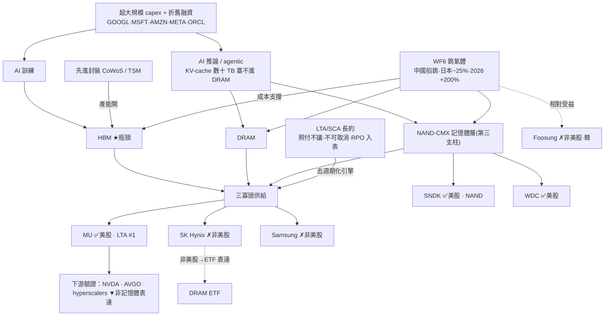

<!-- frontmatter = valid-YAML scalars only. Put wiki-links INLINE in the body; cite sources inline
     per claim. Never put double-bracket links in YAML frontmatter (breaks the parser). -->

# 記憶體超級週期(B 型)— real but LATE,被 LTA 去週期化墊高地板

> 綜合頁。蒸餾自 22 篇 Tier-2 報告([[memory-supercycle]] 叢,gooptions)+ 一手驗證(defeatbeta
> capex/ttm_pe,2026-07-01)。confidence = INITIAL/uncalibrated;當「有紀律的相對強弱 × 週期溫度」讀。

## 一句話(核心張力 = thesis 本身)
記憶體(DRAM / [[HBM]] / [[NAND-CMX]])是真的供給約束 + 需求爆發 + 三寡頭 [[pricing-power]] 的 B 型
超級週期。**多方說「[[LTA]] 去週期化」把它從週期商品變結構受約(這次不一樣);一手 capex 卻是教科書
供給回應頂訊號。** 誰對?→ **LTA 記分卡是可證偽的裁決變數。** 現在:**晚期、別追高,但 LTA 墊高了
下跌地板 → 小注 + 盯 LTA。** 可交易表達:[[MU]](核心)、[[SNDK]]([[NAND-CMX]] 純押)、[[WDC]]。

## 價值鏈(實體 + 關係;消化到 ticker)



## ticker 層(Karst 端產品 = 這張表)

| ticker | 鏈上角色 | 可交易 | 一手驗證(Tier-1) | conviction 含義 |
|---|---|---|---|---|
| [[MU]] | DRAM+HBM+NAND 三線、[[LTA]] #1(16 份 SCA、RPO $100B 入表) | ✅ US | capex **2.94→7.83B(2.66x)** = 供給回應頂訊號 ✅;ttm_pe 26(67%) | **核心表達,但晚期兩面**:LTA 墊地板 vs capex 頂訊號 |
| [[SNDK]] | [[NAND-CMX]] 純度高、LTA book(RPO $41.6B) | ✅ US | ttm_pe **79(97%,n=94 史短不可靠)**;capex ~0.04B(輕資產→供給回應風險低) | NAND-CMX 純押;**估值需盯**(史短) |
| [[WDC]] | NAND/HDD 鄰接 | ✅ US | ttm_pe 38(82%);capex ~0.1–0.3B(平) | 次要、鄰接 |
| SK Hynix / Samsung | HBM 龍頭 / 寡頭核心 | ✗ 非美股 | — | 用 [[MU]]/[[SNDK]] 或 [[DRAM-ETF]] 表達 |
| Foosung | [[WF6]] 材料相對受益 | ✗ 非美股(韓) | — | thesis 輸入,不可交易 |
| NVDA / AVGO / hyperscalers | 需求驗證 | ✅ | — | **下游、非記憶體表達,別混淆** |

## 4-KPI(每條 cited;Tier-2 報告 # + Tier-1 一手)

### 1. moat / bottleneck — 強(2/2)
- **三寡頭 + HBM 瓶頸**:HBM 受 [[advanced-packaging]](CoWoS/TSM)產能閘限(Tier-2 #126/#132)。
- **上游材料咽喉 [[WF6]]**:中國掐鎢、日本約 25% WF6 產能 7 月起減、2026 合約 +70–90%、現貨 +200%
  → 全體記憶體成本上升、韓國 Foosung 相對得利(Tier-2 #110,`corpus.py get wf6-tungsten-memory-chokepoint`)。
- **定價權**:短缺 + LTA 硬約束 → 定價權從週期性往結構性移(Tier-2 #128)。
- **HBM4E 補充(#142/#144)**:HBM base die 邏輯層於 HBM4E 由記憶體廠遷向 TSMC(SK海力士/美光→台積 N3),但
  「切落嚟嗰嚿肉唔大」、三寡頭 DRAM 堆疊主體價值不變;HBM4 記憶體價格溢價 **40–50%** 佐證定價權;且 HBM4E
  封裝三重牆係**封裝廠在解、非記憶體廠**(#144)→ 強化 [[advanced-packaging]]→HBM 產能閘、對 glut-kill 屬輕微 relief。

### 2. 資本配置 / ROIC — 中偏弱(1/2)+ 頂訊號 ✅
- **MU capex 一年 2.66x**:$2.94B(2025-05)→ 7.83B(2026-05)(Tier-1 defeatbeta `quarterly_cash_flow`,
  2026-07-01 拉)。**教科書「供給回應」頂訊號**——多年 underinvestment 正在反轉、產能加速。
- SNDK 輕資產(capex ~0.04B)→ 供給回應風險低,但也少了護城河式重資產壁壘。

### 3. 估值 / priced-in — 中(1/2)
- **MU ttm_pe 26(自身 5y 67 分位,中高非極端)**;WDC 38(82%);SNDK 79(97% 但 n=94 史短不可靠)。
  (Tier-1 `ttm_pe`,2026-07-01)。
- **peak-earnings 陷阱**:supercycle 讓盈利爆 → PE 看似不貴,但那正是週期頂的偽裝(估值研究通則)。

### 4. 成長耐久 / TAM — 中強(1.5/2)
- **三支柱需求**:HBM(訓練)+ DRAM + **[[NAND-CMX]]**(推論 KV-cache,NVIDIA 稱 CMX;資料中心 NAND
  需求 →40% by 2031)= NAND 從儲存變記憶體層,**真·新增 TAM**(Tier-2 #135,bull)。
- 但記憶體本質週期,非軟體 secular;**[[LTA]] 去週期化「若為真」才延長耐久性** → 這是關鍵 if。

## cycle_stage = LATE(三頂訊號)+ 去週期化墊高地板
| 訊號 | 現況 |
|---|---|
| 供給回應 ✅ 已確認 | **MU capex 2.66x**(一手)= 產能加速 = 教科書頂訊號 |
| 擁擠 🟡 | SK Hynix 喊 2034 擴產 3 倍(像 2017 逃命鐘)但 SanDisk 反漲(Tier-2 #104/#128);gooptions 記憶體叢 **僅 3/22 bull** → 這叢反而**沒到最擁擠** |
| 估值 🟡 | MU 67% 中高、peak-earnings 陷阱 |
| **去週期化(offset)** | **[[LTA]]/SCA 照付不議、不可取消、RPO 入表**(MU $100B、SNDK $41.6B)→ **真·墊高下跌地板**,downside 比過去週期淺——*若 LTA 紀律維持* |

→ **LATE 站得住(capex 頂訊號硬),但這輪有真結構 offset([[LTA]])→ 不是純追高、是 kill-bounded 的
兩面小注。** 進場鏡像(便宜 + 供給緊 + 未共識)不成立;但下跌不像過去無底。

## confidence 推導(可追溯)
```
KPI: moat 2/2 · capital 1/2(capex 2.66x 頂訊號)· valuation 1/2(MU 67% + peak-earnings)
     · growth 1.5/2(NAND-CMX 新 TAM,但 LTA-if)                      = 5.5/8 = 0.69 base
cycle penalty (LATE, capex 頂訊號確認,但 LTA 去週期化墊地板 → 罰輕於純晚期): × ~0.55  → 0.38
佐證: capex ✅ + ttm_pe ✅(Tier-1 已拉);LTA/RPO ✅(Tier-2 #128 財報入表,可信度高於一般 KOL)
      逐字稿受限語言 + LTA 記分卡前瞻追蹤仍待接 → 不加分
→ confidence ≈ 0.38  (INITIAL, uncalibrated)
```
**讀法:真主題 + 真結構 offset(LTA)但晚期已確認(capex 頂訊號)+ peak-earnings → 0.38。相對強弱有、
別追高;要吃 [[MU]] 小注 + 盯 LTA 記分卡,或 [[DRAM-ETF]] 分散。**

## kill_condition(LTA 中心,可證偽)
> **[[LTA]] 記分卡停止前進或反轉** —— 合約(LTA/SCA)價格轉跌 **或** 淨新增 LTA 簽署停滯(去週期化敘事
> 不再被財報追認)**或** HBM / [[advanced-packaging]] 產能 ramp 超前 AI 推論需求(轉過剩)。
> 觸發 → confidence 歸零,記憶體回歸經典週期頂、mean-revert。

## Agent 追蹤(定日可證偽預測 → track_record)
- **2026-07-01**:記憶體 = 晚期超級週期、被 LTA 結構墊高地板。表達 [[MU]](核心)+ [[SNDK]]([[NAND-CMX]])。
  方向:**不追高**(晚期);相對強弱小注;**追蹤變數 = LTA 記分卡 + 合約價**;kill = LTA 轉跌。
- forward-IC 評估器(待建)N 天後回填 → 這條預測的 forward IC 才是「thesis 有沒有 edge」的裁判。

## 2026-07-08 update:#150(全文)+ #148(free preview)新證據(confidence/cycle_stage 維持)

- **LTA 去週期化 kill-watch 本季「確認中」(#150 全文)**:美光帳上剩餘履約義務(RPO)約 **$1,000 億**,
  已簽 **16 份 take-or-pay 策略客戶協議**、照付不議、約涵蓋兩成 DRAM 出貨——這是 [[LTA]] 記分卡本季
  的直接財報佐證,強化「不是單純週期反彈」的判斷;同時美光 **FY26 HBM 供給連價帶量全部售罄**、capex
  上修至 **超過 $250 億**(供給回應仍在加碼)。HBM TAM 從 2025 年約 $350 億估上修到 **2028 年約 $1,000
  億**(美光估)。上游 HBM 護城河再獲細節佐證:**SK 海力士 MR-MUF 一次灌注良率 75–80%**(填充散熱良率
  分水嶺,龍頭護城河根源)、HBM4 份額 **60–70%**;三星堆疊良率與 HBM4 認證落後約 **一年**(#150)。
  ⚠ **裂縫觀察**:已有外資將 2026 年 HBM TAM 預估**下修約 13%**(第一條裂縫、待續追);報告自身提醒
  **2017 年也曾有鎖量長約,結果被打回現貨**(多年約讓這輪比過去硬,但**沒有讓週期消失**)。
- **NAND/DRAM 短缺廣度佐證(#148 free preview)**:2026 Q2 **NAND 季漲約 53%(首次超過 DRAM)**、花旗估
  DRAM 季漲約 44%;高盛稱這是 **15 年來最嚴重短缺**,2026 供需缺口估 DRAM 4.9%/NAND 4.2%/HBM 5.1%;
  美光執行長稱短缺延續到 **2027 年**;雲端大廠 2026 資本支出約三成投入記憶體(2024 年僅 8%)。**但
  三星 Q2 營業利益 89.4 兆韓元(+19 倍創天量)當天股價卻跌 6–9%**——peak-earnings 行為,支持本頁「late」
  判定而非否定它;SK 海力士 / 美光目前預估 PE 約 **6.2–7 倍**,報告明確提醒這是 **peak-earnings 倍數,
  不是便宜錨**。**SK 海力士 ADR(代號 SKHY)約 $294 億史上最大外企美股上市案,暫定 2026-07-10 那斯達克
  掛牌**——雙面讀法:一是首次可乾淨買到 HBM4 龍頭(60–70% 份額)的純美股表達;二是「破紀錄規模上市」本身
  與 DRAM-ETF 上市訊號同款讀法(擁擠/晚期確認)。SKHY **掛牌後才有數據,現階段不入 [[universe.yaml]]**
  (見 `thesis/themes.yaml` note)。
- [[ai-capex-macro-risk]]:這頁的 LTA/capex 頂訊號判斷,應對照該頁五盞燈(尤其「四大 FCF 軌跡」與
  「2028 折舊海嘯」)——若那五盞燈轉偏空,本頁的「LTA 墊高地板」假設要重新檢視是否仍站得住。

## 待補(降「未確認」扣分)
- [ ] 接 LTA 記分卡的前瞻追蹤(每季 RPO / 新 LTA 簽署數 → 自動更新 cycle/confidence)。
- [ ] 逐字稿抽 MU/SNDK 管理層 HBM 受限 / 定價 / LTA 語言(moat + 去週期化證據補強)。
- [x] ✅ MU capex 2.66x(一手,供給回應頂訊號)— 2026-07-01。
- [x] ✅ MU/SNDK/WDC ttm_pe 分位(一手)— 2026-07-01。
- [ ] FNSPID 撈過去記憶體週期頂同期新聞,做乾淨 base rate(深化)。

## 來源
Tier-2(gooptions 記憶體叢 22 篇,見 `thesis/wiki/sources/`,全文在 `corpus.db`):關鍵 #128(MU LTA
證明)、#135([[NAND-CMX]])、#110([[WF6]])、#104/#068/#069(LTA 記分卡)、#133(2028 錨)、#103(融資
第二棒);**新增(2026-07-05):#142(HBM 客製 base die 邏輯層遷向台積、切下的肉不大)、#144(HBM4E 封裝
三重牆由封裝廠解、HBM4 溢價 40–50%)**;**新增(2026-07-08):#150(全文,MU RPO ~$1,000億/16份 take-or-pay/
HBM TAM 上修/SK海力士 MR-MUF 良率/三星落後一年)、#148(free preview,NAND 超車 DRAM/15年最嚴重短缺/
SK海力士 ADR SKHY 史上最大上市案)**。Tier-1:defeatbeta `quarterly_cash_flow`(capex)、`ttm_pe`(2026-07-01)。
