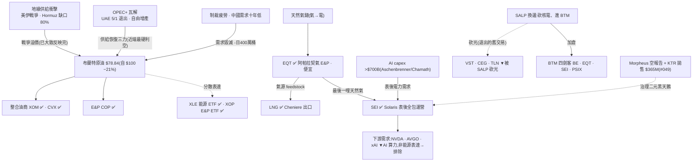

<!-- frontmatter = valid-YAML scalars only. Put wiki-links INLINE in the body; cite per claim.
     Never put double-bracket links in YAML frontmatter (breaks the parser). -->

# 石油天然氣 / 能源(B 型)— 薄證據 WATCH,原油與氣電兩腿分裂

> 綜合頁。蒸餾自 **僅 2 篇 Tier-2 報告**(oil-gas-energy 叢,gooptions)+ 一手驗證(defeatbeta,
> 2026-07-01)。**證據薄(2 篇 < 3 篇門檻)且叢內異質**:一篇原油總經框架(#116,neutral)、一篇氣→電
> 個股(#058,bull),兩腿方向與週期都不同。**依紀律寫成 LOW-confidence 的「觀察 WATCH」,不虛構深度。**
> confidence = INITIAL/uncalibrated。

## 一句話(核心張力 = thesis 本身)
這叢不是一個 thesis、是**兩個被硬綁在一起的能源子鏈**。**上腿=原油:史上最嚴重供給中斷(IEA 稱勝過
1973+1979+2022,[[Hormuz]] 缺口 80%),布蘭特卻從 $100 崩破 $80** —— **規模沒決定方向,供給恢復三力
([[OPEC]]+ 瓦解、制裁疲勞、中國需求十年低)先贏,近端偏空**(#116)。**下腿=天然氣→表後電力([[BTM]]):
[[SEI]] 從氣機商升級「能源到電子」全包運營、已簽約 3.1 GW、AI 算力拉動,是結構性多頭**(#058,bull)——
但這名是全叢最貴(ttm_pe 97 分位)且背「治理二元」黑天鵝(#049)。→ **兩腿都真、但沒有單一方向 edge;
薄證據 + 近端油空 + 單一多頭名擁擠 → 小注觀察、別當一個 thesis 買。** 可交易分軌:油綜合([[XOM]]/[[CVX]]/
[[COP]]/[[XLE]]/[[XOP]])、氣鏈([[EQT]]/[[LNG]])、氣電投機名([[SEI]],事件框架)。

## 價值鏈(實體 + 關係;消化到 ticker)



## ticker 層(Karst 端產品 = 這張表)

| ticker | 鏈上角色 | 可交易 | 一手驗證(Tier-1, 2026-07-01) | conviction 含義 |
|---|---|---|---|---|
| [[XOM]] | 整合油商龍頭 | ✅ US | ttm_pe **23(84% 分位)**;capex ~6–8B/季 **平**(無失控供給回應) | **油空框架下的 beta**;高 PE = **谷底盈利**(油跌→盈利縮),非貴,兩義 |
| [[CVX]] | 整合油商 | ✅ US | ttm_pe 28.8(81%);capex ~4–5B/季 平 | 同上、資本紀律佳 |
| [[COP]] | E&P 純上游 | ✅ US | ttm_pe **17.7(85%)**;capex ~3B/季 **持平偏降** | 對油價 beta 高、紀律佳 |
| [[EQT]] | 阿帕拉契天然氣 E&P、[[BTM]] 氣源 | ✅ US | ttm_pe **10.1(35% — 全叢唯一便宜)**;capex ~0.5–0.6B **平** | **氣電腿最佳質價比**:便宜 + 紀律 + AI 表後拉動 |
| [[LNG]] | Cheniere 天然氣出口(兩篇都列) | ✅ US | ttm_pe 39.1(71%);capex 0.57→0.74B 微升 | 氣鏈出口、擴產中、貴中偏穩 |
| [[SEI]] | Solaris 表後電力全包、氣→電、3.1 GW 已簽約 | ✅ US | ttm_pe **97(97% 分位!)**;capex 0.13→0.34B(**2.6x 加速**) | **唯一 bull 名但最貴 + 治理二元(#049)** → 事件/選擇權框架、小注 |
| [[XLE]] / [[XOP]] | 能源 / E&P ETF | ✅ US | — | **總經二元下的分散表達**(避單一名治理/二元) |
| VST / CEG / TLN | 核電(SALP 已砍光) | ✅ US | — | **退出的「舊交易」,非本叢表達→排除** |
| NVDA / AVGO / xAI | AI 算力需求錨 | ✅ | — | **下游需求、非能源表達,排除** |

## 4-KPI(每條 cited;Tier-2 報告 # + Tier-1 一手)

### 1. moat / bottleneck — 中偏弱(1/2)
- **原油無定價權**:油商是價格接受者;**[[OPEC]]+ 框架正在瓦解**(UAE 5/1 退出、想不受配額自由增產),
  賣方協調的護城河在崩(Tier-2 #116)。史上最嚴重供給中斷 + Hormuz 缺口 80%,布蘭特仍崩 21% = 卡點沒
  轉成定價權(#116)。
- **天然氣→表後電力有真瓶頸**:[[SEI]] 升級「最後一哩天然氣 + 配電 + 儲能 + 控制 + 排放」整站全包、簽
  第三家投資等級客戶 >600 MW、Power 佔 earnings ~70%→目標 90%(Tier-2 #058)。電網併網排隊 + AI 算力
  急電 = 表後供電是真卡點——但這是 [[BTM]]/AI-power 的護城河,不是「油氣」本身。

### 2. 資本配置 / ROIC — 中(1/2)
- **油商資本紀律佳**:XOM/CVX/COP capex 近六季**大致持平**(XOM ~6–8B、CVX ~4–5B、COP ~3B/季;Tier-1
  `quarterly_cash_flow`)——美股這端**沒有失控供給回應**。**但油價下跌的供給回應來自 [[OPEC]]+/UAE 增產,
  不是美股 capex**(#116)——供給頂訊號在體制外,美股讀不到。
- **[[SEI]] capex 一年 2.6x**(0.13→0.34B,Tier-1)= 3.1 GW 建置加速,但這是**成長 capex**(押 AI 需求),
  非商品供給回應;若 AI capex 打嗝即擱淺。[[EQT]] capex 平 + 便宜 = 氣端資本紀律最健康。

### 3. 估值 / priced-in — 中(1/2)⚠️ 兩義
- **[[EQT]] ttm_pe 10(35% 分位)= 全叢唯一便宜**;油商 XOM 23(84%)、CVX(81%)、COP(85%)分位偏高——
  **但油是週期股,高 PE = 谷底盈利(油從 100 跌到 78→盈利縮→PE 升),是記憶體「peak-earnings 陷阱」的
  鏡像**,對油商反而可能是**便宜訊號**,近端油空下兩義(Tier-1 `ttm_pe`;#116 近端偏空)。
- **[[SEI]] ttm_pe 97(97% 分位)= 極端 priced-in**,唯一 bull 名被市場搶先定價到頂(Tier-1)。
- **crowding = 50% bull**(2 篇 1 bull):比記憶體 14%(0.38)擠、比光通訊 58%(0.30)鬆——**中度擁擠**。

### 4. 成長耐久 / TAM — 中(1/2)分裂
- **原油需求在衰退**:中國進口十年低(戰前 −日 400 萬桶)、結構性 EV/效率壓力(#116)——**非成長 TAM**。
- **氣電腿有真新 TAM**:Aschenbrenner「100GW 算力叢集」+ Chamath 估 2026 hyperscaler capex >$700B、瓶頸
  指向燃氣輪機/變壓器/戰術電網(#058);[[SEI]] $1B+ 年化 EBITDA 中期框架、scope 20–50% IRR(#058)。
- 兩腿相加=一個衰退、一個成長 → 淨中性,**沒有統一的成長敘事**。

## cycle_stage = LATE(原油超級過剩 near-term)+ 氣電腿另計
| 訊號 | 現況 |
|---|---|
| 原油供給回應 ✅ near-term | **[[OPEC]]+ 瓦解 + 制裁疲勞 + 中國需求毀滅**三力,布蘭特 −21%、破 $80;派斯(Warren Pies)5/25 喊空已兌現 ~20%,下行「多半已兌現」(#116)= 晚期跌勢 |
| 總經二元 🟡 | **6/19 美伊協議**是 >10% 幅度二元事件,但油已崩、不對稱**已反轉**(簽成利多有限、破局反彈更大)(#116)= 方向未定、控倉不單押 |
| 氣電腿 🟢 結構(另一時鐘) | 表後電力 + AI capex 拉動、[[SEI]] 3.1 GW ramp 中 = 更像 mid/結構期,但單一名擁擠(97 分位)+ 治理二元(#049) |
| 擁擠 🟡 中度 | 50% bull(1/2);SALP 把核電 VST/CEG/TLN **砍光**換 [[BTM]](#058)= 資金已在換邊、氣電敘事非未共識 |

→ **原油端 = 晚期超級過剩、近端偏空(供給恢復先贏);氣電端 = 結構成長但單名貴 + 治理雷。兩腿沒有共同
方向 → 這不是一個可以「進場」的 thesis,是一張需要分軌盯的 WATCH。** 進場鏡像(便宜 + 供給緊 + 未共識)
只有 [[EQT]](便宜 + 氣緊 + AI 拉動)勉強成立,其餘皆不成立。

## confidence 推導(可追溯;2026-07-16 red-team 修訂)
```
KPI: moat 1/2(油無定價權/OPEC+瓦解;僅氣電有瓶頸,red-team 生還不變)
     · capital 1/2(油商紀律佳但供給回應在體制外;SEI 成長capex靠槓桿)
     · valuation 1/2(EQT 便宜 35% vs 油商谷底盈利兩義 vs SEI 97% 極端,機械讀數不覆核)
     · growth 1/2(油需求衰退 vs 氣電新TAM,淨中性;red-team 2026-07-16:承重機制生還,無格降)
                                                                        = 4/8 = 0.50 base
penalty(DESIGN §4a 表:crowding 67.8 → 60-80 帶 × late)                  × 0.55  → 0.275
不綁 cap(raw < 0.30)                                                    → confidence = raw = 0.275
→ confidence = 0.275  (red-team 冇搵到令 subscore 移動嘅硬事實,殺傷力全落 magnitude 通道 +
   kill_metrics 時效修正,唔喺 confidence 數字。INITIAL, uncalibrated)
```
red-team 詳見 `backtest/results/2026-07-16_redteam_oil_gas_energy.md`。
**讀法:confidence 0.25 < 記憶體 0.38、< 光通訊 0.30 —— 不是因為主題假,是因為(a)證據薄(2 篇)、
(b)叢異質沒有統一方向、(c)最大子腿(原油)報告自身就是 neutral/近端偏空。當「薄證據觀察 + 分軌盯」讀,
別當一個方向 thesis 下注。要碰:氣端 [[EQT]] 小注(唯一便宜+紀律+AI 拉),或 [[XLE]]/[[XOP]] 分散避單名雷。**

## red_team(Level-2,2026-07-16;詳 backtest/results/2026-07-16_redteam_oil_gas_energy.md)
- **判決:部分中彈 + 結構判決「唔應該當一個方向 thesis」**。gas→AI-power 需求機制生還,但現金合約
  背書中彈;macro 前提(油腿)stale/inverted;SEI 名 mis-specified(其實屬 ai-power-grid cluster)。
- **balance-sheet 三度落刀**:EQT deferred revenue ≈零、KMI 零、SEI 僅 $76M——「多年鎖單=現金地板」
  冇任何入帳印證,Homer City 4.4 GW 係披露式 agreement-in-principle backlog,唔係入帳合約負債。
- **⚠️ kill_metrics 已 stale**:`brent_upper_trigger` 記錄 current=78/as-of 2026-07-08,但 Brent
  已重上 ~$85 逼近 $90(MOU 已崩、荷莫茲 2026-07-14 復封)——theme 行緊近自己 bullish kill 一個星期
  而 metric 未捉到,建議更新 current/as-of。
- **SEI $1B EBITDA magnitude 腿未證**:已 flag `magnitude_unconfirmed`(theme 層記錄,見
  themes.yaml note)——當下 run-rate 僅 $340-370M、3.1 GW buildout 主要靠槓桿(net debt 一年
  4x 爆)而非客戶現金。
- **結構建議(留用戶決策)**:gas-power 腿(SEI)本屬 ai-power-grid cluster,建議 oil-gas-energy
  收窄成「油-macro WATCH(neutral β)+ EQT 單名」。

## kill_condition(分軌、可證偽)
> **這是 WATCH,不是方向單。升級/降級的可證偽條件:**
> **① 原油腿**:布蘭特**決定性收復 > $90**(Hormuz 暗航油輪遭攻擊→保險暴漲→實質中斷,或 [[OPEC]]+ 重拾
> 紀律)→ 「超級過剩、近端偏空」框架被推翻,需改寫成多頭;**反之跌破 $60**(中國需求續崩)→ 能源類股
> 長多(Pies 長腿)也破。
> **② 氣電腿**:[[SEI]] **治理二元惡化**(Morpheus 空報告指控坐實 / KTR 續拋 / 主要長約被解約,#049)
> **或** AI 表後 capex 停滯(hyperscaler 砍單)→ 氣電多頭腿(#058)歸零。
> 任一軌觸發 → 該軌 confidence 歸零;兩軌若同時失去 edge(油進穩定區間、氣電擁擠退潮無新催化)→ 能源退化
> 成純 beta,整叢下架、無 thesis。

## Agent 追蹤(定日可證偽預測 → track_record)
- **2026-07-01**:油氣能源 = **薄證據(2 篇)、兩腿分裂**的 WATCH。原油(#116)near-term **偏空/超級過剩**
  (布蘭特 $78.84、供給恢復三力先贏);氣電(#058)結構多但單名 [[SEI]] **最貴(pe 97 分位)+ 治理二元**。
  方向:**不當一個 thesis 買**;可碰的只有氣端 [[EQT]](便宜 + 紀律 + AI 表後拉動)小注,或 [[XLE]]/[[XOP]]
  分散。追蹤變數 = 布蘭特價位 + 6/19 Iran 二元 + SEI 治理案 + EQT 估值分位;kill = 油破 $90/$60、SEI 治理坐實。
- forward-IC 評估器(待建)N 天後回填 → 這條預測的 forward IC 才是「thesis 有沒有 edge」的裁判。

## 待補(降「未確認」扣分 / 加深叢)
- [ ] 叢太薄(2 篇):再 ingest 油氣 / 天然氣 / LNG / 表後電力報告,把 oil-gas-energy 與 [[ai-power-grid]]
      的邊界(SEI 同時屬兩叢)理清 → 才可能從 WATCH 升成方向 thesis。
- [ ] 接布蘭特 / WTI 價格前瞻追蹤 + 6/19 Iran 二元結果回填 → 自動更新原油腿 cycle/confidence。
- [ ] 抽 [[SEI]] 逐字稿(3.1 GW ramp / 客戶集中度 / 治理回應)+ 追 Morpheus 空報告與 KTR 拋售後續(#049)。
- [x] ✅ XOM/CVX/COP/EQT/LNG/SEI ttm_pe + capex(一手,谷底盈利 vs 成長 capex 已分辨)— 2026-07-01。
- [ ] FNSPID 撈過去油價供給衝擊(1973/1979/2022)同期新聞,做乾淨 base rate(#116 稱本次勝過三者加總)。

## 來源
Tier-2(oil-gas-energy 叢 **僅 2 篇**,`thesis/wiki/sources/`,全文 `corpus.db`):**#116**(油市悖論、
供給恢復三力、Pies 短空長多、6/19 二元;neutral)、**#058**(SEI molecule-to-electron、3.1 GW、$1B EBITDA、
SALP 換邊砍核電;bull)。跨叢佐證:**#049**([[ai-power-grid]] 叢、SEI 治理二元 = Morpheus 空報告 + KTR
$365M 拋售)。Tier-1:defeatbeta `ttm_pe`、`quarterly_cash_flow`(capex)(2026-07-01)。
</content>
</invoke>
