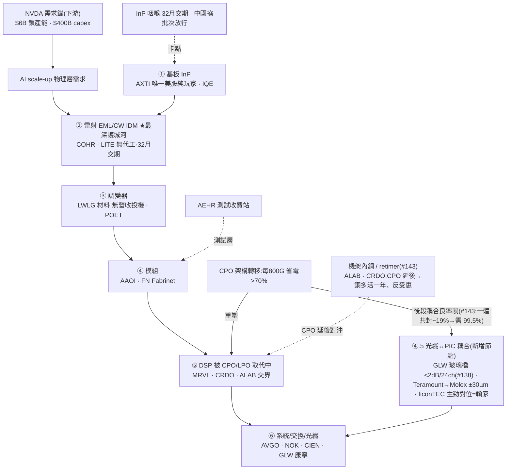

<!-- frontmatter = valid-YAML scalars only. Put wiki-links INLINE in the body; cite per claim.
     Never put double-bracket links in YAML frontmatter (breaks the parser). -->

# 光通訊 / 矽光子(B 型)— 真瓶頸,但最擁擠

> 綜合頁。蒸餾自 24 篇 Tier-2 報告(photonics-optical 叢,gooptions)+ 一手驗證(defeatbeta,2026-07-01)。
> **這叢是全批最擁擠(14/24 = 58% bull),confidence 因此壓到 0.30 < 記憶體 0.38**——即使 TAM 更大、
> 瓶頸更硬。示範:crowding 壓 confidence。INITIAL/uncalibrated。

## 一句話(核心張力)
光互連是 **AI scale-up 的物理層瓶頸**:銅撐到 3 公尺、再遠走光,TAM 10x($15B→$154B,高盛)。瓶頸真
(InP 雷射交期 **32 個月**、[[NVDA]] 三張 $2B 支票把產能買死)。**但這是全批最擁擠的主題**——58% 看多、
護城河名估值 75–98 分位、還有無盈利投機股喊 6–8x。→ **真主題、真瓶頸,但重度 priced-in:分層挑質、
別追小型 froth。** 最深護城河 = 無代工雷射 IDM [[COHR]]/[[LITE]];上游咽喉 = [[InP]] 的 [[AXTI]]。

## 價值鏈(6 層架構;毛利 20%→60%,消化到 ticker)



## ticker 層(Karst 端產品;6 層 → 分層 conviction)

| ticker | 層 / 角色 | 可交易 | 一手驗證(Tier-1) | conviction 分層 |
|---|---|---|---|---|
| [[COHR]] | ② 雷射 IDM 最深護城河、訂單到 2028、NVDA 夥伴 | ✅ | **ttm_pe 188(98%!)+ capex 0.11→0.29B(2.6x)** | **質最優但估值極端 + 供給回應** → 擁有護城河、慎入場 |
| [[LITE]] | ② 雷射 IDM、NVDA $2B 首押、高 beta | ✅ | ttm_pe 159(75%) | 質優但貴 / 高 beta |
| [[AXTI]] | ① [[InP]] 唯一美股純玩家、32 月交期咽喉;COHR 預付 $22.28M 鎖 3 年 6 吋(#139/#141) | ✅ | ttm_pe 16 是**盈利觸頂尾隨假象**(#141:當季虧損 −14.7%、預估 PE 72.8×、P/S 61×→38.6×、−41% vs 50 日均);6 吋良率僅 15–20% | **咽喉真、但「唯一便宜」下修**(#141);−13% 為 CPO 延後連坐非爆雷 |
| [[MRVL]] | ⑤ 架構定義者、跨鏈(自研 ASIC+1.6T DSP+光子 fabric) | ✅ | ttm_pe 102(86%) | 質優但貴、跨鏈 |
| [[AAOI]] | ④ 模組、9x 擴產宣言、InP 自製 | ✅ | ttm_pe 25(48%)、capex 0.03→0.06B(2.1x) | 投機-中、波動大 |
| [[SIVE]] | 100% CPO 1.6T 純玩家、喊 6–8x、估值全押 CPO 時程(#143) | ✅ | **無盈利;P/S ~190× 且營收年減(#143)** | **純投機 / CPO 延後最曝險端** |
| [[LWLG]] | ③ 調變器材料、無營收、IP 授權 | ✅ | **無盈利** | **純選擇權** |
| [[GLW]] | ⑥ 光纖 + ④.5 玻璃橋耦合 + 玻璃基板 + 玻璃晶圓 OCS = **四條光鏈**(#138);三雲鎖單 Meta $6B/NVDA 認股權證/Amazon | ✅ | **46× FY27 PE / 36× FY28、Truist 維持 Hold**(#138)= 非「便宜防守」;玻璃橋尚未變現 | 質優大型但估值已反映、發表≠量產 |
| [[FN]] | ④ 模組代工(Fabrinet) | ✅ | — | 代工、鏟子 |
| [[ALAB]] / CRDO | 機架內銅 / retimer、CPO 延後多活一年反受惠(#143) | ✅(待拉一手) | 未拉 ttm_pe → 待補 | **CPO 延後對沖**、非純光鏈多方 |
| NVDA / AVGO / GOOGL | 需求錨 / 下游交換 | ✅ | — | **非光通訊表達,排除** |

## 4-KPI(每條 cited)
### 1. moat / bottleneck — 強(2/2)
- **雙瓶頸**:上游 [[InP]] 基板(雷射交期 32 個月,#092)+ **無代工、產能不可共享的 EML/CW 雷射 IDM**
  (COHR/LITE,最佳 Coherent,#092)。NVDA 三張 $2B 支票($6B)鎖產能 = 卡點被外部確認。
- **6 層架構、毛利差 3 倍(20%→60%,#054)**:「把 LITE 和 LWLG 當同類 = 把台積電當聯發科」→ 護城河極
  不平均,集中在雷射 IDM 那層。
- **InP 咽喉再獲 SEC 背書(#139/#141)**:COHR 預付 **$22.285M 鎖 3 年 6 吋 InP 包銷**(8-K,2026-06-25),
  連自擴 6 吋的 Coherent 都得向 AXT 排隊 → 咽喉未鬆(kill 未觸發);AXT 6 吋單晶良率僅 15–20%,最高價值的
  雷射料(硫摻雜 n 型)仍是尺寸遷移**落後者**、量產主力還在 3 吋(#141)。
- **新增耦合關(#138)**:CPO 後段「光纖對不準 PIC」是**新瓶頸節點**——康寧玻璃橋(離子交換波導、被動對位、
  <2dB、24 通道)vs Teramount(併入 Molex,±30µm/0.5dB、晶圓級)競逐;傳統主動對位設備(ficonTEC)結構性輸家。

### 2. 資本配置 / ROIC — 中(1/2)+ 供給回應形成中
- **COHR capex 2.6x**(0.11→0.29B,一手)、AAOI 喊 9x、AXTI 4x 增資 → **供給正在回應**(晚期形成訊號)。
- GLW:光通訊 ROIC 將超顯示器(#070)→ 資本效率敘事偏正,但仍是敘事待證。

### 3. 估值 / priced-in — 弱(0.5/2)⚠️ 最大拖累
- **護城河名估值極端**:COHR ttm_pe **98 分位**、MRVL 86%、LITE 75%(一手,2026-07-01)。
- **無盈利投機**:SIVE、LWLG 無盈利,報告本身喊 6–8x(#063)、9x(#060)= froth。
- **crowding**:24 篇 **58% bull**、滿是 SALP/Leopold 持倉、NVDA 鎖單、「8 天 4 家確認」「集體訊號週」
  (#055)= 賣方一致、資金湧入 → 重度 priced-in。
- **AXTI 去溢價 + 「唯一便宜」下修(#141)**:AXTI P/S 自 61× 殺到 38.6×、−41% vs 50 日均,但**當季轉虧
  (−14.7%)、預估 PE 72.8×** → 過去的「唯一便宜錨(ttm_pe 16/26 分位)」是**盈利觸頂尾隨假象**、不宜再當
  便宜入口(同一修正見 [[advanced-packaging]]、[[rare-earth-materials]] 的 AXTI 引用)。

### 4. 成長耐久 / TAM — 強(2/2)
- **TAM $15B→$154B(10x,高盛,#092)**;光互連是 AI scale-up 的**物理層必需**(非題材),CPO 省電 >70%
  → 真、additive、若 AI capex 續則耐久。

## cycle_stage = LATE / 最擁擠(crowding 壓 confidence 的示範)
| 訊號 | 現況 |
|---|---|
| 擁擠 🔴 **全批最高** | **58% bull** + 護城河名 75–98 分位 + 小型股 6–8x 目標 + SALP/NVDA 鎖單敘事 |
| 供給回應 🟡 形成中 | COHR capex 2.6x、AAOI 9x / AXTI 4x 擴產宣言 |
| 瓶頸仍真 🟢 | InP 交期 32 月未解、中國僅**精準批次放行**(#115)+ COHR 預付鎖 6 吋(#139/#141)= 短缺未結束 → 主題有腿 |
| crowding 開始消風 🟡(新,#141/#143) | **CPO 延後恐慌單日殺 10%、AXTI −13%** = 擁擠端首度回修;但屬「時程滑動」非「替代」——龍頭 COHR/LITE 靠可插拔+EML 訂單、延後不痛(Lumentum $808M **+90% YoY**),純押注 SIVE/LWLG(P/S ~190×)最曝險 → 分層洗牌、非全鏈利空 |

→ **真物理瓶頸,但被市場搶先定價到極端。** 對比記憶體(3/22 bull、MU 67 分位),這叢**更晚更擠** →
confidence 更低。**挑質(COHR/LITE/GLW)、避 froth(SIVE/LWLG);要進場等 crowding 消風。**

## confidence 推導
```
KPI: moat 2/2 · capital 1/2(COHR capex 2.6x) · valuation 0.5/2(COHR 98%/MRVL 86% + SIVE/LWLG 無盈利)
     · growth 2/2(TAM 10x 物理層必需)                                   = 5.5/8 = 0.69 base
crowding/cycle penalty (LATE + 58% bull 最擁擠 + 護城河名 75-98 分位 + 小型投機 froth): × ~0.43  → 0.30
→ confidence ≈ 0.30  (< 記憶體 0.38 — 擁擠壓低,即使 TAM 更大、瓶頸更硬。INITIAL, uncalibrated)
```

## kill_condition(可證偽)
> [[InP]] 短缺解除(32 月交期壓縮 / 中國全面放行 / 新產能上線 → 基板不再是卡點)**或** CPO 導入時程實質
> 落後([[LPO]]/可插拔續當 good-enough,#107)**或** 雷射 IDM(COHR/LITE)訂單能見度(到 2028)/定價破裂。
> **crowding-unwind:** 無盈利投機(SIVE/LWLG)+ 75–98 分位護城河名,任何 AI-capex 打嗝即重挫。
> 觸發 → confidence 歸零。
> **(#143 更新:CPO 延後已現──NVIDIA CPO 交換機推遲一季、2026 僅出貨數千台;但屬「時程滑動」非「替代」,
> 龍頭訂單來自可插拔+EML 不痛 → 逼近 kill 但未觸發。真觸發要 LPO/可插拔長期勝出、或龍頭訂單能見度破裂。)**

## Agent 追蹤(定日可證偽預測 → track_record)
- **2026-07-01**:光通訊 = 真物理瓶頸但**最擁擠、重度 priced-in**。表達分層:質 [[COHR]]/[[LITE]]/[[GLW]]
  (擁有護城河、慎入場)vs froth [[SIVE]]/[[LWLG]](避)。方向:**不追**;等 crowding 消風;追蹤變數 =
  InP 交期 + 護城河名估值分位 + bull 佔比;kill = InP 解除 / CPO 落後。
- **2026-07-05**(ingest #138/#139/#141/#143):瓶頸**再確認**(COHR 預付鎖 6 吋 InP、龍頭延後不痛),同時
  **擁擠開始消風**(CPO 延後單日殺 10%、AXTI −13%)= 論述地基未破、froth 開始回修 → confidence 維持 0.30、
  cycle 維持 LATE;修正:AXTI「唯一便宜」下修為盈利觸頂假象;新增 ④.5 耦合節點 + ALAB/CRDO 銅對沖。
- forward-IC 評估器(待建)N 天後回填 → 裁判。

## 2026-07-08 update:#149(free preview)新證據 —— 層輪動,非板塊看空(confidence/cycle_stage 維持)

- **網路扁平化 = 層輪動,不是整個光通訊看空(#149)**:OpenAI **MRC**(兩層交換即可連 **10 萬+ GPU**,
  背書名單 AMD/AVGO/INTC/MSFT/NVDA)+ Amazon **RNG**(用被動光學取代主動網路設備,**−60%+**)一起把
  「交換機對交換機」(switch-to-switch)這一層壓平,直接砍掉這層最密集的收發器需求。
- **第一次具名券商行動**:B. Riley 以「網路扁平化」為由把 [[AAOI]] 降評至中性、目標價 **$129**——
  理由不是缺貨/CPO 延後,而是拓撲壓縮本身,這與過去(系列 21/#107)「CPO 取代 DSP、光學含量不變」的
  元件換代邏輯是**不同機制**(前者砍模組數量、後者只換模組內部元件)。[[AAOI]] 反向對賭需求持續:
  官宣德州擴產至約 **70 萬顆/月**、雷射磊晶擴增約 **350%**。
- **TAM 總量仍增,價值往上游遷移**:光學 TAM $15B→$154B(仍是 10x 級成長),但收發器層承壓、價值往
  上游光源/CPO/矽光/InP 遷移 → **強化本頁既有立場(挑質 [[COHR]]/[[LITE]]/[[GLW]]、避收發器層/froth)**,
  不改變 confidence 0.30 / cycle LATE(這是分層訊號,非新增瓶頸或新增擁擠證據)。
- [[ai-capex-macro-risk]]:收發器層壓力若擴散成整條光鏈需求下修(而非純架構層輪動),要對照該頁「承諾
  −run-rate 缺口」與「四大 FCF 軌跡」兩盞燈,分辨是架構重組還是 AI-capex 打嗝的前兆。

## 2026-07-16 update:#168(free preview / paywall)Musk 收 Mesh Optical —— 垂直整合佐證「moat 在上游雷射」(confidence/cycle_stage 維持)

- **來源限制**:#168 為 **paywall 文,只引 free preview**;付費段(散戶可交易上游雷射受惠鏈、四條反方逐條、
  六軸 if-then 框架)未見,以下僅 free-preview 可驗證內容,thesisType = **neutral**(報告自陳刻意不選邊)。
- **事件(Tier-3 signal)**:Musk **個人名義**(非 SpaceX/非 xAI)收購前 Starlink 雷射工程師創辦嘅光模組新創
  **Mesh Optical**,FTC 四天火速批准、金額未揭露。Mesh 產品 Alpha C1 走 **[[LPO]] 路線**(砍 DSP retimer)、
  1.6T/800G、功耗壓 <10W、倒裝晶片黏晶封裝主打可製造性(創辦人來自 Starlink 太空雷射量產)。
- **佐證本頁承重錨(moat = 雷射 IDM / [[InP]] 咽喉),非新事實、不改分數**:報告 free-preview 自己嘅一句話結論=
  「Musk 買到嘅係**模組設計 + 封裝組裝端**,買唔到卡喉嗰顆雷射晶粒同 InP 晶圓;真正可交易鏡頭 = 資金往上游雷射流」——
  與本頁「最深護城河 = 無代工雷射 IDM [[COHR]]/[[LITE]];上游咽喉 = [[InP]] [[AXTI]]」**同一結論、不同路徑**
  (垂直整合案例 vs 6 層毛利分解)。CW 雷射仍外購、點名 Coherent/Lumentum/住友電工握上游。
- **對 kill 軸 = 逼近但未觸(反而加固)**:kill 其一 =「[[LPO]]/可插拔續當 good-enough」。#168 顯示 Mesh 行 LPO,
  但 free preview 明言「LPO 拆走 DSP,但光冇消失,**每顆 Alpha C1 仍要一顆雷射在發光**」→ LPO 減 DSP 唔減雷射需求,
  **雷射 moat 生還於 LPO**,呼應 2026-07-15 Level-2 red_team「bypass 半句生還(LPO 拆 DSP 但要更高質雷射)」。
  非 kill 觸發,係對「moat 唔會被 LPO 繞過」嘅第三方佐證。
- **crowding:輕微加溫,不改 band**:報告(Serenity 轉述)點名 **[[SIVE]]** 為上游首選候選 —— SIVE 正是本頁列
  「純投機 / CPO 延後最曝險、避」嘅 froth 名。又一 neutral/偏多報告聚焦上游雷射鏈 = 擁擠端再添一筆,方向與
  「58% bull、避 froth」一致,不構成新增瓶頸或估值一手證據 → **confidence 0.30 / cycle LATE 維持**(夜班紀律:
  無 Tier-1 財報級新事實不郁分)。
- **需求錨旁證(標注,待日間覆核)**:xAI Colossus 555,000 顆 GPU / 2GW(2026-01)、長期目標 100 萬顆 —— 若屬實,
  與 [[ai-power-grid]]/[[ai-capex-macro-risk]] 嘅下游需求錨同向,但 GPU 叢集規模係 free-preview 轉述、**未一手核**,
  標「待日間 session 覆核」,不入承重證據。
- **資料/可交易性注記**:primary_ticker `SPCX`、Mesh、SpaceX、xAI 均**私有 / 非可交易** → 不加 universe.yaml;
  可交易表達仍是本頁既有 COHR/LITE/SIVE 等。raw 內文一處自稱「ISSUE #164」與 frontmatter `#168` 不一致(頻道
  編號瑕疵,已見 gooptions 慣例),以 manifest/frontmatter `#168` 為準。

## 待補
- [ ] 接「crowding 溫度」自動量測(bull 佔比 + 估值分位 → 動態 cycle/confidence)。
- [ ] 逐字稿抽 COHR/LITE 管理層產能/交期/定價語言(moat + 32 月交期證據補強)。
- [x] ✅ COHR/LITE/AXTI/MRVL/AAOI ttm_pe + capex(一手)— 2026-07-01。
- [ ] universe.yaml 加光通訊 grouping,讓 scan 覆蓋(目前 thesis 層有、scan 未覆蓋)。
- [ ] SIVE/LWLG 無盈利 → 用選擇權/事件框架(非 PE)另評。
- [ ] 拉 [[ALAB]]/CRDO ttm_pe/capex(一手),CPO-延後對沖曝險,再評是否納 universe.yaml。
- [ ] 拉 GLW FY27/28 PE 一手核(#138 稱 46×/36×),校準「便宜防守」→「已反映」的定位。
- [ ] 2026 年底–2027 上半天然實驗窗:AXT 翻倍落地 + LightCounting「短缺年底消退」預測——結構 vs 週期
  故事嘅區分 checkpoint(red-team 2026-07-15)。
- [ ] COHR WIP 暴脹(存貨 +65% 快過營收 +49%)雙義未決(InP pre-build vs 需求前置)——早期警戒標記。

## red_team(Level-2,2026-07-15;詳 backtest/results/2026-07-15_redteam_photonics_optical.md)
- **判決:部分中彈。**「唔會被繞過」半句**生還兼強化**(LPO 拆 DSP 但要更高質雷射;CPO ELS 要 6-11 倍
  功率 CW——兩條繞過路徑照食 InP);但兩個量化承重錨中彈+duration 半句降級。
- 三刀(事實錨):①「32 個月交期」係 Tier-2 自陳、零一手掛源;「order book 到 2028」係 CEO 一手
  「售罄到 2027 年底」嘅放鬆轉述(#139 自己拆穿口徑鏈)。②COHR/LITE balance sheet 零 RPO、
  deferred revenue 可忽略(COHR ~$62M/LITE $7.3M,gatekeeper 核實)——「披露 backlog ≠ 入帳緩衝」
  同 memory 同型,第二次斬中。③供給回應已 dated:AXT $632.5M 融資+2026 產能翻倍 ahead-of-schedule
  +2027 再翻倍(SEC 8-K)、住友 2028=2023 嘅 12 倍、TSMC COUPE 500→10,000 wpm、LightCounting 一手
  證實 double-ordering + 短缺「2026 年底消退」——「解除」係 2027 定 2028 嘅時點問題,唔係如果。
- 雙向誠實:毛利 9 季擴張(COHR 30.3→37.7%、LITE 16.2→44.2%)證定價權**而家**係真——但掂周邊
  唔掂 duration;LITE 簽名反而乾淨(FG 反跌)。
- **應用(2026-07-15):**moat 2→1.5(duration 錨降級);growth 2 維持(bypass 半句生還=需求機制
  未動搖)。公式:base (1.5+1+0.5+2)/8=0.625 × penalty(crowding 57.1,late)0.65 = raw 0.406 →
  single-source cap → **confidence 0.30 不變**(agent 酌情建議 0.27 被 gatekeeper 否決——凍結公式
  輸出先算數,酌情走數正係 P2 消滅對象)。kill 軸 2 已改寫(CPO 時程→per-port InP 含量)、
  能見度基準已校返「2027 年底」。Tier-1 毛利佐證只掂周邊,**唔解** single-source cap。

## 來源
Tier-2(photonics 叢 24 篇,`thesis/wiki/sources/`,全文 `corpus.db`):#092(雷射 IDM 護城河)、#054
(6 層架構)、#055(InP 集體訊號週)、#059(AXTI InP 純玩家)、#063(SIVE CPO 純玩家)、#070(GLW 康寧)、
#107(CPO 取代 DSP 非模組廠)、#115(中國批次放行 InP);**新增批次(2026-07-05):#138(GLW 玻璃橋≠玻璃基板、
新增耦合節點、三雲、46× PE)、#139(多頭長推體檢、COHR 預付 $22.28M 鎖 6 吋 InP)、#141(AXTI 殺盤=去估值溢價、
分階段爬坡、雷射仍 3 吋)、#143(CPO 延後三排受害地圖、龍頭不痛、ALAB 銅窗口)**;**新增(2026-07-08):
#149(free preview,網路扁平化 OpenAI MRC/Amazon RNG 壓收發器層、B. Riley 具名降評 AAOI、層輪動非板塊看空)**;
**新增(2026-07-16):#168(free preview/paywall,neutral,Musk 個人收 Mesh Optical=垂直整合入場券非終局、
買到組裝封裝端買唔到上游雷射/InP、Alpha C1 走 LPO 但仍需雷射→moat 生還於 LPO、點名 SIVE 上游候選)**。
Tier-1:defeatbeta `ttm_pe`/`quarterly_cash_flow`(2026-07-01)。
