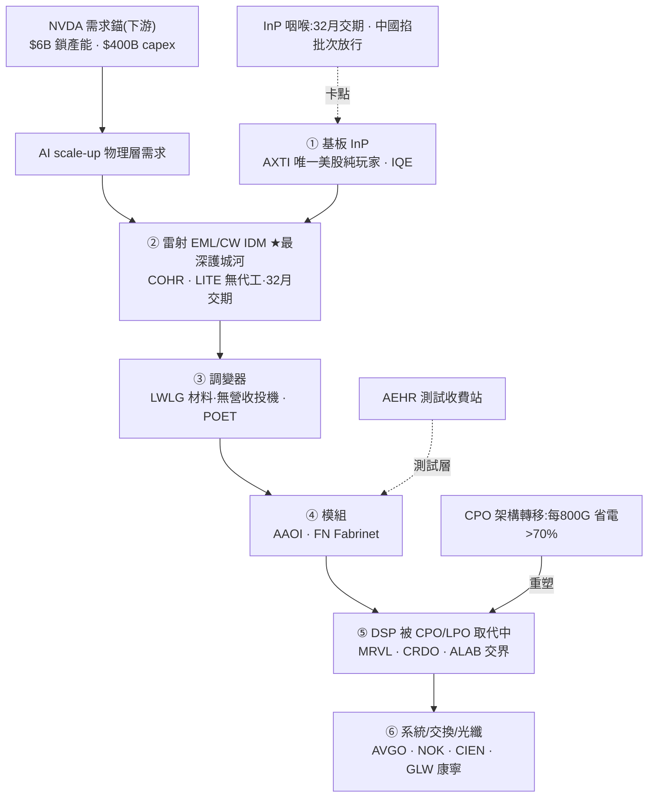

<!-- frontmatter = valid-YAML scalars only. Put wiki-links INLINE in the body; cite per claim.
     Never put double-bracket links in YAML frontmatter (breaks the parser). -->

# 光通訊 / 矽光子(B 型)— 真瓶頸,但最擁擠

> 綜合頁。蒸餾自 24 篇 Tier-2 報告(photonics-optical 叢,gooptions)+ 一手驗證(defeatbeta,2026-07-01)。
> **這叢是全批最擁擠(14/24 = 58% bull),confidence 因此壓到 0.30 < 記憶體 0.38**——即使 TAM 更大、
> 瓶頸更硬。示範:crowding 壓 confidence。INITIAL/uncalibrated。

## 一句話(核心張力)
光互連是 **AI scale-up 的物理層瓶頸**:銅撐到 3 公尺、再遠走光,TAM 10x($15B→$154B,高盛)。瓶頸真
(InP 雷射交期 **32 個月**、[[NVDA]] 三張 $2B 支票把產能買死)。**但這是全批最擁擠的主題**——58% 看多、
護城河名估值 75–98 分位、還有無盈利投機股喊 6–8x。→ **真主題、真瓶頸,但重度 priced-in:分層挑質、
別追小型 froth。** 最深護城河 = 無代工雷射 IDM [[COHR]]/[[LITE]];上游咽喉 = [[InP]] 的 [[AXTI]]。

## 價值鏈(6 層架構;毛利 20%→60%,消化到 ticker)



## ticker 層(Karst 端產品;6 層 → 分層 conviction)

| ticker | 層 / 角色 | 可交易 | 一手驗證(Tier-1) | conviction 分層 |
|---|---|---|---|---|
| [[COHR]] | ② 雷射 IDM 最深護城河、訂單到 2028、NVDA 夥伴 | ✅ | **ttm_pe 188(98%!)+ capex 0.11→0.29B(2.6x)** | **質最優但估值極端 + 供給回應** → 擁有護城河、慎入場 |
| [[LITE]] | ② 雷射 IDM、NVDA $2B 首押、高 beta | ✅ | ttm_pe 159(75%) | 質優但貴 / 高 beta |
| [[AXTI]] | ① [[InP]] 唯一美股純玩家、32 月交期咽喉 | ✅ | ttm_pe 16(**26%,唯一便宜**)但小型二元;$632M 增資 4x 產能 | **便宜咽喉但二元**(供給回應中) |
| [[MRVL]] | ⑤ 架構定義者、跨鏈(自研 ASIC+1.6T DSP+光子 fabric) | ✅ | ttm_pe 102(86%) | 質優但貴、跨鏈 |
| [[AAOI]] | ④ 模組、9x 擴產宣言、InP 自製 | ✅ | ttm_pe 25(48%)、capex 0.03→0.06B(2.1x) | 投機-中、波動大 |
| [[SIVE]] | 100% CPO 1.6T 純玩家、喊 6–8x | ✅ | **無盈利(pre-earnings)** | **純投機 / 最擁擠端** |
| [[LWLG]] | ③ 調變器材料、無營收、IP 授權 | ✅ | **無盈利** | **純選擇權** |
| [[GLW]] | ⑥ 光纖(康寧)、NVDA、CEO 稱光通訊 ROIC 將超顯示器 | ✅ | 大型多元、估值較穩 | 質優大型、防守 |
| [[FN]] | ④ 模組代工(Fabrinet) | ✅ | — | 代工、鏟子 |
| NVDA / AVGO / GOOGL | 需求錨 / 下游交換 | ✅ | — | **非光通訊表達,排除** |

## 4-KPI(每條 cited)
### 1. moat / bottleneck — 強(2/2)
- **雙瓶頸**:上游 [[InP]] 基板(雷射交期 32 個月,#092)+ **無代工、產能不可共享的 EML/CW 雷射 IDM**
  (COHR/LITE,最佳 Coherent,#092)。NVDA 三張 $2B 支票($6B)鎖產能 = 卡點被外部確認。
- **6 層架構、毛利差 3 倍(20%→60%,#054)**:「把 LITE 和 LWLG 當同類 = 把台積電當聯發科」→ 護城河極
  不平均,集中在雷射 IDM 那層。

### 2. 資本配置 / ROIC — 中(1/2)+ 供給回應形成中
- **COHR capex 2.6x**(0.11→0.29B,一手)、AAOI 喊 9x、AXTI 4x 增資 → **供給正在回應**(晚期形成訊號)。
- GLW:光通訊 ROIC 將超顯示器(#070)→ 資本效率敘事偏正,但仍是敘事待證。

### 3. 估值 / priced-in — 弱(0.5/2)⚠️ 最大拖累
- **護城河名估值極端**:COHR ttm_pe **98 分位**、MRVL 86%、LITE 75%(一手,2026-07-01)。
- **無盈利投機**:SIVE、LWLG 無盈利,報告本身喊 6–8x(#063)、9x(#060)= froth。
- **crowding**:24 篇 **58% bull**、滿是 SALP/Leopold 持倉、NVDA 鎖單、「8 天 4 家確認」「集體訊號週」
  (#055)= 賣方一致、資金湧入 → 重度 priced-in。

### 4. 成長耐久 / TAM — 強(2/2)
- **TAM $15B→$154B(10x,高盛,#092)**;光互連是 AI scale-up 的**物理層必需**(非題材),CPO 省電 >70%
  → 真、additive、若 AI capex 續則耐久。

## cycle_stage = LATE / 最擁擠(crowding 壓 confidence 的示範)
| 訊號 | 現況 |
|---|---|
| 擁擠 🔴 **全批最高** | **58% bull** + 護城河名 75–98 分位 + 小型股 6–8x 目標 + SALP/NVDA 鎖單敘事 |
| 供給回應 🟡 形成中 | COHR capex 2.6x、AAOI 9x / AXTI 4x 擴產宣言 |
| 瓶頸仍真 🟢 | InP 交期 32 月未解、中國僅**精準批次放行**(#115)= 短缺未結束 → 主題有腿 |

→ **真物理瓶頸,但被市場搶先定價到極端。** 對比記憶體(3/22 bull、MU 67 分位),這叢**更晚更擠** →
confidence 更低。**挑質(COHR/LITE/GLW)、避 froth(SIVE/LWLG);要進場等 crowding 消風。**

## confidence 推導
```
KPI: moat 2/2 · capital 1/2(COHR capex 2.6x) · valuation 0.5/2(COHR 98%/MRVL 86% + SIVE/LWLG 無盈利)
     · growth 2/2(TAM 10x 物理層必需)                                   = 5.5/8 = 0.69 base
crowding/cycle penalty (LATE + 58% bull 最擁擠 + 護城河名 75-98 分位 + 小型投機 froth): × ~0.43  → 0.30
→ confidence ≈ 0.30  (< 記憶體 0.38 — 擁擠壓低,即使 TAM 更大、瓶頸更硬。INITIAL, uncalibrated)
```

## kill_condition(可證偽)
> [[InP]] 短缺解除(32 月交期壓縮 / 中國全面放行 / 新產能上線 → 基板不再是卡點)**或** CPO 導入時程實質
> 落後([[LPO]]/可插拔續當 good-enough,#107)**或** 雷射 IDM(COHR/LITE)訂單能見度(到 2028)/定價破裂。
> **crowding-unwind:** 無盈利投機(SIVE/LWLG)+ 75–98 分位護城河名,任何 AI-capex 打嗝即重挫。
> 觸發 → confidence 歸零。

## Agent 追蹤(定日可證偽預測 → track_record)
- **2026-07-01**:光通訊 = 真物理瓶頸但**最擁擠、重度 priced-in**。表達分層:質 [[COHR]]/[[LITE]]/[[GLW]]
  (擁有護城河、慎入場)vs froth [[SIVE]]/[[LWLG]](避)。方向:**不追**;等 crowding 消風;追蹤變數 =
  InP 交期 + 護城河名估值分位 + bull 佔比;kill = InP 解除 / CPO 落後。
- forward-IC 評估器(待建)N 天後回填 → 裁判。

## 待補
- [ ] 接「crowding 溫度」自動量測(bull 佔比 + 估值分位 → 動態 cycle/confidence)。
- [ ] 逐字稿抽 COHR/LITE 管理層產能/交期/定價語言(moat + 32 月交期證據補強)。
- [x] ✅ COHR/LITE/AXTI/MRVL/AAOI ttm_pe + capex(一手)— 2026-07-01。
- [ ] universe.yaml 加光通訊 grouping,讓 scan 覆蓋(目前 thesis 層有、scan 未覆蓋)。
- [ ] SIVE/LWLG 無盈利 → 用選擇權/事件框架(非 PE)另評。

## 來源
Tier-2(photonics 叢 24 篇,`thesis/wiki/sources/`,全文 `corpus.db`):#092(雷射 IDM 護城河)、#054
(6 層架構)、#055(InP 集體訊號週)、#059(AXTI InP 純玩家)、#063(SIVE CPO 純玩家)、#070(GLW 康寧)、
#107(CPO 取代 DSP 非模組廠)、#115(中國批次放行 InP)。Tier-1:defeatbeta `ttm_pe`/`quarterly_cash_flow`
(2026-07-01)。
