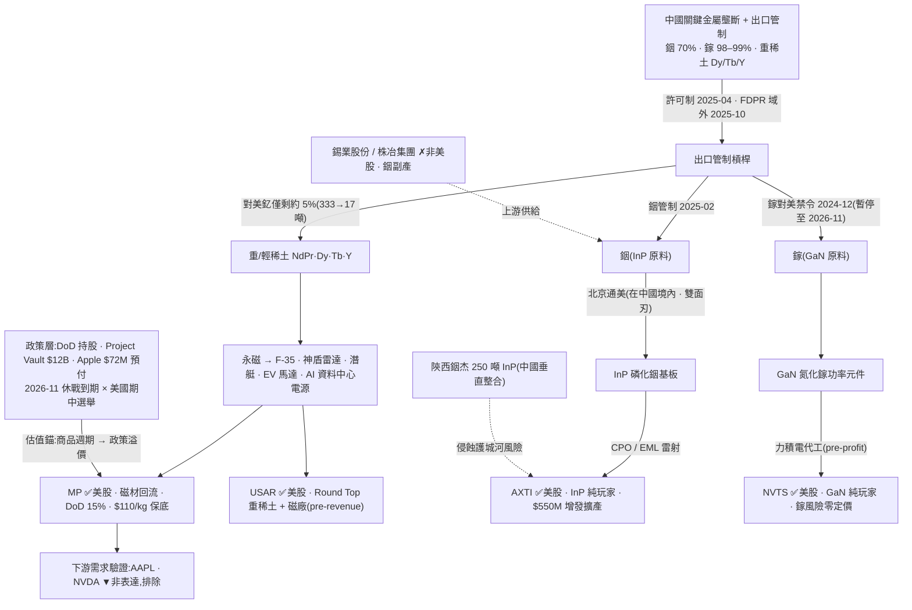

<!-- frontmatter = valid-YAML scalars only. Put wiki-links INLINE in the body; cite per claim.
     Never put double-bracket links in YAML frontmatter (breaks the parser). -->

# 稀土 / 關鍵金屬咽喉(B 型)— 真地緣卡口,但證據薄 + 二元事件

> 綜合頁。蒸餾自 **僅 2 篇** Tier-2 報告([[rare-earth-materials]] 叢,gooptions)+ 一手驗證
> (defeatbeta ttm_pe/capex,2026-07-01)。**證據薄——這是一張誠實的「薄證據觀察」thesis,不灌水。**
> confidence = INITIAL/uncalibrated;當「有紀律的相對強弱 × 事件溫度」讀,不是精確機率。

## 一句話(核心張力 = thesis 本身)
稀土與關鍵金屬(重稀土 [[NdPr]]/Dy/Tb、[[indium]] 銦、[[gallium]] 鎵)是中國**一手掐住的地緣咽喉**——
USGS 官方占比:銦 70%、鎵 98–99%,對美釔只剩管制前約 5%(#078/#105)。**多方說「機制原封不動 +
2026-11 休戰到期撞美國期中選舉、川普不能輸」是雙劇本都贏的非對稱押注;但這是二元地緣事件、不是可
複製的 edge,而且證據只有 2 篇。** 現在:**真咽喉、真政策後盾([[MP]] 準國有),但薄證據 + 事件二元 +
[[MP]] 估值已入政策溢價 → 小注、分層、盯 2026-11。** 可交易表達:[[MP]](核心政策資產)、[[AXTI]]
(唯一便宜咽喉)、[[USAR]]/[[NVTS]](pre-earnings,選擇權框架)。

## 價值鏈(實體 + 關係;消化到 ticker)



## ticker 層(Karst 端產品 = 這張表)

| ticker | 鏈上角色 | 可交易 | 一手驗證(Tier-1) | conviction 含義 |
|---|---|---|---|---|
| [[MP]] | 重稀土 / 永磁回流、DoD 15% 持股、$110/kg NdPr 保底、Apple $72M 預付、Project Vault $12B 核心(#078) | ✅ US | ttm_pe **119.6(自身史 92 分位!n=697)**;capex **29.0→77.4M(2.66x)** 供給回應 | **核心政策資產,但估值已入政策溢價**——別追高 |
| [[AXTI]] | [[InP]] 基板純玩家、銦卡口、北京通美(#105)(**與 [[photonics-optical]] 叢重疊**) | ✅ US | ttm_pe **16.2(26 分位,唯一便宜,n=3544)**;capex 小(0.5→3.0M)、$550M 增發尚未全部落地 | **便宜咽喉,但北京通美雙面刃 + 陝西銦杰垂直整合風險** |
| [[USAR]] | Round Top 重稀土礦 + Stillwater 磁廠(#078) | ✅ US | **pre-revenue → PE 無意義**(43.6、n=366 噪音);capex 3.0→38.6M(12x 建廠) | **前期重資產,選擇權 / 事件框架**(非 PE) |
| [[NVTS]] | GaN 純玩家、鎵卡口、力積電代工(#105) | ✅ US | **pre-profit → PE 無意義**(11.8、n=61 假象);capex 輕(fabless) | **鎵風險零定價、純事件 / 選擇權押注** |
| AAPL / NVDA | 下游 AI / 消費需求(Apple 預付) | ✅ | — | **需求驗證、非稀土表達,排除** |
| 錫業股份 / 株冶集團 / 陝西銦杰 / 力積電 | 上游金屬 / 垂直整合 / 代工 | ✗ 非美股 | — | thesis 輸入,不可交易 |

## 4-KPI(每條 cited;Tier-2 報告 # + Tier-1 一手)

### 1. moat / bottleneck — 中強(1.5/2)
- **真金屬咽喉(官方數據)**:銦 70%、鎵 98–99% 產量在中國(USGS MCS 2026,#105);重稀土對美近斷供——
  釔對美從管制前 8 個月 333 噸 → 管制後 17 噸(約 5%,CSIS,#078)。副產品性質(銦=鋅副產、鎵=鋁副產)
  → 需求暴增也不會自動放量,結構性瓶頸(#105)。
- **[[MP]] 準國有政策護城河**:DoD 15% 持股 + 10 年 $110/kg NdPr 保底 + Apple $72M 預付 + Project Vault
  $12B 核心受益(#078)= 估值錨從商品週期股位移到政策溢價。
- **扣分**:這是**地緣 / 政策**護城河、非技術護城河;且對中國曝險名為**雙面刃**——[[AXTI]] 北京通美在中國
  境內(反被限制 InP 出口的風險)、[[NVTS]] 第三方評護城河=無(#105)。

### 2. 資本配置 / ROIC — 弱偏中(1/2)+ 供給回應形成中
- **供給正在回應**:[[MP]] capex 一年 2.66x(29.0→77.4M,Tier-1 `quarterly_cash_flow`,2026-07-01);
  [[AXTI]] $550M 增發(= 年收入 $88M 的 **6.25x**,SEC 8-K,#105)撐 InP 擴產;[[USAR]] capex 12x 建廠。
- **但**多為前期 / 稀釋 / 未達規模,現階段 ROIC 弱或負;[[MP]] 有 $110/kg 保底撐現金流底線(#078)是唯一
  結構性正分。**回流本身既是 thesis(去中國化)也稀釋稀缺溢價**——兩面。

### 3. 估值 / priced-in — 中(1/2)
- **[[MP]] ttm_pe 119.6、自身史 92 分位**(Tier-1,2026-07-01)= 政策溢價已重度入價,peak-policy 陷阱。
- **[[AXTI]] ttm_pe 16.2、26 分位 = 全叢唯一便宜**(與 [[photonics-optical]] 一手結論一致)。
- **[[USAR]] / [[NVTS]] pre-earnings → PE 無意義**(USAR 43.6 噪音、NVTS 11.8 n=61 假象)→ 改用事件 /
  選擇權框架評估,別用 PE。

### 4. 成長耐久 / TAM — 中強(1.5/2)
- **需求結構耐久**:永磁鎖死國防(F-35、神盾、潛艇)+ EV 馬達 + AI 資料中心電源;[[InP]] 鎖死 CPO/EML
  雷射(光通訊放量剛開始)、[[GaN]] 為資料中心電源 / EV / 雷達首選(#105)= 真、additive、非一次性。
- **但**可投資成長取決於**回流執行 + 咽喉是否延續**,且核心催化劑是 **2026-11 二元地緣事件**(#078)——
  耐久性有,edge 的可複製性弱。

## cycle_stage = EVENT-DRIVEN(二元地緣事件主導)+ 薄證據
| 訊號 | 現況 |
|---|---|
| 事件二元 🔴 | **2026-11 中國休戰到期同月撞美國期中選舉**(#078)= 單點二元:劇本 A 續約 / 劇本 B 破裂 → 押注不對稱但**不是可複製 edge** |
| 擁擠 🟡(薄) | 叢內 **2/2 = 100% bull**,但**僅 2 篇 → 弱訊號**(非記憶體 22 篇 / 光通訊 24 篇的強共識讀);市場層面 [[MP]] 已擠(92 分位)、[[AXTI]] 未擠(26 分位)= 混合 |
| 供給回應 🟡 形成中 | [[MP]] capex 2.66x、[[AXTI]] $550M 增發、[[USAR]] 建廠;中國反向垂直整合(陝西銦杰 250 噸 InP,#105)= 供給雙向回應 |
| 咽喉仍真 🟢 | 管制機制原封不動、川習會僅口頭「會處理」無正式協議(#078/#105);鎵禁令僅「暫停」未解除 |

→ **真咽喉、真政策後盾,但這輪是二元事件驅動 + 證據薄 + [[MP]] 已入政策溢價。** 不是進場鏡像(便宜 +
未共識),是 **event-bounded 的分層小注**:偏好便宜咽喉 [[AXTI]],[[MP]] 別追高,[[USAR]]/[[NVTS]] 選擇權押。

## confidence 推導(可追溯;2026-07-16 red-team 修訂)
```
KPI: moat 1.5/2(USGS 官方咽喉 + MP 準國有;但政策非技術護城河、雙面刃)
     · capital 1/2(MP capex 2.66x + AXTI $550M 增發,但前期/稀釋/ROIC 弱)
     · valuation 1/2(MP 92 分位政策溢價 vs AXTI 26 分位便宜;USAR/NVTS pre-earnings)
     · growth 1/2(red-team 2026-07-16 分岔:兌現未到——2026-11 事件未至,可投資成長靠執行 →
       由 1.5 降至 1)                                                    = 4/8 = 0.50 base
penalty(DESIGN §4a 表:crowding 97.8 → ≥90 帶 × event-driven)              × 0.55  → 0.309
single-source cap(sources len=1)                                            → min(0.309, 0.30)
→ confidence = 0.30  (penalty 標準化;magnitude_tier 5-10x-binary 已承擔 2026-11 事件二元風險,
   §4a 明令不喺 penalty 再折一次。INITIAL, uncalibrated)
```
red-team 詳見 `backtest/results/2026-07-15_redteam_rare_earth_materials.md`。
**讀法:真地緣咽喉 + 真政策後盾,但薄證據(2 篇)+ 二元事件 + MP 已入政策溢價 → 0.28,全批最低。分層:
[[AXTI]] 便宜咽喉小注、[[MP]] 別追高、[[USAR]]/[[NVTS]] 選擇權框架;主追蹤 = 2026-11。**

## kill_condition(可證偽)
> **2026-11 中美達成正式協議、全面解除銦 / 鎵 / 重稀土出口管制**(白宮「會處理」升級為有法律約束力的解除)
> → 咽喉論述基礎瓦解;**或** 中國本土垂直整合按時落地(陝西銦杰 250 噸 InP 良率達標 / 中國磁材放量)→ 稀缺
> 性從源頭被侵蝕;**或** [[MP]] 的 DoD $110/kg 保底 / Project Vault 撥款生變(政策溢價消失);**或** 休戰無限
> 期延長且市場徹底 price-out 斷供風險(事件催化劑消失)。任一觸發 → confidence 歸零,回歸商品週期股 mean-revert。

## Agent 追蹤(定日可證偽預測 → track_record)
- **2026-07-01**:稀土 / 關鍵金屬 = 真地緣咽喉但**薄證據(2 篇)+ 二元事件**(2026-11 休戰到期 × 期中選舉)。
  表達分層:[[MP]](核心政策資產,但 ttm_pe 92 分位政策溢價已入,**別追高**)、[[AXTI]](唯一便宜咽喉 26 分位、
  北京通美雙面刃)、[[USAR]]/[[NVTS]](pre-earnings,**選擇權 / 事件框架**)。方向:**不追 MP 高位**;偏好 AXTI
  便宜咽喉小注;追蹤變數 = **2026-11 休戰續約與否** + 陝西銦杰進度 + 北京通美出口許可 + MP capex/保底;
  kill = 管制正式解除 / 中國垂直整合落地。
- **2026-07-13**:跨主題中國供應鏈曝險總覽 [[china-supply-macro-risk]] 新增(Fable 交接書 P2-13)——
  聚合本 theme + [[us-solar-manufacturing]] 碲依賴 + [[MP]] capex/D&A 警號對抗式覆核(已裁決:駁回 P2
  前兆說,見 `backtest/results/2026-07-13_mp_capex_da_review.md`)+ [[photonics-optical]] 嘅 [[AXTI]]
  中國製造雙重曝險。2026-11 單點事件仍是本 theme 主追蹤變數。
- forward-IC 評估器(待建)N 天後回填 → 這條預測的 forward IC 才是「thesis 有沒有 edge」的裁判。

## 待補(降「薄證據」扣分 = 本叢第一優先)
- [ ] **證據太薄(僅 2 篇)** → 下批 gooptions 補「稀土供應鏈系列 Part 02 USAR / Part 03 Project Vault」
      (#078 明列後續多篇)+ CCL 上游卡口篇(#105 系列篇 02)→ 再重算 confidence。
- [ ] 一手核實 [[MP]] DoD $110/kg 保底 + Project Vault 撥款(SEC/DoD 文件),把政策溢價從 Tier-2 轉引升為 Tier-1。
- [ ] 追蹤 2026-11 休戰到期單點事件(續約 / 破裂)+ 陝西銦杰 250 噸落地進度 + 北京通美出口許可。
- [x] ✅ MP/USAR/AXTI/NVTS ttm_pe 分位 + capex 趨勢(一手)— 2026-07-01。
- [ ] universe.yaml 加稀土 / 關鍵金屬 grouping(AXTI 已在光通訊組;MP/USAR/NVTS 待加)讓 scan 覆蓋。

## 來源
Tier-2(rare-earth 叢**僅 2 篇**,`thesis/wiki/sources/`,全文 `corpus.db`):#078(MP 三撞點 / DoD 15% +
$110/kg 保底 / Rosenthal $96 萬內部人加碼 / 2026-11 雙撞點)、#105(銦鎵雙金屬卡口 / USGS 銦 70% 鎵 98–99% /
AXTI $550M 增發 / NVTS 鎵零定價 / 陝西銦杰垂直整合)。報告內引 USGS MCS 2026、SEC 8-K、CSIS/BMI/IEA/白宮
(Tier-2 轉引,尚未一手核實)。Tier-1:defeatbeta `ttm_pe` + `quarterly_cash_flow`(capex),2026-07-01。
</content>
</invoke>
