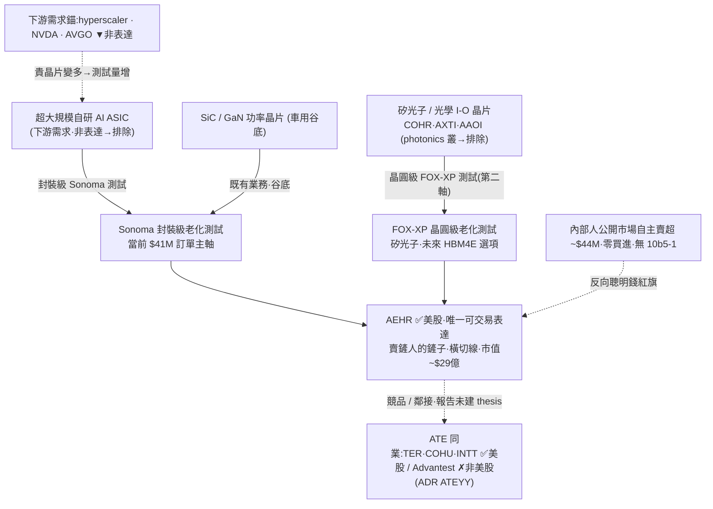

<!-- frontmatter = valid-YAML scalars only, tickers quoted。wiki-links 一律 INLINE 放內文;每條 claim
     inline 引用來源。切勿把 [[wiki-links]] 放進 YAML frontmatter(會斷 parser)。 -->

# 半導體後段設備 / 老化測試(B 型)— 真收費站,但薄證據 + 單名 froth

> 綜合頁,**薄證據 watch**。本叢在 gooptions 語料中僅 **1 篇**報告([[semicap-equipment]] 叢,#087
> AEHR),thesisType = **neutral(0/1 bull = 0%)**,而且那篇報告自己就把 [[AEHR]] 定調為「放追蹤清單、
> 別在追高區進場」。+ 一手驗證(defeatbeta ttm_pe/capex,2026-07-01)。**證據薄 → confidence 低(0.20),
> 這是一條 watch 而非可下注的主題。** INITIAL/uncalibrated,當「有紀律的相對強弱 × 週期溫度」讀。

## 一句話(核心張力 = thesis 本身)
老化測試(burn-in / [[ATE]] 後段)是 AI 晶片浪潮裡少數**橫切線 · 賣鏟人的鏟子**:不賭哪顆晶片贏,只要
「貴到不容許出貨後才壞」的晶片變多,每顆出貨前都得過這道**收費站**。**結構需求是真的(一手 $41M 超大型
雲端業者 Sonoma 追加量產單、訂單出貨比 >3.5x、backlog $50.9M 創紀錄,#087);但唯一可交易表達 [[AEHR]]
本身已是極端 froth** —— 一年 +856%、forward PE ~615x、現價站在**所有**賣方目標價之上、且內部人在公告大單
前六天自主賣超 $44M。→ **主題早(滲透率才 ~5%)、股價極晚(追高區)。看懂乾淨結構 ≠ 乾淨進場 → watch。**
可交易表達僅 [[AEHR]](小型、β3.27);[[TER]]/[[COHU]]/[[INTT]] 為鄰接同業但報告未建 thesis。

## 價值鏈(實體 + 關係;消化到 ticker)



## ticker 層(Karst 端產品 = 這張表)

| ticker | 鏈上角色 | 可交易 | 一手驗證(Tier-1) | conviction 含義 |
|---|---|---|---|---|
| [[AEHR]] | 老化測試橫切收費站;Sonoma 封裝級(AI ASIC 主軸)+ FOX-XP 晶圓級(矽光子/未來 HBM4E) | ✅ US | **TTM EPS 現為負(-0.38)→ ttm_pe 無定義**;上次正值 PE 12.29 已是 2025-05($9.54,現~$96 約 10x 後、盈利翻負);capex TTM ~$4.75M 且 $2.82M→$74K/季**下降**(輕資產) | **唯一表達,但單名極端 froth**:真收費站 vs forward 615x + 內部人賣超紅旗 → watch,不追高 |
| Advantest / Teradyne([[TER]])/ Cohu([[COHU]])/ inTEST([[INTT]]) | ATE 後段測試同業(報告點名的競品集合) | Advantest ✗非美股(ADR ATEYY);TER/COHU/INTT ✅ US | — | **鄰接 proxy,報告未建 thesis → 不列為表達;僅供分散/對讀** |
| COHR / [[AXTI]] / [[AAOI]] | 被 FOX-XP 測試的矽光子晶片(第二需求軸) | ✅ | — | **下游/被測物、屬 [[photonics-optical]] 叢 → 排除、非本叢表達** |
| hyperscaler / NVDA / AVGO | 需求錨(貴晶片來源) | ✅ | — | **下游需求、非老化測試表達,別混淆** |

## 4-KPI(每條 cited;Tier-2 報告 # + Tier-1 一手)

### 1. moat / bottleneck — 中偏弱(1/2)
- **橫切收費站 + 交叉銷售鎖定**:少數同時做晶圓級 FOX-XP 與封裝級 Sonoma 老化測試,客戶驗證期選了平台、
  量產通常鎖同平台(設備業典型轉換成本)(Tier-2 #087)。
- **但護城河「唯一達量產規模」是管理層自述、逐字稿未點名對手**(Advantest/Teradyne/Cohu/inTEST 一個都沒提),
  無第三方驗證 → 須照公司視角打折;且 ASIC 老化測試滲透率**才 ~5%**(管理層估算)= 利基小、易被切入(Tier-2 #087)。

### 2. 資本配置 / ROIC — 弱(0.5/2)
- **輕資產、capex 小且下降**:capex TTM ~$4.75M,季度 $2.82M(2025-05)→ $74K(2026-02)**回落**
  (Tier-1 defeatbeta `quarterly_cash_flow`,2026-07-01)→ **無供給回應 capex boom**(這點反而不是頂訊號),
  但也沒有重資產壁壘。
- **當期在谷底、ROIC 現為負**:FY Q3 2026 營收僅 $10.3M、年減 44%(碳化矽功率谷底),**TTM EPS -0.38**
  (Tier-1 `ttm_pe`)→ 現金報酬當前為負,故事全押未認列的 backlog。

### 3. 估值 / priced-in — 極弱(0/2)⚠️ 最大拖累
- **PE 無定義(盈利翻負)→ 用事件/選擇權框架,非 PE**:TTM EPS -0.38、ttm_pe 無定義(Tier-1,2026-07-01);
  報告給的 **forward PE ~615x、P/S ~64x、P/B ~20.6x**(Tier-2 #087)。
- **極端 priced-in / froth**:一年 **+856%**、4 月單月 +144%、現價 ~$92 **站在所有賣方目標價之上**
  (Craig-Hallum 買進 $68、Lake Street 買進 $56 全在現價下方);50/200 日均 $76/$39 乖離近一倍;β~3.27(Tier-2 #087)。
- **反向聰明錢紅旗**:內部人公開市場自主賣超 ~$44M、零買進、每筆無 10b5-1,執行長在 $41M 大單公告前六天賣
  $10.8M;空單 ~16–17%(Tier-2 #087,對到 SEC Form 4 一手)。

### 4. 成長耐久 / TAM — 中強(1.5/2)
- **一手結構需求(最硬)**:2026-04-16 超大型雲端業者史上最大 $41M Sonoma 追加**量產**單、訂單出貨比 >3.5x、
  backlog $50.9M 創紀錄、FY26 下半年訂單累計逾 $92M(Tier-2 #087,對到 IR/SEC)。
- **橫切、additive、長跑道**:滲透率才 ~5%、隨每顆貴 AI 晶片增加而放量(Tier-2 #087)。
- 但**小基期 + 單一客戶集中 + 認列遞延**(這筆 $41M 要 FY2027 才認列、未給 FY2027 指引)+ TAM 金額皆管理層估算
  → 耐久性存在,但可見度低、易受單客戶變動傳導。

## cycle_stage = LATE(單名 froth 主導)+ 主題本身其實早
| 訊號 | 現況 |
|---|---|
| 擁擠 / froth 🔴(單名) | **forward 615x、+856%、站在所有賣方目標價之上、內部人賣超 $44M、β3.27** = 教科書追高區(#087) |
| 供給回應 🟢 未現 | capex 小且**下降**($2.82M→$74K/季,一手)= 輕資產、無產能洪水(對 downside 反而是好事) |
| 需求瓶頸 🟡 真但早 | 滲透率才 ~5%、$41M 一手單背書 = 主題**早**,但要 FY2027 才認列(#087) |
| 共識擁擠 🟢 低 | 叢內 **0/1 bull**、賣方覆蓋極薄、機構被動為主、無明星主動基金重倉 = **無分析師共識搶跑**(唯一 mitigant) |

→ **主題早(5% 滲透)、但唯一可交易表達 [[AEHR]] 的價格極晚(froth + 內部人紅旗)。** 進場鏡像(便宜 + 供給
緊 + 未共識)在「便宜」這格完全不成立;kill-bounded 也難,因 615x 下跌空間大。**看懂 ≠ 買 → watch。**

## confidence 推導(可追溯;2026-07-16 red-team 修訂)
```
KPI: moat 1/2(真收費站+鎖定,但「唯一」未驗證、滲透 5% 利基)
     · capital 0.5/2(輕資產 capex 下降=無 boom,但當期 ROIC 負、谷底)
     · valuation 0/2(PE 無定義/盈利負;forward 615x+P/S64x+站在所有目標價之上+內部人賣 $44M)
     · growth 1/2(red-team 2026-07-16 中彈:FY26 營收實跌 -15%、$41M 單未認列、FY27 +160-200%
       指引全靠 contingent 前瞻、耐久 magnitude 腿未入 P&L → 由 1.5 降至 1)   = 2.5/8 = 0.3125 base
penalty(DESIGN §4a 表:crowding 40.7 → 40-60 帶 × late)                    × 0.65  → 0.2031
single-source cap(sources len=1)                                            → min(0.2031, 0.30)
→ confidence = 0.20  (< photonics 0.30 < memory 0.38。唯一 red-team subscore 通道實質壓低
   confidence 嘅 theme——formula 遷移原本會上拉到 0.24,red-team growth 中彈抵銷咗上拉。
   INITIAL, uncalibrated)
```
red-team 詳見 `backtest/results/2026-07-16_redteam_semicap.md`。
**讀法(對齊錨點):photonics 58% bull → 0.30、memory 14% bull → 0.38。本叢雖 0% bull(共識不擁擠),但
(a) 證據薄(1 篇 vs 24)(b) 單名估值比 photonics 護城河名更極端(forward 615x vs 75–98 分位)(c) 內部人賣超
紅旗(d) 護城河未驗證 → 壓到 0.20 < 0.30。真收費站 + 一手 $41M 單撐住不歸零。要碰只放 watch、等回檔或
FY2027 認列,不追高。**

## kill_condition(可證偽)
> **內部人續賣不止**(股價回檔後仍賣、或執行長再有大額自主賣出,反向聰明錢訊號不轉弱)**或** **backlog 認列破功**
> ($41M / $50.9M backlog 的 FY2027 認列延期、大客戶砍 Sonoma 擴張、單客戶集中傳導)**或** **競品切入解構「唯一」**
> (Advantest/Teradyne/Cohu/inTEST 切入封裝級量產老化測試,稀釋 moat)。
> **froth-unwind:** forward 615x + 站在所有目標價之上 + β3.27,任何 AI-capex 打嗝即被放大重挫。
> 觸發 → confidence 歸零,回歸「谷底重估已 priced-in 的高波動小型設備股」。

## red_team(Level-2,2026-07-16;詳 backtest/results/2026-07-16_redteam_semicap.md)
- **判決:分岔**——已-priced 收費站(技術/競爭半句)生還兼加固,未證嘅耐久 magnitude 腿中彈。
- **balance-sheet 三度命中**:deferred revenue 僅 $1.91M = backlog($80.6M)嘅 2.4% 且停滯萎縮——
  「創紀錄 backlog = 耐久能見度」呢個承重 claim 一手證偽,同 pilot MU RPO / photonics COHR-LITE
  同一形態。**毛利反證定價權**:51%→26–33% 隨量壓縮,同真收費站應守毛利嘅形態相反。
- **耐久 magnitude 腿(FY27 +160-200% 指引)未入 P&L**:FY26 營收實跌 -15%、$41M 單未認列(推
  Q2 FY27)、CEO 親口「always lumpy… cyclical」。**已 flag `magnitude_unconfirmed: true`
  (burn-in-tollgate-froth node),sizing v2 對此 node 收起 magnitude 加成。**
- **兩面誠實**:競爭者(Advantest/TER/COHU/INTT)狩獵兩手空空(未切入,幫控方);內部人 2026-07-15
  動作實為例行 RSU 代扣稅、非公開市場拋售(較舊敘事淡),但 5 年 0 買 13 賣紅旗仍在。

## Agent 追蹤(定日可證偽預測 → track_record)
- **2026-07-01**:半導體後段老化測試 = 真橫切收費站,但**薄證據(1 篇 neutral)+ 唯一表達 [[AEHR]] 極端
  froth(forward 615x、+856%、站在所有目標價之上、內部人賣 $44M)**。方向:**不追高**;僅 watch。
  追蹤變數 = 內部人 Form 4(是否停賣/買進)+ FY2027 指引首度給出(backlog 對到可算營收)+ 價格回到
  50/200 日線之間;kill = 內部人續賣 / 認列破功 / 競品切入。
- forward-IC 評估器(待建)N 天後回填 → 這條預測的 forward IC 才是「thesis 有沒有 edge」的裁判。

## 2026-07-08 update:#150 獨立佐證(同一批事實,非新 kill 觸發;confidence 0.20 維持)

- **#150(HBM 製程系列)獨立提及 [[AEHR]] froth 框架,佐證而非新訊號**:一年 **+8x**、forward PE **~615x**,
  內部人(#150 用詞「公司內部人」)自 $30 漲到 $100 過程中**幾乎只賣不買**、累計賣出約 **$4,400 萬**,
  執行長**賣在 $4,100 萬訂單公告前六天**——與本頁既有 #087 內部人賣超紅旗**同一批事實**,非獨立第二
  來源的新爆料。**新增細節(#150)**:該訂單為**主力雲端業者(hyperscaler)對自研晶片老化測試的追加訂單**
  金額 $4,100 萬,與本頁 Sonoma $41M 一手單為同一筆交易的另一敘述角度。本更新**不構成新 kill 觸發**,
  僅是第二個 Tier-2 來源獨立確認同一組事實(整叢仍實質是同一批公開資訊的重複引用,證據薄的定性不變)。

## 待補(降「未確認」扣分 + 加厚薄證據)
- [ ] **證據薄**:整叢僅 #087 一篇 → 待新 gooptions 批次補入(Advantest/Teradyne/Cohu 定價權、OSAT 老化測試
      產能翻 4x 的第二來源),才可能把 confidence 從 watch 往上調。
- [ ] 追 AEHR FY Q4 2026 法說(~2026-07):FY26 是否達 $45–50M 高標、矽光子 FOX-XP 是否如期出貨、**是否首度
      給 FY2027 指引**(把故事從「相信」變「可算」)。
- [ ] 每月 SEC Form 4:內部人是否出現公開市場買進 / 賣超是否在回檔後停止(kill 變數)。
- [ ] AEHR 無正 TTM 盈利 → 用選擇權/事件框架(非 PE)另評進場(報告建議長天期買權或 CSP 貼近 $56–70 夠貴線)。
- [x] ✅ AEHR ttm_pe(現為負、無定義)+ capex(TTM $4.75M 且下降)一手 — 2026-07-01。

## 來源
Tier-2(semicap-equipment 叢原僅 1 篇,`thesis/wiki/sources/`,全文 `corpus.db`):**#087**(AEHR 老化測試橫切
收費站、$41M 一手單、內部人 $44M 賣超、forward 615x、賣方目標價 $56–68,對到 IR/SEC EDGAR CIK 0001040470
Form 4);**新增(2026-07-08):#150**(HBM 製程系列,獨立提及 AEHR froth 框架 + 主力雲端業者自研晶片老化
測試追加訂單細節,同一批事實非新 kill 觸發)。Tier-1:defeatbeta `ttm_pe`(TTM EPS -0.38、PE 無定義)、
`quarterly_cash_flow`(capex TTM $4.75M 且季度下降)(2026-07-01)。
</content>
</invoke>
