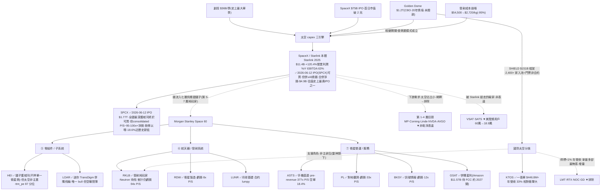

<!-- frontmatter = valid-YAML scalars only。wiki-links 一律放本文 INLINE、逐條 cite。
     NEVER 把 [[wiki-links]] 放進 YAML frontmatter([[ 是 flow-seq 起手、會炸 parser)。 -->

# 太空 / 衛星經濟(B 型)— 主題早週期、真;但可乾淨買的表達幾乎都是夢想定價或執行賭注

> 綜合頁。蒸餾自 6 篇 Tier-2 報告([[space-satellite]] 叢,gooptions/Trend Core)+ 一手驗證(defeatbeta
> `ttm_pe`/`quarterly_cash_flow`,2026-07-01)+ 2026-07-14 重估(SpaceX IPO,SEC S-1 + CNBC/CNN 一手查核)。
> confidence = INITIAL/uncalibrated;當「有紀律的相對強弱 × 週期溫度 × priced-in 閘」讀。**這叢語料自律
> (6 篇僅 1 bull=17%),但可交易純玩家估值到夢想定價(P/S 377x/94x)。2026-06-12 SpaceX 已 IPO(SPCX,
> $1.77T,史上最大),本頁一直講嘅「最深護城河唔可以乾淨買」而家過時——但呢個名本身係史上最貴 IPO 之一
> +混入 xAI 燒錢業務,新舊兩股力量大致抵消,confidence 維持 0.28(見下 2026-07-14 重估段)。**

## 一句話(核心張力 = thesis 本身)
太空是**真·早週期結構主題**:發射成本崩塌 **$54,500→$2,720/kg(-95%)** 把 LEO 通訊從「銥星九個月破產」
變成「Starlink 2025 營收 $11.387B、EBITDA 63%」的生意(Tier-2 #101);創投單季 **$36B**(史上最大)、
Golden Dome CBO **$1.2 兆**、SpaceX $75B IPO 三引擎同時點火(#111)。**但核心張力不是「太空會不會漲」,
而是「這條鏈上,誰真的收到錢、而且價格還沒把未來透支光」。** 最深護城河 SpaceX/[[Starlink]] 是**需求錨、
本體難買又偏貴**(Damodaran 估高 30%);可乾淨買的純玩家不是 **pre-revenue 執行賭注**([[ASTS]] 377x P/S、
[[RKLB]] 94x P/S 仍虧損)、就是**估值站上自身歷史頂**的鏟子([[HEI]] ttm_pe 87 分位、[[MP]] 92 分位)。
→ **主題真且早,但可交易表達重度 priced-in + 多為二元 → 小注、選項/事件框架、別追夢想定價。**

## 價值鏈(實體 + 關係;消化到 ticker)



## ticker 層(Karst 端產品 = 這張表)

| ticker | 鏈上角色(層) | 可交易 | 一手驗證(Tier-1,2026-07-01) | conviction 含義 |
|---|---|---|---|---|
| [[RKLB]] | ⑥ 發射純玩家、SpaceX 外最活躍;Q1 營收 $200.3M(+63.5%)、backlog $2.2B(+108%)、Neutron 2026Q4 首飛目標(#111) | ✅ US | **ttm_pe = 虧損(無)** = 靠 backlog 兌現未來;capex $22M→$50M→$27M(Neutron 建置) | **發射層核心表達,但 P/S 94x + 仍虧損** → 選項/事件框架、盯 Neutron 首飛 |
| [[ASTS]] | ⑦ 手機直連衛星(D2D)、FCC 授權、實測 98.9 Mbps、backlog $12 億;市值近 590x 2025 營收(#109) | ✅ US | **ttm_pe 54.6(pre-revenue→無意義)**;capex 爆發 **$82M→$424M(5x)** = 建星系 | **pre-revenue 執行賭注**(2026H2 衛星能否準時足量上天);空單 18.4% → 純選項 |
| [[KTOS]] | 國防太空、Golden Dome 相對衝擊最大(一張 $446.8M≈年營收 33%);2025 營收 $1.347B(+18.5%)(#113) | ✅ US | **ttm_pe 294.9(74 分位、Op 利潤率僅 2.9%→PE 失真)**;capex $20–28M 微升 | Golden Dome 相對規模位置好,但**薄利潤率 + 太空佔比未揭露** → 溢價追有修正風險 |
| [[HEI]] | ⑤ 鏟子護城河、全球最大獨立飛機更換件、不押單一衛星商;FY25 營收 $4.485B(+16%)(#111) | ✅ US | **ttm_pe 63.6(87 分位、n=7146 深史→頂區)**;capex $13–27M(無供給回應暴衝) | **質最優鏟子,但太空非主業(嵌 ETG 段)+ 估值站頂** → 買的是航空售後、非太空 |
| [[LOAR]] | ⑤ 迷你 TransDigm 航太利基併購飛輪;Q1 $156.1M(+36%)、內部人 cluster 買 $11.3M(#041,**唯一 bull**) | ✅ US | **ttm_pe 113.7(29 分位、n=546 短史;GAAP 被併購攤提壓、Adj 較低)**;capex ~$3–6M(輕資產) | **唯一 bull,但空曝險最薄**(售後 50–55%、國防<25%)→ 是航太 roll-up 故事、非太空 capex 表達 |
| [[MP]] | ① 稀土上游(原料採礦層) | ✅ US | ttm_pe 119.6(**92 分位、頂**);capex $30M→$77M 升 | 稀土/國防供應、**多元化非太空純玩家**、估值頂 → 排除於核心表達 |
| [[RDW]] / [[LUNR]] / [[PL]] / [[BKSY]] | ⑥⑦ 衛星製造 / 月球 / 對地觀測 / 訊號情報 | ✅ US | RDW·PL·BKSY **ttm_pe 虧損(無)**;LUNR 9.6(合約 lumpy 失真);P/S 8–33x | 小型二元、燒錢 → 純選項、非核心 |
| [[GSAT]] | ⑦ Globalstar、Amazon $11.57B 收購中(S 波段頻譜、待 FCC、約 2027 關)(#111) | ✅ US | ttm_pe 19.2(4 分位)**但併購套利、非營運估值** | 併購套利標的(賭交易完成)、非太空成長表達 |
| [[SPCX]] / [[Starlink]] | 本體、最深護城河(發射+Starlink+Starship+xAI);2026-06-12 IPO $1.77T,史上最大 | ✅ US(2026-06-12 起) | S-1(FY2025 合併):收入$18B、淨損-$4.9B、adj EBITDA $6.58B;Starlink收入$11.4B(+49.8%YoY)/營業利潤+120.4%/EBITDA+86.2%;Space segment收入$4B、Starship研發燒~$3B;AI(xAI)segment收入$3.2B。無ttm_pe(淨損+史短) | **終於可買嘅本體,但consolidated P/S~95-100x/EV-EBITDA~270x=史上最貴IPO之一+xAI燒錢稀釋純度;掛牌以嚟-18.6%近歷史新低(僅1個月,唔當趨勢)** → late-cycle/priced-in、magnitude 2-3x 封頂,唔追高、盯Starlink增速同Starship里程碑 |
| VSAT / SATS | 被 Starlink 搶走的輸家(#108) | ✅ 但空側 | 美寬頻用戶 60萬→18.9萬(#108) | **輸家、非 bull 表達,別混淆** |
| LMT / RTX / NOC / GD | 國防主承包、Golden Dome 得標<1% 年營收 | ✅ | — | **增量、拿最多卻最無感 → 非太空表達,排除** |
| NVDA / AVGO / Linde / Corning | ① – ④ 多元化巨頭、太空佔營收極小 | ✅ | — | **下游需求 / 稀釋、排除** |

## 4-KPI(每條 cited;Tier-2 報告 # + Tier-1 一手)

### 1. moat / bottleneck — 中(1/2)
- **2026-07-14 更新:最深護城河而家可以直接買**——SpaceX 2026-06-12 IPO(SPCX),靠垂直整合 + 發射成本
  崩塌把 LEO 通訊做成唯一獲利部門(Starlink 2025 $11.4B、+120.4% 營業利潤 YoY、EBITDA 63%,S-1)。以下
  「無法乾淨表達」呢句係 2026-07-01 舊讀,現時已過時,保留做歷史對照:~~但散戶配額有限、Damodaran 估高
  30%(#111)→ 護城河最深的資產無法乾淨表達,只能用第 5-7 層鏟子近似。~~
- **可交易鏟子的護城河不均**:[[HEI]] 有「不押單一衛星商、誰中標零件都在裡面」的鏟子護城河(#111);
  [[LOAR]] 是「買低倍數利基件、整合後享 LOAR 溢價」的迷你 TransDigm 飛輪(#041)。但 [[RKLB]] 要與 SpaceX
  競爭、[[ASTS]]/[[PL]]/[[BKSY]] 是執行賭注非護城河。
- **原本的瓶頸(發射)正在崩塌**:這是主題的引擎、卻也意味沒有單一可交易名握著像 [[InP]]/[[HBM]] 那種硬
  卡點 → moat 分散、指標性弱於光通訊/記憶體。SPCX 本身雖握最深護城河,但 2026-02 起同 xAI/X 用
  common-control accounting 併表——買 SPCX 唔係純買「太空」,係買一間夾埋 AI compute 燒錢業務嘅
  綜合體,moat 讀數上調但唔係滿分。

### 2. 資本配置 / ROIC — 中(1/2)+ 早週期「買建」而非晚期供給頂
- **capex 真放量 = 早週期基建訊號**:[[ASTS]] capex **$82M→$424M(5x,建星系)**、[[RKLB]] 升(Neutron)、
  [[KTOS]]/[[MP]] 微升(一手 `quarterly_cash_flow`,2026-07-01)。這和記憶體「capex 暴衝=晚期供給回應頂」
  **性質相反**——這裡是需求端基礎建設早期(Space Capital 稱「多十年基建週期早期」、單季 VC $36B,#111)。
- **但純玩家多在燒錢、ROIC 未證**:[[RKLB]]/[[RDW]]/[[PL]]/[[BKSY]] 會計虧損(一手 `ttm_pe`=無);
  有真獲利+好 ROIC 的 [[HEI]]/[[LOAR]] 卻是輕資產航太、太空不是主業(#111/#041)→ 「太空 ROIC」尚未有
  乾淨、可買、已獲利的代表。
- **2026-07-14 更新:SPCX 本身就係「創造價值 vs 軍備競賽」嘅教科書並存案例**(呼應 DESIGN.md 自己嘅
  Mag7 CAPEX 恐慌警世例)——Starlink segment 資本效率靚(39% 營業利潤率、EBITDA 仲以 86.2% YoY 升緊,
  真.創造價值);但成盤嘢合併淨損 -$4.9B,主因 Starship 研發燒 ~$3B(接近打平成個 Space segment 收入)
  + xAI segment 燒錢(軍備競賽,同 Mag7 capex 恐慌同一劇本)。買 SPCX = 買一個靚 ROIC 業務(Starlink)
  同兩個未證 ROIC 業務(Starship/xAI)嘅混合體,唔可以將 Starlink 嘅資本效率直接套用去成隻股。

### 3. 估值 / priced-in — 弱(0.5/2)⚠️ 最大拖累
- **夢想定價**:以 2026-06-12 收盤 P/S,[[ASTS]] **377x**、[[RKLB]] 94x、[[PL]] 33x、[[MP]] 30x;最高到最低
  差約 **50 倍**(#111)——「太空受惠」根本不是齊漲的籃子。
- **鏟子也站上自身歷史頂**:一手 `ttm_pe`(2026-07-01)——[[HEI]] 63.6(**87 分位**、深史)、[[MP]] 119.6
  (**92 分位**)、[[KTOS]] 294.9(74 分位、薄利潤率失真)。即使 HEI P/S 僅 9x(全叢最便宜),其 PE 分位仍在頂區。
- **pre-revenue → PE 無意義**:[[ASTS]]/[[RKLB]]/[[RDW]]/[[PL]]/[[BKSY]] 用選項/事件框架,不用 PE。
- **連本體都貴**:Damodaran 把 SpaceX 拆三段估基本值 $1.22T、比 IPO 喊價低 30%、直言 81x 營收/156x EBITDA
  是「流鼻血等級」(#101)→ 整條鏈的錨已 priced-in。
- **2026-07-14 更新:本體而家有真數據驗證咗「貴」**——SPCX 2026-06-12 IPO $1.77T(首日市值曾見 $2.1兆),
  以 S-1 FY2025 合併數字計,大約 P/S 95-100x、EV/EBITDA ~270x,仲要係淨損狀態(非淨利)——史上最貴 IPO
  之一,Damodaran 嘅「流鼻血」判斷事後睇算保守。掛牌以嚟高位 $170.86(06-30)跌到 $139.14(07-13),
  -18.6%、貼近媒體標嘅「歷史新低」——早期擠泡跡象,但上市至今僅約 1 個月數據,唔夠計 200SMA,唔當
  趨勢確認,純粹當「呢個位開始貴,市場可能已經喺消化」嘅早期訊號睇。

### 4. 成長耐久 / TAM — 強(2/2)
- **相變已被財報證明**:發射成本 -95% 讓同一個 LEO 點子從破產($5B→$25M)變 $11.387B 營收、63% EBITDA
  (#101)= 真、已兌現、非題材。
- **三引擎同時點火且早**:VC 單季 $36B(史上最大、全年有望破 2025 的 $553 億)、Golden Dome CBO $1.2 兆
  (太空攔截器層 7,800 顆衛星 ~$743B、佔七成)、SpaceX $75B IPO(#111/#113)。
- **下一次相變候選 = 軌道運算**(Starship 再降 10x、AI 機架上天、TAM $28.5T 中 93% 為 AI)——**但全屬公司
  說法、工程驗證為零**(#101)→ growth 給滿分靠已兌現的 Starlink,不靠未證的 Starship。
- **2026-07-14 更新:consolidated entity 稀釋咗「太空」呢個 TAM 讀數**——SPCX 而家夾埋 xAI(AI compute,
  $3.2B 收入,同太空 TAM 完全唔同源)。Starlink 嘅 additive TAM(擴大寬頻覆蓋)同 launch 嘅 additive TAM
  (令衛星星座經濟上可行)依然成立、依然 durable;但 buy SPCX 唔再係一個乾淨嘅「太空 TAM」表達,而係
  「太空 TAM(真、durable)+ AI compute TAM(另一個完全唔同嘅賭注,燒緊錢)」嘅混合注碼。growth 分數
  維持 2/2 係因為 Starlink/launch 本身依然強,但呢個 2/2 而家有 xAI 呢個唔相關嘅稀釋因子要記住。

## cycle_stage = EARLY(主題)但 LATE-PRICED(股價)— 兩層錯位是本 thesis 的重點
| 訊號 | 現況 |
|---|---|
| 主題週期 🟢 **早** | Space Capital 稱「多十年基建週期早期」、VC 單季 $36B 史上最大、Golden Dome 尚未撥款(#111) |
| 供給/建置 🟢 早期買建 | capex 放量是**建星系/建火箭**(ASTS 5x、RKLB Neutron),非晚期供給回應頂(一手,對比記憶體) |
| 擁擠(bull-count)🟢 低 | 語料 **6 篇僅 1 bull=17%**、5/6 neutral;報告自己做 priced-in 閘(「夢想定價 vs 當期獲利」)= **這叢不在最擁擠端** |
| **估值 priced-in 🔴 頂** | **但可交易純玩家夢想定價(ASTS 377x/RKLB 94x P/S)+ 鏟子 PE 站 87–92 分位頂 + 多檔 pre-revenue 二元**;連本體 Damodaran 估高 30% |
| **2026-07-14 新增:本體 IPO 本身 = 比 thematic ETF 上市更強嘅擁擠訊號** 🔴 | DESIGN.md 原有邏輯:新 thematic ETF 上市(如 DRAM ETF)本身雙重意義=確認+晚期。SpaceX 史上最大 IPO(全市場最多人討論嘅上市事件之一)係同一邏輯嘅更強版本——呢個訊號指向「呢個主題已經去到主流資金/媒體關注嘅頂點」,同表格上面「bull-count 低」嗰行睇落矛盾,但其實係兩種唔同嘅擁擠(語料擁擠 vs 資金/媒體擁擠),要分開睇 |

→ **主題早、語料自律(利多);但『能乾淨買的東西』重度 priced-in 或二元(利空)——兩層錯位。SpaceX 自己嘅
史上最大 IPO 現在是第三層擁擠證據,同語料層嘅「低擁擠」讀數方向相反,要留意呢個矛盾,唔好只揀對自己方便
嗰個讀數。** 進場鏡像
(便宜 + 未共識)在**敘事上成立(早)、在可交易標的上不成立(貴/燒錢)**。這不是純追高,但邊際上更像
「選項式參與早週期 + 嚴守 kill」,不是「便宜買深護城河」。

## confidence 推導(可追溯;2026-07-16 red-team 修訂)
```
KPI: moat 1/2(最深護城河 SpaceX 不可乾淨買;鏟子護城河不均、operator 是執行賭注、發射瓶頸正崩)
     · capital 1/2(capex 真放量=早週期建置訊號:ASTS $82M→$424M、RKLB Neutron;但純玩家燒錢、ROIC 未證)
     · valuation 0.5/2(ASTS 377x/RKLB 94x P/S 夢想定價;HEI 87%、MP 92% ttm_pe 分位頂;多檔 pre-revenue)
     · growth 1.5/2(red-team 2026-07-16 分岔:相變一「發射成本-95%」已證生還,但超級週期三支柱——
       backlog(ASTS $12B僅~1.9%現金背書)/Golden Dome($1.2T願景 vs 真實~$38B撥款)/VC($36B寬口徑、
       窄義僅$7.9-9.4B)——全部降級為敘事,耐久半截未過 Level-2 → 由 2 降至 1.5)
                                                                          = 4.0/8 = 0.50 base
penalty(DESIGN §4a 表:crowding 59.9 → 40-60 帶 × early)                  × 0.95  → 0.475
single-source cap(sources len=1)                                            → min(0.475, 0.30)
→ confidence = 0.30  (penalty 標準化;red-team 殺傷力唔喺 confidence 數字——落 magnitude 通道,見
   golden-dome-policy-option + d2d-spectrum-optionality nodes 之 magnitude_unconfirmed。
   INITIAL, uncalibrated)
```
red-team 詳見 `backtest/results/2026-07-15_redteam_space_satellite.md`(2026-07-16 對象執行)。
**讀法:真主題 + 真早週期,但「可乾淨買的表達」品質稀薄——0.28 略低於光通訊 0.30。理由:光通訊尚有可乾淨買、
擁一硬瓶頸([[InP]]/雷射 IDM)的深護城河 [[COHR]]/[[LITE]];太空最深護城河(SpaceX)幾乎不可買,可交易多為
pre-revenue 執行賭注或站頂鏟子。要參與 → 小注、選項/事件框架([[RKLB]] Neutron、[[ASTS]] 上天、[[KTOS]]
Golden Dome 相對衝擊),盯 kill;避 377x/94x P/S 追高。**

**2026-07-14 重估(SpaceX IPO 後,confidence 維持 0.28 不變——呢個係考慮過嘅不變,唔係漏更新):**
```
上面 moat 1/2 嘅damping理由(「最深護城河唔可以乾淨買」)而家部分解除——SPCX可以直接買,呢個係利好。
但同一時間出現兩個新嘅利淡因子,量級大致相若:
  (a) SPCX 本身係史上最貴IPO之一(consolidated P/S~95-100x、EV/EBITDA~270x、淨損-$4.9B)= valuation
      軸嘅damping只會更重,唔會減輕;
  (b) SPCX 併入 xAI/X(common-control accounting)= moat/growth 兩軸都要扣返一嚿「呢個唔係純太空
      表達」嘅純度折讓;
  (c) SpaceX 自己嘅史上最大IPO本身就係一個比thematic ETF上市更強嘅擁擠/晚期訊號(見上cycle_stage表新增行)。
淨效果:(a)+(b)+(c) 嘅利淡力度,大致抵消咗「終於可以買」嘅利好。4-KPI base分同cycle/crowding penalty
都冇改變到需要郁動最終數嘅程度——confidence繼續係0.28,直到SPCX累積track record(至少一季後續財報+
更長價格史,方可信200SMA讀數)先再校準。SPCX個股本身喺node層面已用cycle_stage=late、magnitude_tier
2-3x記錄(見themes.yaml),反映「真moat但priced+impure」嘅讀法,唔會漏咗呢層資訊落sizing/scan。
```

## red_team(Level-2,2026-07-16;詳 backtest/results/2026-07-15_redteam_space_satellite.md)
- **判決:部分中彈**——承重相變(發射成本-95%、Starlink 已兌現)生還且係全 corpus 唯一真.掂到承重
  claim 嘅一手佐證;「相變開啟多十年超級週期」嘅三條量級支柱全部降級為敘事。
- **balance-sheet 三度落刀,斬中全叢最貴嗰隻**:ASTS「backlog $12B」≈98%非cash-backed(deferred
  revenue僅~$233M≈1.9%),係TAM式MOU非RPO式合約義務;RKLB backlog $2.2B僅~11%現金背書(較乾淨)。
- **Golden Dome 撥款落差**:CBO $1.2T願景 vs 真實已授權約$38B(OBBBA $25B+FY2026 $13.4B)——連
  wiki自己「$250B已到位」都高估約7倍。VC $36B係最寬口徑(含GPS/Applications),窄義純太空僅
  $7.9-9.4B、與SpaceX IPO buzz綁定。
- **已 flag `magnitude_unconfirmed: true`**(golden-dome-policy-option + d2d-spectrum-optionality
  nodes),sizing v2 對呢兩個 node 收起 magnitude 加成。confidence 淨效果 = 向下但唔郁動(0.28
  維持;遷移後公式標準化拉到 0.30,red-team 唔准酌情抵消呢個標準化)。

## kill_condition(可證偽)
> **相變二不來或第一引擎熄火** —— [[Starship]] 快速重複使用長期延宕(成本停在 Falcon 量級 → 軌道運算等
> $28.5T AI TAM 敘事整體延後,#101)**或** Golden Dome 遭砍/推遲($1.2T 只是 CBO 願景、已授權約 $38B[OBBBA $25B+FY2026 $13.4B,red-team 2026-07-16 核實;舊記「$250B」高估約 7 倍]、
> 是政治變數,#113)**或** 純玩家獲利遲遲不轉正、燒錢加速(高 P/S 與獲利落差擴大,#111)。
> **個股 kill(可證偽、定日):** [[RKLB]] Neutron 2026Q4 再延;[[ASTS]] 2026H2 衛星未準時足量上天;
> [[GSAT]] Amazon 併購 FCC 卡關/破局;**[[SPCX]]**(2026-07-14 新增)Starlink 收入年增速跌穿 30%(2025
> 為 49.8%,顯著減速)或 Starship 研發燒錢(2025 約 $3B)持續擴大而冇對應飛行里程碑兌現。**估值 unwind:**
> ASTS 377x/RKLB 94x P/S + 多檔 pre-revenue,任何 AI-capex / 風險偏好打嗝即高 beta 重挫;SPCX 本身
> consolidated P/S~95-100x,同一風險適用。觸發 → confidence 歸零、該表達 mean-revert。

## Agent 追蹤(定日可證偽預測 → track_record)
- **2026-07-01**:太空 = **真·早週期結構主題,但可乾淨買的表達重度 priced-in / 多為 pre-revenue 二元**。
  表達分層:發射/國防「相對衝擊」位置 [[RKLB]]/[[KTOS]](選項/事件框架、盯 Neutron 首飛 + Golden Dome
  撥款)vs 夢想定價 [[ASTS]](377x P/S、pre-revenue,純選項)vs 站頂鏟子 [[HEI]](質優但太空非主業、PE 87
  分位)vs 唯一 bull [[LOAR]](航太 roll-up、空曝險薄)。方向:**不追夢想定價**;小注 + 嚴守 kill;
  追蹤變數 = Neutron 首飛 / Golden Dome 撥款 / 純玩家獲利轉正 / P/S 分化是否收斂;kill = Starship 延宕 /
  Golden Dome 砍預算 / 個股執行 miss。
- forward-IC 評估器(待建)N 天後回填 → 這條預測的 forward IC 才是「thesis 有沒有 edge」的裁判。
- **2026-07-14**:SpaceX 2026-06-12 IPO(SPCX,$1.77T,史上最大)。全 theme 一直講嘅「最深護城河唔可以
  乾淨買」過時,已加 SPCX 做新 node(cycle_stage late、magnitude 2-3x)。Theme-level confidence/cycle_
  stage/verdict 維持不變(0.28/early/real-early-but-froth-priced)——4-KPI 重估後,「終於可買」嘅利好
  同「史上最貴IPO之一+xAI混業稀釋+IPO本身係強擁擠訊號」嘅利淡大致抵消,詳細推導見上 confidence 段。
  追蹤變數:Starlink 收入增速(2025 49.8%,留意會唔會減速)、Starship 里程碑 vs 燒錢速度、SPCX 股價
  走勢(掛牌以嚟 -18.6%,累積夠 200 個交易日先計 200SMA)、xAI segment 虧損有冇擴大。

## 待補(降「未確認」扣分)
- [ ] 接純玩家「獲利轉正 + P/S 分化收斂」自動追蹤(RKLB/ASTS 毛利、燒錢速度 → 動態 cycle/confidence)。
- [ ] Golden Dome 撥款節奏追蹤(SHIELD 框架 → 任務訂單落地、KTOS 太空佔比揭露)。
- [x] ✅ universe.yaml 加太空 grouping——2026-07-14 核實:`thesis: space-satellite` 機制已自動將全部
  theme tickers(含新加嘅 SPCX)拉入 scan,唔使手動改 universe.yaml。
- [ ] pre-revenue 名(ASTS/RKLB/RDW/PL/BKSY)改用選項/事件框架另評(非 PE)。
- [x] ✅ ttm_pe + 自身分位、capex 趨勢(一手,LOAR/HEI/KTOS/RKLB/ASTS/MP/GSAT/RDW/PL/LUNR/BKSY)— 2026-07-01。
- [ ] SPCX 累積至少 1 季後續財報(下一份 10-Q/年報)+ 更長價格史(200+ 交易日先計得 200SMA)先再校準
  cycle_stage/confidence——現時淨係 IPO 當日 S-1 一次性數據 + 約 1 個月股價,唔夠做趨勢判斷。
- [ ] 查 NASA(Tema Space Exploration ETF,本 theme thesis_etf)IPO 後有冇新增 SPCX 做持股、佔比幾多
  ——SpaceX 市值遠超籃內其他名,如果納入好可能一舉成為 ETF 最大持股,影響 purity 讀數。

## 來源
Tier-2(space-satellite 叢 6 篇,`thesis/wiki/sources/`,全文 `corpus.db`):#101(發射成本崩塌=相變、
Starlink S-1)、#108(Starlink 現金奶牛 vs 兩條成本曲線、Viasat 輸家)、#109(ASTS D2D 執行賭注)、
#111(七層受惠地圖 = 價值鏈骨幹、P/S 分化表)、#113(Golden Dome 三層錢流、KTOS 相對衝擊)、#041(LOAR
迷你 TransDigm,**唯一 bull**)。Tier-1:defeatbeta `ttm_pe`(+自身分位)、`quarterly_cash_flow`(capex)
— 2026-07-01。

**2026-07-14 新增(SpaceX IPO 重估,非 gooptions 語料,WebSearch 一手查核)：**
Tier-1:SpaceX SEC Form S-1(2026-05-20 申報,FY2025 合併財務揭露);defeatbeta/yfinance 價格數據
(`backtest/data.py`,2026-06-22 起,SPCX 舊 ticker 2020-2026 屬另一間已下市公司,ticker 回收,已排除
唔用嗰段)。Tier-2/3(新聞確認,非分析觀點):
- [SpaceX targets $135 IPO price at valuation of $1.77 trillion (CNBC, 2026-06-03)](https://www.cnbc.com/2026/06/03/spacex-ipo-stock-price-roadshow-musk.html)
- [SpaceX shares debut after biggest IPO in history (CNN, 2026-06-12)](https://www.cnn.com/2026/06/12/business/live-news/spacex-goes-public-ipo)
- [Initial public offering of SpaceX (Wikipedia)](https://en.wikipedia.org/wiki/Initial_public_offering_of_SpaceX)
- [SpaceX Stock (SPCX) Hits Record Low (TipRanks, 2026-07-13)](https://www.tipranks.com/news/spacex-stock-spcx-hits-record-low-but-top-analyst-says-long-term-story-still-strong)
- [6 charts: SpaceX's S-1 financials (Yahoo Finance/PitchBook)](https://finance.yahoo.com/markets/stocks/articles/6-charts-spacex-1-financials-225255139.html)
