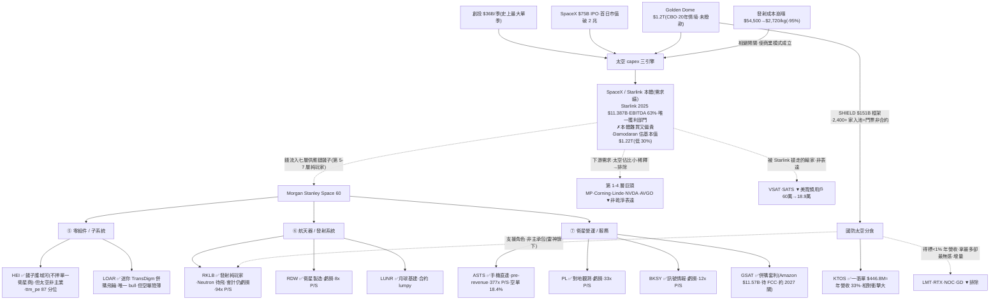

<!-- frontmatter = valid-YAML scalars only。wiki-links 一律放本文 INLINE、逐條 cite。
     NEVER 把 [[wiki-links]] 放進 YAML frontmatter([[ 是 flow-seq 起手、會炸 parser)。 -->

# 太空 / 衛星經濟(B 型)— 主題早週期、真;但可乾淨買的表達幾乎都是夢想定價或執行賭注

> 綜合頁。蒸餾自 6 篇 Tier-2 報告([[space-satellite]] 叢,gooptions/Trend Core)+ 一手驗證(defeatbeta
> `ttm_pe`/`quarterly_cash_flow`,2026-07-01)。confidence = INITIAL/uncalibrated;當「有紀律的相對強弱
> × 週期溫度 × priced-in 閘」讀。**這叢語料自律(6 篇僅 1 bull=17%),但可交易純玩家估值到夢想定價
> (P/S 377x/94x)、且最深護城河(SpaceX)幾乎不可乾淨買 → confidence 壓到 0.28 < 光通訊 0.30。**

## 一句話(核心張力 = thesis 本身)
太空是**真·早週期結構主題**:發射成本崩塌 **$54,500→$2,720/kg(-95%)** 把 LEO 通訊從「銥星九個月破產」
變成「Starlink 2025 營收 $11.387B、EBITDA 63%」的生意(Tier-2 #101);創投單季 **$36B**(史上最大)、
Golden Dome CBO **$1.2 兆**、SpaceX $75B IPO 三引擎同時點火(#111)。**但核心張力不是「太空會不會漲」,
而是「這條鏈上,誰真的收到錢、而且價格還沒把未來透支光」。** 最深護城河 SpaceX/[[Starlink]] 是**需求錨、
本體難買又偏貴**(Damodaran 估高 30%);可乾淨買的純玩家不是 **pre-revenue 執行賭注**([[ASTS]] 377x P/S、
[[RKLB]] 94x P/S 仍虧損)、就是**估值站上自身歷史頂**的鏟子([[HEI]] ttm_pe 87 分位、[[MP]] 92 分位)。
→ **主題真且早,但可交易表達重度 priced-in + 多為二元 → 小注、選項/事件框架、別追夢想定價。**

## 價值鏈(實體 + 關係;消化到 ticker)



## ticker 層(Karst 端產品 = 這張表)

| ticker | 鏈上角色(層) | 可交易 | 一手驗證(Tier-1,2026-07-01) | conviction 含義 |
|---|---|---|---|---|
| [[RKLB]] | ⑥ 發射純玩家、SpaceX 外最活躍;Q1 營收 $200.3M(+63.5%)、backlog $2.2B(+108%)、Neutron 2026Q4 首飛目標(#111) | ✅ US | **ttm_pe = 虧損(無)** = 靠 backlog 兌現未來;capex $22M→$50M→$27M(Neutron 建置) | **發射層核心表達,但 P/S 94x + 仍虧損** → 選項/事件框架、盯 Neutron 首飛 |
| [[ASTS]] | ⑦ 手機直連衛星(D2D)、FCC 授權、實測 98.9 Mbps、backlog $12 億;市值近 590x 2025 營收(#109) | ✅ US | **ttm_pe 54.6(pre-revenue→無意義)**;capex 爆發 **$82M→$424M(5x)** = 建星系 | **pre-revenue 執行賭注**(2026H2 衛星能否準時足量上天);空單 18.4% → 純選項 |
| [[KTOS]] | 國防太空、Golden Dome 相對衝擊最大(一張 $446.8M≈年營收 33%);2025 營收 $1.347B(+18.5%)(#113) | ✅ US | **ttm_pe 294.9(74 分位、Op 利潤率僅 2.9%→PE 失真)**;capex $20–28M 微升 | Golden Dome 相對規模位置好,但**薄利潤率 + 太空佔比未揭露** → 溢價追有修正風險 |
| [[HEI]] | ⑤ 鏟子護城河、全球最大獨立飛機更換件、不押單一衛星商;FY25 營收 $4.485B(+16%)(#111) | ✅ US | **ttm_pe 63.6(87 分位、n=7146 深史→頂區)**;capex $13–27M(無供給回應暴衝) | **質最優鏟子,但太空非主業(嵌 ETG 段)+ 估值站頂** → 買的是航空售後、非太空 |
| [[LOAR]] | ⑤ 迷你 TransDigm 航太利基併購飛輪;Q1 $156.1M(+36%)、內部人 cluster 買 $11.3M(#041,**唯一 bull**) | ✅ US | **ttm_pe 113.7(29 分位、n=546 短史;GAAP 被併購攤提壓、Adj 較低)**;capex ~$3–6M(輕資產) | **唯一 bull,但空曝險最薄**(售後 50–55%、國防<25%)→ 是航太 roll-up 故事、非太空 capex 表達 |
| [[MP]] | ① 稀土上游(原料採礦層) | ✅ US | ttm_pe 119.6(**92 分位、頂**);capex $30M→$77M 升 | 稀土/國防供應、**多元化非太空純玩家**、估值頂 → 排除於核心表達 |
| [[RDW]] / [[LUNR]] / [[PL]] / [[BKSY]] | ⑥⑦ 衛星製造 / 月球 / 對地觀測 / 訊號情報 | ✅ US | RDW·PL·BKSY **ttm_pe 虧損(無)**;LUNR 9.6(合約 lumpy 失真);P/S 8–33x | 小型二元、燒錢 → 純選項、非核心 |
| [[GSAT]] | ⑦ Globalstar、Amazon $11.57B 收購中(S 波段頻譜、待 FCC、約 2027 關)(#111) | ✅ US | ttm_pe 19.2(4 分位)**但併購套利、非營運估值** | 併購套利標的(賭交易完成)、非太空成長表達 |
| SpaceX / [[Starlink]] | 本體、需求錨、最深護城河(發射+Starlink+Starship) | ✗ 本體難買 | Damodaran 基本值 $1.22T(低 IPO 喊價 30%)(#101/#111) | **需求錨、priced-in;用第 5-7 層鏟子表達,別追本體** |
| VSAT / SATS | 被 Starlink 搶走的輸家(#108) | ✅ 但空側 | 美寬頻用戶 60萬→18.9萬(#108) | **輸家、非 bull 表達,別混淆** |
| LMT / RTX / NOC / GD | 國防主承包、Golden Dome 得標<1% 年營收 | ✅ | — | **增量、拿最多卻最無感 → 非太空表達,排除** |
| NVDA / AVGO / Linde / Corning | ① – ④ 多元化巨頭、太空佔營收極小 | ✅ | — | **下游需求 / 稀釋、排除** |

## 4-KPI(每條 cited;Tier-2 報告 # + Tier-1 一手)

### 1. moat / bottleneck — 中(1/2)
- **最深護城河在不可乾淨買的本體**:SpaceX 靠垂直整合 + 發射成本崩塌把 LEO 通訊做成唯一獲利部門
  (Starlink 2025 $11.387B、EBITDA 63%,#101);但散戶配額有限、Damodaran 估高 30%(#111)→ 護城河最深
  的資產無法乾淨表達,只能用第 5-7 層鏟子近似。
- **可交易鏟子的護城河不均**:[[HEI]] 有「不押單一衛星商、誰中標零件都在裡面」的鏟子護城河(#111);
  [[LOAR]] 是「買低倍數利基件、整合後享 LOAR 溢價」的迷你 TransDigm 飛輪(#041)。但 [[RKLB]] 要與 SpaceX
  競爭、[[ASTS]]/[[PL]]/[[BKSY]] 是執行賭注非護城河。
- **原本的瓶頸(發射)正在崩塌**:這是主題的引擎、卻也意味沒有單一可交易名握著像 [[InP]]/[[HBM]] 那種硬
  卡點 → moat 分散、指標性弱於光通訊/記憶體。

### 2. 資本配置 / ROIC — 中(1/2)+ 早週期「買建」而非晚期供給頂
- **capex 真放量 = 早週期基建訊號**:[[ASTS]] capex **$82M→$424M(5x,建星系)**、[[RKLB]] 升(Neutron)、
  [[KTOS]]/[[MP]] 微升(一手 `quarterly_cash_flow`,2026-07-01)。這和記憶體「capex 暴衝=晚期供給回應頂」
  **性質相反**——這裡是需求端基礎建設早期(Space Capital 稱「多十年基建週期早期」、單季 VC $36B,#111)。
- **但純玩家多在燒錢、ROIC 未證**:[[RKLB]]/[[RDW]]/[[PL]]/[[BKSY]] 會計虧損(一手 `ttm_pe`=無);
  有真獲利+好 ROIC 的 [[HEI]]/[[LOAR]] 卻是輕資產航太、太空不是主業(#111/#041)→ 「太空 ROIC」尚未有
  乾淨、可買、已獲利的代表。

### 3. 估值 / priced-in — 弱(0.5/2)⚠️ 最大拖累
- **夢想定價**:以 2026-06-12 收盤 P/S,[[ASTS]] **377x**、[[RKLB]] 94x、[[PL]] 33x、[[MP]] 30x;最高到最低
  差約 **50 倍**(#111)——「太空受惠」根本不是齊漲的籃子。
- **鏟子也站上自身歷史頂**:一手 `ttm_pe`(2026-07-01)——[[HEI]] 63.6(**87 分位**、深史)、[[MP]] 119.6
  (**92 分位**)、[[KTOS]] 294.9(74 分位、薄利潤率失真)。即使 HEI P/S 僅 9x(全叢最便宜),其 PE 分位仍在頂區。
- **pre-revenue → PE 無意義**:[[ASTS]]/[[RKLB]]/[[RDW]]/[[PL]]/[[BKSY]] 用選項/事件框架,不用 PE。
- **連本體都貴**:Damodaran 把 SpaceX 拆三段估基本值 $1.22T、比 IPO 喊價低 30%、直言 81x 營收/156x EBITDA
  是「流鼻血等級」(#101)→ 整條鏈的錨已 priced-in。

### 4. 成長耐久 / TAM — 強(2/2)
- **相變已被財報證明**:發射成本 -95% 讓同一個 LEO 點子從破產($5B→$25M)變 $11.387B 營收、63% EBITDA
  (#101)= 真、已兌現、非題材。
- **三引擎同時點火且早**:VC 單季 $36B(史上最大、全年有望破 2025 的 $553 億)、Golden Dome CBO $1.2 兆
  (太空攔截器層 7,800 顆衛星 ~$743B、佔七成)、SpaceX $75B IPO(#111/#113)。
- **下一次相變候選 = 軌道運算**(Starship 再降 10x、AI 機架上天、TAM $28.5T 中 93% 為 AI)——**但全屬公司
  說法、工程驗證為零**(#101)→ growth 給滿分靠已兌現的 Starlink,不靠未證的 Starship。

## cycle_stage = EARLY(主題)但 LATE-PRICED(股價)— 兩層錯位是本 thesis 的重點
| 訊號 | 現況 |
|---|---|
| 主題週期 🟢 **早** | Space Capital 稱「多十年基建週期早期」、VC 單季 $36B 史上最大、Golden Dome 尚未撥款(#111) |
| 供給/建置 🟢 早期買建 | capex 放量是**建星系/建火箭**(ASTS 5x、RKLB Neutron),非晚期供給回應頂(一手,對比記憶體) |
| 擁擠(bull-count)🟢 低 | 語料 **6 篇僅 1 bull=17%**、5/6 neutral;報告自己做 priced-in 閘(「夢想定價 vs 當期獲利」)= **這叢不在最擁擠端** |
| **估值 priced-in 🔴 頂** | **但可交易純玩家夢想定價(ASTS 377x/RKLB 94x P/S)+ 鏟子 PE 站 87–92 分位頂 + 多檔 pre-revenue 二元**;連本體 Damodaran 估高 30% |

→ **主題早、語料自律(利多);但『能乾淨買的東西』重度 priced-in 或二元(利空)——兩層錯位。** 進場鏡像
(便宜 + 未共識)在**敘事上成立(早)、在可交易標的上不成立(貴/燒錢)**。這不是純追高,但邊際上更像
「選項式參與早週期 + 嚴守 kill」,不是「便宜買深護城河」。

## confidence 推導(可追溯)
```
KPI: moat 1/2(最深護城河 SpaceX 不可乾淨買;鏟子護城河不均、operator 是執行賭注、發射瓶頸正崩)
     · capital 1/2(capex 真放量=早週期建置訊號:ASTS $82M→$424M、RKLB Neutron;但純玩家燒錢、ROIC 未證)
     · valuation 0.5/2(ASTS 377x/RKLB 94x P/S 夢想定價;HEI 87%、MP 92% ttm_pe 分位頂;多檔 pre-revenue)
     · growth 2/2(相變已證:Starlink $11.387B/63% EBITDA;VC $36B/季;Golden Dome $1.2T;多十年基建早期)
                                                                          = 4.5/8 = 0.5625 base
cycle/crowding penalty:
  (+) bull 僅 1/6=17%(語料自律、5/6 neutral)+ 主題早週期(VC 剛放量、Golden Dome 未撥款) → 罰輕
  (−) 可交易表達重度 priced-in(ASTS/RKLB 夢想定價、多檔 pre-revenue 二元)+ 最深護城河 SpaceX 不可乾淨買
      + 唯一 bull(LOAR)其實空曝險最薄 → 罰重
  兩力相抵、淨中度罰 × ~0.50                                              → 0.28
佐證: capex ✅ + ttm_pe/分位 ✅(Tier-1 已拉,2026-07-01);報告自帶 priced-in 閘(可信度高於單向 KOL)
→ confidence ≈ 0.28  (INITIAL, uncalibrated)
```
**讀法:真主題 + 真早週期,但「可乾淨買的表達」品質稀薄——0.28 略低於光通訊 0.30。理由:光通訊尚有可乾淨買、
擁一硬瓶頸([[InP]]/雷射 IDM)的深護城河 [[COHR]]/[[LITE]];太空最深護城河(SpaceX)幾乎不可買,可交易多為
pre-revenue 執行賭注或站頂鏟子。要參與 → 小注、選項/事件框架([[RKLB]] Neutron、[[ASTS]] 上天、[[KTOS]]
Golden Dome 相對衝擊),盯 kill;避 377x/94x P/S 追高。**

## kill_condition(可證偽)
> **相變二不來或第一引擎熄火** —— [[Starship]] 快速重複使用長期延宕(成本停在 Falcon 量級 → 軌道運算等
> $28.5T AI TAM 敘事整體延後,#101)**或** Golden Dome 遭砍/推遲($1.2T 只是 CBO 願景、已到位僅 $250B、
> 是政治變數,#113)**或** 純玩家獲利遲遲不轉正、燒錢加速(高 P/S 與獲利落差擴大,#111)。
> **個股 kill(可證偽、定日):** [[RKLB]] Neutron 2026Q4 再延;[[ASTS]] 2026H2 衛星未準時足量上天;
> [[GSAT]] Amazon 併購 FCC 卡關/破局。**估值 unwind:** ASTS 377x/RKLB 94x P/S + 多檔 pre-revenue,任何
> AI-capex / 風險偏好打嗝即高 beta 重挫。觸發 → confidence 歸零、該表達 mean-revert。

## Agent 追蹤(定日可證偽預測 → track_record)
- **2026-07-01**:太空 = **真·早週期結構主題,但可乾淨買的表達重度 priced-in / 多為 pre-revenue 二元**。
  表達分層:發射/國防「相對衝擊」位置 [[RKLB]]/[[KTOS]](選項/事件框架、盯 Neutron 首飛 + Golden Dome
  撥款)vs 夢想定價 [[ASTS]](377x P/S、pre-revenue,純選項)vs 站頂鏟子 [[HEI]](質優但太空非主業、PE 87
  分位)vs 唯一 bull [[LOAR]](航太 roll-up、空曝險薄)。方向:**不追夢想定價**;小注 + 嚴守 kill;
  追蹤變數 = Neutron 首飛 / Golden Dome 撥款 / 純玩家獲利轉正 / P/S 分化是否收斂;kill = Starship 延宕 /
  Golden Dome 砍預算 / 個股執行 miss。
- forward-IC 評估器(待建)N 天後回填 → 這條預測的 forward IC 才是「thesis 有沒有 edge」的裁判。

## 待補(降「未確認」扣分)
- [ ] 接純玩家「獲利轉正 + P/S 分化收斂」自動追蹤(RKLB/ASTS 毛利、燒錢速度 → 動態 cycle/confidence)。
- [ ] Golden Dome 撥款節奏追蹤(SHIELD 框架 → 任務訂單落地、KTOS 太空佔比揭露)。
- [ ] universe.yaml 加太空 grouping(RKLB/ASTS/KTOS/HEI/LOAR/RDW/LUNR/BKSY/PL/GSAT),讓 scan 覆蓋。
- [ ] pre-revenue 名(ASTS/RKLB/RDW/PL/BKSY)改用選項/事件框架另評(非 PE)。
- [x] ✅ ttm_pe + 自身分位、capex 趨勢(一手,LOAR/HEI/KTOS/RKLB/ASTS/MP/GSAT/RDW/PL/LUNR/BKSY)— 2026-07-01。

## 來源
Tier-2(space-satellite 叢 6 篇,`thesis/wiki/sources/`,全文 `corpus.db`):#101(發射成本崩塌=相變、
Starlink S-1)、#108(Starlink 現金奶牛 vs 兩條成本曲線、Viasat 輸家)、#109(ASTS D2D 執行賭注)、
#111(七層受惠地圖 = 價值鏈骨幹、P/S 分化表)、#113(Golden Dome 三層錢流、KTOS 相對衝擊)、#041(LOAR
迷你 TransDigm,**唯一 bull**)。Tier-1:defeatbeta `ttm_pe`(+自身分位)、`quarterly_cash_flow`(capex)
— 2026-07-01。
