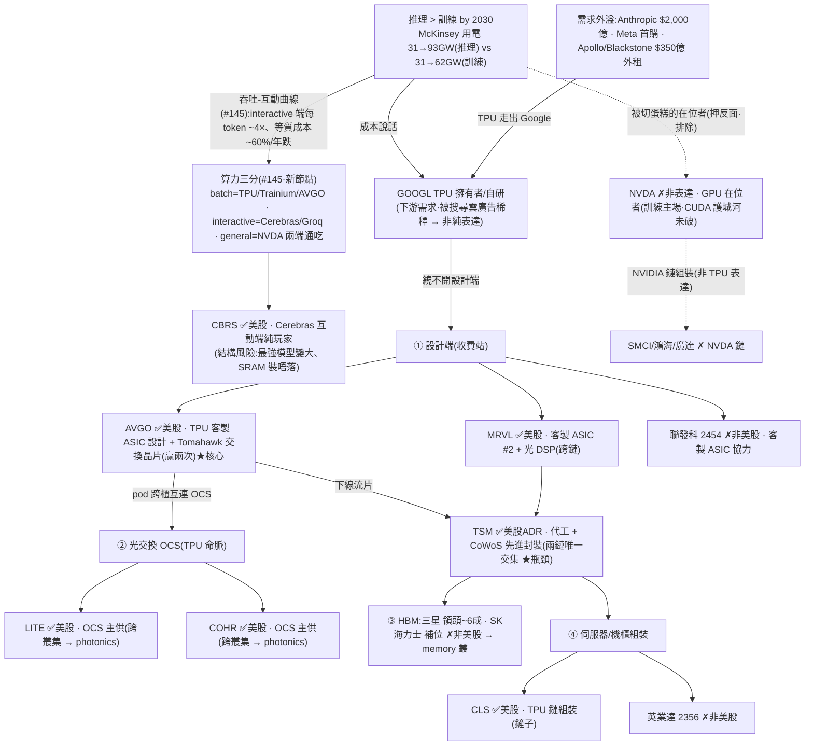

<!-- frontmatter = valid-YAML scalars only, tickers quoted. Put wiki-links INLINE in the body; cite
     per claim. NEVER put double-bracket links in YAML frontmatter (breaks the parser). -->

# TPU / 自研晶片(B 型)— 真·推理份額轉移,但單篇薄證據 + 設計端最共識

> 綜合頁。蒸餾自 **3 篇** Tier-2 報告(#129 核心 + #145/#146 跨源佐證,[[tpu-custom-silicon]] 叢,gooptions)
> + 一手驗證(defeatbeta ttm_pe/capex,2026-07-01)。**證據由 1→3 篇,但 #145/#146 同出一場 SemiAnalysis /
> Dylan Patel(Sequoia)訪問 → voice 仍 ~1、非完全獨立;confidence 暫維持 0.28,獨立第二把聲仍係上調門檻。**
> INITIAL/uncalibrated;當「有紀律的相對強弱 × 週期溫度」讀。

## 一句話(核心張力 = thesis 本身)
算力重心從**訓練**移到**推理**(2030 推理用量超訓練),而推理比的是「服務一個 token 要花多少錢」。
[[TPU]] 作為 [[GOOGL]] 量身訂做的 [[ASIC]],每有效運算成本比 [[NVDA]] 旗艦低 **20–50%**,把 Gemini
token 價壓到 $1.74(對手 $4+)、讓 Anthropic/Meta 願意外用 → **結構性咬下 NVIDIA 推理份額**(#129)。
**但這是「切蛋糕、不是翻桌」:訓練主場仍在 NVDA、CUDA 未破,上檔有界。** 而且最純押法 = 設計端收費站
[[AVGO]],正是全市場最共識的 AI 交易之一。→ **主題真、但單篇證據 + 設計端重度 priced-in → 小注、盯
「TPU 走出 Google 的速度」與「設計端訂單」。** 可交易表達:[[AVGO]](核心)、[[MRVL]]、[[TSM]]、[[CLS]]。

## 價值鏈(TPU 鏈 vs NVIDIA 鏈;消化到 ticker)



## ticker 層(Karst 端產品 = 這張表)

| ticker | 鏈上角色 | 可交易 | 一手驗證(Tier-1) | conviction 含義 |
|---|---|---|---|---|
| [[AVGO]] | ① 設計端 TPU 客製 ASIC + Tomahawk 交換(**贏兩次**)= 收費站(#129) | ✅ US | ttm_pe **62.9(75%)**;capex 0.10→0.25B(**~2.4x** 供給回應形成) | **核心純表達**,但已是最共識 AI 交易之一 |
| [[MRVL]] | ① 客製 ASIC #2 + 光 DSP、跨鏈 | ✅ US | ttm_pe **101.8(86%)**;capex 0.07→0.16B(~2.2x) | 質優但貴、AVGO 的競爭設計者(亦見 [[photonics-optical]]) |
| [[TSM]] | 代工 + CoWoS、**兩鏈唯一交集**(押 AI 誰贏都受惠) | ✅ US ADR | ttm_pe **39.7(86%)**;capex 結構性巨大(季度 ~TWD 287B/Q ≈ $9B/Q) | 鏟子/瓶頸、無論哪條鏈都吃到 |
| [[CLS]] | ④ TPU 鏈伺服器/機櫃組裝 | ✅ US | ttm_pe **44.1(87%)**;capex 0.048→0.23B(**~4.8x** 近季跳升) | 組裝、鏟子、低毛利、波動大 |
| [[GOOGL]] | TPU 擁有者/自研(下游·被搜尋雲廣告稀釋) | ✅ | — | 報告明言「非最純押法」→ 下游需求、稀釋,**不列入純表達** |
| COHR / LITE | ② OCS 光交換(TPU 命脈) | ✅ | 見 [[photonics-optical]] | **跨叢集**,用 photonics 表達 |
| 聯發科 / 英業達 / 三星 / SK海力士 | 設計協力 / 組裝 / HBM | ✗ 非美股 | — | thesis 輸入,不可交易 |
| [[NVDA]] / SMCI | 被顛覆在位者 / NVIDIA 鏈組裝 | ✅ | — | **押反面 / 非 TPU 表達 → 排除** |

## 4-KPI(每條 cited;Tier-2 報告 #129 + Tier-1 一手)

### 1. moat / bottleneck — 強偏中(1.5/2)
- **AVGO 贏兩次**:TPU 運算晶片主要設計者 + 資料中心高階交換晶片 Tomahawk,是「不管哪家雲端巨頭自研
  晶片都繞不開的設計端」= 收費站(Tier-2 #129)。
- **TSM 兩鏈唯一交集**:代工 + CoWoS 先進封裝(N3P→N2),TPU 鏈與 NVIDIA 鏈都得走它 = 硬瓶頸(#129)。
- **扣分**:設計端有聯發科競爭、hyperscaler 自研內化的長期風險;是「設計服務」而非鎖死 IP 壟斷 → 1.5 非 2。
- **#146 護城河再定義**:Dylan Patel 指「99% 客製 ASIC 失敗,因 AI 晶片本質是軟體」→ 佐證 [[AVGO]]「贏兩次」
  (設計 + 軟體整合);但**真 NVDA 護城河唔係 CUDA,而係「開源模型都長成 GPU 嘅形狀」**(中國開源佔 Hugging
  Face 下載 ~40%、累計 >10B、全部為 NVIDIA 而設)→ TPU 上位嘅真領先指標 = Google Gemma 有冇養出強嘅
  TPU-shaped 開源模型(Gemma >400M 下載、Gemma 4 top-3 開源),唔係「模型自己寫 kernel」。
- **AVGO 長期壓力(#146)**:Google 同時跑 **3 條 TPU 設計線**(Broadcom + 聯發科 + 1 未公開)→ 對 AVGO 設計端
  收費站係長期稀釋風險,要盯。

### 2. 資本配置 / ROIC — 中(1/2)+ 供給回應形成中
- **全鏈 capex 上行(一手,2026-07-01)**:AVGO 0.10→0.25B(~2.4x)、MRVL 0.07→0.16B(~2.2x)、
  CLS 0.048→0.23B(~4.8x 近季跳升)= 供給正在回應(中後段訊號)。
- 設計端(AVGO/MRVL)相對**輕資產、高 ROIC**;重資本在 [[TSM]](結構性 ~$36B+/年)。整鏈資本擴張 = 週期
  非最早期。

### 3. 估值 / priced-in — 弱(0.5/2)⚠️ 最大拖累
- **全鏈估值抬高**:AVGO ttm_pe **75 分位**、MRVL **86%**、TSM **86%**、CLS **87%**(一手,2026-07-01)
  = 高但非極端(不像 [[photonics-optical]] COHR 98%)。
- **共識**:「買 AI = 買設計端客製 ASIC / 買 AVGO」是本輪市場**最擁擠的交易之一** → 重度 priced-in;
  peak-AI-capex 一旦打嗝即 de-rate。

### 4. 成長耐久 / TAM — 強偏中(1.5/2)
- **推理 2030 超訓練**(McKinsey 用電:推理 31→93 GW vs 訓練 31→62 GW);TPU 每有效運算低 **20–50%**
  (SemiAnalysis);2028 NVDA 推理份額 **降至 2–3 成**、雲端自研 ASIC **>40% CAGR**(New Street);Gemini
  token **$1.74** vs 對手 $4+(Artificial Analysis)(全 Tier-2 #129)。
- **但「切蛋糕、不是翻桌」**:訓練主場仍 NVDA、CUDA 護城河短期未破 → 上檔**有界**;且 2028 份額、$200B
  投入、$350B 外租多為**第三方估算,非已實現財報**(#129 風險段自陳)。

## cycle_stage = MID(主題早、表達晚的張力)
| 訊號 | 現況 |
|---|---|
| 主題擴散 🟢 早 | TPU **2026 才走出 Google**(Anthropic 加碼、Meta 首購、Apollo/Blackstone $350億 外租)= 外租平台剛從個案變趨勢(#129) |
| 供給回應 🟡 形成中 | AVGO capex ~2.4x、CLS ~4.8x 近季、MRVL ~2.2x(一手)= 整鏈資本擴張 |
| 估值/共識 🔴 已抬高 | 全鏈 75–87 分位 + 「買 AVGO 客製 ASIC」= 最共識 AI 交易之一 |
| 上檔邊界 🟡 | 切蛋糕非翻桌:訓練主場 NVDA、CUDA 未破(#129) |

→ **主題本身早(TPU 剛外溢),但最純的表達(AVGO 設計端)已被市場搶先定價、且是共識。** 這正是「主題
早、expression 晚」的張力 → 定為 **MID**。不是純追高,但也不是便宜未共識的乾淨進場。

## confidence 推導(可追溯)
```
KPI: moat 1.5/2(AVGO 贏兩次 + TSM 瓶頸,但設計端可競爭) · capital 1/2(全鏈 capex 上行) 
     · valuation 0.5/2(75–87 分位 + AVGO 最共識) · growth 1.5/2(推理超訓練,但切蛋糕有界)
     = 4.5/8 = 0.56 base
penalty = 薄證據(單一 Tier-2 報告 n=1,無跨源佐證) × 共識(AVGO 客製 ASIC 全市場最擁擠交易之一)
         × mid-late(全鏈 75–87 分位 + capex 上行 + 上檔切蛋糕有界): × ~0.50  → 0.28
一手已拉: AVGO/MRVL/TSM/CLS ttm_pe + capex(Tier-1, 2026-07-01) ✅
→ confidence ≈ 0.28  (INITIAL, uncalibrated)
```
**讀法:主題真(推理成本經濟學 + AVGO 收費站),但 confidence < photonics 0.30——主因「證據薄(1 篇 vs
24)+ AVGO 設計端最共識」,不是瓶頸更弱。相對強弱有、別追高;要吃 [[AVGO]] 小注 + 盯 TPU 外溢速度與
設計端訂單,[[TSM]] 是「誰贏都吃到」的分散鏟子。**

## kill_condition(可證偽)
> **「TPU 走出 Google 的速度」停滯** —— Anthropic/Meta 之後**無新雲端/企業採用**(外租平台仍卡在少數
> 巨頭)**或** [[AVGO]] AI / 客製 ASIC 拿單與營收上修**停止**(收費站未被財報確認)**或** New Street 追蹤的
> **NVDA 推理份額不見鬆動**(擴散慢於樂觀情境)**或** 真護城河「開源模型都長成 GPU 形狀」未破——Google
> Gemma 一直養唔出強嘅 TPU-shaped 開源模型(中國開源仍 ~40% HF 下載、全為 NVIDIA 而設,#146)。
> **反面風險(crowding-unwind):** 全鏈 75–87 分位 + 最共識設計端,任何 AI-capex 打嗝即重挫。
> 觸發 → confidence 歸零,回歸「買 AI 就是買 NVDA」的思考慣性。

## Agent 追蹤(定日可證偽預測 → track_record)
- **2026-07-01**:TPU/自研晶片 = 真·推理份額轉移(成本經濟學),但**單篇薄證據 + 設計端最共識**。表達:
  [[AVGO]](設計端收費站、核心)+ [[TSM]](兩鏈唯一交集、鏟子)+ [[MRVL]]/[[CLS]](次要)。方向:**不追高**;
  小注;**追蹤變數 = TPU 外部採用擴散數 + AVGO 客製 ASIC 訂單/AI 營收上修 + Gemini-對手 token 價差 +
  NVDA 推理份額**;kill = 外溢停滯 / 份額不鬆動 / CUDA 擋住中小型部署。
- **2026-07-05**(ingest #145/#146):跨源佐證使薄證據 1→3 篇(但同一 SemiAnalysis/Dylan 訪問→非完全獨立,
  confidence 暫維持 0.28);護城河再定義——真 NVDA 壁壘 =「開源模型都長成 GPU 形狀」非 CUDA,領先指標改追
  Google Gemma 養唔養到強 TPU-shaped 開源模型(#146);新增互動端節點 CBRS/Groq(#145)。kill 相應更新。
- forward-IC 評估器(待建)N 天後回填 → 這條預測的 forward IC 才是「thesis 有沒有 edge」的裁判。

## 待補(降「未確認」扣分 + 加厚薄證據)
- [ ] **證據仍薄(1 篇)**:等 gooptions「TPU 供應鏈」系列後續(#129 明言「下一篇拆設計端博通」)或其他
      獨立來源,做跨源佐證再上調 confidence。
- [ ] 逐字稿抽 AVGO 管理層「客製 ASIC / 網路交換 / AI 營收」語言(moat + 收費站證據補強)。
- [ ] 接「TPU 走出 Google」外部採用計數器(Anthropic/Meta 後的新客戶 → 動態 cycle/confidence)。
- [x] ✅ AVGO/MRVL/TSM/CLS ttm_pe 分位 + capex(一手)— 2026-07-01。
- [ ] universe.yaml 加 TPU/custom-silicon grouping,讓 scan 覆蓋(目前 thesis 層有、scan 未覆蓋)。

## 來源
Tier-2(TPU 叢 **3 篇**,`thesis/wiki/sources/`,全文 `corpus.db`):**#129**(TPU 逆襲:推理時代成本
說話,`corpus.py get 129-trend-core-research-tpu-inference-cost-insurgency`)——內含 SemiAnalysis 成本、
McKinsey 用電、New Street 份額、Artificial Analysis token 價、AVGO「贏兩次」、TSM 兩鏈交集、OCS 命脈等
二手引用;**新增(2026-07-05):#145(AI 推理經濟曲線:batch/interactive/general 三分、每 token ~4×、
~60%/年成本跌、Cerebras/Groq 互動端)、#146(CUDA 護城河再定義:真壁壘=開源模型 GPU-shaped、中國佔 HF
~40%、Google Gemma 為 TPU 上位領先指標、Google 3 條 TPU 設計線壓 AVGO)——但兩篇同出 SemiAnalysis/Dylan
Patel 訪問、非獨立第二把聲**。Tier-1:defeatbeta `ttm_pe` / `quarterly_cash_flow`(capex)(2026-07-01)。
